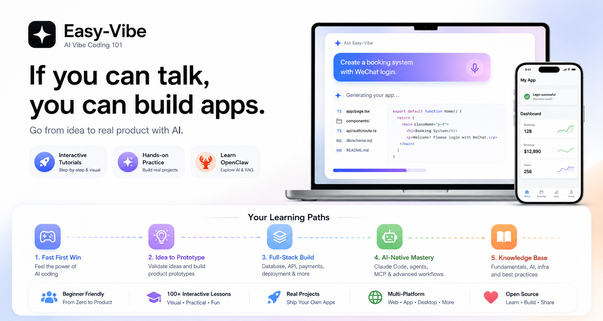
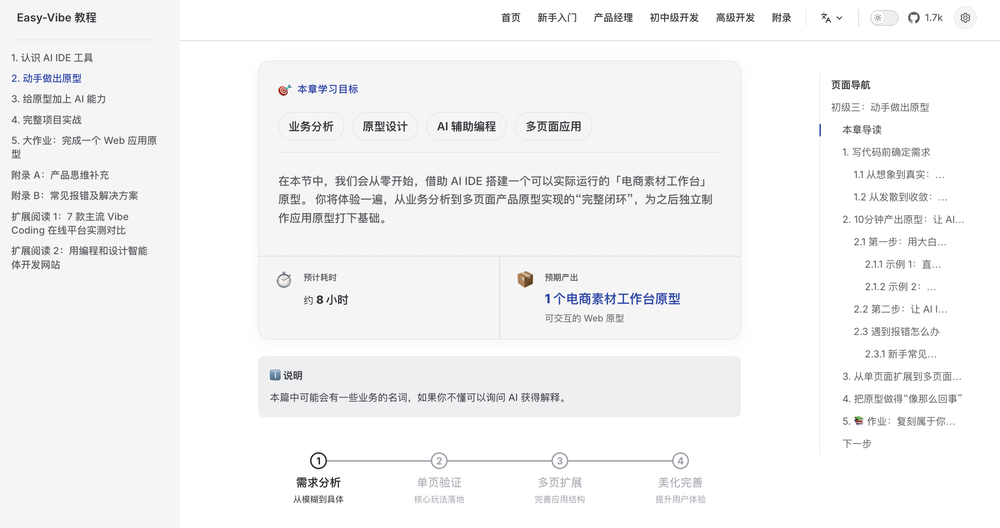
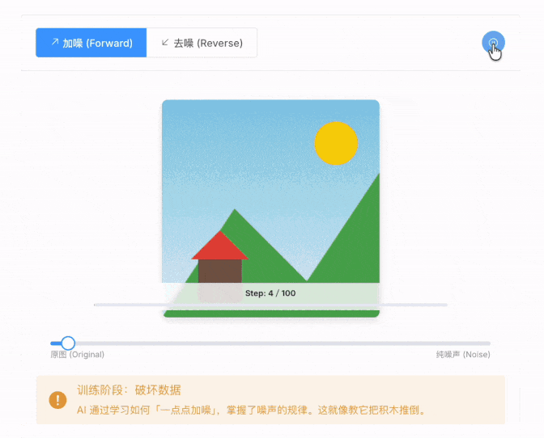
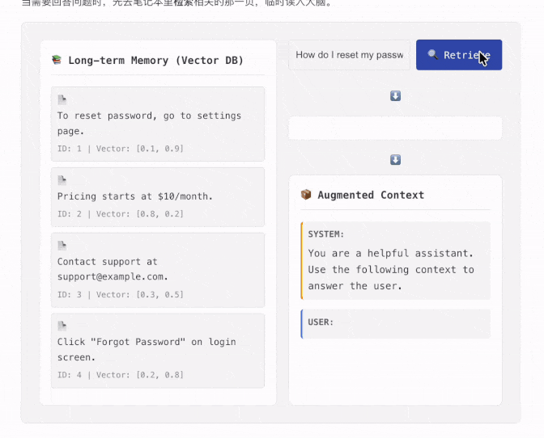
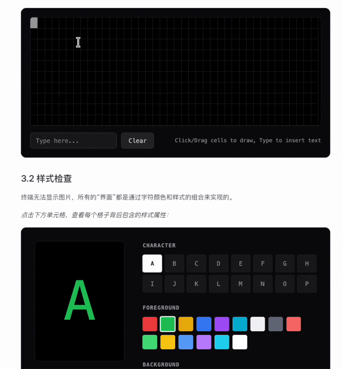
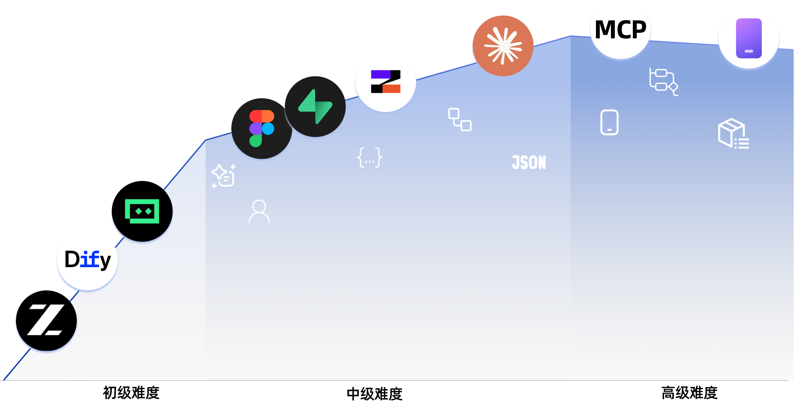

<!-- trigger vercel build -->
<div align="center">




<p align="center" style="font-size: 1.2em; color: #666; margin: 20px 0;">
  直接上手，一起 vibe！会说话就会做应用。<br>
  <span style="font-size: 0.9em; color: #888;">Jump right in and vibe together — if you can talk, you can build apps.</span>
</p>

<a href="https://trendshift.io/repositories/22079" target="_blank"></a>

<p align="center" style="font-size: 1.05em; color: #666; margin: 16px 0;">
  你好 · Hello · 哈囉 · こんにちは · 안녕하세요 · Hola · Bonjour · Hallo · مرحبا · Xin chào<br>
  我们的教程（第一部分）已经支持 10 种语言，欢迎世界各地的朋友一起 coding！<br>
  <span style="font-size: 0.9em; color: #888;">Stage 1 of our tutorial is now available in 10 languages. Friends around the world, let's start coding together!</span>
</p>

<p align="center">
  🚀 <a href="https://datawhalechina.github.io/easy-vibe/welcome.html">开始体验</a> · ✨ <a href="https://datawhalechina.github.io/easy-vibe/zh-cn/appendix/">交互式教程</a> · 🦞 <a href="https://github.com/datawhalechina/hello-claw">学习 OpenClaw</a> · 📖 <a href="#目录--table-of-contents">查看目录</a><br>
  <span style="font-size: 0.85em; color: #888;">🚀 <a href="https://datawhalechina.github.io/easy-vibe/welcome.html">Start Exploring</a> · ✨ <a href="https://datawhalechina.github.io/easy-vibe/en/appendix/">Interactive Tutorial</a> · 🦞 <a href="https://github.com/datawhalechina/hello-claw">Learn OpenClaw</a> · 📖 <a href="#目录--table-of-contents">Table of Contents</a></span>
</p>

<p align="center">
  <a href="https://datawhalechina.github.io/easy-vibe/welcome.html">开始阅读</a> ·
  <a href="#-内容导航">学习地图</a><br>
  <span style="font-size: 0.85em; color: #888;">
    <a href="https://datawhalechina.github.io/easy-vibe/welcome.html">Read Online</a> ·
    <a href="#-content-navigation">Learning Map</a>
  </span>
</p>

<p align="center">
    <a href="https://github.com/datawhalechina/easy-vibe/stargazers" target="_blank">
        </a>
    <a href="https://github.com/datawhalechina/easy-vibe/network/members" target="_blank">
        </a>
    <a href="../../LICENSE" target="_blank">
        </a>
</p>

<p align="center">
  <a href="../zh-CN/README.md"></a>
  <a href="../zh-TW/README.md"></a>
  <a href="../en-US/README.md"></a>
  <a href="../ja-JP/README.md"></a>
  <a href="../es-ES/README.md"></a>
  <a href="../fr-FR/README.md"></a>
  <a href="../ko-KR/README.md"></a>
  <a href="../ar-SA/README.md"></a>
  <a href="../vi-VN/README.md"></a>
  <a href="../de-DE/README.md"></a>
</p>

</div>
<table align="center">
  <tr>
    <td width="50%" valign="top" align="center">
      
      <br>
      <strong>新手专属学习地图</strong>
      <br>
      <sub>零基础专属指引，清晰规划路径，告别“学了忘”</sub>
    </td>
    <td width="50%" valign="top" align="center">
      
      <br>
      <strong>手把手图文教程</strong>
      <br>
      <sub>保姆级图文详解，如同私教在旁，跟着做就能学会</sub>
    </td>
  </tr>
  <tr>
    <td width="50%" valign="top" align="center">
      
      <br>
      <strong>沉浸式模拟编程</strong>
      <br>
      <sub>虚拟鼠标自动导览，带你快速上手 IDE 核心用法</sub>
    </td>
    <td width="50%" valign="top" align="center">
      
      <br>
      <strong>看得见的 AI 原理</strong>
      <br>
      <sub>算法原理动画化，一眼看懂 AI 如何“画”出图片</sub>
    </td>
  </tr>
  <tr>
    <td width="50%" valign="top" align="center">
      
      <br>
      <strong>像玩游戏一样学 RAG</strong>
      <br>
      <sub>独家交互组件，点击即可看清 RAG 数据流向</sub>
    </td>
    <td width="50%" valign="top" align="center">
      
      <br>
      <strong>可视化终端原理</strong>
      <br>
      <sub>命令行操作可视化，直观展示后台逻辑与原理</sub>
    </td>
  </tr>
</table>
<div align="center">
  <h3>⭐ 欢迎 <a href="https://github.com/datawhalechina/easy-vibe" style="color: #d0cd16ff;">点击此处Star</a> 加速更新 ❤️</h3>
</div>

<div align="center" style="margin: 30px 0;">
  <a href="https://github.com/datawhalechina/easy-vibe/issues/new?template=story_submission.md">
    
  </a>
  <p style="margin-top: 15px; font-size: 1.1em; color: #666;">
    📝 <strong>有自己的 vibe coding 故事？</strong>
    在这里提交，激励更多人！
  </p>
</div>

## 目录 / Table of Contents

- [为什么需要 Easy-Vibe](#为什么需要-easy-vibe)
- [News](#-news)
- [适合谁](#适合谁)
- [你的学习路径](#你的学习路径)
- [学习建议](#学习建议)
  - [一、零基础入门](#一零基础入门)
  - [二、初中级开发工程师](#二初中级开发工程师)
  - [三、高级开发工程师](#三高级开发工程师)
  - [附录知识库](#-附录知识库)
- [如何学习](#️-如何学习)
- [本地启动本课件](#-本地启动本课件)
- [其他课程 / Other Courses](#-其他课程--other-courses)
- [参与贡献与致谢](#-参与贡献与致谢)
- [LICENSE](#-license)

## 为什么需要 Easy-Vibe

想做个记账小程序？说出来。

想要一个支持微信登录的预约系统？说出来。

想做一个带评论功能的博客？说出来。

在 AI 时代，编程先从描述你想要什么开始。

Easy-Vibe 教你的，就是怎样把它一步步做成真正的产品。

## 🔥 News

- **[2026-05-20]** 🌍 **第一阶段（Stage 1）多语言已全面覆盖**：Stage 1 已在所有支持的语言（zh-cn, en, zh-tw, ja-jp, ko-kr, es-es, fr-fr, de-de, ar-sa, vi-vn）下完整可用，并已完成导航/构建校验，确保不会出现 404。
- **[2026-03-29]** ✨ **「用户故事」专区上线并更新为真实案例**：首页新增交互式故事轮播组件和独立故事页面，并将原有占位内容替换为 4 篇真实用户故事，涵盖乡村小学老师、大学生、高中信息技术老师和货车司机，展示不同背景的学习者如何用 AI 解决真实问题、做出真实产品。[👉 查看故事](https://datawhalechina.github.io/easy-vibe/zh-cn/vibe-stories/story-1.html)
- **[2026-03-26]** 🚀 **阶段二实战内容集中更新**：补充完整 SaaS 全栈大作业[《第一个 SaaS 全栈应用——文案生成网站》](https://datawhalechina.github.io/easy-vibe/zh-cn/stage-2/assignments/copywriting-platform-supabase/)；同时大幅补全[《如何集成 Stripe 等收费系统》](https://datawhalechina.github.io/easy-vibe/zh-cn/stage-2/backend/stripe-payment/)，完善多产品 UI、微信小程序后端等关键章节。
- **[2026-03-25]** 📚 **新增附录「用户研究与需求验证」**：包含 4 篇文章——从哪里找点子、双钻模型、Jobs to Be Done、The Mom Test 用户访谈法，帮助新手学会发现和验证产品想法。[👉 阅读附录](https://datawhalechina.github.io/easy-vibe/zh-cn/appendix/)
- **[2026-03-25]** 📚 **英文文档全面更新**：第二阶段（全栈开发）和第三阶段（高级开发）现已提供完整英文翻译。[👉 开始学习](https://datawhalechina.github.io/easy-vibe/en/stage-2/)
- **[2026-03-02]** 🦞 **OpenClaw & AI Agent 友好支持**：新增 `llms.txt` AI 导航文件，让 OpenClaw、Claude、Cursor、Trae 等 AI Agent 能够快速理解本仓库结构，精准定位教程内容。希望每个🦞都学得愉快！
- **[2026-03-01]** [高级开发部分](https://datawhalechina.github.io/easy-vibe/zh-cn/stage-3/)全面升级：新增 Claude Code 七大深度指南（MCP、Skills、Agent Teams 等）及八大跨平台开发实战（PWA、Electron、NFT、VS Code 插件、Qt 工业应用等）。
- **[2026-02-25]** 更新[附录知识库](https://datawhalechina.github.io/easy-vibe/zh-cn/appendix/)，涵盖 9 大知识领域、80+ 交互式专题。
- **[2026-01-27]** 新增 Android 和 iOS 平台应用开发教程。
- **[2026-01-19]** 发布 Prompt Engineering、AI 演进史、鉴权设计、Git 原理等一系列交互式演示组件，大幅提升可视化学习体验。

<details>
<summary>Past News</summary>

- **[2026-01-16]** 重构项目结构，正式确立“新手入门”章节，降低上手门槛。
- **[2026-01-14]** 完成第一阶段“产品原型构建”文档的大规模更新。
- **[2026-01-13]** 完成文档架构重构，全面支持多语言 (i18n)。
- **[2026-01-01]** 发布项目核心学习地图 (Learning Map)，明确学习路径。
</details>

## 适合谁

- **零基础爱好者**：先做出第一个作品，再理解怎么做
- **产品经理 / 创业者**：快速验证想法，低成本做 MVP
- **学生**：建立 AI 时代的实战技能
- **初级开发者**：补齐从想法到上线的完整开发链路
- **中高级开发者**：掌握 AI 协作开发、复杂项目实战与效率升级


## 你的学习路径

### 🎮 我想先试试（5分钟体验）
**适合人群**：所有人
**学什么**：AI 编程初体验、贪吃蛇小游戏
**你会得到**：5 分钟做出第一个 AI 应用

[开始体验](https://datawhalechina.github.io/easy-vibe/zh-cn/stage-1/learning-map/)

### 💡 我有个想法要实现
**适合人群**：零基础/产品经理/创业者
**学什么**：AI IDE 工具、需求拆解、页面设计、功能规划、提示词写法、原型迭代
**你会得到**：一个可演示的产品原型

[开始学习](https://datawhalechina.github.io/easy-vibe/zh-cn/stage-1/learning-map/)

### 🚀 我想系统学习
**适合人群**：开发者/进阶学习者
**学什么**：前端、后端、数据库、AI 集成、部署运维、Claude Code 开发技巧
**你会得到**：独立完成一个可上线的全栈 AI 应用

[开始学习](https://datawhalechina.github.io/easy-vibe/zh-cn/stage-2/)

### 🦞 我想构建 AI Agent
**适合人群**：对 AI Agent 感兴趣的开发者
**学什么**：OpenClaw AI 助理、Skills 系统、自动化工作流
**你会得到**：一个属于你的命令行 AI 助理

[开始学习](https://github.com/datawhalechina/hello-claw)

### 📚 我想查资料
**适合人群**：所有人
**学什么**：计算机基础、AI 原理、9 大知识领域
**你会得到**：80+ 交互式专题资料

[查看知识库](https://datawhalechina.github.io/easy-vibe/zh-cn/appendix/)

## 学习建议

- 零基础、产品经理、创业者：从 [第一阶段](https://datawhalechina.github.io/easy-vibe/zh-cn/stage-1/learning-map/) 开始
- 有开发经验：从 [第二阶段](https://datawhalechina.github.io/easy-vibe/zh-cn/stage-2/) 开始
- 想直接做复杂项目：进入 [第三阶段](https://datawhalechina.github.io/easy-vibe/zh-cn/stage-3/)
- 想学 AI Agent：看 [Hello Claw](https://github.com/datawhalechina/hello-claw)


### 📖 内容导航

<div align="center">
  
</div>

### 一、零基础入门

| 章节                                                                                 | 关键内容                                          |
| :----------------------------------------------------------------------------------- | :------------------------------------------------ |
| [学习地图](https://datawhalechina.github.io/easy-vibe/zh-cn/stage-1/learning-map/)                             | 整体学习路径导览                                  |
| [AI 时代，会说话就会编程](https://datawhalechina.github.io/easy-vibe/zh-cn/stage-1/ai-capabilities-through-games/) | 通过贪吃蛇等案例初步感受 AI 编程的能力            |
| [寻找好想法](https://datawhalechina.github.io/easy-vibe/zh-cn/stage-1/finding-great-idea/)                     | 学会寻找和验证产品想法，找到值得做的项目          |
| [认识 AI IDE 工具](https://datawhalechina.github.io/easy-vibe/zh-cn/stage-1/introduction-to-ai-ide/)           | 学会使用 IDE，在本地制作小游戏                    |
| [动手做出原型](https://datawhalechina.github.io/easy-vibe/zh-cn/stage-1/building-prototype/)                   | 从需求分析、AI 生成单页面，再到生成多页面产品原型 |
| [给原型加上 AI 能力](https://datawhalechina.github.io/easy-vibe/zh-cn/stage-1/integrating-ai-capabilities/)    | 学会接入常见 AI 能力（文本、图片、视频）          |
| [完整项目实战](https://datawhalechina.github.io/easy-vibe/zh-cn/stage-1/complete-project-practice/)            | 模拟真实场景、接受用户反馈迭代，完整化项目        |

#### 附录：业务思维

| 章节                                                                                 | 关键内容                                   |
| :----------------------------------------------------------------------------------- | :----------------------------------------- |
| [产品思维与方案设计](https://datawhalechina.github.io/easy-vibe/zh-cn/stage-1/appendix-a-product-thinking/)        | 从零到一做产品需要考虑的思维框架           |
| [AI 行业应用场景参考 (B端)](https://datawhalechina.github.io/easy-vibe/zh-cn/stage-1/appendix-industry-scenarios/) | 了解 AI 在不同产业的应用场景               |
| [AI 消费场景灵感参考 (C端)](https://datawhalechina.github.io/easy-vibe/zh-cn/stage-1/appendix-c-consumer-scenarios/) | 探索 AI 在消费级产品中的应用场景           |

#### 附录：技术方案

| 章节                                                                                                                    | 关键内容                                   |
| :---------------------------------------------------------------------------------------------------------------------- | :----------------------------------------- |
| [写代码时遇到错误怎么办](https://datawhalechina.github.io/easy-vibe/zh-cn/stage-1/appendix-b-common-errors/)                                         | vibe coding 中的常见错误及排查方法         |
| [七款 AI 编程工具对比](https://datawhalechina.github.io/easy-vibe/zh-cn/stage-1/appendix-articles/example0-1/vibe-coding-tools-snake-game-tutorial)       | 对比测试主流 AI 编程平台                   |
| [用设计和编程 Agent 设计网站](https://datawhalechina.github.io/easy-vibe/zh-cn/stage-1/appendix-articles/example0-2/vibe-coding-tools-build-website-with-ai-coding-and-design-agents) | 学习如何使用 AI 智能体协同工作             |

### 二、初中级开发工程师

#### 前端部分

| 章节                                                                                                       | 关键内容                                                                     |
| :--------------------------------------------------------------------------------------------------------- | :--------------------------------------------------------------------------- |
| [从Lovart出发，搭建自己的素材生产Agent](https://datawhalechina.github.io/easy-vibe/zh-cn/stage-2/frontend/lovart-assets/)                             | 从零开始，利用Nanobanana和Lovart批量生成高质量的设计素材，并动手构建一个能意图识别的绘图Agent |
| [Figma 与 MasterGo 入门](https://datawhalechina.github.io/easy-vibe/zh-cn/stage-2/frontend/figma-mastergo/)                          | 用设计工具梳理信息架构和页面结构，为前端实现打基础                           |
| [构建第一个现代应用程序-UI 设计](https://datawhalechina.github.io/easy-vibe/zh-cn/stage-2/frontend/ui-design/)                       | 基于设计稿完成组件化界面，实现从设计到代码的第一条链路                       |
| [参考 UI 设计规范与多产品 UI 设计](https://datawhalechina.github.io/easy-vibe/zh-cn/stage-2/frontend/multi-product-ui/)              | 围绕统一主视觉扩展多产品界面，练习系统化设计能力                             |
| [用 LLM 和 Skills 让界面变好看](https://datawhalechina.github.io/easy-vibe/zh-cn/stage-2/frontend/llm-skills-beautiful/)             | 用提示词和 Skills 插件让 AI 生成美观独特的界面                               |
| [一起做霍格沃茨画像](https://datawhalechina.github.io/easy-vibe/zh-cn/stage-2/frontend/hogwarts-portraits/)                          | 从 0 到 1 做出接入 AI 能力的前端应用，串联设计与开发                         |
| [从设计原型到项目代码](https://datawhalechina.github.io/easy-vibe/zh-cn/stage-2/frontend/design-to-code/)                            | 三种路径将设计工具中的原型转化为前端代码                                     |
| [使用现代组件库更新你的界面](https://datawhalechina.github.io/easy-vibe/zh-cn/stage-2/frontend/modern-component-library/)            | 用组件库快速构建专业级界面，统一风格、提升开发效率                           |

#### 后端开发部分

| 章节                                                                                               | 关键内容                                                    |
| :------------------------------------------------------------------------------------------------- | :---------------------------------------------------------- |
| [从数据库到 Supabase](https://datawhalechina.github.io/easy-vibe/zh-cn/stage-2/backend/database-supabase/)                   | 在 Supabase 上落地数据库和 API，打通数据模型与前端页面      |
| [大模型辅助编写接口代码与接口文档](https://datawhalechina.github.io/easy-vibe/zh-cn/stage-2/backend/ai-interface-code/)       | 用大模型协助生成接口与数据库文档及代码，实现可读可测的后端  |
| [Git 和 GitHub 工作流](https://datawhalechina.github.io/easy-vibe/zh-cn/stage-2/backend/git-workflow/)                        | 在 Git 工作流中管理代码，进行版本控制和协作                 |
| [如何部署 Web 应用](https://datawhalechina.github.io/easy-vibe/zh-cn/stage-2/backend/zeabur-deployment/)                     | 使用 CloudBase、Vercel、Zeabur 等平台部署应用上线           |
| [CLI AI 编程工具](https://datawhalechina.github.io/easy-vibe/zh-cn/stage-2/backend/modern-cli/)                              | 使用 CLI 类 AI 编程工具加速开发与调试，形成个人工程化工作流 |
| [如何集成 Stripe 等收费系统](https://datawhalechina.github.io/easy-vibe/zh-cn/stage-2/backend/stripe-payment/)               | 接入支付系统，完成收费链路与基础结算流程                    |
| [大作业：构建第一个现代应用程序-全栈应用](https://datawhalechina.github.io/easy-vibe/zh-cn/stage-2/assignments/copywriting-platform-supabase/) | 综合前端、后端与支付模块，完成可上线的全栈 Web 应用         |

#### AI 能力附录

| 章节                                                                                                     | 关键内容                                                       |
| :------------------------------------------------------------------------------------------------------- | :------------------------------------------------------------- |
| [Dify 入门与知识库集成](https://datawhalechina.github.io/easy-vibe/zh-cn/stage-2/ai-capabilities/dify-knowledge-base/) | 用 Dify Workflow 与基础 RAG 搭建工具类产品，为后续应用升级打样 |

### 三、高级开发工程师

#### Claude Code 核心技能

| 章节                                                                                                    | 关键内容                                                     |
| :------------------------------------------------------------------------------------------------------ | :----------------------------------------------------------- |
| [Claude Code 快速上手](https://datawhalechina.github.io/easy-vibe/zh-cn/stage-3/core-skills/basics/)                                  | 安装配置、基础操作、实用技巧和常用指令                       |
| [Claude Code MCP 完全指南](https://datawhalechina.github.io/easy-vibe/zh-cn/stage-3/core-skills/mcp/)                                 | 通过 MCP 让 Claude Code 连接 GitHub、数据库、API 等外部服务  |
| [Claude Code Skills 完全指南](https://datawhalechina.github.io/easy-vibe/zh-cn/stage-3/core-skills/skills/)                           | 将专业知识打包成可复用技能包，一次配置反复使用               |
| [Claude Code 工作流最佳实践](https://datawhalechina.github.io/easy-vibe/zh-cn/stage-3/core-skills/workflow/)                          | 日常开发、代码重构、Code Review 等场景的最佳实践             |
| [Claude Agent Teams 完全指南](https://datawhalechina.github.io/easy-vibe/zh-cn/stage-3/core-skills/agent-teams/)                      | 多 AI 实例协同工作，像真正的开发团队一样并行协作             |
| [Claude Code Superpowers 工程级开发](https://datawhalechina.github.io/easy-vibe/zh-cn/stage-3/core-skills/superpowers/)               | 让 AI 写出工程级代码，遵循 TDD 和最佳实践                    |
| [如何让 Claude Code 长时间工作](https://datawhalechina.github.io/easy-vibe/zh-cn/stage-3/core-skills/long-running-tasks/)             | 设计长时间运行的任务，让 Coding Tools 持续工作直到完成        |

#### 多平台开发

| 章节                                                                                                           | 关键内容                                                     |
| :------------------------------------------------------------------------------------------------------------- | :----------------------------------------------------------- |
| [如何构建微信小程序](https://datawhalechina.github.io/easy-vibe/zh-cn/stage-3/cross-platform/wechat-miniprogram/)                       | 了解微信小程序生态，从官方模板到上线完成一个前端小程序       |
| [如何构建微信小程序-包含后端](https://datawhalechina.github.io/easy-vibe/zh-cn/stage-3/cross-platform/wechat-miniprogram-backend/)      | 在小程序中接入数据库与后端逻辑，打通完整业务闭环             |
| [如何构建安卓程序](https://datawhalechina.github.io/easy-vibe/zh-cn/stage-3/cross-platform/android-app/)                                | 使用 Expo 等工具，完成 Web/原生一体化的安卓应用开发          |
| [如何构建 iOS 程序](https://datawhalechina.github.io/easy-vibe/zh-cn/stage-3/cross-platform/ios-app/)                                   | 使用 Expo 等工具，完成 Web/原生一体化的 iOS 应用开发         |
| [如何开发 PWA 本地应用](https://datawhalechina.github.io/easy-vibe/zh-cn/stage-3/cross-platform/pwa-local-app/)                         | 让网页变成"真正的 App"，支持离线、推送、桌面安装            |
| [如何开发浏览器 AI 助手插件](https://datawhalechina.github.io/easy-vibe/zh-cn/stage-3/cross-platform/browser-ai-extension/)             | 开发 Chrome 插件，一键总结任意网页，支持云端 API 和内置 AI   |
| [如何开发 Electron 桌面程序](https://datawhalechina.github.io/easy-vibe/zh-cn/stage-3/cross-platform/electron-voice-to-text/)          | 用 Electron 构建语音转文字桌面应用，支持三平台安装运行       |
| [如何快速开发并铸造 NFT](https://datawhalechina.github.io/easy-vibe/zh-cn/stage-3/cross-platform/nft-minting/)                         | 从零编写智能合约，部署到以太坊测试网，铸造自己的 NFT         |
| [如何开发 VS Code 插件](https://datawhalechina.github.io/easy-vibe/zh-cn/stage-3/cross-platform/vscode-extension/)                     | 开发 AI 项目助手插件，支持模板生成、代码对话、多文件问答     |
| [如何开发工业级 Qt 桌面应用](https://datawhalechina.github.io/easy-vibe/zh-cn/stage-3/cross-platform/qt-industrial-hmi/)               | 用 Qt 构建工业级水泵监控 HMI 系统，实时数据、趋势图、报警    |

#### AI 能力附录

| 章节                                                                                                                                      | 关键内容                                                |
| :---------------------------------------------------------------------------------------------------------------------------------------- | :------------------------------------------------------ |
| [什么是 RAG 以及它如何工作](https://datawhalechina.github.io/easy-vibe/zh-cn/stage-3/ai-advanced/rag-introduction/)                | 系统理解 RAG 原理与常见架构，为复杂应用提供知识检索基础 |
| [中高级 RAG 与工作流编排：以 LangGraph 为例](https://datawhalechina.github.io/easy-vibe/zh-cn/stage-3/ai-advanced/langgraph-advanced-rag/) | 使用 LangGraph 等工具设计多步工作流与中高级 RAG 系统    |

### 📚 附录知识库

> 涵盖 **9 大知识领域**、**80+ 交互式专题**，以动画和可视化组件帮助你直观理解从计算机底层到 AI 前沿的核心概念。
>
> 👉 [查看完整附录](https://datawhalechina.github.io/easy-vibe/zh-cn/appendix/) · [AI 能力词典](https://datawhalechina.github.io/easy-vibe/zh-cn/appendix/8-artificial-intelligence/ai-capability-dictionary)

### 🎓 其他课程 / Other Courses

- [Hands-on Modern RL](#other-courses)
- [Learn Harness Engineering](#other-courses)

<table>
  <tr>
    <td valign="top" width="33%">
      <strong>💻 计算机基础</strong><br><br>
      • <a href="https://datawhalechina.github.io/easy-vibe/zh-cn/appendix/1-computer-fundamentals/transistor-to-cpu.html">从晶体管到 CPU</a><br>
      • <a href="https://datawhalechina.github.io/easy-vibe/zh-cn/appendix/1-computer-fundamentals/operating-systems.html">操作系统</a><br>
      • <a href="https://datawhalechina.github.io/easy-vibe/zh-cn/appendix/1-computer-fundamentals/data-encoding-storage.html">数据的编码、存储与传输</a><br>
      • <a href="https://datawhalechina.github.io/easy-vibe/zh-cn/appendix/1-computer-fundamentals/computer-networks.html">网络：两台电脑如何对话</a><br>
      • <a href="https://datawhalechina.github.io/easy-vibe/zh-cn/appendix/1-computer-fundamentals/data-structures.html">数据结构</a><br>
      • <a href="https://datawhalechina.github.io/easy-vibe/zh-cn/appendix/1-computer-fundamentals/algorithm-thinking.html">算法思维入门</a>
    </td>
    <td valign="top" width="33%">
      <strong>🔧 开发工具</strong><br><br>
      • <a href="https://datawhalechina.github.io/easy-vibe/zh-cn/appendix/2-development-tools/git-version-control.html">Git：代码的时光机</a><br>
      • <a href="https://datawhalechina.github.io/easy-vibe/zh-cn/appendix/2-development-tools/command-line-shell.html">命令行与 Shell 脚本</a><br>
      • <a href="https://datawhalechina.github.io/easy-vibe/zh-cn/appendix/2-development-tools/package-managers.html">包管理器</a><br>
      • <a href="https://datawhalechina.github.io/easy-vibe/zh-cn/appendix/2-development-tools/debugging-art/">调试的艺术</a><br>
      • <a href="https://datawhalechina.github.io/easy-vibe/zh-cn/appendix/2-development-tools/regex.html">正则表达式</a><br>
      • <a href="https://datawhalechina.github.io/easy-vibe/zh-cn/appendix/2-development-tools/environment-path.html">环境变量与 PATH</a>
    </td>
    <td valign="top" width="33%">
      <strong>🌐 浏览器与前端</strong><br><br>
      • <a href="https://datawhalechina.github.io/easy-vibe/zh-cn/appendix/3-browser-and-frontend/javascript-deep-dive.html">JavaScript 语言深入</a><br>
      • <a href="https://datawhalechina.github.io/easy-vibe/zh-cn/appendix/3-browser-and-frontend/browser-as-os-rendering.html">浏览器渲染管道</a><br>
      • <a href="https://datawhalechina.github.io/easy-vibe/zh-cn/appendix/3-browser-and-frontend/frontend-frameworks.html">前端框架对比</a><br>
      • <a href="https://datawhalechina.github.io/easy-vibe/zh-cn/appendix/3-browser-and-frontend/graphics-animation.html">图形与动画</a><br>
      • <a href="https://datawhalechina.github.io/easy-vibe/zh-cn/appendix/3-browser-and-frontend/web-performance.html">网页性能的度量与优化</a><br>
      • <a href="https://datawhalechina.github.io/easy-vibe/zh-cn/appendix/3-browser-and-frontend/frontend-engineering.html">前端工程化全貌</a>
    </td>
  </tr>
  <tr>
    <td valign="top" width="33%">
      <strong>🖥️ 服务器与后端</strong><br><br>
      • <a href="https://datawhalechina.github.io/easy-vibe/zh-cn/appendix/4-server-and-backend/http-protocol.html">HTTP 协议</a><br>
      • <a href="https://datawhalechina.github.io/easy-vibe/zh-cn/appendix/4-server-and-backend/api-design.html">API 设计哲学</a><br>
      • <a href="https://datawhalechina.github.io/easy-vibe/zh-cn/appendix/4-server-and-backend/auth-authorization.html">认证与授权体系</a><br>
      • <a href="https://datawhalechina.github.io/easy-vibe/zh-cn/appendix/4-server-and-backend/concurrency-async.html">并发、异步与多线程</a><br>
      • <a href="https://datawhalechina.github.io/easy-vibe/zh-cn/appendix/4-server-and-backend/message-queues.html">消息队列与事件驱动</a><br>
      • <a href="https://datawhalechina.github.io/easy-vibe/zh-cn/appendix/4-server-and-backend/backend-layered-architecture.html">后端分层架构</a>
    </td>
    <td valign="top" width="33%">
      <strong>📊 数据</strong><br><br>
      • <a href="https://datawhalechina.github.io/easy-vibe/zh-cn/appendix/5-data/database-fundamentals.html">数据库原理与 SQL</a><br>
      • <a href="https://datawhalechina.github.io/easy-vibe/zh-cn/appendix/5-data/database-fundamentals.html">数据库原理</a><br>
      • <a href="https://datawhalechina.github.io/easy-vibe/zh-cn/appendix/5-data/data-tracking.html">数据埋点与用户行为采集</a><br>
      • <a href="https://datawhalechina.github.io/easy-vibe/zh-cn/appendix/5-data/data-analysis.html">数据分析基础</a><br>
      • <a href="https://datawhalechina.github.io/easy-vibe/zh-cn/appendix/5-data/ab-testing.html">A/B 测试与实验驱动</a><br>
      • <a href="https://datawhalechina.github.io/easy-vibe/zh-cn/appendix/5-data/data-visualization.html">数据可视化与仪表盘</a>
    </td>
    <td valign="top" width="33%">
      <strong>🏗️ 架构与系统设计</strong><br><br>
      • <a href="https://datawhalechina.github.io/easy-vibe/zh-cn/appendix/6-architecture-and-system-design/monolith-to-microservices.html">从单体到微服务的演进</a><br>
      • <a href="https://datawhalechina.github.io/easy-vibe/zh-cn/appendix/6-architecture-and-system-design/distributed-systems.html">分布式系统的挑战</a><br>
      • <a href="https://datawhalechina.github.io/easy-vibe/zh-cn/appendix/6-architecture-and-system-design/high-availability.html">高可用与容灾</a><br>
      • <a href="https://datawhalechina.github.io/easy-vibe/zh-cn/appendix/6-architecture-and-system-design/system-design-methodology.html">系统设计方法论</a>
    </td>
  </tr>
  <tr>
    <td valign="top" width="33%">
      <strong>☁️ 基础设施与运维</strong><br><br>
      • <a href="https://datawhalechina.github.io/easy-vibe/zh-cn/appendix/7-infrastructure-and-operations/docker-containers.html">Docker 容器化</a><br>
      • <a href="https://datawhalechina.github.io/easy-vibe/zh-cn/appendix/7-infrastructure-and-operations/kubernetes.html">Kubernetes 编排</a><br>
      • <a href="https://datawhalechina.github.io/easy-vibe/zh-cn/appendix/7-infrastructure-and-operations/ci-cd.html">CI / CD 自动化</a><br>
      • <a href="https://datawhalechina.github.io/easy-vibe/zh-cn/appendix/7-infrastructure-and-operations/dns-https.html">域名、DNS 与 HTTPS</a><br>
      • <a href="https://datawhalechina.github.io/easy-vibe/zh-cn/appendix/7-infrastructure-and-operations/monitoring-logging.html">监控、日志与告警</a><br>
      • <a href="https://datawhalechina.github.io/easy-vibe/zh-cn/appendix/7-infrastructure-and-operations/infrastructure-as-code.html">基础设施即代码</a>
    </td>
    <td valign="top" width="33%">
      <strong>🤖 人工智能</strong><br><br>
      • <a href="https://datawhalechina.github.io/easy-vibe/zh-cn/appendix/8-artificial-intelligence/llm-principles.html">大语言模型的工作原理</a><br>
      • <a href="https://datawhalechina.github.io/easy-vibe/zh-cn/appendix/8-artificial-intelligence/transformer-attention.html">Transformer 与注意力机制</a><br>
      • <a href="https://datawhalechina.github.io/easy-vibe/zh-cn/appendix/8-artificial-intelligence/rag.html">RAG 架构</a><br>
      • <a href="https://datawhalechina.github.io/easy-vibe/zh-cn/appendix/8-artificial-intelligence/ai-agents.html">AI Agent 与工具调用</a><br>
      • <a href="https://datawhalechina.github.io/easy-vibe/zh-cn/appendix/8-artificial-intelligence/prompt-engineering.html">提示词工程</a><br>
      • <a href="https://datawhalechina.github.io/easy-vibe/zh-cn/appendix/8-artificial-intelligence/image-generation.html">图像生成原理</a>
    </td>
    <td valign="top" width="33%">
      <strong>🎯 工程素养</strong><br><br>
      • <a href="https://datawhalechina.github.io/easy-vibe/zh-cn/appendix/9-engineering-excellence/code-quality-refactoring.html">代码质量与重构</a><br>
      • <a href="https://datawhalechina.github.io/easy-vibe/zh-cn/appendix/9-engineering-excellence/testing-strategies.html">测试策略</a><br>
      • <a href="https://datawhalechina.github.io/easy-vibe/zh-cn/appendix/9-engineering-excellence/design-patterns.html">设计模式</a><br>
      • <a href="https://datawhalechina.github.io/easy-vibe/zh-cn/appendix/9-engineering-excellence/security-thinking.html">安全思维与攻防基础</a><br>
      • <a href="https://datawhalechina.github.io/easy-vibe/zh-cn/appendix/9-engineering-excellence/technical-writing.html">技术文档写作</a><br>
      • <a href="https://datawhalechina.github.io/easy-vibe/zh-cn/appendix/9-engineering-excellence/open-source-collaboration.html">开源协作</a>
    </td>
  </tr>
</table>

## 🛠️ 如何学习

- 根据个人能力，选择性地阅读和实践相关章节，如果有问题欢迎 issue 提问。

## 💻 本地启动本课件

### 现代方案

在 AI IDE 对话框（vscode、cursor、trae 等）中，输入下列提示词启动本课件：

```
请你帮我运行这个项目的本地服务
```

### 旧方案

1. npm install
2. npm run dev
3. 打开浏览器访问 `http://localhost:3000` 即可查看。

## Other Courses 
 
Our team has also created other courses! Check them out: 
 
[](https://github.com/walkinglabs/hands-on-modern-rl)
 
**Hands-on Modern RL**: An open-source, hands-on curriculum bridging the gap from basic RL concepts to LLM alignment, RLVR, and advanced Agentic systems. 

[](https://github.com/walkinglabs/learn-harness-engineering/tree/main)

**Learn Harness Engineering**: A comprehensive guide to harness engineering.

## 🤝 参与贡献与致谢

- 如果你发现了一些问题，或者觉得任何可以改进本项目的地方，可以提 Issue 进行反馈。如果提完没有人回复你可以联系[保姆团队](https://github.com/datawhalechina/DOPMC/blob/main/OP.md)的同学进行反馈跟进~
- 如果你想参与贡献本项目，可以提 Pull Request，如果提完没有人回复你可以联系[保姆团队](https://github.com/datawhalechina/DOPMC/blob/main/OP.md)的同学进行反馈跟进~
- 如果你对 Datawhale 很感兴趣并想要发起一个新的项目，请按照[Datawhale 开源项目指南](https://github.com/datawhalechina/DOPMC/blob/main/GUIDE.md)进行操作即可~

### 🙏 感谢每位贡献者

- [散步-项目负责人](https://github.com/sanbuphy) (Datawhale成员)
- 方可-指导老师（Datawhale成员, 清华大学）
- [Yerim Kang](https://github.com/yerim25)（实践项目部分-清华大学）
- [赵芷霖](https://github.com/ChileenZ)（实践项目部分-清华大学）
- [李亦萱](https://yixuan20.github.io/)（页面美术设计-清华大学）
- 刘思怡（实践项目部分-清华大学）
- [刘丽欣](https://github.com/liulx25xx)（实践项目部分-清华大学）
- AI Vibe Coding 101 内测群完整给建议体验的小伙伴们

### 特别感谢

- 感谢 [@Sm1les](https://github.com/Sm1les) 对本项目的帮助与支持
- 感谢所有为本项目做出贡献的开发者们和支持点赞的朋友们 ❤️

<div align="center"> 
 
 
 <a href="https://www.star-history.com/#datawhalechina/easy-vibe&type=timeline&legend=top-left"> 
   <picture> 
     <source media="(prefers-color-scheme: dark)" srcset="https://api.star-history.com/svg?repos=datawhalechina/easy-vibe&type=timeline&theme=dark&legend=top-left" /> 
     <source media="(prefers-color-scheme: light)" srcset="https://api.star-history.com/svg?repos=datawhalechina/easy-vibe&type=timeline&legend=top-left" /> 
   </picture> 
 </a>
</div>

<div align=center style="margin-top: 30px;">
  <a href="https://github.com/datawhalechina/easy-vibe/graphs/contributors">
    
  </a>
</div>

## 📄 LICENSE

<div align="center">
<a rel="license" href="http://creativecommons.org/licenses/by-nc-sa/4.0/">
  
</a>
<br />
本作品采用
<a rel="license" href="http://creativecommons.org/licenses/by-nc-sa/4.0/">
  知识共享署名-非商业性使用-相同方式共享 4.0 国际许可协议
</a>
进行许可。
</div>

## Star History

[](https://www.star-history.com/#datawhalechina/easy-vibe&type=date&legend=top-left)
