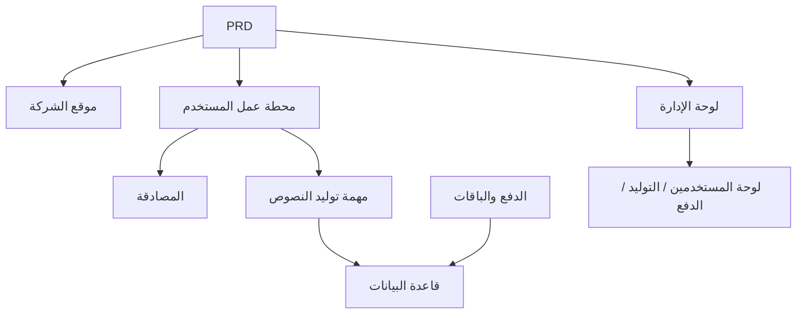

# تطوير SaaS لتوليد نصوص تسويقية بالذكاء الاصطناعي — تطبيق عملي

## نظرة عامة

يتطلب هذا المشروع **التطبيقي** منك العمل وفق مستند متطلبات منتج (PRD) حقيقي، لبناء منتج SaaS لتوليد نصوص تسويقية بالذكاء الاصطناعي من الصفر وموجه للمطورين المستقلين وفرق المحتوى. ستستخدم Supabase كخدمة خلفية، و Stripe كنظام دفع، لإكمال العملية الكاملة من تحليل المتطلبات إلى النشر والتفعيل.

هذا هو المشروع **التطبيقي** الشامل في المرحلة الثانية. في الفصول السابقة، تعلمت كل مهارة على حدة — تصميم الصفحات الأمامية، تطوير واجهات الخلفية، عمليات قواعد البيانات، دمج أنظمة الدفع — هذا المشروع يتطلب منك ربطها جميعًا معًا وتسليم نموذج أولي لمنتج قابل للتشغيل.

## المعارف المسبقة

قبل البدء في هذا المشروع، يجب أن تكون قد أتقنت المحتوى التالي:

- تصميم واجهات المستخدم واستخدام مكتبات المكونات ([تصميم واجهة المستخدم](../../frontend/ui-design/)، [مكتبة المكونات الحديثة](../../frontend/modern-component-library/))
- تصميم وتطوير واجهات الخلفية ([كتابة كود الواجهات](../../backend/ai-interface-code/))
- أساسيات قواعد البيانات و Supabase ([من قاعدة البيانات إلى Supabase](../../backend/database-supabase/))
- دمج أنظمة الدفع ([نظام الدفع Stripe](../../backend/stripe-payment/))
- سير عمل Git والنشر ([سير عمل Git و GitHub](../../backend/git-workflow/)، [نشر تطبيقات الويب](../../backend/zeabur-deployment/))

## أهداف التعلم

بعد إكمال هذا المشروع **التطبيقي**، ستتمكن من:

1. قراءة وفهم مستند PRD حقيقي واستخراج قائمة مهام التطوير منه
2. استخدام الذكاء الاصطناعي لتوليد الصفحات الأمامية وواجهات الخلفية خطوة بخطوة
3. استخدام Supabase لتحقيق مصادقة المستخدمين وعمليات قاعدة البيانات
4. دمج Stripe لتحقيق وظيفة الاشتراك المدفوع
5. بناء لوحة إدارة خلفية وإكمال التكامل الشامل من البداية إلى النهاية

## مقدمة المشروع

المنتج الذي ستقوم ببنائه هو SaaS لتوليد نصوص تسويقية بالذكاء الاصطناعي، يتضمن ثلاثة أنظمة فرعية:

| النظام الفرعي | المسؤولية |
|--------|------|
| **موقع الشركة** | تقديم المنتج، التسعير، الأسئلة الشائعة، تحويل التسجيل |
| **محطة عمل المستخدم** | إدخال **معلومات** المنتج، توليد النصوص، عرض السجل، ترقية الباقة |
| **لوحة الإدارة** | إدارة المستخدمين، سجلات التوليد، بيانات الدفع، نظرة عامة على العمليات |

تستخدم الخلفية Supabase لتوفير قاعدة البيانات والمصادقة، و Stripe لمعالجة المدفوعات، ونموذج ذكاء اصطناعي لتوليد النصوص التسويقية.

::: tip رابط مستند PRD
مستند متطلبات هذا المشروع على GitHub: [عرض PRD](https://github.com/datawhalechina/easy-vibe/blob/main/docs/zh-cn/stage-2/assignments/copywriting-platform-supabase/PRD.md)
:::

<div style="margin: 32px 0;">
  <ClientOnly>
    <StepBar :active="0" :items="[
      { title: 'تحليل المتطلبات', description: 'قراءة PRD، توضيح الصفحات والوظائف والمصادقة ونطاق الدفع' },
      { title: 'بناء الهيكل', description: 'استخدام AI لتوليد ثلاثة هياكل أمامية (www / app / admin)' },
      { title: 'دمج الخلفية', description: 'مصادقة Supabase، واجهة التوليد، دفع Stripe' },
      { title: 'التكامل والنشر', description: 'تشغيل شامل من البداية للنهاية، نشر والتحضير للعرض' }
    ]" />
  </ClientOnly>
</div>

## الجزء الأول: تحليل المتطلبات

### 1.1 قراءة PRD

افتح مستند PRD، وركّز على الإجابة عن الأسئلة التالية:

- كم نقطة دخول في النظام؟ وما هي الصفحات التي يغطيها كل منها؟
- ما هي الوظيفة الأساسية لكل صفحة؟
- ما هي الوحدات والجداول في قاعدة البيانات الموجودة في الخلفية؟
- كيف تم تصميم تسعير الباقات وعملية الدفع والحصة المجانية؟
- ما هو نطاق MVP؟ ما الذي سيتم تنفيذه في الإصدار الأول وما الذي لن يتم؟

::: warning
إذا لم تكن لديك إجابات واضحة على الأسئلة أعلاه، لا تبدأ بكتابة الكود. عدم وضوح المتطلبات هو السبب الأكثر شيوعًا لإعادة العمل.
:::

### 1.2 تأكيد بنية النظام

استنادًا إلى PRD، استخلص البنية العامة للنظام:



## الجزء الثاني: بناء هيكل المشروع

### 2.1 توليد الصفحات الأمامية

استخدم الذكاء الاصطناعي لتوليد الهيكل الأساسي وجميع الصفحات مع بيانات وهمية أولاً.

مرجع **للنصيحة** (Prompt):

```text
ساعدني بناءً على PRD الحالي في توليد هيكل أمامي لـ SaaS لتوليد نصوص تسويقية بالذكاء الاصطناعي.

المتطلبات:
1. ثلاثة مداخل: www و app و admin
2. موقع الشركة يشمل: الصفحة الرئيسية، التسعير، الأسئلة الشائعة
3. app يشمل: تسجيل الدخول، التسجيل، محطة العمل، السجل، صفحة الباقات
4. admin يشمل: الصفحة الرئيسية للإدارة، إدارة المستخدمين، سجلات التوليد، طلبات الدفع
5. توليد فقط هيكل الصفحات وبيانات وهمية بدون ربط واجهات حقيقية
6. نمط SaaS حديث وليس عرضًا تجريبيًا صف دراسي
```

### 2.2 تحسين الصفحات الأساسية

بعد بناء الهيكل، ركّز على تحسين صفحة محطة عمل توليد النصوص (Dashboard):

```text
ساعدني في تحسين صفحة /dashboard.

هذه محطة عمل لتوليد نصوص تسويقية بالذكاء الاصطناعي.

حقول النموذج على اليسار:
- اسم المنتج
- مقدمة بجملة واحدة
- المستخدم المستهدف
- 3 نقاط بيع
- قنوات التوزيع (الموقع، WeChat Moments، Xiaohongshu، Douyin، البريد الإلكتروني)

منطقة **النتائج** على اليمين محجوزة لـ:
- العنوان الرئيسي
- العنوان الفرعي
- CTA
- 3 نسخ نصية قصيرة
- نص طويل

استخدم بيانات وهمية أولاً لتشغيل التفاعل.

المتطلبات:
- حالة تحميل بعد النقر على "توليد النصوص"
- تصميم حالة فارغة لمنطقة **النتائج**
- تخطيط متجاوب يعمل بشكل جيد على الشاشات العريضة والضيقة
```

### 2.3 التحقق من بنية الصفحات

تحقق من كل عنصر:

- [ ] هل مسارات المداخل الثلاثة مستقلة
- [ ] هل عدد الصفحات يتوافق مع PRD
- [ ] هل تخطيط النموذج ومنطقة **النتائج** في Dashboard معقول
- [ ] هل البيانات الوهمية تعرض حالات واجهة مستخدم أساسية

### هل واجهتك عقبات؟

إذا واجهتك صعوبة في مرحلة بناء الواجهة الأمامية، يمكنك مراجعة هذه الفصول:

- [تصميم واجهة المستخدم](../../frontend/ui-design/)
- [تصميم الصفحات والأزرار وفقًا لإرشادات تصميم واجهة المستخدم](../../frontend/multi-product-ui/)
- [اجعل واجهتك جميلة باستخدام LLM و Skills](../../frontend/llm-skills-beautiful/)
- [من النموذج الأولي للتصميم إلى كود المشروع](../../frontend/design-to-code/)
- [تحديث واجهتك باستخدام مكتبة مكونات حديثة](../../frontend/modern-component-library/)

## الجزء الثالث: دمج الخلفية

### 3.1 ربط تسجيل الدخول عبر Supabase

```text
اعتبرني مبتدئًا تمامًا وساعدني خطوة بخطوة في ربط تسجيل الدخول عبر Supabase.

أحتاج منك مساعدتي في:
1. ربط المشروع بـ Supabase
2. تنفيذ وظائف التسجيل وتسجيل الدخول وتسجيل الخروج
3. الانتقال إلى /dashboard بعد تسجيل الدخول بنجاح
4. إعادة توجيه المستخدمين غير المسجلين تلقائيًا إلى /login عند محاولة الوصول إلى /dashboard أو /billing أو /admin
5. إنشاء جدول profiles
6. إنشاء سجل تلقائيًا في جدول profiles بعد تسجيل المستخدم بنجاح
7. يجب أن يحتوي جدول profiles على حقول email و role و plan

متطلبات التنفيذ:
- اذكر في كل خطوة الملفات التي يتم تعديلها
- لا تقم بتشفير المفاتيح بشكل ثابت
- حدد بوضوح الأماكن التي تتطلب عمليات يدوية في لوحة تحكم Supabase
- بعد الانتهاء اشرح كيفية التحقق من التسجيل وتسجيل الدخول
```

### 3.2 ربط واجهة التوليد وقاعدة البيانات

```text
اعتبرني مبتدئًا تمامًا وساعدني في إكمال الوظيفة الأساسية للموقع: توليد نصوص تسويقية وحفظها.

التأثير المطلوب:
1. يملأ المستخدم النموذج في /dashboard وينقر على "توليد النصوص"
2. تستلم الخلفية: اسم المنتج والمقدمة والمستخدم المستهدف ونقاط البيع وقنوات التوزيع
3. تستدعي الخلفية النموذج لتوليد **النتائج**
4. تعرض الصفحة **النتائج** المُولَّدة
5. تُحفظ المدخلات والمخرجات في قاعدة البيانات
6. يمكن للمستخدم عرض السجل عند العودة مرة أخرى

أحتاج منك إكمال:
- إنشاء واجهة توليد /api/generate
- إنشاء جدول generations
- تصميم حقول المدخلات والمخرجات
- قراءة سجل المستخدم الحالي في صفحة Dashboard

تجربة المستخدم:
- حالة تحميل للزر
- رسالة خطأ عند فشل التوليد
- حالة فارغة عند عدم وجود سجل

بعد الانتهاء اذكر:
- موقع ملفات الصفحات الأمامية
- موقع ملفات واجهات الخلفية
- موقع منطق كتابة البيانات إلى قاعدة البيانات
- كيفية اختبار سلسلة التوليد الكاملة
```

### 3.3 ربط الدفع عبر Stripe

```text
اعتبرني مبتدئًا تمامًا وساعدني في إضافة أبسط نظام دفع Stripe يعمل لـ LaunchKit.

لا نحتاج نظامًا معقدًا، فقط نشغّل أبسط سلسلة دفع ممكنة.

أحتاج منك إكمال:
1. صفحة /billing تعرض باقتي free و pro
2. انتقال المستخدم إلى Stripe Checkout بعد النقر على ترقية
3. العودة إلى الموقع بعد نجاح الدفع
4. حفظ **نتائج** الدفع في جدول subscriptions
5. تحديث حقل profile.plan بشكل متزامن
6. مستخدمو free محدودون بـ 3 توليدات يوميًا، ومستخدمو pro بدون حد

مبادئ التنفيذ:
- شغّل المسار الرئيسي أولاً، لا تقلق بشأن الحدود المعقدة مؤقتًا
- اذكر بوضوح الأماكن التي تحتاج إعدادًا في لوحة تحكم Stripe
- بعد الانتهاء اشرح كيفية اختبار سلسلة الدفع الكاملة
```

### 3.4 بناء لوحة الإدارة الخلفية

```text
اعتبرني مبتدئًا تمامًا وساعدني في إنشاء لوحة إدارة خلفية بسيطة وقابلة للاستخدام.

فقط للمسؤولين.

أحتاج منك إكمال:
1. فقط المستخدمون الذين role = admin يمكنهم الوصول إلى /admin
2. تحتوي لوحة الإدارة على 3 علامات تبويب: قائمة المستخدمين، سجلات التوليد، حالة الاشتراك
3. تعرض قائمة المستخدمين: البريد الإلكتروني، الباقة، تاريخ الإنشاء
4. تعرض سجلات التوليد: المستخدم، اسم المنتج، القناة، تاريخ الإنشاء
5. تعرض حالة الاشتراك: المستخدم، الباقة، حالة الدفع

المتطلبات:
- واجهة بسيطة وواضحة
- استخدام الجداول وعلامات التبويب والشارات من مكتبة المكونات الحالية
- بعد الانتهاء اشرح كيفية تعيين الحساب كمسؤول
```

### هل واجهتك عقبات؟

إذا واجهتك صعوبة في مرحلة تطوير الخلفية، يمكنك مراجعة هذه الفصول:

- [من قاعدة البيانات إلى Supabase](../../backend/database-supabase/)
- [كتابة كود الواجهات والتوثيق بمساعدة النماذج الكبيرة](../../backend/ai-interface-code/)
- [كيفية دمج أنظمة الدفع مثل Stripe](../../backend/stripe-payment/)

## الجزء الرابع: التكامل والنشر

### 4.1 اختبار شامل من البداية للنهاية

تحقق من السيناريوهات التالية على الأقل:

- تسجيل ← تسجيل دخول ← توليد نصوص ← عرض السجل ← ترقية الباقة
- تسجيل دخول المسؤول ← عرض بيانات المستخدمين ← عرض سجلات التوليد ← عرض حالة الدفع

فحوصات ما قبل النشر:

```text
اعتبرني مبتدئًا تمامًا وساعدني في التحقق مما إذا كان المشروع جاهزًا للنشر.

نقاط الفحص الرئيسية:
- هل متغيرات البيئة مكتملة
- هل عنوان إعادة توجيه تسجيل الدخول صحيح
- هل عنوان إعادة توجيه دفع Stripe صحيح
- هل تنقص الصفحات حالة تحميل أو حالة فارغة أو رسالة خطأ
- هل يحتوي README على تعليمات التشغيل والنشر

أحتاج منك:
1. سرد العناصر التي تحتاج إصلاحًا مرتبة حسب الأولوية
2. تحديد ما يجب إصلاحه أولًا
3. شرح **خطوات** النشر بعد الإصلاح
```

### 4.2 النشر

انشر المشروع على بيئة الإنترنت العامة. راجع دروس النشر: [سير عمل Git و GitHub](../../backend/git-workflow/)، [نشر تطبيقات الويب](../../backend/zeabur-deployment/).

## المخرجات المطلوبة

بعد إكمال هذا المشروع، يجب عليك تقديم المحتوى التالي:

- [ ] رابط عرض تجريبي عبر الإنترنت قابل للوصول
- [ ] رابط مستودع الكود المصدري (مع README)
- [ ] مستند PRD
- [ ] لقطات شاشة للصفحات الأساسية (الصفحة الرئيسية، Dashboard، Billing، Admin)
- [ ] فيديو عرض تجريبي مدته 60 ثانية (يغطي التسجيل ← التوليد ← الدفع ← لوحة الإدارة)

يجب أن يحتوي README على الأقل: **مقدمة المشروع**، شرح الصفحات الأساسية، حزم التقنيات، **خطوات** التشغيل المحلي، قائمة متغيرات البيئة.

## معايير التقييم

| البعد | المتطلبات الأساسية | المتطلبات المتقدمة |
|------|---------|---------|
| اكتمال المنتج | الصفحة الرئيسية وتسجيل الدخول و Dashboard و Billing و Admin جميعها قابلة للوصول | نصوص الصفحة الرئيسية وأسلوبها البصري يشبهان SaaS حقيقي |
| حلقة الأعمال | التسجيل ← تسجيل الدخول ← التوليد ← عرض السجل يمكن تشغيله بالكامل | الفرق في الصلاحيات بين free و Pro واضح ومرئي |
| صحة البيانات | **نتائج** التوليد وحالة الدفع محفوظة في قاعدة البيانات | توجد رسائل خطأ وحالات فارغة وحالة تحميل واضحة |
| الصلاحيات والأمان | لا يمكن للمستخدمين غير المسجلين الوصول للصفحات المحمية، ولا يمكن للمستخدمين العاديين دخول Admin | يوجد تحقق أساسي من المدخلات ومصادقة من جانب الخادم |
| جودة التسليم | يمكن تشغيل المشروع محليًا ونشره على الإنترنت | README واضح، وهيكل فيديو العرض التجريبي مكتمل |

::: tip
إذا شعرت أن المهمة كبيرة جدًا، تذكر مبدأ واحد: **اضمن أولًا أن "كل شيء يعمل"، ثم اسعَ لـ "أن يكون جميلًا".**
:::

## فحوصات ما قبل التقديم

<el-card shadow="hover" style="margin: 20px 0; border-radius: 12px;">
  <template #header>
    <div style="font-weight: bold; font-size: 16px;">نظرة أخيرة قبل التقديم</div>
  </template>

  <ul style="list-style-type: none; padding-left: 0;">
    <li><label><input type="checkbox" disabled /> الصفحة الرئيسية وتسجيل الدخول و Dashboard و Billing و Admin **مكتملة** جميعها</label></li>
    <li><label><input type="checkbox" disabled /> يمكن للمستخدم التسجيل وتسجيل الدخول والخروج</label></li>
    <li><label><input type="checkbox" disabled /> **نتائج** التوليد محفوظة فعليًا في قاعدة البيانات</label></li>
    <li><label><input type="checkbox" disabled /> سلسلة الدفع الرئيسية تعمل</label></li>
    <li><label><input type="checkbox" disabled /> يمكن للمسؤول عرض المستخدمين وسجلات التوليد وحالة الدفع</label></li>
    <li><label><input type="checkbox" disabled /> تم نشر المشروع على الإنترنت العام</label></li>
  </ul>
</el-card>

## المراجع

- [تصميم واجهة المستخدم](../../frontend/ui-design/)
- [تصميم الصفحات والأزرار وفقًا لإرشادات تصميم واجهة المستخدم](../../frontend/multi-product-ui/)
- [اجعل واجهتك جميلة باستخدام LLM و Skills](../../frontend/llm-skills-beautiful/)
- [من النموذج الأولي للتصميم إلى كود المشروع](../../frontend/design-to-code/)
- [تحديث واجهتك باستخدام مكتبة مكونات حديثة](../../frontend/modern-component-library/)
- [من قاعدة البيانات إلى Supabase](../../backend/database-supabase/)
- [كتابة كود الواجهات والتوثيق بمساعدة النماذج الكبيرة](../../backend/ai-interface-code/)
- [سير عمل Git و GitHub](../../backend/git-workflow/)
- [نشر تطبيقات الويب](../../backend/zeabur-deployment/)
- [كيفية دمج أنظمة الدفع مثل Stripe](../../backend/stripe-payment/)
