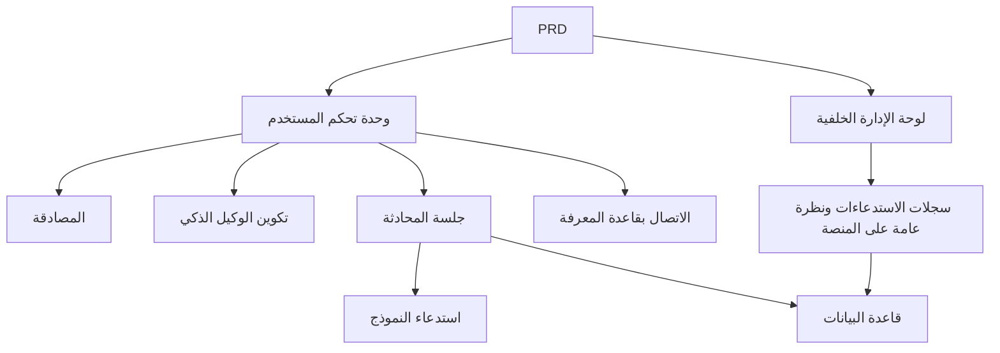

# تطوير منصة وكلاء ذكاء اصطناعي مشابهة لـ Dify - مشروع عملي

## نظرة عامة

يتطلب منك هذا المشروع العملي العمل على أساس مستند متطلبات منتج (PRD) حقيقي، وبناء منصة وكلاء ذكاء اصطناعي تحاكي التجربة الأساسية لـ Dify من الصفر. ستبني وحدة تحكم المستخدم ولوحة الإدارة الخلفية ومنصة خلفية لتحقيق الوظائف الأساسية مثل إدارة الوكلاء الذكيين والمحادثات والسجلات وقواعد المعرفة.

هذا هو مشروع Stage 2 التطبيقي الشامل. على عكس المشاريع السابقة ذات الصفحة أو الوظيفة الواحدة، يتطلب منك هذا المشروع بناء منتج AI بـ "طابع منصة" - يتضمن أدواراً متعددة ووحدات متعددة واستمرارية البيانات وسلسلة استدعاء النماذج.

## المعارف المسبقة

قبل البدء في هذا المشروع، يجب أن تكون قد أتقنت المحتوى التالي:

- تصميم واجهات الويب واستخدام مكتبات المكونات ([تصميم واجهة المستخدم](../../frontend/ui-design/)، [المكتبة الحديثة للمكونات](../../frontend/modern-component-library/))
- تصميم وتطوير واجهات البرمجيات الخلفية ([كتابة كود الواجهات](../../backend/ai-interface-code/))
- أساسيات قواعد البيانات و Supabase ([من قاعدة البيانات إلى Supabase](../../backend/database-supabase/))
- سير عمل Git والنشر ([Git و GitHub](../../backend/git-workflow/)، [نشر تطبيقات الويب](../../backend/zeabur-deployment/))

## أهداف التعلم

بعد إكمال هذا المشروع العملي، ستتمكن من:

1. قراءة وفهم PRD حقيقي واستخراج قائمة مهام التطوير منه
2. تصميم هيكل الصفحات ونماذج البيانات لمنصة الوكلاء الذكيين
3. تنفيذ سلسلة كاملة من إنشاء الوكيل الذكي والمحادثات وتسجيل السجلات
4. استخدام AI للمساعدة في تطوير منتجات من نوع المنصات
5. إكمال الاختبار الشامل من طرف إلى طرف وتسليم نموذج أولي لمنصة AI قابل للعرض

## مقدمة المشروع

المنتج الذي ستبنيه هو منصة وكلاء ذكاء اصطناعي مشابهة لـ Dify، تتضمن نظامين فرعيين:

| النظام الفرعي | المسؤولية |
|--------|------|
| **وحدة تحكم المستخدم** | إنشاء وكلاء ذكيين، تكوين Prompt، بدء المحادثات، عرض السجلات، إدارة قواعد المعرفة |
| **لوحة الإدارة الخلفية** | عرض بيانات المستخدمين، استخدام موارد المنصة، إحصائيات الاستدعاءات |

يجب أن تدعم الواجهة الخلفية القدرات الأساسية التالية: إدارة الوكلاء الذكيين، إدارة الجلسات، تخزين الرسائل، استدعاء النماذج، تسجيل سجلات الاستدعاءات، الاتصال بقواعد المعرفة.

::: tip مدخل PRD
مستند متطلبات هذا المشروع متاح على GitHub: [عرض PRD](https://github.com/datawhalechina/easy-vibe/blob/main/docs/zh-cn/stage-2/assignments/custom-dify-agent-platform/PRD.md)
:::

<div style="margin: 32px 0;">
  <ClientOnly>
    <StepBar :active="0" :items="[
      { title: 'تحليل المتطلبات', description: 'قراءة PRD وتوضيح الصفحات وحدود القدرات والمصادقة ونماذج البيانات' },
      { title: 'بناء الهيكل', description: 'استخدام AI لإنشاء هيكل وحدة تحكم المستخدم ولوحة الإدارة' },
      { title: 'التطوير التكراري', description: 'إضافة الوكلاء والمحادثات والسجلات وقواعد المعرفة لكل وحدة' },
      { title: 'الاختبار والنشر', description: 'الاختبار الشامل من طرف إلى طرف والنشر والتحضير للعرض' }
    ]" />
  </ClientOnly>
</div>

## الجزء الأول: تحليل المتطلبات

### 1.1 قراءة PRD

افتح مستند PRD، وركز على الإجابة عن الأسئلة التالية:

- ما الذي يجب إدخاله في MVP من الوكلاء والجلسات والسجلات وقواعد المعرفة؟
- هل تم تحديد قائمة الصفحات والمسارات؟
- ما هي حدود استدعاء النماذج وتسجيل السجلات؟
- هل يتم تأجيل التعددية والعمليات المعقدة؟

::: warning
إذا لم تكن لديك إجابات واضحة على الأسئلة أعلاه، لا تبدأ في كتابة الكود. سوء فهم المتطلبات هو السبب الأكثر شيوعاً لإعادة العمل.
:::

### 1.2 تأكيد بنية النظام

بناءً على PRD، رتب البنية الشاملة للنظام:



## الجزء الثاني: بناء هيكل المشروع

### 2.1 إنشاء الصفحات الأمامية

مرجع لموجه الأوامر:

```text
بناءً على PRD الحالي، ساعدني في إنشاء هيكل أمامي لمنصة وكلاء ذكاء اصطناعي مشابهة لـ Dify.

المتطلبات:
1. جانب المستخدم يتضمن: تسجيل الدخول، قائمة الوكلاء، تكوين الوكيل، صفحة المحادثة، صفحة السجلات، صفحة قاعدة المعرفة
2. جانب الإدارة يتضمن: الصفحة الرئيسية للوحة التحكم، نظرة عامة على المستخدمين، نظرة عامة على استخدام الموارد
3. إنشاء هيكل الصفحات والبيانات الوهمية فقط، دون ربط واجهات حقيقية
4. النمط يجب أن يشبه منصات AI الحديثة
```

### 2.2 التحقق من هيكل الصفحات

تحقق من كل عنصر:

- [ ] هل مدخلات وحدة تحكم المستخدم ولوحة الإدارة الخلفية مفصولة
- [ ] هل صفحات قائمة الوكلاء والتكوين والمحادثة والسجلات وقاعدة المعرفة كاملة
- [ ] هل يمكن الوصول إلى الصفحة الرئيسية للوحة التحكم ونظرة عامة على المستخدمين
- [ ] هل تعرض البيانات الوهمية حالات واجهة المستخدم الأساسية

## الجزء الثالث: التطوير التكراري

### 3.1 التقدم حسب الوحدات

على أساس الهيكل، أضف الوظائف حسب الوحدات بالترتيب التالي:

1. **المصادقة**: التسجيل، تسجيل الدخول، التمييز بين الأدوار
2. **إدارة الوكلاء الذكيين**: الإنشاء، التعديل، الحذف، تكوين Prompt
3. **وظيفة المحادثة**: إنشاء الجلسات، إرسال واستقبال الرسائل، استدعاء النماذج
4. **تسجيل السجلات**: الوقت المستغرق، استخدام token، تسجيل الأخطاء
5. **الاتصال بقاعدة المعرفة** (نقاط إضافية): رفع المستندات، البحث، حقن النتائج
6. **لوحة الإدارة الخلفية**: بيانات المستخدمين، استخدام الموارد، إحصائيات الاستدعاءات

بعد إكمال كل وحدة، استخدم الجدول التالي للفحص الذاتي:

| عنصر الفحص | طريقة التحقق |
|--------|----------|
| توافق الصفحات | هل عدد الصفحات والوظائف يتوافق مع PRD |
| اكتمال الواجهات | هل واجهات agents و chat و logs و knowledge كاملة |
| عزل الصلاحيات | هل يمكن للمستخدمين إدارة وكلائهم وجلساتهم فقط |
| توافق البيانات | هل بيانات messages و logs و documents متطابقة |
| قابلية العرض | هل يمكن عرض سلسلة "إنشاء وكيل ← محادثة ← عرض السجلات" الكاملة |

### 3.2 الاتصال بقاعدة المعرفة (نقاط إضافية)

إذا كنت ترغب في إضافة قدرات قاعدة المعرفة، يمكنك إضافة "مفتاح قاعدة المعرفة" لكل وكيل ذكي:

- عند التفعيل، ابحث أولاً عن أجزاء المعرفة، ثم أرسلها مع سؤال المستخدم إلى النموذج
- عند التعطيل، استجب وفق وضع المحادثة العادية

لا حاجة للسعي لتحقيق RAG معقد في الإصدار الأول، فقط تأكد من أن "نتائج البحث مرئية وسلسلة الاستدعاء قابلة للتفسير".

## الجزء الرابع: الاختبار والنشر

### 4.1 اختبار من طرف إلى طرف

تحقق من السيناريوهات التالية على الأقل:

- تسجيل حساب ← إنشاء وكيل ذكي ← تكوين Prompt ← بدء محادثة ← عرض السجلات
- تسجيل دخول المسؤول ← عرض بيانات المستخدمين ← عرض إحصائيات الاستدعاءات

تحقق قبل النشر:

- [ ] جميع الواجهات الأساسية لديها تحقق من تسجيل الدخول
- [ ] التحقق من ملكية الوكيل الذكي يعمل بشكل صحيح
- [ ] سجلات الجلسات والسجلات محفوظة فعلياً في قاعدة البيانات
- [ ] مفتاح النموذج يستخدم متغيرات البيئة وليس مشفراً بشكل ثابت
- [ ] رسائل الخطأ مرئية في الواجهة الأمامية وليست فقط في وحدة التحكم

### 4.2 النشر

انشر المشروع في بيئة الإنترنت العامة. مرجع لدروس النشر: [سير عمل Git و GitHub](../../backend/git-workflow/)، [نشر تطبيقات الويب](../../backend/zeabur-deployment/).

## المخرجات المطلوبة

بعد إكمال هذا المشروع، يجب عليك تقديم المحتوى التالي:

- [ ] رابط عرض عبر الإنترنت قابل للوصول
- [ ] رابط مستودع الكود المصدري (يتضمن README)
- [ ] مستند PRD
- [ ] لقطات شاشة للصفحات الرئيسية (صفحة إدارة الوكلاء، صفحة المحادثة، صفحة السجلات، الصفحة الرئيسية للوحة التحكم)
- [ ] فيديو عرض مدته 60 ثانية (يغطي إنشاء وكيل ← محادثة ← عرض السجلات)

يجب أن يتضمن README على الأقل: مقدمة المشروع، شرح البنية، التقنيات المستخدمة، خطوات التشغيل المحلي، قائمة متغيرات البيئة، شرح الواجهات.

## معايير التقييم

| البُعد | المتطلبات الأساسية | المتطلبات المتقدمة |
|------|---------|---------|
| اكتمال المنصة | صفحات agents / chat / logs تعمل | توجد تنقل واضح ولغة تصميم موحدة |
| حلقة الأعمال | يمكن إنشاء وكيل ذكي وإجراء محادثة حقيقية | دعم التبديل بين وكلاء متعددين وجلسات سابقة |
| البيانات والتتبع | الرسائل وسجلات الاستدعاءات قابلة للاستعلام | توجد لوحة إحصائيات لـ token / الوقت المستغرق |
| أمان الصلاحيات | فقط المستخدمون المسجلون يمكنهم الوصول للواجهات الأساسية | التحقق من ملكية الموارد مكتمل |
| التسليم الهندسي | قابل للنشر والعرض و README واضح | الاتصال بقاعدة المعرفة ونتائج البحث قابلة للتفسير |

## التحقق قبل التقديم

<el-card shadow="hover" style="margin: 20px 0; border-radius: 12px;">
  <template #header>
    <div style="font-weight: bold; font-size: 16px;">نظرة أخيرة قبل التقديم</div>
  </template>

  <ul style="list-style-type: none; padding-left: 0;">
    <li><label><input type="checkbox" disabled /> بعد تسجيل الدخول يمكن الوصول لصفحات إدارة الوكلاء والمحادثة والسجلات</label></li>
    <li><label><input type="checkbox" disabled /> يمكن إنشاء وكيل واحد على الأقل وإجراء محادثة ناجحة</label></li>
    <li><label><input type="checkbox" disabled /> كل جولة سؤال وجواب يمكن العثور على سجلها في قاعدة البيانات</label></li>
    <li><label><input type="checkbox" disabled /> عند فشل الاستدعاء تكون رسالة الخطأ مرئية في الواجهة الأمامية والسجل مسجل</label></li>
    <li><label><input type="checkbox" disabled /> المشروع منشور و README وفيديو العرض مكتملان</label></li>
  </ul>
</el-card>

## المراجع

- [تصميم واجهة المستخدم](../../frontend/ui-design/)
- [تحديث واجهتك باستخدام المكتبة الحديثة للمكونات](../../frontend/modern-component-library/)
- [من قاعدة البيانات إلى Supabase](../../backend/database-supabase/)
- [كتابة كود الواجهات بمساعدة النماذج اللغوية الكبيرة](../../backend/ai-interface-code/)
- [سير عمل Git و GitHub](../../backend/git-workflow/)
- [نشر تطبيقات الويب](../../backend/zeabur-deployment/)
