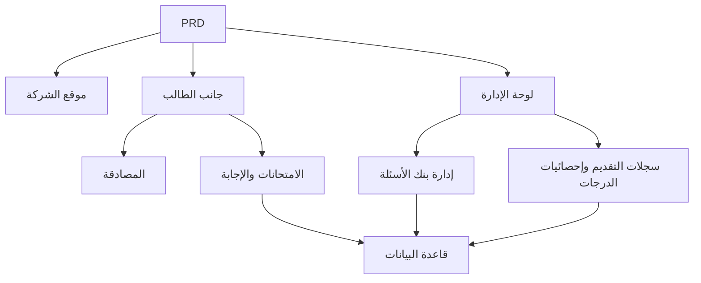

# تطوير نظام الامتحانات عبر الإنترنت والإدارة — تطبيق عملي

## نظرة عامة

يتطلب هذا المشروع **التطبيقي** منك العمل وفق مستند متطلبات منتج (PRD) حقيقي، لبناء نظام امتحانات عبر الإنترنت وإدارة من الصفر. ما يميز هذا المشروع هو أنه يتضمن أدوارًا متعددة (طالب ومسؤول)، حيث يرى كل دور صفحات مختلفة ويمكنه تنفيذ عمليات مختلفة. ستستخدم Express لبناء الخلفية وتنفيذ سلسلة أعمال الامتحانات الكاملة.

هذا هو المشروع **التطبيقي** الشامل في المرحلة الثانية. أنظمة الصلاحيات متعددة الأدوار شائعة جدًا في العمل الفعلي، وبعد إتقان هذا النموذج، ستتمكن من التعامل مع سيناريوهات أعمال متنوعة مثل التعليم والتدريب و SaaS وإدارة الخلفية.

## المعارف المسبقة

قبل البدء في هذا المشروع، يجب أن تكون قد أتقنت المحتوى التالي:

- تصميم واجهات المستخدم واستخدام مكتبات المكونات ([تصميم واجهة المستخدم](../../frontend/ui-design/)، [مكتبة المكونات الحديثة](../../frontend/modern-component-library/))
- تصميم وتطوير واجهات الخلفية ([كتابة كود الواجهات](../../backend/ai-interface-code/))
- أساسيات قواعد البيانات و Supabase ([من قاعدة البيانات إلى Supabase](../../backend/database-supabase/))
- سير عمل Git والنشر ([سير عمل Git و GitHub](../../backend/git-workflow/)، [نشر تطبيقات الويب](../../backend/zeabur-deployment/))

## أهداف التعلم

بعد إكمال هذا المشروع **التطبيقي**، ستتمكن من:

1. قراءة وفهم مستند PRD حقيقي واستخراج قائمة مهام التطوير منه
2. تصميم التحكم في صلاحيات نظام متعدد الأدوار وتوجيه الصفحات
3. استخدام Express لتنفيذ واجهات API خلفية كاملة
4. تنفيذ سلسلة أعمال الامتحانات والتقديم والتصحيح التلقائي
5. إكمال التكامل الشامل من البداية للنهاية وتسليم نموذج أولي لنظام أعمال قابل للعرض

## مقدمة المشروع

المنتج الذي ستقوم ببنائه هو نظام امتحانات عبر الإنترنت وإدارة، يتضمن ثلاثة أنظمة فرعية:

| النظام الفرعي | المسؤولية |
|--------|------|
| **موقع الشركة** | تقديم المنصة، مدخل تسجيل الدخول |
| **جانب الطالب** | قائمة الامتحانات، الإجابة، التقديم، عرض الدرجات |
| **لوحة الإدارة** | إدارة بنك الأسئلة، إدارة الامتحانات، سجلات التقديم، إحصائيات الدرجات |

تستخدم الخلفية Express، وتحتاج إلى دعم: مصادقة تسجيل الدخول، صلاحيات الأدوار، إدارة الامتحانات وبنك الأسئلة، عملية التقديم والتصحيح التلقائي، إدارة الدرجات والإحصائيات.

::: tip رابط مستند PRD
مستند متطلبات هذا المشروع على GitHub: [عرض PRD](https://github.com/datawhalechina/easy-vibe/blob/main/docs/zh-cn/stage-2/assignments/exam-management-express/PRD.md)
:::

<div style="margin: 32px 0;">
  <ClientOnly>
    <StepBar :active="0" :items="[
      { title: 'تحليل المتطلبات', description: 'قراءة PRD، توضيح الأدوار والصفحات وسلسلة الامتحانات ونموذج البيانات' },
      { title: 'بناء الهيكل', description: 'استخدام AI لتوليد هيكل صفحات جانب الطالب والإدارة' },
      { title: 'تطوير الخلفية', description: 'Express يربط تسجيل الدخول والامتحانات والتقديم والتصحيح' },
      { title: 'التكامل والنشر', description: 'تشغيل شامل من البداية للنهاية، نشر والتحضير للعرض' }
    ]" />
  </ClientOnly>
</div>

## الجزء الأول: تحليل المتطلبات

### 1.1 قراءة PRD

افتح مستند PRD، وركّز على الإجابة عن الأسئلة التالية:

- كم دورًا يتضمن النظام؟ وماذا يمكن لكل دور أن يفعل؟
- هل قائمة الصفحات مكتملة؟ ما هي الصفحات في جانب الطالب وجانب الإدارة؟
- ما أنواع الأسئلة المدعومة؟ وما هو منطق التصحيح لكل نوع؟
- ما هي العملية الكاملة للامتحان؟ (النشر ← البدء ← الإجابة ← التقديم ← التصحيح ← عرض الدرجات)

::: warning
إذا لم تكن لديك إجابات واضحة على الأسئلة أعلاه، لا تبدأ بكتابة الكود. عدم وضوح المتطلبات هو السبب الأكثر شيوعًا لإعادة العمل.
:::

### 1.2 تأكيد بنية النظام

استنادًا إلى PRD، استخلص البنية العامة للنظام:



## الجزء الثاني: بناء هيكل المشروع

### 2.1 توليد الصفحات الأمامية

مرجع **للنصيحة**:

```text
ساعدني بناءً على PRD الحالي في توليد هيكل أمامي لنظام امتحانات عبر الإنترنت وإدارة.

حزم التقنيات المطلوبة:
- Next.js App Router
- TypeScript
- Tailwind CSS
- shadcn/ui

قائمة الصفحات:
1. الصفحة الرئيسية /
2. صفحة تسجيل الدخول /login
3. قائمة امتحانات الطالب /student/exams
4. صفحة إجابة الطالب /student/exams/[id]
5. صفحة درجات الطالب /student/history
6. الصفحة الرئيسية للإدارة /admin
7. صفحة إدارة الامتحانات /admin/exams
8. صفحة إدارة بنك الأسئلة /admin/questions
9. صفحة سجلات التقديم /admin/submissions

المتطلبات:
- صفحات جانب الطالب تؤكد على الوضوح والتركيز وسهولة الإجابة
- صفحات جانب الإدارة تستخدم تخطيط شريط جانبي + شريط علوي
- استخدم بيانات وهمية أولاً بدون ربط واجهات حقيقية
- **لاحظ** التوافق الأساسي مع سطح المكتب والأجهزة المحمولة
```

### 2.2 تحسين صفحة إجابة الطالب

صفحة الإجابة هي الصفحة الأساسية في جانب الطالب، ركّز على تحسينها:

```text
ساعدني في تحسين صفحة إجابة الطالب.

هذه صفحة إجابة في نظام امتحانات عبر الإنترنت، تحتاج إلى تضمين:
- عرض عنوان الامتحان والعد التنازلي وعدد الأسئلة المُجاب عليها في الأعلى
- عرض نص السؤال والخيارات في الوسط
- دعم ثلاثة أنواع أسئلة: اختيار من متعدد، صح/خطأ، إجابة قصيرة
- بطاقة إجابة على اليسار أو الأعلى تعرض حالة الإجابة لكل سؤال
- مربع تأكيد قبل النقر على التقديم

استخدم بيانات وهمية لتحقيق التفاعل أولاً بدون ربط واجهات حقيقية.

المتطلبات:
- واجهة بسيطة، لا تشبه صفحة جدول الإدارة
- عد تنازلي بارز لكن بدون ضغط مبالغ فيه
- توجد حالة فارغة وحالة تحميل
```

### 2.3 تحسين لوحة الإدارة الخلفية

تركز النسخة الأولى من لوحة الإدارة على ثلاث مناطق أساسية:

- **إدارة الامتحانات**: إنشاء امتحان، تعيين المدة، حالة النشر
- **إدارة بنك الأسئلة**: إضافة أسئلة، تعديل أسئلة، فرز حسب نوع السؤال
- **سجلات التقديم**: عرض تقديمات الطلاب والدرجات والوقت

### 2.4 التحقق من بنية الصفحات

تحقق من كل عنصر:

- [ ] هل مدخلا جانب الطالب والإدارة منفصلان
- [ ] هل صفحة تسجيل الدخول وقائمة الامتحانات وصفحة الإجابة وصفحة الدرجات مكتملة
- [ ] هل صفحات بنك الأسئلة وإدارة الامتحانات وسجلات التقديم في جانب الإدارة قابلة للوصول
- [ ] هل يوجد فرق واضح في نمط الصفحات بين جانب الطالب وجانب الإدارة

### هل واجهتك عقبات؟

إذا واجهتك صعوبة في مرحلة بناء الواجهة الأمامية، يمكنك مراجعة هذه الفصول:

- [من قاعدة البيانات إلى Supabase](../../backend/database-supabase/)
- [تصميم وتطوير واجهات الخلفية للتطبيقات](../../backend/ai-interface-code/)
- [تحديث واجهتك باستخدام مكتبة مكونات حديثة](../../frontend/modern-component-library/)

## الجزء الثالث: تطوير الخلفية

### 3.1 تسجيل الدخول والتحكم في الصلاحيات

```text
اعتبرني مبتدئًا تمامًا وساعدني في إكمال تسجيل الدخول والتحكم في الصلاحيات لنظام الامتحانات عبر الإنترنت.

الخلفية تستخدم Express.

الأهداف:
1. يمكن للطالب والمسؤول تسجيل الدخول
2. يُعاد دور المستخدم بعد تسجيل الدخول
3. يمكن للطالب فقط الوصول إلى واجهات /student/*
4. يمكن للمسؤول فقط الوصول إلى واجهات /admin/*
5. يُعاد توجيه المستخدمين غير المسجلين إلى /login عند محاولة الوصول للصفحات المحمية

متطلبات التنفيذ:
- اقترح هيكل دليل واضح
- اشرح بوضوح مسؤوليات الوسائط
- لا تقم بتشفير المتغيرات البيئية بشكل ثابت
- بعد الانتهاء اشرح كيفية التحقق من أن الصلاحيات تعمل
```

### 3.2 واجهات إدارة الامتحانات وبنك الأسئلة

يُنصح بالتنفيذ حسب الوحدات التالية:

| الوحدة | الواجهات المقترحة |
|------|----------|
| إدارة الامتحانات | `GET /api/exams`، `POST /api/admin/exams`، `PATCH /api/admin/exams/:id` |
| إدارة بنك الأسئلة | `GET /api/admin/questions`، `POST /api/admin/questions` |
| بدء الامتحان | `POST /api/submissions/start` |
| تقديم ورقة الامتحان | `POST /api/submissions/:id/submit` |
| سجل الدرجات | `GET /api/student/history`، `GET /api/admin/submissions` |

مرجع **للنصيحة**:

```text
ساعدني في تصميم وتنفيذ Express API لنظام الامتحانات عبر الإنترنت.

نطاق الوظائف:
- المسؤول ينشئ امتحانات
- المسؤول يدير بنك الأسئلة
- الطالب يعرض الامتحانات المنشورة
- الطالب يبدأ الامتحان وينشئ تقديمًا
- الطالب يقدم الإجابات ويتم التصحيح التلقائي للأسئلة الموضوعية
- أسئلة الإجابة القصيرة تُعلَّم كقيد المراجعة أولًا
- الطالب يعرض درجاته التاريخية
- المسؤول يعرض جميع سجلات التقديم

المتطلبات:
- تسمية واضحة للواجهات
- إرجاع بنية JSON موحدة
- فصل controller و service و middleware و db في الكود
- شرح كيفية اختبار كل واجهة
```

### 3.3 منطق التصحيح

منطق التصحيح هو قاعدة الأعمال الأساسية في نظام الامتحانات:

- **أسئلة الاختيار من متعدد**: يُحصل الطالب على النقاط إذا تطابقت إجابته مع الإجابة النموذجية
- **أسئلة الصح/الخطأ**: يمكن تصحيحها تلقائيًا أيضًا
- **أسئلة الإجابة القصيرة**: في الإصدار الأول يتم حفظ الإجابة فقط بدون درجة، مع حالة `reviewed = false`

::: tip عنصر إضافي
إذا أردت إضافة قدرات الذكاء الاصطناعي، يمكنك السماح للمسؤول بإدخال "الموضوع + الصعوبة" في لوحة الإدارة، ثم يقوم النموذج بتوليد مجموعة من الأسئلة المرشحة أولًا، ثم تتم مراجعتها يدويًا وإضافتها إلى بنك الأسئلة. لكن هذا عنصر إضافي وليس مطلوبًا.
:::

## الجزء الرابع: التكامل والنشر

### 4.1 اختبار شامل من البداية للنهاية

تحقق من السيناريوهات التالية على الأقل:

- تسجيل دخول الطالب ← عرض قائمة الامتحانات ← بدء الإجابة ← التقديم ← عرض الدرجات
- تسجيل دخول المسؤول ← إنشاء امتحان ← إضافة أسئلة ← النشر ← عرض سجلات التقديم

### 4.2 النشر

- نشر الواجهة الأمامية على Vercel / Zeabur
- نشر Express API على Zeabur / Railway / Render
- استخدام Supabase Postgres أو PostgreSQL مُدار لقاعدة البيانات

فحوصات ما قبل النشر:

- [ ] هل متغيرات البيئة مكتملة
- [ ] هل عناوين API للواجهة الأمامية والخلفية صحيحة
- [ ] هل حالة تسجيل الدخول تعمل في بيئة الإنتاج
- [ ] هل يمكن لحساب المسؤول الوصول فعليًا إلى لوحة الإدارة
- [ ] هل يحتوي README على تعليمات التشغيل والنشر والاختبار

## المخرجات المطلوبة

بعد إكمال هذا المشروع، يجب عليك تقديم المحتوى التالي:

- [ ] رابط عرض تجريبي عبر الإنترنت قابل للوصول
- [ ] رابط مستودع الكود المصدري (مع README)
- [ ] مستند PRD
- [ ] لقطات شاشة للصفحات الأساسية (الصفحة الرئيسية، قائمة امتحانات الطالب، صفحة الإجابة، لوحة الإدارة)
- [ ] فيديو عرض تجريبي مدته 60 ثانية (يغطي عملية إجابة الطالب وعملية إدارة المسؤول)

يجب أن يحتوي README على الأقل: **مقدمة المشروع**، شرح الصفحات الأساسية، حزم التقنيات، **خطوات** التشغيل المحلي، قائمة متغيرات البيئة.

## معايير التقييم

| البعد | المتطلبات الأساسية | المتطلبات المتقدمة |
|------|---------|---------|
| اكتمال الصفحات | الصفحات الرئيسية لجانب الطالب والإدارة قابلة للوصول | نمط الصفحات موحد، والتوافق الأساسي مع الأجهزة المحمولة |
| حلقة الأعمال | يمكن للطالب تسجيل الدخول والمشاركة في الامتحان والتقديم وعرض الدرجات | يمكن للمسؤول إنشاء ونشر امتحان بالكامل |
| صحة البيانات | تُكتب الإجابات المقدمة في قاعدة البيانات والأسئلة الموضوعية تُصحح تلقائيًا | أسئلة الإجابة القصيرة تدعم المراجعة اليدوية أو المساعدة بالذكاء الاصطناعي |
| التحكم في الصلاحيات | حدود وصول الطالب والمسؤول واضحة | واجهات الخادم لديها أيضًا تحقق من الأدوار |
| جودة التسليم | المشروع قابل للتشغيل والنشر و README واضح | يوجد فيديو عرض تجريبي وتعليمات اختبار |

## فحوصات ما قبل التقديم

<el-card shadow="hover" style="margin: 20px 0; border-radius: 12px;">
  <template #header>
    <div style="font-weight: bold; font-size: 16px;">نظرة أخيرة قبل التقديم</div>
  </template>

  <ul style="list-style-type: none; padding-left: 0;">
    <li><label><input type="checkbox" disabled /> الصفحة الرئيسية وتسجيل الدخول وجانب الطالب وجانب الإدارة **مكتملة** جميعها</label></li>
    <li><label><input type="checkbox" disabled /> يمكن للطالب بدء الامتحان وتقديم الإجابات بشكل طبيعي</label></li>
    <li><label><input type="checkbox" disabled /> يمكن للمسؤول إنشاء امتحان وعرض سجلات التقديم</label></li>
    <li><label><input type="checkbox" disabled /> درجات الأسئلة الموضوعية تُحسب تلقائيًا وتُكتب في قاعدة البيانات</label></li>
    <li><label><input type="checkbox" disabled /> تم التحقق من حدود صلاحيات الطالب والمسؤول</label></li>
    <li><label><input type="checkbox" disabled /> تم نشر المشروع أو لديه تعليمات تشغيل محلي كاملة</label></li>
  </ul>
</el-card>

## المراجع

- [تصميم واجهة المستخدم](../../frontend/ui-design/)
- [تحديث واجهتك باستخدام مكتبة مكونات حديثة](../../frontend/modern-component-library/)
- [من قاعدة البيانات إلى Supabase](../../backend/database-supabase/)
- [كتابة كود الواجهات والتوثيق بمساعدة النماذج الكبيرة](../../backend/ai-interface-code/)
- [سير عمل Git و GitHub](../../backend/git-workflow/)
- [نشر تطبيقات الويب](../../backend/zeabur-deployment/)
