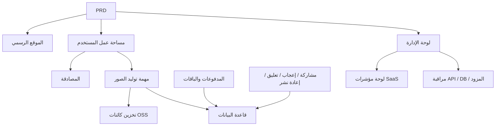

# تطوير SaaS حديث لتوليد الصور بالذكاء الاصطناعي - مشروع عملي

## نظرة عامة

يتطلب منك هذا المشروع العملي العمل على أساس مستند متطلبات منتج (PRD) حقيقي، وبناء منتج SaaS لتوليد الصور بالذكاء الاصطناعي من الصفر مستوحى من تجربة Midjourney. ستمر بالعملية الكاملة من تحليل المتطلبات وتفكيك المشروع والتطوير التكراري إلى الاختبار الشامل والنشر.

هذا هو مشروع Stage 2 التطبيقي الشامل. في الفصول السابقة، تعلمت مهارات فردية مثل تصميم واجهات الويب وتطوير واجهات البرمجيات الخلفية وقواعد البيانات ودمج المدفوعات - هذا المشروع يتطلب منك ربطها جميعاً معاً وتسليم نموذج أولي لمنتج قابل للتشغيل.

## المعارف المسبقة

قبل البدء في هذا المشروع، يجب أن تكون قد أتقنت المحتوى التالي:

- تصميم واجهات الويب واستخدام مكتبات المكونات ([تصميم واجهة المستخدم](../../frontend/ui-design/)، [المكتبة الحديثة للمكونات](../../frontend/modern-component-library/))
- تصميم وتطوير واجهات البرمجيات الخلفية ([كتابة كود الواجهات](../../backend/ai-interface-code/))
- أساسيات قواعد البيانات و Supabase ([من قاعدة البيانات إلى Supabase](../../backend/database-supabase/))
- دمج المدفوعات ([نظام الدفع Stripe](../../backend/stripe-payment/))
- سير عمل Git والنشر ([Git و GitHub](../../backend/git-workflow/)، [نشر تطبيقات الويب](../../backend/zeabur-deployment/))

## أهداف التعلم

بعد إكمال هذا المشروع العملي، ستتمكن من:

1. قراءة وفهم PRD حقيقي واستخراج قائمة مهام التطوير منه
2. تفكيك الوحدات بناءً على PRD ووضع خطة تنفيذ تدريجية
3. استخدام AI للمساعدة في بناء الهيكل الأمامي وتطوير واجهات البرمجيات الخلفية
4. التحقق من كل وحدة والتحسين التكراري
5. إكمال الاختبار الشامل من طرف إلى طرف ونقل المشروع من "قابل للتشغيل" إلى "جاهز للتسليم"

## مقدمة المشروع

المنتج الذي ستبنيه هو منصة SaaS حديثة لتوليد الصور بالذكاء الاصطناعي، تتضمن ثلاثة أنظمة فرعية:

| النظام الفرعي | المسؤولية |
|--------|------|
| **الموقع الرسمي** | تقديم المنتج، التسعير، الأسئلة الشائعة، تحويل التسجيل |
| **مساحة عمل المستخدم** | إدخال Prompt، توليد الصور، المعرض، الأرصدة، الباقات، التفاعل المجتمعي |
| **لوحة الإدارة** | إدارة المستخدمين، إدارة المهام، إدارة المدفوعات، مراجعة المحتوى، مؤشرات SaaS، مراقبة النظام |

يجب أن تدعم الواجهة الخلفية القدرات الأساسية التالية: مصادقة المستخدمين، مهام توليد الصور، تخزين كائنات OSS، الأرصدة ومدفوعات الباقات، التفاعل الاجتماعي للصور، مراقبة بيانات العمليات.

::: tip مدخل PRD
مستند متطلبات هذا المشروع متاح على GitHub: [عرض PRD](https://github.com/datawhalechina/easy-vibe/blob/main/docs/zh-cn/stage-2/assignments/modern-landing-page/PRD.md)
:::

<div style="margin: 32px 0;">
  <ClientOnly>
    <StepBar :active="0" :items="[
      { title: 'تحليل المتطلبات', description: 'قراءة PRD واستخراج الصفحات والوحدات ونماذج البيانات والحدود' },
      { title: 'بناء الهيكل', description: 'استخدام AI لإنشاء ثلاثة هياكل أمامية (www / app / admin)' },
      { title: 'التطوير التكراري', description: 'إضافة الواجهات والصلاحيات والمدفوعات والمراقبة لكل وحدة' },
      { title: 'الاختبار والنشر', description: 'الاختبار الشامل من طرف إلى طرف والنشر والتحضير للعرض' }
    ]" />
  </ClientOnly>
</div>

## الجزء الأول: تحليل المتطلبات

### 1.1 قراءة PRD

افتح مستند PRD، وركز على الإجابة عن الأسئلة التالية:

- كم عدد نقاط الدخول في النظام؟ وما هي الصفحات التي يغطيها كل منها؟
- ما هي الوظائف الأساسية لكل صفحة؟
- ما هي الوحدات والجداول في قاعدة البيانات التي تتضمنها الواجهة الخلفية؟
- ما هو نطاق MVP؟ ما الذي سيتم تنفيذه في الإصدار الأول وما الذي لن يتم؟

::: warning
إذا لم تكن لديك إجابات واضحة على الأسئلة أعلاه، لا تبدأ في كتابة الكود. سوء فهم المتطلبات هو السبب الأكثر شيوعاً لإعادة العمل.
:::

### 1.2 تأكيد بنية النظام

بناءً على وصف PRD، قم بترتيب البنية الشاملة للنظام:



يُنصح برسم مخطط البنية بكلماتك الخاصة للتأكد من أن فهمك للنظام كامل.

## الجزء الثاني: بناء هيكل المشروع

### 2.1 إنشاء الصفحات الأمامية

استخدم AI لإنشاء الهيكل الأساسي والبيانات الوهمية لجميع الصفحات أولاً. الهدف من هذه الخطوة هو بناء هيكل المعلومات والمسارات، دون الحاجة إلى ربط واجهات حقيقية.

مرجع لموجه الأوامر:

```text
بناءً على PRD الحالي، ساعدني في إنشاء هيكل أمامي لمنصة SaaS حديثة لتوليد الصور بالذكاء الاصطناعي.

المتطلبات:
1. ثلاثة نقاط دخول: www و app و admin
2. الموقع الرسمي يتضمن: الصفحة الرئيسية، التسعير، الأسئلة الشائعة
3. app يتضمن: تسجيل الدخول، إنشاء حساب، مساحة عمل التوليد، المعرض، الباقات، الأرصدة، المجتمع، تفاصيل الأعمال، المركز الشخصي
4. admin يتضمن: الصفحة الرئيسية للوحة التحكم، إدارة المستخدمين، إدارة المهام، إدارة المحتوى، إدارة الباقات، طلبات الدفع، إعدادات العمليات، مؤشرات SaaS، مراقبة النظام
5. إنشاء هيكل الصفحات والبيانات الوهمية فقط، دون ربط واجهات حقيقية
6. النمط مستوحى من Midjourney، بسيط وحديث مع طابع منتجي
```

### 2.2 التحقق من هيكل الصفحات

بعد إنشاء الهيكل، تحقق من كل عنصر:

- [ ] هل مسارات نقاط الدخول الثلاثة مستقلة (`/` و `/app` و `/admin`)
- [ ] هل عدد الصفحات يتوافق مع PRD
- [ ] هل يمكن الوصول إلى كل صفحة والتنقل فيها بشكل طبيعي
- [ ] هل تعرض البيانات الوهمية حالات واجهة المستخدم الأساسية (قوائم، حالة فارغة، نماذج، إلخ)

## الجزء الثالث: التطوير التكراري

### 3.1 التقدم حسب الوحدات

على أساس الهيكل، أضف الوظائف حسب الوحدات بالترتيب التالي:

1. **المصادقة**: التسجيل، تسجيل الدخول، التمييز بين الأدوار
2. **قاعدة البيانات**: إنشاء جداول البيانات، واجهات القراءة والكتابة
3. **الأعمال الأساسية**: مهام توليد الصور، تخزين النتائج
4. **تخزين OSS**: رفع الصور والوصول إليها
5. **المدفوعات**: الباقات، الأرصدة، دمج Stripe
6. **التفاعل الاجتماعي**: المشاركة، الإعجاب، التعليق
7. **لوحة الإدارة**: إدارة المستخدمين، إدارة المهام، مراجعة المحتوى
8. **مراقبة البيانات**: لوحة مؤشرات SaaS، مراقبة النظام

بعد إكمال كل وحدة، استخدم الجدول التالي للفحص الذاتي:

| عنصر الفحص | طريقة التحقق |
|--------|----------|
| توافق الصفحات | هل عدد الصفحات ونقاط الدخول والوظائف تتوافق مع PRD |
| صحة الواجهات | هل معلمات الطلب وبنية الإرجاع ومعالجة الحالات معقولة |
| عزل الصلاحيات | هل يتم عزل المستخدمين العاديين عن المسؤولين |
| توافق البيانات | هل قاعدة البيانات و OSS والمدفوعات والأرصدة متطابقة |
| قابلية العرض | هل يمكن عرض سلسلة أعمال كاملة للآخرين |

::: tip
إذا وجدت أن المحتوى الذي أنشأه AI قد حاد عن PRD، لا تقم بإلغاء الصفحة بأكملها وإعادة البدء، فقط اطلب منه تعديل الوحدة المحددة.
:::

### 3.2 الأدوار والمسؤوليات

أثناء التطوير التكراري، ستحتاج إلى لعب ثلاثة أدوار في نفس الوقت:

- **مدير المنتج**: تأكيد أن وظائف كل وحدة تتوافق مع PRD
- **المسؤول التقني**: تأكيد أن خطة التنفيذ معقولة
- **مهندس الاختبار**: تأكيد أن الوظائف تعمل بشكل صحيح

## الجزء الرابع: الاختبار والنشر

### 4.1 اختبار من طرف إلى طرف

التركيز في المرحلة الأخيرة ليس على إضافة صفحات جديدة، بل على تشغيل سلسلة الأعمال الكاملة. تحقق من السيناريوهات التالية على الأقل:

- تسجيل حساب ← شراء أرصدة ← توليد صورة ← عرض السجل ← التفاعل والمشاركة
- تسجيل دخول المسؤول ← عرض بيانات المستخدمين ← عرض إحصائيات المهام ← عرض مراقبة النظام

### 4.2 النشر

انشر المشروع في بيئة الإنترنت العامة، وتأكد من:

- اكتمال تكوين متغيرات البيئة
- صحة عنوان رد الاتصال لتسجيل الدخول
- صحة عنوان رد الاتصال للمدفوعات
- عدم وجود loading أو حالة فارغة أو رسائل خطأ مفقودة في الصفحات

مرجع لدروس النشر: [سير عمل Git و GitHub](../../backend/git-workflow/)، [نشر تطبيقات الويب](../../backend/zeabur-deployment/).

## المخرجات المطلوبة

بعد إكمال هذا المشروع، يجب عليك تقديم المحتوى التالي:

- [ ] رابط عرض عبر الإنترنت قابل للوصول
- [ ] رابط مستودع الكود المصدري (يتضمن README)
- [ ] مستند PRD
- [ ] لقطات شاشة للصفحات الرئيسية (الصفحة الرئيسية للموقع، مساحة عمل التوليد، المعرض، صفحة الباقات، الصفحة الرئيسية للوحة الإدارة)
- [ ] فيديو عرض مدته 60 ثانية (يغطي التسجيل ← التوليد ← العرض ← إدارة لوحة التحكم)

يجب أن يتضمن README على الأقل: مقدمة المشروع، شرح الصفحات الرئيسية، التقنيات المستخدمة، خطوات التشغيل المحلي، قائمة متغيرات البيئة.

## معايير التقييم

| البُعد | المتطلبات الأساسية | المتطلبات المتقدمة |
|------|---------|---------|
| توافق PRD | الصفحات والوظائف وهياكل البيانات تتوافق بشكل أساسي مع PRD | القدرة على شرح علاقة كل قرار تصميمي بـ PRD بوضوح |
| حلقة المنتج | التسجيل ← شراء الأرصدة ← توليد صورة ← عرض السجل ← التفاعل والمشاركة يعمل بشكل كامل | حالة المدفوعات ورصيد الأرصدة وعدد مرات التوليد متطابقة |
| قدرات لوحة الإدارة | يمكن عرض إدارة المستخدمين والمهام والمدفوعات والمحتوى | لوحة مؤشرات SaaS وصفحة مراقبة النظام كاملة وقابلة للاستخدام |
| اكتمال الهندسة | تم ربط سلسلة الواجهة الأمامية والخلفية وقاعدة البيانات و OSS والمدفوعات | توجد معالجة الأخطاء والحالات الفارغة وحالة التحميل |
| جودة التسليم | قابل للنشر والتشغيل | README واضح وهيكل فيديو العرض مكتمل |

## المراجع

- [تصميم واجهة المستخدم](../../frontend/ui-design/)
- [تصميم الصفحات والأزرار بالرجوع إلى معايير تصميم واجهة المستخدم](../../frontend/multi-product-ui/)
- [تحسين مظهر واجهتك باستخدام LLM و Skills](../../frontend/llm-skills-beautiful/)
- [من النموذج الأولي للتصميم إلى كود المشروع](../../frontend/design-to-code/)
- [تحديث واجهتك باستخدام المكتبة الحديثة للمكونات](../../frontend/modern-component-library/)
- [من قاعدة البيانات إلى Supabase](../../backend/database-supabase/)
- [كتابة كود الواجهات بمساعدة النماذج اللغوية الكبيرة](../../backend/ai-interface-code/)
- [سير عمل Git و GitHub](../../backend/git-workflow/)
- [نشر تطبيقات الويب](../../backend/zeabur-deployment/)
- [كيفية دمج Stripe وأنظمة الدفع الأخرى](../../backend/stripe-payment/)
