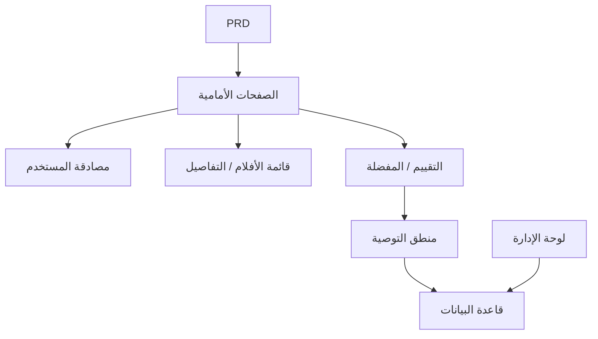

# تطوير نظام توصية الأفلام باستخدام Spring Boot - مشروع عملي

## نظرة عامة

يتطلب منك هذا المشروع العملي العمل على أساس مستند متطلبات منتج (PRD) حقيقي، واستخدام Spring Boot لبناء موقع أفلام مع قدرات التوصية. التحدي الأساسي لهذا المشروع يكمن في: أنه ليس مجرد عمليات إضافة وحذف وتعديل بسيطة، بل يحتاج منك للتفكير في "كيف تؤثر سلوكيات المستخدم على نتائج التوصية" و "كيف تجعل التوصيات قابلة للتفسير".

هذا هو مشروع Stage 2 التطبيقي الشامل. ستتعرف لأول مرة على نمط تطوير منتجات "المحتوى + السلوك + التوصية"، وهذا النمط شائع جداً في التجارة الإلكترونية ومنصات المحتوى والخلاصات المخصصة.

## المعارف المسبقة

قبل البدء في هذا المشروع، يجب أن تكون قد أتقنت المحتوى التالي:

- تصميم واجهات الويب واستخدام مكتبات المكونات ([تصميم واجهة المستخدم](../../frontend/ui-design/)، [المكتبة الحديثة للمكونات](../../frontend/modern-component-library/))
- تصميم وتطوير واجهات البرمجيات الخلفية ([كتابة كود الواجهات](../../backend/ai-interface-code/))
- أساسيات قواعد البيانات و Supabase ([من قاعدة البيانات إلى Supabase](../../backend/database-supabase/))
- سير عمل Git والنشر ([Git و GitHub](../../backend/git-workflow/)، [نشر تطبيقات الويب](../../backend/zeabur-deployment/))

## أهداف التعلم

بعد إكمال هذا المشروع العملي، ستتمكن من:

1. قراءة PRD واستخراج قائمة مهام تطوير نظام التوصية
2. استخدام Spring Boot لبناء مشروع خلفي وتنفيذ RESTful API
3. تصميم سلسلة بيانات كاملة من "سلوك المستخدم ← التوصية"
4. تنفيذ منطق توصية قابل للتفسير
5. إكمال الاختبار الشامل من طرف إلى طرف وتسليم نموذج أولي لمنتج قابل للعرض

## مقدمة المشروع

المنتج الذي ستبنيه هو موقع أفلام مع قدرات التوصية:

| الوظيفة | الوصف |
|------|------|
| **التصفح والبحث** | يمكن للمستخدمين تصفح الأفلام والبحث عنها |
| **التقييم والحفظ** | يمكن للمستخدمين تقييم الأفلام وإضافتها إلى المفضلة |
| **التوصية المخصصة** | يقدم النظام نتائج توصية بناءً على سلوك المستخدم |
| **لوحة الإدارة** | يحافظ المسؤول على بيانات الأفلام ويعرض تأثير التوصية |

::: tip مدخل PRD
مستند متطلبات هذا المشروع متاح على GitHub: [عرض PRD](https://github.com/datawhalechina/easy-vibe/blob/main/docs/zh-cn/stage-2/assignments/movie-recommendation-springboot/PRD.md)
:::

<div style="margin: 32px 0;">
  <ClientOnly>
    <StepBar :active="0" :items="[
      { title: 'تحليل المتطلبات', description: 'قراءة PRD وتوضيح استراتيجية التوصية وبيانات السلوك ونطاق لوحة الإدارة' },
      { title: 'بناء الهيكل', description: 'استخدام AI لإنشاء صفحة القائمة وصفحة التفاصيل وصفحة التوصية وصفحة لوحة الإدارة' },
      { title: 'التطوير التكراري', description: 'إضافة منطق التوصية وتسجيل السلوك وإدارة لوحة الإدارة' },
      { title: 'الاختبار والنشر', description: 'الاختبار الشامل من طرف إلى طرف والنشر والتحضير للعرض' }
    ]" />
  </ClientOnly>
</div>

## الجزء الأول: تحليل المتطلبات

### 1.1 قراءة PRD

افتح مستند PRD، وركز على الإجابة عن الأسئلة التالية:

- ما هي استراتيجية التوصية؟ هل يستخدم الإصدار الأول نسخة قابلة للتفسير (مثل التشابه في التقييم)؟
- ما هي بيانات سلوك المستخدم التي يجب تخزينها؟ (التقييمات، المفضلة، سجل التصفح، إلخ)
- ما هي مؤشرات تأثير التوصية التي يحتاج المسؤول للاطلاع عليها؟
- هل قائمة الصفحات كاملة؟

::: warning
إذا لم تكن لديك إجابات واضحة على الأسئلة أعلاه، لا تبدأ في كتابة الكود. سوء فهم المتطلبات هو السبب الأكثر شيوعاً لإعادة العمل.
:::

### 1.2 تأكيد بنية النظام



## الجزء الثاني: بناء هيكل المشروع

### 2.1 إنشاء الصفحات الأمامية

مرجع لموجه الأوامر:

```text
بناءً على PRD الحالي، ساعدني في إنشاء هيكل أمامي لنظام توصية الأفلام باستخدام Spring Boot.

المتطلبات:
1. الصفحات تتضمن: الصفحة الرئيسية، قائمة الأفلام، تفاصيل الفيلم، صفحة التوصية، المركز الشخصي، لوحة الإدارة
2. إنشاء هيكل الصفحات والبيانات الوهمية فقط، دون ربط واجهات حقيقية
3. النمط يجب أن يشبه منتج المحتوى الحقيقي، وليس عرضاً توضيحياً للفصل
```

### 2.2 التحقق من هيكل الصفحات

تحقق من كل عنصر:

- [ ] صفحة قائمة الأفلام تدعم البحث والتصفية
- [ ] صفحة تفاصيل الفيلم تتضمن أزرار التقييم والحفظ
- [ ] صفحة التوصية تعرض نتائج التوصية وأسباب التوصية
- [ ] لوحة الإدارة تعرض بيانات الأفلام وتأثير التوصية

## الجزء الثالث: التطوير التكراري

### 3.1 التقدم حسب الوحدات

1. **إعداد مشروع Spring Boot**: هيكل المشروع، تكوين قاعدة البيانات، العمليات الأساسية CRUD
2. **إدارة بيانات الأفلام**: واجهات قائمة الأفلام والتفاصيل والبحث
3. **سلوك المستخدم**: واجهات التقييم والحفظ، كتابة بيانات السلوك
4. **منطق التوصية**: تنفيذ خوارزمية التوصية بناءً على سلوك المستخدم
5. **عرض التوصية**: عرض نتائج التوصية مع أسباب التوصية
6. **لوحة الإدارة**: صيانة بيانات الأفلام، عرض تأثير التوصية

### 3.2 الفحص الذاتي للوحدات

| عنصر الفحص | طريقة التحقق |
|--------|----------|
| الوظائف الأساسية | هل القائمة والتفاصيل والتقييم والحفظ تشكل حلقة كاملة |
| ارتباط التوصية | هل سلوك المستخدم يؤثر على نتائج التوصية |
| قابلية تفسير التوصية | هل يمكن للمستخدم فهم سبب توصية هذه الأفلام |
| بيانات لوحة الإدارة | هل يمكن للمسؤول عرض بيانات الأفلام وتأثير التوصية |

## الجزء الرابع: الاختبار والنشر

### 4.1 اختبار من طرف إلى طرف

تحقق من السيناريوهات التالية على الأقل:

- تصفح الأفلام ← تقييم ← حفظ ← عرض صفحة التوصية، تأكيد تغير نتائج التوصية
- تسجيل دخول المسؤول ← إضافة فيلم ← عرض إحصائيات تأثير التوصية

## المخرجات المطلوبة

بعد إكمال هذا المشروع، يجب عليك تقديم المحتوى التالي:

- [ ] رابط عرض عبر الإنترنت قابل للوصول
- [ ] رابط مستودع الكود المصدري (يتضمن README)
- [ ] مستند PRD
- [ ] لقطات شاشة للصفحات الرئيسية (قائمة الأفلام، تفاصيل الفيلم، صفحة التوصية، لوحة الإدارة)
- [ ] فيديو عرض مدته 60 ثانية

## معايير التقييم

| البُعد | المتطلبات الأساسية | المتطلبات المتقدمة |
|------|---------|---------|
| توافق PRD | الصفحات والوظائف وهياكل البيانات تتوافق بشكل أساسي مع PRD | القدرة على شرح قرارات التصميم بوضوح |
| حلقة المنتج | تصفح ← تقييم ← حفظ ← توصية تعمل بشكل كامل | سلوك التقييم يؤثر بشكل واضح على نتائج التوصية |
| جودة التوصية | نتائج التوصية معقولة وأسباب التوصية قابلة للتفسير | دعم استراتيجيات توصية متعددة |
| قدرات لوحة الإدارة | يمكن عرض بيانات الأفلام وتأثير التوصية | توجد مؤشرات إحصائية مثل دقة التوصية |
| اكتمال الهندسة | تم ربط سلسلة الواجهة الأمامية والخلفية Spring Boot وقاعدة البيانات | واجهة التوصية لديها تخزين مؤقت أو تحسين للأداء |

## المراجع

- [تصميم واجهة المستخدم](../../frontend/ui-design/)
- [تحديث واجهتك باستخدام المكتبة الحديثة للمكونات](../../frontend/modern-component-library/)
- [من قاعدة البيانات إلى Supabase](../../backend/database-supabase/)
- [كتابة كود الواجهات بمساعدة النماذج اللغوية الكبيرة](../../backend/ai-interface-code/)
- [سير عمل Git و GitHub](../../backend/git-workflow/)
- [نشر تطبيقات الويب](../../backend/zeabur-deployment/)
