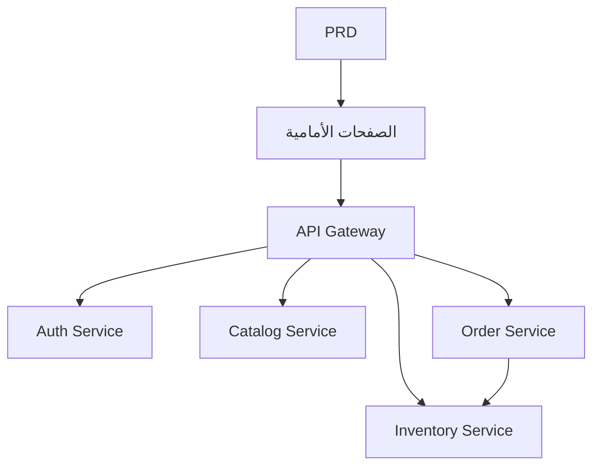

# تطوير نظام الخدمات المصغرة للتجارة الإلكترونية للمواد الغذائية الطازجة - مشروع عملي

## نظرة عامة

يتطلب منك هذا المشروع العملي العمل على أساس مستند متطلبات منتج (PRD) حقيقي، وبناء نظام خدمات مصغرة للتجارة الإلكترونية للمواد الغذائية الطازجة من الصفر. على عكس مشاريع الخدمة الواحدة السابقة، يتم تقسيم الواجهة الخلفية لهذا المشروع إلى خدمات مستقلة متعددة حسب الأعمال، وتوحيدها للخارج من خلال بوابة API. ستتعلم كيفية تصميم حدود الخدمات وكيفية التعامل مع مشاكل تناسق البيانات عبر الخدمات.

هذا هو مشروع Stage 2 التطبيقي الشامل. هندسة الخدمات المصغرة شائعة جداً في العمل الفعلي، وبعد إتقان الأفكار الأساسية لتقسيم الخدمات وتوجيه البوابة، ستتمكن من التعامل مع تصميم أنظمة خلفية أكثر تعقيداً.

## المعارف المسبقة

قبل البدء في هذا المشروع، يجب أن تكون قد أتقنت المحتوى التالي:

- تصميم واجهات الويب واستخدام مكتبات المكونات ([تصميم واجهة المستخدم](../../frontend/ui-design/)، [المكتبة الحديثة للمكونات](../../frontend/modern-component-library/))
- تصميم وتطوير واجهات البرمجيات الخلفية ([كتابة كود الواجهات](../../backend/ai-interface-code/))
- أساسيات قواعد البيانات و Supabase ([من قاعدة البيانات إلى Supabase](../../backend/database-supabase/))
- سير عمل Git والنشر ([Git و GitHub](../../backend/git-workflow/)، [نشر تطبيقات الويب](../../backend/zeabur-deployment/))

## أهداف التعلم

بعد إكمال هذا المشروع العملي، ستتمكن من:

1. قراءة PRD واستخراج قائمة مهام تطوير نظام الخدمات المصغرة
2. تقسيم حدود الخدمات حسب مجال الأعمال (المصادقة، المنتجات، المخزون، الطلبات)
3. تصميم وتنفيذ مسارات بوابة API
4. التعامل مع مشاكل خصم المخزون وتناسق الطلبات عبر الخدمات
5. إكمال الاختبار الشامل من طرف إلى طرف وتسليم نموذج أولي للخدمات المصغرة قابل للعرض

## مقدمة المشروع

المنتج الذي ستبنيه هو نظام خدمات مصغرة للتجارة الإلكترونية للمواد الغذائية الطازجة:

| النظام الفرعي | المسؤولية |
|--------|------|
| **واجهة المستخدم** | تصفح المنتجات، تقديم الطلبات، عرض الطلبات |
| **واجهة الإدارة** | إدارة المنتجات، إدارة المخزون، إدارة الطلبات |

يتم تقسيم الواجهة الخلفية حسب الأعمال إلى الخدمات التالية:

| الخدمة | المسؤولية |
|------|------|
| **API Gateway** | مدخل موحد، توجيه الطلبات، التحقق من المصادقة |
| **Auth Service** | تسجيل المستخدمين، تسجيل الدخول، إصدار JWT |
| **Catalog Service** | إدارة معلومات المنتجات |
| **Inventory Service** | إدارة كميات المخزون |
| **Order Service** | إنشاء الطلبات، إدارة الحالات |

::: tip مدخل PRD
مستند متطلبات هذا المشروع متاح على GitHub: [عرض PRD](https://github.com/datawhalechina/easy-vibe/blob/main/docs/zh-cn/stage-2/assignments/simple-grocery-microservices/PRD.md)
:::

<div style="margin: 32px 0;">
  <ClientOnly>
    <StepBar :active="0" :items="[
      { title: 'تحليل المتطلبات', description: 'قراءة PRD وتوضيح تقسيم الخدمات والصفحات وسلسلة المعاملات' },
      { title: 'بناء الهيكل', description: 'إنشاء الواجهة الأمامية والبوابة وهياكل الخدمات' },
      { title: 'التطوير التكراري', description: 'إضافة الواجهات لكل وحدة وإصلاح تناسق المخزون والطلبات' },
      { title: 'الاختبار والنشر', description: 'الاختبار الشامل من طرف إلى طرف والنشر والتحضير للعرض' }
    ]" />
  </ClientOnly>
</div>

## الجزء الأول: تحليل المتطلبات

### 1.1 قراءة PRD

افتح مستند PRD، وركز على الإجابة عن الأسئلة التالية:

- كيف يتم تقسيم الخدمات؟ ما هي حدود مسؤولية كل خدمة؟
- ما هي الصفحات في واجهة المستخدم وواجهة الإدارة على التوالي؟
- ما هي استراتيجية خصم المخزون بعد تقديم الطلب؟ كيف يتم التعامل مع النجاح / الفشل / انتهاء المهلة؟
- ما هي القدرات المعقدة التي يتم تأجيلها في الإصدار الأول (مثل المعاملات الموزعة، طوابير الرسائل)؟

::: warning
إذا لم تكن لديك إجابات واضحة على الأسئلة أعلاه، لا تبدأ في كتابة الكود. سوء فهم المتطلبات هو السبب الأكثر شيوعاً لإعادة العمل.
:::

### 1.2 تأكيد بنية النظام



## الجزء الثاني: بناء هيكل المشروع

### 2.1 إنشاء هيكل المشروع

مرجع لموجه الأوامر:

```text
بناءً على PRD الحالي، ساعدني في إنشاء هيكل مشروع نظام الخدمات المصغرة للتجارة الإلكترونية للمواد الغذائية الطازجة.

المتطلبات:
1. إنشاء هيكل واجهة المستخدم وواجهة الإدارة الأمامية
2. إنشاء خمسة أدلة: api-gateway و auth-service و catalog-service و inventory-service و order-service
3. كل خدمة تقوم فقط بإنشاء مدخل أدنى قابل للتشغيل
4. عدم الاتصال بقاعدة بيانات حقيقية أو نظام دفع في البداية
```

### 2.2 التحقق من هيكل المشروع

تحقق من كل عنصر:

- [ ] هيكل أدلة الخدمات الخمسة واضح
- [ ] يمكن بدء API Gateway وإعادة توجيه الطلبات
- [ ] واجهات الفحص الصحي لكل خدمة متاحة
- [ ] يمكن الوصول إلى صفحات واجهة المستخدم وواجهة الإدارة

## الجزء الثالث: التطوير التكراري

### 3.1 التقدم حسب الوحدات

1. **API Gateway**: تكوين المسارات، وسيط التحقق من JWT
2. **Auth Service**: التسجيل، تسجيل الدخول، إصدار JWT
3. **Catalog Service**: عمليات CRUD للمنتجات، استعلام القائمة
4. **Inventory Service**: استعلام المخزون، خصم المخزون
5. **Order Service**: إنشاء الطلبات، تدفق الحالات، الربط مع المخزون
6. **واجهة الإدارة**: إدارة المنتجات، إدارة المخزون، إدارة الطلبات

### 3.2 الفحص الذاتي للوحدات

| عنصر الفحص | طريقة التحقق |
|--------|----------|
| مسارات البوابة | هل يتم إعادة توجيه واجهات كل خدمة بشكل صحيح عبر البوابة |
| عزل الصلاحيات | هل واجهات المستخدم وواجهة الإدارة معزولة |
| توافق البيانات | هل بيانات المنتجات والمخزون متزامنة |
| حلقة المعاملات | بعد تقديم الطلب، هل خصم المخزون وحالة الطلب متسقة |
| معالجة الفشل | عند عدم كفاية المخزون أو انتهاء المهلة، هل توجد آلية تعويض |

## الجزء الرابع: الاختبار والنشر

### 4.1 اختبار من طرف إلى طرف

تحقق من السيناريوهات التالية على الأقل:

- تصفح المنتجات ← إضافة إلى سلة التسوق ← تقديم طلب ← عرض الطلب
- المسؤول ← إضافة منتج ← تحديث المخزون ← عرض الطلب

## المخرجات المطلوبة

بعد إكمال هذا المشروع، يجب عليك تقديم المحتوى التالي:

- [ ] رابط عرض عبر الإنترنت قابل للوصول
- [ ] رابط مستودع الكود المصدري (يتضمن README)
- [ ] مستند PRD
- [ ] لقطات شاشة للصفحات الرئيسية (قائمة المنتجات، صفحة الطلب، صفحة الطلبات، لوحة الإدارة)
- [ ] فيديو عرض مدته 60 ثانية

## معايير التقييم

| البُعد | المتطلبات الأساسية | المتطلبات المتقدمة |
|------|---------|---------|
| توافق PRD | الصفحات والوظائف وتقسيم الخدمات يتوافق بشكل أساسي مع PRD | القدرة على شرح أسباب تقسيم الخدمات بوضوح |
| حلقة المنتج | تصفح ← تقديم طلب ← خصم مخزون ← عرض الطلب يعمل بشكل كامل | عند انتهاء مهلة الطلب أو عدم كفاية المخزون توجد آلية تعويض |
| بنية الخدمات | يمكن بدء كل خدمة بشكل مستقل والوصول إليها بشكل موحد عبر البوابة | الاتصال بين الخدمات لديه معالجة أخطاء وإعادة محاولة |
| قدرات لوحة الإدارة | إدارة المنتجات والمخزون والطلبات قابلة للتشغيل | واجهة الإدارة لديها إحصائيات بيانات |
| اكتمال الهندسة | تم ربط سلسلة الواجهة الأمامية والبوابة والخدمات وقاعدة البيانات | يوجد Docker Compose أو تنسيق مشابه |

## المراجع

- [تصميم واجهة المستخدم](../../frontend/ui-design/)
- [تحديث واجهتك باستخدام المكتبة الحديثة للمكونات](../../frontend/modern-component-library/)
- [من قاعدة البيانات إلى Supabase](../../backend/database-supabase/)
- [كتابة كود الواجهات بمساعدة النماذج اللغوية الكبيرة](../../backend/ai-interface-code/)
- [سير عمل Git و GitHub](../../backend/git-workflow/)
- [نشر تطبيقات الويب](../../backend/zeabur-deployment/)
