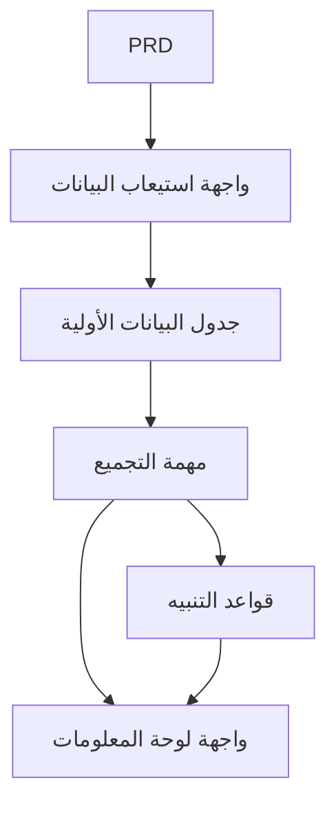

# تطوير منصة تحليل بيانات حركة المرور باستخدام Go - مشروع عملي

## نظرة عامة

يتطلب منك هذا المشروع العملي العمل على أساس مستند متطلبات منتج (PRD) حقيقي، واستخدام لغة Go لبناء منصة لتحليل بيانات حركة المرور. يختلف اتجاه هذا المشروع عن أنظمة الإضافة والحذف والتعديل السابقة - حيث ستحتاج إلى بناء سلسلة بيانات كاملة من "استيعاب البيانات ← التجميع ← التنبيه ← التصور". هذا النوع من منتجات البيانات شائع جداً في سيناريوهات إنترنت الأشياء والمراقبة وتحليل العمليات.

هذا هو مشروع Stage 2 التطبيقي الشامل، وهو أيضاً أول تعرض لك للغة Go. لا تقلق، مع أساسك السابق في JavaScript / TypeScript، لن يكون تعلم Go صعباً - التركيز على فهم أفكار تصميم سلسلة البيانات.

## المعارف المسبقة

قبل البدء في هذا المشروع، يجب أن تكون قد أتقنت المحتوى التالي:

- تصميم واجهات الويب واستخدام مكتبات المكونات ([تصميم واجهة المستخدم](../../frontend/ui-design/)، [المكتبة الحديثة للمكونات](../../frontend/modern-component-library/))
- تصميم وتطوير واجهات البرمجيات الخلفية ([كتابة كود الواجهات](../../backend/ai-interface-code/))
- أساسيات قواعد البيانات و Supabase ([من قاعدة البيانات إلى Supabase](../../backend/database-supabase/))
- سير عمل Git والنشر ([Git و GitHub](../../backend/git-workflow/)، [نشر تطبيقات الويب](../../backend/zeabur-deployment/))

## أهداف التعلم

بعد إكمال هذا المشروع العملي، ستتمكن من:

1. قراءة مستند PRD واستخراج قائمة مهام التطوير لمنتجات البيانات
2. استخدام Go (Gin أو Fiber) لبناء خدمة API خلفية
3. تصميم سلسلة كاملة من استيعاب البيانات والتجميع داخل النوافذ الزمنية والتنبيهات
4. الحفاظ على توافق البيانات الخلفية مع لوحة المعلومات الأمامية
5. إكمال الاختبار الشامل من طرف إلى طرف وتسليم نموذج أولي لمنتج بيانات قابل للعرض

## مقدمة المشروع

المنتج الذي ستبنيه هو منصة Go لتحليل بيانات حركة المرور:

| الوحدة | المسؤولية |
|------|----------|
| **استيعاب البيانات** | استقبال أحداث حركة المرور الأولية وتخزينها |
| **تجميع البيانات** | حساب الاتجاهات ومؤشرات الازدحام حسب النوافذ الزمنية |
| **التنبيهات** | إنشاء سجلات التنبيهات بناءً على القواعد |
| **لوحة المعلومات** | عرض رسوم الاتجاهات والتصنيفات وقائمة التنبيهات في الواجهة الأمامية |

::: tip مدخل PRD
مستند متطلبات هذا المشروع متاح على GitHub: [عرض PRD](https://github.com/datawhalechina/easy-vibe/blob/main/docs/zh-cn/stage-2/assignments/traffic-data-visualization-go/PRD.md)
:::

<div style="margin: 32px 0;">
  <ClientOnly>
    <StepBar :active="0" :items="[
      { title: 'تحليل المتطلبات', description: 'قراءة PRD وتوضيح مصادر البيانات ومعايير المؤشرات وقواعد التنبيه' },
      { title: 'بناء الهيكل', description: 'استخدام AI لإنشاء خدمة Go API وهيكل لوحة المعلومات الأمامية' },
      { title: 'التطوير التكراري', description: 'إضافة منطق التجميع وقواعد التنبيه وواجهات لوحة المعلومات' },
      { title: 'الاختبار والنشر', description: 'الاختبار الشامل من طرف إلى طرف والنشر والتحضير للعرض' }
    ]" />
  </ClientOnly>
</div>

## الجزء الأول: تحليل المتطلبات

### 1.1 قراءة PRD

افتح مستند PRD، وركز على الإجابة عن الأسئلة التالية:

- ما هو مصدر البيانات؟ ما هي الحقول الموجودة؟
- ما هو تعريف المؤشرات الأساسية؟ (على سبيل المثال، المعيار المحدد للازدحام)
- ما هي قواعد التنبيه؟ هل يجب تبسيطها في الإصدار الأول؟
- ما هي الصفحات والرسوم البيانية التي تتضمنها لوحة المعلومات؟

::: warning
إذا لم تكن لديك إجابات واضحة على الأسئلة أعلاه، لا تبدأ في كتابة الكود. سوء فهم المتطلبات هو السبب الأكثر شيوعاً لإعادة العمل.
:::

### 1.2 تأكيد سلسلة البيانات



## الجزء الثاني: بناء هيكل المشروع

### 2.1 إنشاء خدمة Go API

مرجع لموجه الأوامر:

```text
بناءً على PRD الحالي، ساعدني في إنشاء هيكل منصة تحليل بيانات حركة المرور باستخدام Go.

المتطلبات:
1. استخدام Gin أو Fiber
2. توفير واجهة استيعاب البيانات
3. توفير هيكل مهمة التجميع
4. توفير هيكل واجهات dashboard و alerts
5. عدم إجراء تحليل معقد حقيقي، فقط بنية قابلة للتشغيل
```

### 2.2 التحقق من هيكل المشروع

تحقق من كل عنصر:

- [ ] يمكن بدء خدمة Go بشكل طبيعي
- [ ] يمكن لواجهة استيعاب البيانات استقبال البيانات وتخزينها
- [ ] تم بناء إطار مهمة التجميع
- [ ] يمكن لصفحة لوحة المعلومات الأمامية عرض الرسوم البيانية الأساسية

## الجزء الثالث: التطوير التكراري

### 3.1 التقدم حسب الوحدات

1. **واجهة استيعاب البيانات**: استقبال أحداث حركة المرور الأولية وكتابتها في قاعدة البيانات
2. **تجميع البيانات**: التجميع حسب النوافذ الزمنية وحساب الاتجاهات ومؤشرات الازدحام
3. **قواعد التنبيه**: إنشاء سجلات التنبيهات بناءً على الحدود
4. **واجهات لوحة المعلومات**: توفير بيانات الاتجاهات وبيانات التصنيف وقائمة التنبيهات
5. **لوحة المعلومات الأمامية**: صفحات رسوم الاتجاهات والتصنيفات وقائمة التنبيهات

### 3.2 الفحص الذاتي للوحدات

| عنصر الفحص | طريقة التحقق |
|--------|----------|
| استيعاب البيانات | هل تم تخزين البيانات الأولية بشكل صحيح |
| معايير التجميع | هل منطق حساب مؤشرات الاتجاهات والتصنيفات متسقة |
| قواعد التنبيه | هل شروط تفعيل التنبيهات تتوافق مع التوقعات |
| توافق البيانات | هل يتطابق عرض لوحة المعلومات مع البيانات الخلفية |
| معايير API | هل توجد بنية إرجاع موحدة ومعالجة الأخطاء |

## الجزء الرابع: الاختبار والنشر

### 4.1 اختبار من طرف إلى طرف

تحقق من السيناريوهات التالية على الأقل:

- استيعاب مجموعة بيانات اختبار ← تنفيذ مهمة التجميع ← تحديث عرض لوحة المعلومات
- تفعيل شرط التنبيه ← إنشاء سجل تنبيه ← ظهور التنبيه على صفحة التنبيهات

## المخرجات المطلوبة

بعد إكمال هذا المشروع، يجب عليك تقديم المحتوى التالي:

- [ ] رابط عرض عبر الإنترنت قابل للوصول
- [ ] رابط مستودع الكود المصدري (يتضمن README)
- [ ] مستند PRD
- [ ] لقطات شاشة للصفحات الرئيسية (عرض استيعاب البيانات، لوحة الاتجاهات، قائمة التنبيهات)
- [ ] فيديو عرض مدته 60 ثانية

## معايير التقييم

| البُعد | المتطلبات الأساسية | المتطلبات المتقدمة |
|------|---------|---------|
| توافق PRD | تتوافق الوظائف وهياكل البيانات بشكل أساسي مع PRD | القدرة على شرح معايير المؤشرات ومنطق التجميع بوضوح |
| سلسلة البيانات | استيعاب ← تجميع ← تنبيه ← لوحة معلومات تعمل بشكل كامل | مهمة التجميع تدعم التحديث التزايدي |
| قدرات التحليل | وحدات الاتجاهات والتصنيف والتنبيهات تعمل | المؤشرات قابلة للتكوين وقواعد التنبيه قابلة للتخصيص |
| العرض الأمامي | لوحة المعلومات تعرض الرسوم البيانية الأساسية | الرسوم البيانية تدعم تصفية النطاق الزمني |
| اكتمال الهندسة | تم ربط Go API وقاعدة البيانات وسلسلة الواجهة الأمامية | API لديه معالجة أخطاء موحدة وسجلات |

## المراجع

- [تصميم واجهة المستخدم](../../frontend/ui-design/)
- [تحديث واجهتك باستخدام المكتبة الحديثة للمكونات](../../frontend/modern-component-library/)
- [من قاعدة البيانات إلى Supabase](../../backend/database-supabase/)
- [كتابة كود الواجهات بمساعدة النماذج اللغوية الكبيرة](../../backend/ai-interface-code/)
- [سير عمل Git و GitHub](../../backend/git-workflow/)
- [نشر تطبيقات الويب](../../backend/zeabur-deployment/)
