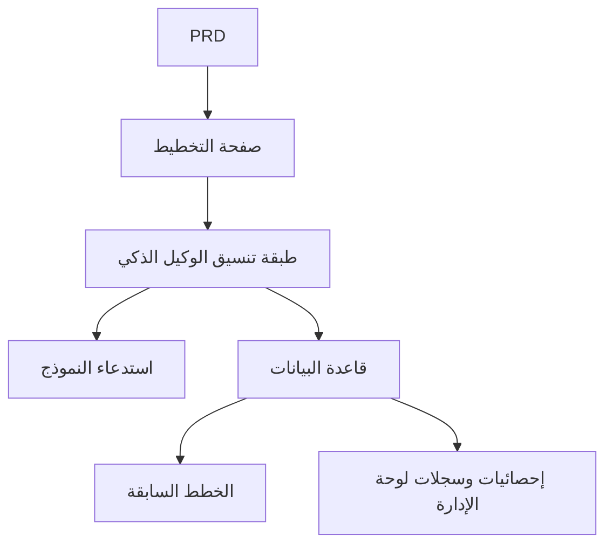

# تطوير منصة وكيل تخطيط السفر الذكي - مشروع عملي

## نظرة عامة

يتطلب منك هذا المشروع العملي العمل على أساس مستند متطلبات منتج (PRD) حقيقي، وبناء منصة وكيل تخطيط سفر ذكي من الصفر. ستبني منتج AI كاملاً قادراً على استقبال مدخلات منظمة وإنشاء خط سير يومي ودعم الحفظ وإعادة الاستخدام - وليس مجرد روبوت دردشة، بل منتج يمتلك قدرات إدارة المهام.

هذا هو مشروع Stage 2 التطبيقي الشامل. التحدي الأساسي لهذا المشروع يكمن في: كيف تجعل AI يُنشئ خطط سفر منظمة وقابلة للاستخدام، بدلاً من نص طويل غير قابل للتشغيل.

## المعارف المسبقة

قبل البدء في هذا المشروع، يجب أن تكون قد أتقنت المحتوى التالي:

- تصميم واجهات الويب واستخدام مكتبات المكونات ([تصميم واجهة المستخدم](../../frontend/ui-design/)، [المكتبة الحديثة للمكونات](../../frontend/modern-component-library/))
- تصميم وتطوير واجهات البرمجيات الخلفية ([كتابة كود الواجهات](../../backend/ai-interface-code/))
- أساسيات قواعد البيانات و Supabase ([من قاعدة البيانات إلى Supabase](../../backend/database-supabase/))
- سير عمل Git والنشر ([Git و GitHub](../../backend/git-workflow/)، [نشر تطبيقات الويب](../../backend/zeabur-deployment/))

## أهداف التعلم

بعد إكمال هذا المشروع العملي، ستتمكن من:

1. قراءة PRD واستخراج قائمة مهام تطوير منصة الوكيل الذكي
2. تصميم نماذج إدخال منظمة وتنسيقات إخراج منظمة
3. تنفيذ طبقة تنسيق الوكيل الذكي لمعالجة مدخلات المستخدم واستدعاء النموذج وتخزين النتائج
4. بناء حلقة أعمال "توليد ← حفظ ← إعادة استخدام"
5. إكمال الاختبار الشامل من طرف إلى طرف وتسليم نموذج أولي لمنتج AI قابل للعرض

## مقدمة المشروع

المنتج الذي ستبنيه هو منصة وكيل تخطيط سفر ذكي:

| الوظيفة | الوصف |
|------|------|
| **تخطيط الرحلة** | يُدخل المستخدم نقطة الانطلاق والوجهة والتاريخ والميزانية والتفضيلات، ويُنشئ النظام خط سير يومي |
| **تفكيك الميزانية** | تتضمن نتائج الرحلة توزيع الميزانية والاقتراحات |
| **إدارة السجل** | يمكن للمستخدم حفظ الخطط السابقة وإعادة إنشائها وتصديرها |
| **لوحة الإدارة** | يعرض المسؤول الوجهات الشائعة والمهام الفاشلة وتعليقات المستخدمين |

::: tip مدخل PRD
مستند متطلبات هذا المشروع متاح على GitHub: [عرض PRD](https://github.com/datawhalechina/easy-vibe/blob/main/docs/zh-cn/stage-2/assignments/travel-planning-agent-platform/PRD.md)
:::

<div style="margin: 32px 0;">
  <ClientOnly>
    <StepBar :active="0" :items="[
      { title: 'تحليل المتطلبات', description: 'قراءة PRD وتوضيح الصفحات وتنسيق الوكيل وهياكل الإدخال والإخراج' },
      { title: 'بناء الهيكل', description: 'استخدام AI لإنشاء هيكل الصفحة الرئيسية وصفحة التخطيط وصفحة السجل ولوحة الإدارة' },
      { title: 'التطوير التكراري', description: 'إضافة الإخراج المنظم وحالات المهام وإدارة السجل لكل وحدة' },
      { title: 'الاختبار والنشر', description: 'الاختبار الشامل من طرف إلى طرف والنشر والتحضير للعرض' }
    ]" />
  </ClientOnly>
</div>

## الجزء الأول: تحليل المتطلبات

### 1.1 قراءة PRD

افتح مستند PRD، وركز على الإجابة عن الأسئلة التالية:

- هل الإصدار الأول يقتصر على وجهة واحدة فقط؟
- هل يجب أن يكون إخراج الرحلة منظماً؟ وما هو الهيكل؟
- ما مدى عمق قدرات التصدير؟ (رابط مشاركة / PDF / صورة)
- ما هو نطاق إحصائيات لوحة الإدارة وسجلات المهام؟

::: warning
إذا لم تكن لديك إجابات واضحة على الأسئلة أعلاه، لا تبدأ في كتابة الكود. سوء فهم المتطلبات هو السبب الأكثر شيوعاً لإعادة العمل.
:::

### 1.2 تأكيد بنية النظام



## الجزء الثاني: بناء هيكل المشروع

### 2.1 إنشاء الصفحات الأمامية

مرجع لموجه الأوامر:

```text
بناءً على PRD الحالي، ساعدني في إنشاء هيكل أمامي لمنصة وكيل تخطيط السفر الذكي.

المتطلبات:
1. الصفحات تتضمن: الصفحة الرئيسية، صفحة التخطيط، صفحة تفاصيل الرحلة، صفحة السجلات، صفحة الإدارة
2. الجانب الأيسر من صفحة التخطيط هو نموذج والجانب الأيمن هو معاينة النتائج
3. إنشاء هيكل الصفحات والبيانات الوهمية فقط، دون ربط واجهات حقيقية
4. النمط يجب أن يشبه منتجات AI الحديثة
```

### 2.2 التحقق من هيكل الصفحات

تحقق من كل عنصر:

- [ ] هل حقول نموذج صفحة التخطيط تتوافق مع PRD
- [ ] هل يمكن لمنطقة معاينة النتائج عرض بيانات الرحلة المنظمة
- [ ] هل يمكن لصفحة السجلات عرض خطط متعددة
- [ ] هل يمكن لصفحة لوحة الإدارة عرض البيانات الإحصائية

## الجزء الثالث: التطوير التكراري

### 3.1 التقدم حسب الوحدات

1. **المصادقة**: التسجيل، تسجيل الدخول
2. **نموذج التخطيط**: إدخال منظم (نقطة الانطلاق، الوجهة، التاريخ، الميزانية، التفضيلات)
3. **تنسيق الوكيل الذكي**: استقبال الإدخال ← استدعاء النموذج ← تحليل الإخراج المنظم
4. **عرض النتائج**: عرض الرحلة حسب اليوم، تفكيك الميزانية، الاقتراحات
5. **إدارة السجل**: حفظ الخطة، إعادة الإنشاء، التصدير
6. **لوحة الإدارة**: الوجهات الشائعة، المهام الفاشلة، تعليقات المستخدمين
7. **حالات المهام**: إدارة الحالة (قيد الإنشاء / نجاح / فشل) وتسجيل الأخطاء

### 3.2 الفحص الذاتي للوحدات

| عنصر الفحص | طريقة التحقق |
|--------|----------|
| اكتمال الإدخال | هل حقول النموذج تتوافق مع PRD |
| تنظيم الإخراج | هل نتائج الرحلة هي بيانات منظمة (وليس نصاً طويلاً) |
| توافق البيانات | هل بيانات trip و itinerary و logs متطابقة |
| التحقق من الحلقة | هل يمكن عرض "إدخال ← توليد ← حفظ ← إعادة إنشاء" |

## الجزء الرابع: الاختبار والنشر

### 4.1 اختبار من طرف إلى طرف

تحقق من السيناريوهات التالية على الأقل:

- إدخال معلمات الرحلة ← توليد خط سير يومي ← عرض تفكيك الميزانية ← حفظ في السجل
- إعادة إنشاء رحلة من السجلات
- عرض المسؤول لإحصائيات المهام وسجلات الفشل

## المخرجات المطلوبة

بعد إكمال هذا المشروع، يجب عليك تقديم المحتوى التالي:

- [ ] رابط عرض عبر الإنترنت قابل للوصول
- [ ] رابط مستودع الكود المصدري (يتضمن README)
- [ ] مستند PRD
- [ ] لقطات شاشة للصفحات الرئيسية (صفحة التخطيط، صفحة تفاصيل الرحلة، صفحة السجلات، لوحة الإدارة)
- [ ] فيديو عرض مدته 60 ثانية

## معايير التقييم

| البُعد | المتطلبات الأساسية | المتطلبات المتقدمة |
|------|---------|---------|
| توافق PRD | الصفحات والوظائف وهياكل البيانات تتوافق بشكل أساسي مع PRD | القدرة على شرح قرارات التصميم بوضوح |
| حلقة المنتج | تخطيط ← حفظ ← سجل ← إعادة إنشاء يعمل بشكل كامل | دعم التصدير والمشاركة |
| جودة الإخراج | نتائج الرحلة منظمة وقابلة للقراءة | تفكيك الميزانية معقول والاقتراحات مستهدفة |
| قدرات لوحة الإدارة | يمكن عرض إحصائيات المهام وسجلات الفشل | توجد تحليلات للوجهات الشائعة |
| اكتمال الهندسة | تم ربط سلسلة الواجهة الأمامية والخلفية وقاعدة البيانات واستدعاء النموذج | إدارة حالات المهام مكتملة والأخطاء قابلة للتتبع |

## المراجع

- [تصميم واجهة المستخدم](../../frontend/ui-design/)
- [تحديث واجهتك باستخدام المكتبة الحديثة للمكونات](../../frontend/modern-component-library/)
- [من قاعدة البيانات إلى Supabase](../../backend/database-supabase/)
- [كتابة كود الواجهات بمساعدة النماذج اللغوية الكبيرة](../../backend/ai-interface-code/)
- [سير عمل Git و GitHub](../../backend/git-workflow/)
- [نشر تطبيقات الويب](../../backend/zeabur-deployment/)
