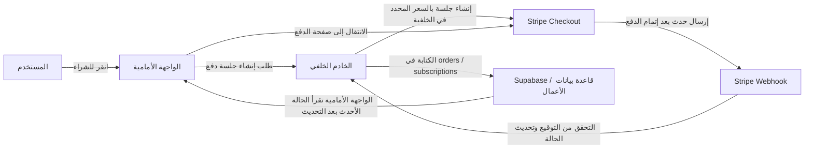
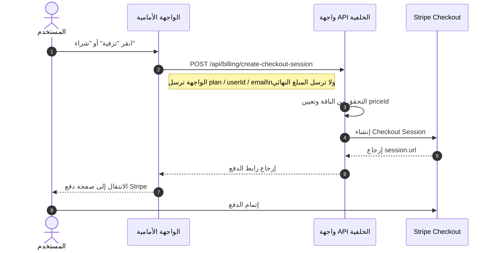
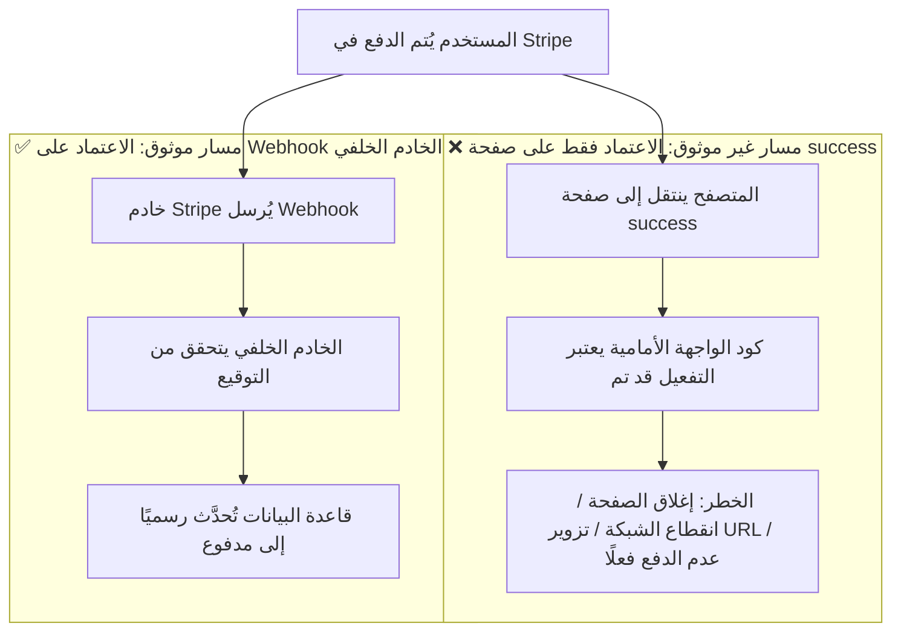
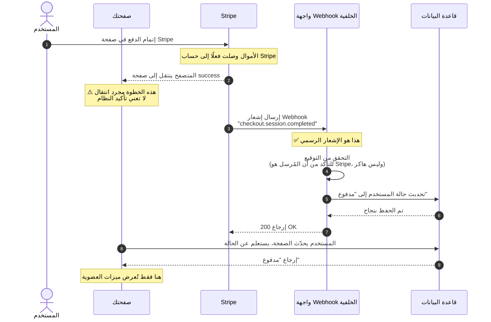
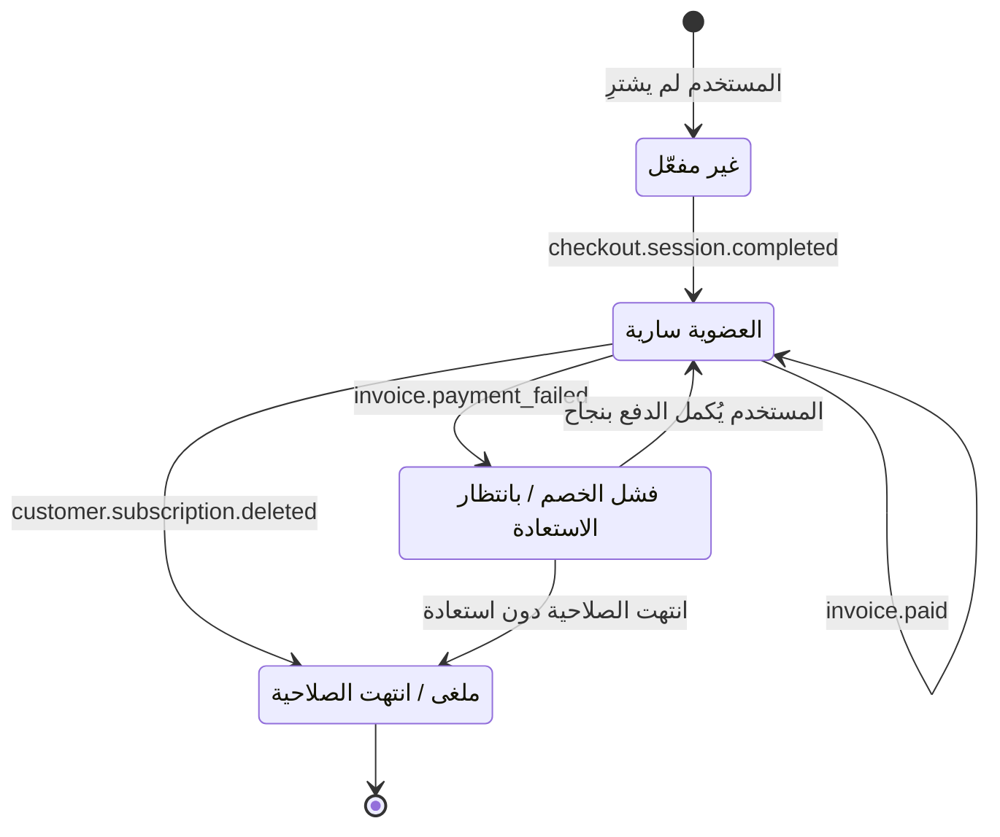
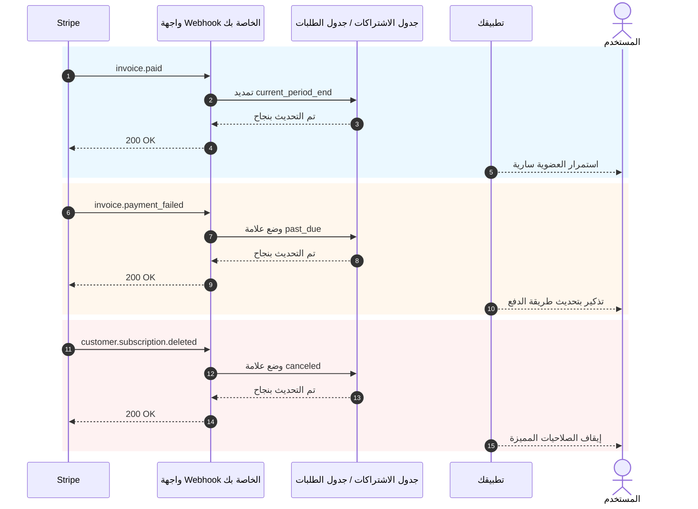

# كيفية دمج أنظمة الدفع مثل Stripe

عندما يصبح لدى منتجك صفحات ونظام تسجيل دخول وقاعدة بيانات وخلفية أساسية، فإن السؤال العملي التالي هو: **كيف يتم التحصيل المالي**.

كثير من الأشخاص عند التعامل مع الدفع للمرة الأولى، يركّزون اهتمامهم بالكامل على "كيفية الانتقال إلى صفحة الدفع". لكن ما يحدد حقًا استقرار النظام ليس الزر، بل سلسلة الدفع الكاملة: من يحدد السعر، ومن يؤكد نجاح الدفع، ومن يحدّث قاعدة البيانات، ومن يستعيد الصلاحيات.

هذه المقالة مقسّمة إلى قسمين:

- **القسم الأول** يتناول فقط أساسيات الدمج العملي، بهدف مساعدتك على ربط Stripe بمشروعك في أسرع وقت ممكن.
- **القسم الثاني** مُدرج في الملحق، ويتضمن تفاصيل Webhook وأحداث الاشتراك والفروقات في حلول الدفع بين الدول والمناطق المختلفة.

> 💡 يُنصح بإكمال هذه الفصول أولًا قبل المتابعة
>
> - [من قاعدة البيانات إلى Supabase](../database-supabase/)
> - [كتابة كود الواجهات ومستندات الواجهات بمساعدة النماذج اللغوية الكبيرة](../ai-interface-code/)
> - [كيفية نشر تطبيقات الويب](../zeabur-deployment/)

# ما ستتعلمه

1. كيف يبدو نظام الدفع الأدنى القابل للتشغيل.
2. كيفية ربط Stripe بمشروعك بأسرع طريقة ممكنة.
3. كيفية كتابة prompt يجعل الذكاء الاصطناعي يضيف نظام الدفع مباشرة.
4. إذا لم تكن تعمل على مشروع Stripe للأسواق الخارجية، ما هي حلول الدفع التي يجب أن تعطيها الأولوية في المناطق المختلفة.

---

# القسم الأول: الأساسيات

## 1. تذكّر 3 مبادئ أولًا

إذا لم تتذكر سوى ثلاثة أشياء، فتذكّر ما يلي:

1. **يجب أن يحدد الخادم الخلفي السعر**، لا يمكن الوثوق بالمبلغ المُرسل من الواجهة الأمامية.
2. **ما يُفعّل الصلاحيات فعلًا هو Webhook**، وليس صفحة `success`.
3. **يجب أن تحفظ قاعدة بياناتك حالة الدفع**، لا يمكن الاعتماد فقط على لوحة تحكم Stripe.

هذه المبادئ الثلاثة هي الحدود الأساسية لنظام الدفع. طالما أن الحدود صحيحة، فإن التبديل بين Stripe وPayPal وAlipay وWeChat Pay هو في جوهره "تغيير الواجهة فقط، دون تغيير البنية".

## 2. ماذا يحدث إذا لم تُعالج في الخادم الخلفي، بل ربطت الواجهة الأمامية مباشرة بـ Stripe؟

هذا هو التفكير الأكثر طبيعية لدى الكثير من الناس عند التعامل مع الدفع للمرة الأولى:

- لديّ زر "شراء" على الصفحة
- هل يمكنني أن أجعل الواجهة الأمامية تتصل بـ Stripe مباشرة
- هل يعني هذا أنني لا أحتاج إلى خادم خلفي

إذا كنت تصنع صفحة عرض تجريبية فقط، فهذا التفكير ليس مشكلة بالطبع.
ولكن إذا كنت تنوي تحصيل أموال حقيقية، **هذا الطريق عادةً يؤدي إلى مشاكل**.

أكثر المشاكل شيوعًا هي:

1. **السعر سهل التعديل**
   الطلبات في المتصفح يُرسلها المستخدم من جهازه. يمكن للآخرين تعديل محتوى الطلب.
2. **المعلومات الحساسة معرّضة للكشف**
   المفاتيح السرية المهمة حقًا، ومنطق التسعير، ومنطق تفعيل العضويات لا ينبغي أن تكون في الواجهة الأمامية أصلًا.
3. **لا يمكنك التأكد بشكل موثوق "هل هذا الدفع ناجح فعلًا"**
   انتقال المستخدم إلى صفحة النجاح لا يعني أن قاعدة بياناتك تمت مزامنتها بشكل صحيح.
4. **حالة قاعدة البيانات ستكون فوضوية**
   قد يقول المستخدم "لقد دفعت بالفعل"، لكن نظامك لم يسجّل ذلك أصلًا.

لذا فإن التقسيم الأكثر أمانًا للعمل يجب أن يكون:

- الواجهة الأمامية مسؤولة عن: عرض الأزرار، بدء الشراء، الانتقال بين الصفحات
- الخادم الخلفي مسؤول عن: تحديد السعر، إنشاء جلسة الدفع، استقبال Webhook، تحديث قاعدة البيانات

::: info يمكنك تذكّر هذا في جملة واحدة
**الواجهة الأمامية يمكنها تولي مسؤولية الانتقال، لكن الخادم الخلفي يجب أن يتولى التسعير والتأكيد.**

طالما أنك تحصّل أموالًا حقيقية، لا تضع "سلطة تحديد السعر النهائي" و"منطق التفعيل بعد نجاح الدفع" في الواجهة الأمامية.
:::

## 3. متى يكون من المناسب استخدام Stripe أولًا

إذا كنت تعمل في السيناريوهات التالية، فإن Stripe عادةً يكون نقطة البداية الأكثر ملاءمة:

- منتجات SaaS الموجهة للمستخدمين الدوليين
- منتجات الاشتراكات المدفوعة
- المنتجات الرقمية، والقوالب، وباقات أرصدة AI
- تريد التحقق السريع من جدوى التحصيل المالي، بدلًا من التعامل مع تفاصيل الدفع المحلي من البداية

إذا كان معظم مستخدميك في بر الصين الرئيسي، فعادةً لن يكون Stripe هو الخيار الأول، وسأتحدث عن هذا بالتفصيل في الملحق.

## 4. سلسلة الدفع الأدنى القابل للتشغيل

لنبدأ بالحد الأدنى. طالما أن هذه السلسلة تعمل، فإن نظام الدفع لديك يمتلك الهيكل الأساسي.



ترجمتها بلغة بسيطة:

1. المستخدم ينقر على الزر.
2. الواجهة الأمامية تطلب رابط الدفع من الخادم الخلفي.
3. الخادم الخلفي ينشئ جلسة دفع باستخدام مفتاح Stripe.
4. المستخدم يذهب إلى صفحة Stripe للدفع.
5. Stripe يُبلغك عبر Webhook بأن "الدفع ناجح فعلًا".
6. الخادم الخلفي يحدّث قاعدة البيانات.

## 5. مخطط التسلسل القياسي لبدء الدفع

إذا كنت معتادًا على مخططات النظام الأكثر رسمية، يمكنك الاطلاع على مخطط التسلسل هذا مباشرة:



## 6. البدء السريع

إذا كنت تريد أسرع طريقة لدمجه في مشروعك، فاتبع هذه الخطوات الخمس.

### 6.1 الخطوة الأولى: إنشاء المنتجات والأسعار في لوحة تحكم Stripe

الهدف من هذه الخطوة ليس "تهيئة بعض الأشياء عشوائيًا"، بل تحديد **ماذا تبيع فعليًا وكيف تريد التحصيل** بوضوح داخل Stripe.

في نموذج Stripe:

- **Product** يُمثّل "ما الذي تبيعه"، مثل `عضوية Pro`
- **Price** يُمثّل "كم سعر هذا المنتج، وبأي دورة زمنية"، مثل `اشتراك شهري 9.9 دولار`، `اشتراك سنوي 99 دولار`

لماذا يجب القيام بهذه الخطوة أولًا؟
لأنه عندما ينشئ الخادم الخلفي Checkout Session لاحقًا، لا يُرسل مبلغًا مباشرةً إلى Stripe، بل يُرسل `price_id` موجودًا مسبقًا. ثم يقوم Stripe بناءً على هذا `price_id` بإنشاء صفحة الدفع الفعلية والمبلغ والعملة ودورة الاشتراك.

إذا تخطيت هذه الخطوة، فلن تتمكن من "إنشاء رابط الدفع" لاحقًا.

::: info لماذا يجب التوقف هنا قليلًا
كثير من المبتدئين يجدون مصطلحي `Product` و`Price` مزعجين بعض الشيء، ويشعرون وكأنهم يتعلمون المصطلحات الداخلية لـ Stripe.

ولكن في الواقع، هذه الخطوة تؤدي أمرًا بسيطًا جدًا:
- تحديد "ماذا نبيع" بوضوح
- تحديد "كم السعر" بوضوح
- جعل الخادم الخلفي قادرًا على استخدام `price_id` ثابت لإنشاء رابط الدفع

بمجرد فهم هذا المستوى، لن يبدو Checkout Session مجردًا.
:::

للحد الأدنى من نظام اشتراكات، تحتاج على الأقل إلى إنشاء هذين المستويين:

- `Product` واحد
- `Price` واحد أو أكثر

يمكنك فتح هذه الصفحات مباشرة:

- صفحة تسجيل الدخول إلى Stripe Dashboard: [Dashboard Login](https://dashboard.stripe.com/login)
- مستندات إدارة المنتجات والأسعار في Stripe: [Manage products and prices](https://docs.stripe.com/products-prices/manage-prices)
- مستندات البدء السريع لـ Stripe Checkout: [Build a Stripe-hosted checkout page](https://docs.stripe.com/checkout/quickstart?lang=node)
- صفحة المنتجات في Stripe Dashboard: [Product catalog](https://dashboard.stripe.com/test/products)

يُنصح بالعمل أولًا في **وضع الاختبار (Test mode)**، ولا تبني في بيئة الإنتاج من البداية.

أكثر تكوين أدنى شيوعًا هو:

- `Product`: `Pro Plan`
- `Price 1`: `pro_monthly`
- `Price 2`: `pro_yearly`

أثناء عملك في لوحة التحكم، يمكنك الفهم بهذا الترتيب:

1. أنشئ منتجًا أولًا `Pro Plan`
2. ثم أضف تحت هذا المنتج سعرين
3. الاشتراك الشهري والسنوي هما في الواقع طريقتا تحصيل لنفس المنتج

بعد الانتهاء، سجّل هذه المعلومات على الأقل:

- `price_id` للاشتراك الشهري
- `price_id` للاشتراك السنوي
- اسم الباقة الخاص بك، مثل `pro_monthly`، `pro_yearly`

إذا كانت هذه أول مرة تدخل فيها لوحة تحكم Stripe، يُنصح بفهم هذه الخطوة على النحو التالي:

- `Product` يحدد ما يُباع في صفحة الدفع
- `Price` يحدد كم المبلغ المطلوب في صفحة الدفع
- ما سيستخدمه الخادم الخلفي فعلًا لاحقًا هو بشكل أساسي `price_id`

::: info القيم التي يجب تسجيلها فعلًا
أهم شيء في هذه الصفحة ليس اسم المنتج، بل `price_id`.

سواء طلبت من الذكاء الاصطناعي مساعدتك في ربط الخادم الخلفي، أو قمت باستكشاف الأخطاء بنفسك، فما ستستخدمه بشكل متكرر عادةً هو:
- `STRIPE_PRICE_PRO_MONTHLY`
- `STRIPE_PRICE_PRO_YEARLY`
- `price_id` المقابل لكل منهما
:::

إذا كنت تريد أن يأخذك الذكاء الاصطناعي خطوة بخطوة لإكمال تهيئة لوحة التحكم، يمكنك استخدام هذا prompt مباشرة:

```text
أستخدم Stripe لأول مرة. لا تقم بتعديل الكود، بل ساعدني أولًا في إكمال التهيئة الأساسية للدفع في لوحة تحكم Stripe.

يرجى إعطائي تعليمات خطوة بخطوة بناءً على هذه المستندات الرسمية:
- https://docs.stripe.com/products-prices/manage-prices
- https://docs.stripe.com/checkout/quickstart?lang=node

وضعي هو:
- أريد إنشاء نظام اشتراك مدفوع بأبسط شكل
- لدي فقط باقتان: اشتراك شهري واشتراك سنوي
- لا أفهم بعد مصطلحات Product و Price

يرجى:
1. أن تشرح لي بأبسط الكلمات ما هو Product وما هو Price.
2. أن تعلمني خطوات العمل بترتيب "أي صفحة أفتح أولًا -> أين أنقر -> ماذا أملأ".
3. أن تذكرني بعد الانتهاء بالقيم التي أحتاج لنسخها من لوحة التحكم لاستخدامها في الخادم الخلفي.
4. إذا كان من السهل أن أخطئ، ذكرني بأن أعمل دائمًا في وضع الاختبار.
```

### 6.2 الخطوة الثانية: تحضير متغيرات البيئة

عادةً تحتاج على الأقل إلى تحضير متغيرات البيئة التالية:

- `STRIPE_SECRET_KEY`
- `STRIPE_WEBHOOK_SECRET`
- `STRIPE_PRICE_PRO_MONTHLY`
- `STRIPE_PRICE_PRO_YEARLY`
- `APP_URL`
- `SUPABASE_URL`
- `SUPABASE_SERVICE_ROLE_KEY`

يمكنك فتح هذه الصفحات مباشرة:

- مستندات Stripe API Keys: [API keys](https://docs.stripe.com/keys)
- صفحة Stripe Dashboard API Keys: [API Keys](https://dashboard.stripe.com/test/apikeys)
- مستندات Stripe Webhooks: [Receive Stripe events in your webhook endpoint](https://docs.stripe.com/webhooks)
- صفحة Stripe Dashboard Webhooks: [Workbench Webhooks](https://dashboard.stripe.com/test/workbench/webhooks)

> ⚠️ `STRIPE_SECRET_KEY` و`SUPABASE_SERVICE_ROLE_KEY` يجب أن يظلا في الخادم الخلفي فقط.

::: info الهدف من خطوة متغيرات البيئة
هذه الخطوة ليست "ملء `.env`"، بل هي وضع أكثر الأشياء حساسية في نظام الدفع في الخادم الخلفي:

- مفتاح Stripe الخلفي
- مفتاح التحقق من Webhook
- تعيين الأسعار الخاص بك

بكلمات بسيطة:
الواجهة الأمامية مسؤولة فقط عن بدء الشراء، أما الأسرار ومنطق التسعير فيجب أن تبقى في الخادم.
:::

يمكنك أيضًا أن تطلب من الذكاء الاصطناعي مساعدتك في ترتيب هذه الخطوة:

```text
يرجى الاطلاع على كيفية تخزين متغيرات البيئة في مشروعي الحالي، ثم ساعدني في ترتيب متغيرات بيئة Stripe المطلوبة.

يرجى الرجوع إلى هذه المستندات:
- https://docs.stripe.com/keys
- https://docs.stripe.com/webhooks

وضعي هو:
- أنا مبتدئ تمامًا
- لا أميّز أي المتغيرات يجب أن تكون في الواجهة الأمامية وأيها في الخادم الخلفي
- لست متأكدًا مما إذا كان يجب تعديل `.env` أو `.env.local` أو ملف آخر في المشروع الحالي

يرجى:
1. البحث في المشروع الحالي عن مكان كتابة متغيرات البيئة عادةً.
2. سرد الحد الأدنى من المتغيرات المطلوبة لدمج Stripe.
3. شرح ما يفعله كل متغير بأبسط الكلمات.
4. إخباري من أي صفحة في Stripe يجب نسخ كل متغير.
5. إذا كان هناك ملف نموذجي لمتغيرات البيئة في المشروع، أضف أسماء المتغيرات مباشرة.
```

### 6.3 الخطوة الثالثة: إنشاء Checkout Session في الخادم الخلفي

لا تحتاج في هذه الخطوة إلى كتابة الواجهة بنفسك، دع الذكاء الاصطناعي يُنفذها بالرجوع إلى المستندات الرسمية.

أعطه هذه المستندات أولًا:

- البدء السريع لـ Stripe Checkout: [Build a Stripe-hosted checkout page](https://docs.stripe.com/checkout/quickstart?lang=node)
- واجهة Checkout Sessions API: [Create a Checkout Session](https://docs.stripe.com/api/checkout/sessions/create)
- وثائق الاشتراكات: [Subscriptions](https://docs.stripe.com/payments/subscriptions)

ثم الصق هذا prompt مباشرة:

```text
يرجى الاطلاع على كيفية تنظيم كود الخادم الخلفي في مشروعي الحالي، ثم ساعدني في دمج دفع Stripe.

يرجى الرجوع إلى هذه المستندات الرسمية:
- https://docs.stripe.com/checkout/quickstart?lang=node
- https://docs.stripe.com/api/checkout/sessions/create
- https://docs.stripe.com/payments/subscriptions

هدفي بسيط جدًا:
- بعد أن ينقر المستخدم على زر الشراء، ينتقل إلى صفحة دفع Stripe
- الباقات هي اشتراك شهري واشتراك سنوي فقط
- لا تجعلني أقرر أين يجب أن يكون الكود، انظر إلى المشروع أولًا ثم ضعه في المكان المناسب

يرجى:
1. البحث في المشروع لمعرفة مكان ملف الدخول الخلفي وملف التوجيه وكيفية كتابة متغيرات البيئة.
2. الرجوع إلى المستندات الرسمية، وساعدني في دمج خطوة "إنشاء رابط دفع Stripe".
3. لا تجعلني أُرسل المبلغ بنفسي، يجب أن يحدد السعر من خلال متغيرات البيئة في الخادم الخلفي.
4. أخبرني بالملفات التي قمت بتعديلها بعد الانتهاء.
5. أخبرني في النهاية بأي تهيئات إضافية يجب أن أقوم بها في لوحة تحكم Stripe.
```

### 6.4 الخطوة الرابعة: الانتقال إلى صفحة الدفع من الواجهة الأمامية

الهدف من هذه الخطوة بسيط جدًا: جعل زر صفحة التسعير يستدعي واجهة الخادم الخلفي، ثم ينتقل إلى Stripe Checkout.

المستندات المرجعية:

- وثائق تكامل Stripe Checkout: [Build an integration with Checkout](https://docs.stripe.com/payments/checkout/build-integration)

الprompt للذكاء الاصطناعي:

```text
ساعدني في ربط زر "الشراء" في المشروع مع Stripe.

المتطلبات:
- لا تُعدّل الصفحات الحالية، غيّر فقط المنطق بعد النقر على الزر
- بعد النقر، استدعِ واجهة الخادم الخلفي للحصول على رابط الدفع، ثم انتقل إلى Stripe
- في حالة الخطأ، اعرض رسالة بسيطة للمستخدم (مثل "الدفع غير متاح حاليًا، يرجى المحاولة لاحقًا")

المستندات المرجعية: https://docs.stripe.com/payments/checkout/build-integration
```

### 6.5 الخطوة الخامسة: Webhook يحدّث حالة قاعدة البيانات

هذه هي الخطوة الأكثر أهمية.

::: info لماذا هذه الخطوة هي الأكثر أهمية
كثير من الناس يظنون أن "المستخدم دفع وانتقل إلى صفحة success" يُعتبَر مكتملًا.

لا.

ما هو مهم حقًا لنظامك هو:
**هل أرسل Stripe الحدث رسميًا إلى Webhook الخاص بك، وهل نجح الخادم الخلفي في تحديث حالة قاعدة البيانات.**
:::

يمكنك أيضًا أن تطلب من الذكاء الاصطناعي التنفيذ المباشر بالرجوع إلى مستندات Webhook الرسمية من Stripe، دون كتابته يدويًا.

المستندات المرجعية:

- Stripe Webhooks: [Receive Stripe events in your webhook endpoint](https://docs.stripe.com/webhooks)
- Stripe CLI: [Stripe CLI](https://docs.stripe.com/stripe-cli)
- استخدام Stripe CLI: [Use the Stripe CLI](https://docs.stripe.com/stripe-cli/use-cli)

الprompt للذكاء الاصطناعي:

```text
يرجى المتابعة في مساعدتي لربط خطوة "التفعيل التلقائي بعد نجاح الدفع" في Stripe.

يرجى الرجوع إلى هذه المستندات الرسمية:
- https://docs.stripe.com/webhooks
- https://docs.stripe.com/stripe-cli
- https://docs.stripe.com/stripe-cli/use-cli

هدفي هو:
- بعد أن يدفع المستخدم، لا يقتصر الأمر على الانتقال إلى صفحة النجاح
- بل يتم فعلًا تغيير حالة العضوية في قاعدة البيانات إلى "مفعّلة"

يرجى:
1. البحث في المشروع الحالي عن الكود المتعلق بقاعدة البيانات وكيفية تخزين حالة المستخدم.
2. إضافة Stripe webhook.
3. بعد نجاح الدفع، تغيير حالة المستخدم المقابل إلى active، أو تحديث حقل حالة العضوية المستخدم حاليًا في المشروع.
4. إذا كان هناك جدول اشتراكات أو جدول طلبات أو جدول مستخدمين في المشروع، فضل استخدام الهيكل القائم.
5. أخبرني بالملفات التي قمت بتعديلها بعد الانتهاء.
6. أخبرني أيضًا كيفية اختبار ما إذا كانت هذه الخطوة قد نجحت فعلًا محليًا.
```

## 7. Prompts للذكاء الاصطناعي لدمج Stripe بسرعة

إذا كنت تستخدم أدوات مثل Codex أو Claude Code أو Trae أو Cursor، يمكنك لصق الprompt التالي مباشرة وجعله يقوم بدمج الدفع في مشروعك.

```text
يرجى مساعدتي في ربط مشروعي الحالي بدفع Stripe. أريد إنشاء وظيفة اشتراك مدفوع بأبسط شكل ممكن.

متطلباتي:
1. أنا مبتدئ تمامًا، يرجى الاطلاع على المشروع أولًا ثم تقرير أين يجب تعديل الكود.
2. لا تجعلني أحكم على هيكل الدلائل أو هيكل التوجيه أو هيكل قاعدة البيانات بنفسي.
3. أريد فقط أبسط نسخة أولًا: باقتان فقط، اشتراك شهري واشتراك سنوي.
4. بعد أن ينقر المستخدم على الشراء، ينتقل إلى صفحة دفع Stripe.
5. بعد نجاح الدفع، تتغير حالة العضوية في قاعدة البيانات إلى "مفعّلة".
6. لا تضف ميزات معقدة كثيرة من البداية، مثل القسائم أو الترقية/الإلغاء أو الفواتير المعقدة.

متطلبات المخرجات:
1. أعطني خطة التعديلات أولًا.
2. ثم قم بتعديل الكود مباشرة.
3. أخبرني في النهاية كيفية الاختبار محليًا خطوة بخطوة.
4. إذا كانت هناك خطوة تتطلب مني الذهاب إلى لوحة تحكم Stripe، أعطني الرابط والنقاط الرئيسية مباشرة.
```

إذا كنت تريد أن يكون الذكاء الاصطناعي أكثر ملاءمة لمشروعك، يمكنك إضافة في البداية:

- إطار الواجهة الأمامية الخاص بك
- هيكل أدلة الخادم الخلفي الخاص بك
- أسماء جداول قاعدة البيانات الخاصة بك
- هل نظام المستخدمين لديك هو Supabase Auth أم Auth مُخصص

## 7.1 اترك الاختبار المحلي أيضًا للذكاء الاصطناعي

إذا كنت تريد أن يساعدك الذكاء الاصطناعي حتى في ربط الاختبار المحلي بالكامل، يمكنك استخدام النص التالي مباشرة:

```text
يرجى المتابعة في مساعدتي لتشغيل دفع Stripe فعلًا. أريد أن أتبع الخطوات واحدة تلو الأخرى، ولا أريد أن أخمن بنفسي.

يرجى الرجوع إلى المستندات الرسمية:
- https://docs.stripe.com/webhooks
- https://docs.stripe.com/stripe-cli
- https://docs.stripe.com/stripe-cli/use-cli

هدفي:
1. أخبرني بأي صفحات Stripe يجب أن أفتح أولًا.
2. أخبرني كيفية الحصول على STRIPE_WEBHOOK_SECRET.
3. أخبرني كيفية استخدام stripe login وstripe listen.
4. أخبرني كيفية التحقق من أن checkout.session.completed قد وصل فعلًا إلى الwebhook المحلي.
5. إذا كان المشروع الحالي يتطلب تشغيل الواجهة الأمامية والخادم الخلفي أولًا، أخبرني أيضًا بالأوامر المحددة.
6. لا تشرح المبادئ فقط، أخرج خطوات العمل الفعلية.
7. إذا أخطأت في خطوة ما، أخبرني كيف يبدو أكثر الأخطاء شيوعًا.
```

## 8. أكثر 4 أخطاء شيوعًا

1. **اعتبار صفحة `success` دليلًا على نجاح الدفع**
   ما يحدد الحالة فعلًا هو Webhook، وليس الانتقال في الواجهة الأمامية.
2. **السماح للواجهة الأمامية بإرسال المبلغ**
   هذا يخلق خطرًا جسيمًا بتعديل السعر.
3. **معالجة مسار Webhook مسبقًا بواسطة `express.json()`**
   التحقق من توقيع Stripe يحتاج إلى نص الطلب الأصلي.
4. **عدم معالجة التكرار (Idempotency)**
   قد يُعيد Webhook المحاولة، وإذا كنت تضيف عضوية أو أرصدة في كل مرة، فستحدث مشاكل.

## 9. نصيحة اختيار في جملة واحدة

إذا كنت تريد فقط تشغيل التحصيل المالي أولًا:

| المستخدمون الرئيسيون | الحل الذي يجب تجربته أولًا |
| :--- | :--- |
| SaaS للأسواق الخارجية / المستخدمون الدوليون | Stripe |
| مستخدمو بر الصين الرئيسي | Alipay / WeChat Pay |
| فرق هونغ كونغ أو العابرة للحدود | Stripe + حل تجميعي للمحافظ المحلية / FPS |

سأتحدث عن الفروقات المحددة لاحقًا في الملحق.

::: info أبسط طريقة للاختيار
لا تفكر من البداية في "أريد دمج جميع طرق الدفع العالمية دفعة واحدة".

الترتيب الأكثر عملية عادةً هو:
- اختر سلسلة دفع رئيسية بناءً على المنطقة التي يوجد فيها معظم مستخدميك
- شغّل الحد الأدنى القابل للتشغيل من الدفع أولًا
- ثم أضف طرق الدفع الثانية والثالثة بناءً على المصادر الفعلية للمستخدمين
:::

## 10. ملخص

الآن، لقد أتقنت سلسلة الدفع الأساسية ولكن الأكثر أهمية:

1. الواجهة الأمامية تبدأ الشراء.
2. الخادم الخلفي ينشئ Checkout Session.
3. المستخدم يدفع في صفحة Stripe.
4. Stripe يُبلغ الخادم الخلفي عبر Webhook.
5. الخادم الخلفي يحدّث قاعدة البيانات.
6. الواجهة الأمامية تعرض حالة العضوية أو الطلب الجديدة بعد التحديث.

إذا كنت تريد فقط دمج الدفع في مشروعك بسرعة، فالمحتوى السابق كافٍ. الملحق التالي يمكنك العودة إليه عندما تواجه مشاكل فعلية.

---

# الملحق

## الملحق أ: أكثر الكائنات شيوعًا في Stripe

عند قراءة مستندات Stripe لأول مرة، من السهل أن تشعر بالارتباك بسبب أسماء هذه الكائنات. في الواقع تحتاج فقط إلى فهم ما يلي أولًا:

| الكائن | الوظيفة | ما يمكنك تشبيهه به |
| :--- | :--- | :--- |
| `Product` | يصف ما يتم بيعه | المنتج أو باقة العضوية |
| `Price` | يصف السعر ودورة التحصيل | اشتراك شهري، اشتراك سنوي، شراء لمرة واحدة |
| `Checkout Session` | عملية دفع مستضافة من Stripe | صفحة الدفع |
| `Subscription` | علاقة الاشتراك الدوري | عضوية بتجديد تلقائي |
| `Customer` | المستخدم الدافع | ملف العميل في Stripe |
| `Webhook` | إشعار غير متزامن | Stripe يُخبرك "ماذا حدث مع هذا الدفع" |

## الملحق ب: لماذا صفحة `success` لا تعني نجاح الدفع

كثير من الناس يظنون أن "المستخدم دفع وانتقل إلى صفحة success" يُعتبَر دفعًا ناجحًا. هذا هو الخطأ الأكثر شيوعًا.

### لنأخذ سيناريو حقيقي أولًا

لنفترض أنك أنشأت موقع عضويات:
1. ينقر المستخدم على "شراء العضوية"
2. ينتقل إلى صفحة دفع Stripe
3. يُدخل المستخدم بطاقة الائتمان وينقر على الدفع
4. تنتقل الصفحة إلى `success.html` الخاص بك
5. تكتب كودًا في صفحة success: "بما أننا وصلنا إلى هذه الصفحة، فعّل العضوية للمستخدم"

**أين المشكلة؟**

المستخدم قد لا يكون قد دفع فعلًا، أو أغلق الصفحة في منتصف الدفع، ومع ذلك يمكنه الوصول إلى `success.html` مباشرة.

### مساران مختلفان تمامًا



**الفرق الجوهري:**

| | الانتقال إلى صفحة success | إشعار Webhook |
| :--- | :--- | :--- |
| من يُرسله | متصفح المستخدم | خادم Stripe |
| هل يمكن تزويره | نعم، الوصول المباشر إلى URL يكفي | لا، يوجد التحقق من التوقيع |
| هل يمثل بالتأكيد نجاح الدفع | ليس بالضرورة | بالتأكيد |
| كيف يعرف نظامك | كود الواجهة الأمامية يخمّن | إشعار رسمي من Stripe |

### كيف يجب أن يكون التدفق الكامل



### نقاط التوقف في كل مرحلة

**المرحلة 1: المستخدم يدفع في Stripe**

هذه هي اللحظة الوحيدة التي تؤكد "الأموال دُفعت فعلًا":
- المستخدم يُدخل معلومات بطاقة الائتمان وينقر على التأكيد
- البنك يخصم المبلغ من بطاقة المستخدم
- Stripe يؤكد استلام هذا المبلغ

**المرحلة 2: المتصفح ينتقل إلى صفحة success (أكبر مشكلة)**

هذه الخطوة غير موثوقة تمامًا، لأن:
- المستخدم يمكنه كتابة `yoursite.com/success` مباشرة في المتصفح والوصول بدون دفع
- المستخدم أغلق الصفحة في منتصف الدفع، لكنه نسخ رابط success مسبقًا وفتحه لاحقًا
- مشاكل الشبكة تمنع الانتقال، لكن المال خُصم فعلًا (المستخدم دفع لكنه لم ير صفحة النجاح)
- المستخدم ضغط على زر الرجوع، ودفع مرة أخرى، لكن كلا الدفعين ينتقلان إلى نفس صفحة success

**المرحلة 3: Stripe يُرسل Webhook**

هذا هو الإشعار النشط من Stripe لخادمك بأن "هذا الدفع وصل":
- فقط خادم Stripe يمكنه إرسال هذا الطلب
- الطلب يحتوي على توقيع، ويمكن لخادمك الخلفي التحقق مما إذا كان فعلًا من Stripe
- حتى لو لم تُفتح صفحة success أو انقطعت شبكة المستخدم، سيتم إرسال Webhook

**المرحلة 4: الخادم الخلفي يتحقق من التوقيع**

لماذا التحقق؟ لمنع الهاكرز من تزوير الإشعارات.

لنفترض عدم وجود تحقق، يمكن للهاكر إرسال إشعار مزيف لخادمك: "المستخدم A دفع 1000 يوان". سيقوم نظامك بتفعيل العضوية للهاكر.

عملية التحقق:
- Stripe يُنشئ توقيعًا لمحتوى الإشعار باستخدام المفتاح المتفق عليه بينكما
- الخادم الخلفي يتحقق من تطابق التوقيع باستخدام نفس المفتاح
- تطابق = 100% من Stripe، عدم تطابق = رفض مباشر

**المرحلة 5: تحديث قاعدة البيانات**

فقط بعد نجاح التحقق، تُحدَّث قاعدة البيانات:
- تغيير حالة المستخدم من "بانتظار الدفع" إلى "مدفوع"
- تسجيل رقم الطلب والمبلغ ووقت الدفع
- تفعيل صلاحيات العضوية المقابلة

**المرحلة 6: الواجهة الأمامية تستعلم عن الحالة**

صفحة success لا يجب أن تحكم بأن "الوصول إلى هذه الصفحة يعني النجاح". الطريقة الصحيحة:
- عند تحميل الصفحة، يُرسل طلب إلى الخادم الخلفي: "هل دفع هذا المستخدم؟"
- الخادم الخلفي يستعلم من قاعدة البيانات ويعيد الحالة الفعلية
- بناءً على النتيجة المعروضة، يعرض "تم التفعيل بنجاح" أو "بانتظار التأكيد"

### ممارسة خاطئة شائعة

```javascript
// خطأ: التفعيل المباشر في صفحة success
// success.html
if (window.location.pathname === '/success') {
  // خطير! أي شخص يمكنه الوصول إلى /success
  activateMembership();
}
```

```javascript
// صحيح: الاستعلام من الخادم الخلفي عند كل تحديث
// success.html
async function checkStatus() {
  const response = await fetch('/api/user/status');
  const data = await response.json();

  if (data.paymentStatus === 'paid') {
    showMemberFeatures();
  } else {
    showPendingMessage();
  }
}
```

### الخلاصة في جملة واحدة

**صفحة success تعني فقط "نجح انتقال المتصفح"، أما Webhook فهو "تأكيد Stripe الرسمي لاستلام الأموال".**

يجب أن يعتمد نظامك على Webhook كمرجع، ولا يثق بانتقال الواجهة الأمامية.

## الملحق ج: أحداث الاشتراك الأكثر أهمية للمراقبة

| الحدث | المعنى | ما يجب عليك فعله عادةً |
| :--- | :--- | :--- |
| `checkout.session.completed` | أول تفعيل ناجح | إنشاء سجل اشتراك محلي |
| `invoice.paid` | نجاح التجديد التلقائي | تمديد فترة الصلاحية |
| `invoice.payment_failed` | فشل الخصم التلقائي | وضع علامة حالة الخطر وتنبيه المستخدم |
| `customer.subscription.deleted` | إلغاء الاشتراك | استعادة الصلاحيات أو وضع علامة انتهاء الصلاحية |

### مخطط حالة الاشتراك



### مخطط تسلسل التجديد / الفشل / الإلغاء



## الملحق د: كيفية اختيار حلول الدفع الأخرى

### 1. بر الصين الرئيسي

إذا كان معظم المستخدمين في بر الصين الرئيسي، فالخيار الأول لا يزال **[Alipay](https://open.alipay.com/)** و**[WeChat Pay](https://pay.wechatpay.cn/)**.

**النموذج التجاري:**

كلاهما يعمل بنموذج "بوابة الدفع". تحتاج إلى:
- التقدم للحصول على مؤهلات التاجر (رخصة تجارية، حساب بنكي للشركات)
- أموال المستخدم تذهب مباشرة إلى حساب التاجر الخاص بك
- أنت مسؤول عن الضرائب والاسترداد والتسوية

**النموذج التقني:**

كلاهما يتبع نموذج "طلب خلفي + استدعاء أمامي + إشعار خلفي"، مثل Stripe.

**عملية دمج Alipay:**
1. إنشاء تطبيق في منصة Alipay المفتوحة
2. تهيئة المفاتيح العامة/الخاصة وعنوان الاستدعاء
3. الخادم الخلفي يستدعي واجهة الطلب الموحدة لإنشاء رابط دفع أو رمز QR
4. المستخدم يمسح الرمز أو ينتقل للدفع
5. Alipay يُبلغ الخادم الخلفي بشكل غير متزامن لتحديث حالة الطلب

**عملية دمج WeChat Pay:**
- JSAPI Pay: مناسب للحسابات الرسمية والتطبيقات الصغيرة، المستخدم يدفع مباشرة داخل WeChat
- Native Pay: إنشاء رمز QR على الكمبيوتر، المستخدم يمسح الرمز للدفع
- H5 Pay: فتح تطبيق WeChat من متصفح الهاتف للدفع

العملية: طلب خلفي → الحصول على `prepay_id` أو `code_url` → استدعاء الدفع من الواجهة الأمامية → الخادم الخلفي يستقبل الإشعار ويؤكد النجاح

**روابط مرجعية:**
- منصة Alipay المفتوحة: https://open.alipay.com/
- مستندات تاجر WeChat Pay: https://pay.wechatpay.cn/doc/v3/merchant/

### 2. هونغ كونغ

سوق هونغ كونغ مختلط نسبيًا، التركيبات الشائعة:

- البطاقات البنكية: Visa / Mastercard
- FPS (التحويل الفوري السريع): التحويل الفوري المحلي في هونغ كونغ
- AlipayHK / WeChat Pay HK: نسخ هونغ كونغ من Alipay وWeChat

**التركيبة الموصى بها:**
- استخدام **[Stripe](https://stripe.com/hk)** لتغطية البطاقات الدولية والاشتراكات
- استخدام **[Airwallex](https://www.airwallex.com/)** أو **[Adyen](https://www.adyen.com/)** للمحافظ المحلية وFPS

### 3. الأسواق الخارجية / SaaS الدولي

#### [Stripe](https://stripe.com/)

**النموذج التجاري:** بوابة دفع

- تحتاج إلى التقدم للحصول على مؤهلات التاجر بنفسك (Stripe يمكنه المساعدة في بعض الدول)
- أموال المستخدم تذهب إلى حساب Stripe الخاص بك، ثم تُحوّل إلى حسابك البنكي
- أنت مسؤول عن الإقرار الضريبي بنفسك

**النموذج التقني:**

- أفضل تجربة API، مستندات واضحة
- يدعم Checkout (صفحة مستضافة)، Elements (نماذج مخصصة)، Payment Links (بدون كود)
- Webhook يُبلغ بحالة الدفع
- يدعم الاشتراكات والفواتير والعملات المتعددة

**لمن هو مناسب:** SaaS للأسواق الخارجية، المطورون المستقلون، الفرق التي تحتاج تخصيصًا مرنًا

**الرابط المرجعي:** https://docs.stripe.com/

#### [PayPal](https://www.paypal.com/)

**النموذج التجاري:** بوابة دفع

- أموال المستخدم تذهب إلى حساب PayPal الخاص بك، ثم تسحبها إلى البنك
- أنت مسؤول عن الضرائب بنفسك

**النموذج التقني:**

- الدفع لمرة واحدة: زر في الواجهة الأمامية، الخادم الخلفي ينشئ/يؤكد الطلب
- الاشتراكات: أنشئ Product وPlan أولًا، ثم استخدم SDK للعرض
- يحتاج أيضًا إلى خادم خلفي وWebhook، لا تعتمد فقط على استدعاء الواجهة الأمامية

**لمن هو مناسب:** الأعمال الخارجية التي تحتاج قناة إضافية، المستخدمون معتادون على الدفع عبر PayPal

**الرابط المرجعي:** https://developer.paypal.com/docs/

#### [Paddle](https://www.paddle.com/)

**النموذج التجاري:** تاجر السجل (MoR)

- Paddle هو "تاجر السجل"، قانونيًا Paddle هو من يتحصّل من المستخدم
- Paddle يتعامل مع الضرائب العالمية وVAT والاسترداد والامتثال نيابةً عنك
- أموال المستخدم تذهب إلى Paddle، وبعد خصم الضرائب والرسوم يُحوّل الباقي إليك
- لا تحتاج إلى تسجيل شركة في كل دولة أو التعامل مع الضرائب

**النموذج التقني:**

- Paddle.js: تضمين صفحة دفع مستضافة في الواجهة الأمامية
- واجهة API خلفية: إنشاء transaction وتسليمها إلى checkout
- Webhook يُزامن حالة الاشتراك

**لمن هو مناسب:** فرق SaaS التي لا تريد التعامل مع الضرائب العالمية، خاصة B2B SaaS

**الرابط المرجعي:** https://developer.paddle.com/

#### [Lemon Squeezy](https://www.lemonsqueezy.com/)

**النموذج التجاري:** تاجر السجل (MoR)

- مشابه لـ Paddle، Lemon Squeezy هو "تاجر السجل"
- يتعامل مع الضرائب العالمية وVAT والامتثال نيابةً عنك
- استحوذت عليه Stripe في 2024، لكنه يعمل بشكل مستقل

**النموذج التقني:**

- Hosted Checkout: الأبسط، إنشاء رابط دفع مباشرة
- Checkout Overlay: طبقة عائمة مُضمّنة في صفحتك
- واجهة API خلفية: إنشاء checkout، تحكم مرن

**لمن هو مناسب:** المطورون المستقلون، المنتجات الرقمية، تراخيص البرمجيات

**الرابط المرجعي:** https://docs.lemonsqueezy.com/

### 4. الحلول على مستوى المؤسسات

#### [Airwallex](https://www.airwallex.com/)

**النموذج التجاري:** بوابة دفع + حسابات عالمية

- يوفر حسابات تحصيل عالمية (مشابهة للحسابات البنكية الافتراضية)
- يدعم التحصيل بعملات متعددة وتحويل العملات والدفع
- أنت مسؤول عن الضرائب بنفسك

**النموذج التقني:**

- Payment Links: تكوين تقريبًا صفري، إنشاء رابط دفع
- Hosted Payment Page: صفحة مستضافة
- Drop-in / Embedded / Native API: تكامل عميق، درجة عالية من التخصيص
- يدعم Alipay HK وFPS وWeChat Pay وغيرها من طرق الدفع المحلية

**لمن هو مناسب:** فرق هونغ كونغ، الأعمال العابرة للحدود، الشركات التي تحتاج حسابات بعملات متعددة

**الرابط المرجعي:** https://www.airwallex.com/docs/

#### [Adyen](https://www.adyen.com/)

**النموذج التجاري:** بوابة دفع

- منصة دفع على مستوى المؤسسات، حجم المعاملات السنوي تريليون يورو
- يدعم جميع القنوات: عبر الإنترنت وفي المتجر وعلى الهاتف المحمول
- أنت مسؤول عن الضرائب بنفسك

**النموذج التقني:**

- Pay by Link: الأبسط، إنشاء رابط دفع
- Drop-in / Components: التكامل القياسي عبر الإنترنت
- يمكن تفعيل Alipay وAlipay HK وPayMe وغيرها من طرق الدفع المحلية من لوحة التحكم

**لمن هو مناسب:** المؤسسات الكبيرة، الشركات التي تحتاج دفعًا متعدد القنوات

**الرابط المرجعي:** https://docs.adyen.com/

### 5. مقارنة الحلول

| الحل | النموذج التجاري | معالجة الضرائب | لمن هو مناسب |
| :--- | :--- | :--- | :--- |
| Stripe | بوابة دفع | تعالجها بنفسك | SaaS للأسواق الخارجية، المطورون |
| PayPal | بوابة دفع | تعالجها بنفسك | قناة إضافية للأسواق الخارجية |
| Paddle | MoR | Paddle يعالجها | B2B SaaS، لا تريد التعامل مع الضرائب |
| Lemon Squeezy | MoR | LS يعالجها | المطورون المستقلون، المنتجات الرقمية |
| Adyen | بوابة دفع | تعالجها بنفسك | المؤسسات الكبيرة |
| Airwallex | بوابة دفع + حسابات | تعالجها بنفسك | الأعمال العابرة للحدود، فرق هونغ كونغ |
| Alipay / WeChat Pay | بوابة دفع | تعالجها بنفسك | مستخدمو بر الصين الرئيسي |

### 6. اختيار الحل حسب المنطقة

| سوقك | الحل الموصى به |
| :--- | :--- |
| بر الصين الرئيسي | Alipay / WeChat Pay |
| هونغ كونغ | Stripe + Airwallex / Adyen |
| SaaS للأسواق الخارجية | Stripe (تدير الضرائب بنفسك) أو Paddle (MoR يديرها) |
| المنتجات الرقمية للأسواق الخارجية | Stripe / Lemon Squeezy / Paddle |
| المؤسسات متعددة المناطق | Adyen / Airwallex / تركيبة Stripe |
