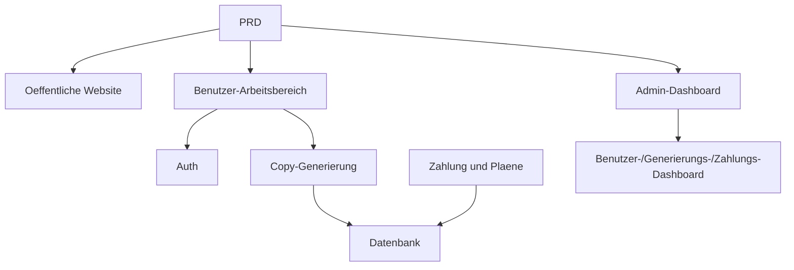

# KI-Marketing-Copywriting SaaS Entwicklungspraxis

## Ueberblick

Dieses Praxisprojekt erfordert die Umsetzung eines echten PRD von Grund auf: Ein KI-Marketing-Copywriting SaaS-Produkt fuer Indie-Entwickler und Content-Teams. Du wirst Supabase als Backend-Service und Stripe als Zahlungssystem verwenden und den gesamten Prozess von der Anforderungsanalyse bis zur Bereitstellung abschliessen.

Dies ist die umfassende Praxisphase von Stage 2. In den vorherigen Kapiteln hast du einzelne Faehigkeiten gelernt - Frontend, Backend, Datenbank, Zahlungsintegration. Dieses Projekt erfordert die Verkettung aller Faehigkeiten zur Lieferung eines lauffaehigen Produktprototyps.

## Vorkenntnisse

- Frontend-Design und Komponentenbibliotheken ([UI-Design](../../frontend/ui-design/), [Moderne Komponentenbibliothek](../../frontend/modern-component-library/))
- Backend-API-Design und Entwicklung ([API-Code schreiben](../../backend/ai-interface-code/))
- Datenbankgrundlagen und Supabase ([Von der Datenbank zu Supabase](../../backend/database-supabase/))
- Zahlungsintegration ([Stripe-Zahlungssystem](../../backend/stripe-payment/))
- Git-Workflow und Bereitstellung ([Git und GitHub](../../backend/git-workflow/), [Web-Anwendungen bereitstellen](../../backend/zeabur-deployment/))

## Lernziele

Nach Abschluss dieser Praxis wirst du in der Lage sein:

1. Einen echten PRD zu lesen und eine Entwicklungsaufgabenliste zu extrahieren
2. KI-gestuetzt schrittweise Frontend-Seiten und Backend-APIs zu generieren
3. Supabase fuer Benutzerauthentifizierung und Datenbankoperationen zu verwenden
4. Stripe fuer Abo-Zahlungsfunktionen zu integrieren
5. Ein Admin-Dashboard zu erstellen und End-to-End-Tests abzuschliessen

## Projektuebersicht

Das zu erstellende Produkt ist eine KI-Marketing-Copywriting SaaS mit drei Subsystemen:

| Subsystem | Verantwortung |
|-----------|---------------|
| **Oeffentliche Website** | Produktvorstellung, Preisgestaltung, FAQ, Registrierungskonvertierung |
| **Benutzer-Arbeitsbereich** | Produktinformationen eingeben, Copy generieren, Verlauf anzeigen, Plan upgraden |
| **Admin-Dashboard** | Benutzerverwaltung, Generierungsaufzeichnungen, Zahlungsdaten, Betriebsuebersicht |

::: tip PRD-Zugang
Die Anforderungen fuer dieses Projekt befinden sich auf GitHub: [PRD ansehen](https://github.com/datawhalechina/easy-vibe/blob/main/docs/zh-cn/stage-2/assignments/copywriting-platform-supabase/PRD.md)
:::

<div style="margin: 32px 0;">
  <ClientOnly>
    <StepBar :active="0" :items="[
      { title: 'Anforderungsanalyse', description: 'PRD lesen, Seiten, Funktionen, Auth, Zahlungsumfang klaeren' },
      { title: 'Geruest erstellen', description: 'Mit KI drei Frontend-Gerueste generieren (www / app / admin)' },
      { title: 'Backend-Integration', description: 'Supabase Auth, Generierungs-API, Stripe-Zahlung' },
      { title: 'Test und Bereitstellung', description: 'End-to-End durchlaufen, bereitstellen und Demo vorbereiten' }
    ]" />
  </ClientOnly>
</div>

## Teil 1: Anforderungsanalyse

### 1.1 PRD lesen

Beantworte folgende Fragen:
- Wie viele Einstiegspunkte hat das System? Welche Seiten deckt jeder ab?
- Was ist die Kernfunktion jeder Seite?
- Welche Module und Datenbanktabellen enthaelt das Backend?
- Wie sind Preisgestaltung, Zahlungsablauf und kostenlose Kontingente gestaltet?
- Was ist der MVP-Umfang?

::: warning
Wenn diese Fragen keine klaren Antworten haben, beginne nicht mit dem Code. Unklare Anforderungen sind die haeufigste Ursache fuer Nachbesserungen.
:::

### 1.2 Systemarchitektur bestaetigen



## Teil 2: Projektgeruest erstellen

### 2.1 Frontend-Seiten generieren

Prompt-Referenz:

```text
Bitte generiere basierend auf dem aktuellen PRD ein Frontend-Geruest fuer eine KI-Marketing-Copywriting SaaS.

Anforderungen:
1. Drei Einstiegspunkte: www, app, admin
2. Website: Startseite, Preisgestaltung, FAQ
3. App: Login, Registrierung, Dashboard, Verlauf, Plan-Seite
4. Admin: Startseite, Benutzerverwaltung, Generierungsaufzeichnungen, Zahlungen
5. Zunaechst nur Seitenstruktur mit Mock-Daten, keine echten APIs
6. Stil wie eine moderne SaaS, nicht wie ein Klassenzimmer-Demo
```

### 2.2 Kernseite Dashboard verfeinern

```text
Bitte verfeinere die /dashboard Seite.

Felder im linken Formular:
- Produktname
- Ein-Satz-Beschreibung
- Zielbenutzer
- 3 Verkaufsargumente
- Vertriebskanaele

Rechte Ergebnisbereich:
- Hauptueberschrift, Unterueberschrift, CTA
- 3 kurze Copy-Varianten
- Lange Copy
```

### 2.3 Seitenstruktur ueberpruefen

- [ ] Drei Einstiegspunkte mit unabhaengigen Routen
- [ ] Seitenanzahl stimmt mit PRD ueberein
- [ ] Dashboard-Layout mit Formular und Ergebnisbereich
- [ ] Mock-Daten zeigen grundlegende UI-Zustaende

### Hilfe bei Blockaden?

Wenn du beim Frontend-Aufbau feststeckst, kannst du diese Kapitel ueberpruefen:

- [UI-Design](../../frontend/ui-design/)
- [Moderne Komponentenbibliothek](../../frontend/modern-component-library/)
- [Von Design zu Code](../../frontend/design-to-code/)

## Teil 3: Backend-Integration

### 3.1 Supabase-Login integrieren

```text
Bitte hilf mir Schritt fuer Schritt bei der Supabase-Login-Integration.

1. Projekt mit Supabase verbinden
2. Registrierung, Login, Logout implementieren
3. Nach Login zu /dashboard weiterleiten
4. Geschuetzte Seiten automatisch zu /login umleiten
5. profiles-Tabelle erstellen
6. Nach Registrierung automatisch Datensatz in profiles erstellen
```

### 3.2 Generierungs-API und Datenbank integrieren

```text
Bitte hilf mir bei der Implementierung der Kernfunktion: Marketing-Copy generieren und speichern.

1. Benutzer fuellt Formular aus und klickt "Copy generieren"
2. Backend erhaelt: Produktname, Beschreibung, Zielbenutzer, Verkaufsargumente, Kanaele
3. Backend ruft Modell zur Generierung auf
4. Seite zeigt Ergebnisse
5. Eingabe und Ausgabe werden in der Datenbank gespeichert
6. Benutzer kann beim naechsten Besuch den Verlauf sehen
```

### 3.3 Stripe-Zahlung integrieren

```text
Bitte hilf mir bei der einfachsten Stripe-Zahlungsintegration.

1. /billing-Seite zeigt free und pro Plaene
2. Nach Klick auf Upgrade Weiterleitung zu Stripe Checkout
3. Nach Zahlung Rueckkehr zur Website
4. Zahlergebnis in subscriptions-Tabelle speichern
5. profile.plan-Feld aktualisieren
6. Free-Benutzer: max. 3 Generierungen/Tag, Pro: unbegrenzt
```

### 3.4 Admin-Dashboard erstellen

```text
Bitte hilf mir beim Aufbau eines einfachen Admin-Dashboards.

1. Nur role = admin Benutzer koennen auf /admin zugreifen
2. Drei Tabs: Benutzerliste, Generierungsaufzeichnungen, Abostatus
3. Benutzerliste: E-Mail, Plan, Erstellungsdatum
4. Generierungsaufzeichnungen: Benutzer, Produktname, Kanal, Datum
5. Abostatus: Benutzer, Plan, Zahlungsstatus
```

## Teil 4: Test und Bereitstellung

### 4.1 End-to-End-Tests

Mindestens folgende Szenarien validieren:
- Registrierung > Login > Copy generieren > Verlauf anzeigen > Plan upgraden
- Admin-Login > Benutzerdaten anzeigen > Generierungsaufzeichnungen > Zahlungsstatus

### 4.2 Bereitstellung

Projekt oeffentlich bereitstellen. Siehe: [Git und GitHub](../../backend/git-workflow/), [Web-Anwendungen bereitstellen](../../backend/zeabur-deployment/).

## Liefergegenstaende

- [ ] Zugaenglicher Online-Demo-Link
- [ ] Quellcode-Repository-Link (mit README)
- [ ] PRD-Dokument
- [ ] Kernseit-Screenshots (Startseite, Dashboard, Billing, Admin)
- [ ] 60-Sekunden-Demo-Video

## Bewertungskriterien

| Dimension | Grundanforderung | Erweiterte Anforderung |
|-----------|------------------|------------------------|
| Produktvollstaendigkeit | Alle Hauptseiten zugaenglich | Stil wie echte SaaS |
| Geschaefsabschluss | Registrierung > Generierung > Verlauf lauffaehig | Free/Pro-Unterschiede klar sichtbar |
| Datenkorrektheit | Ergebnisse und Zahlungsstatus in Datenbank | Fehlermeldungen, Leerzustaende und Loading vorhanden |
| Berechtigungen | Geschuetzte Seiten nicht ohne Login zugaenglich | Serverseitige Rollenpruefung |
| Engineering | Lokal startbar und oeffentlich bereitstellbar | README klar, Demo-Video vollstaendig |

::: tip
Wenn die Aufgabe zu gross erscheint, merke dir: **Zuerst "zum Laufen bringen", dann "verschönern".**
:::

## Einreichungspruefung

<el-card shadow="hover" style="margin: 20px 0; border-radius: 12px;">
  <template #header>
    <div style="font-weight: bold; font-size: 16px;">Letzter Blick vor der Einreichung</div>
  </template>

  <ul style="list-style-type: none; padding-left: 0;">
    <li><label><input type="checkbox" disabled /> Startseite, Login, Dashboard, Billing, Admin abgeschlossen</label></li>
    <li><label><input type="checkbox" disabled /> Benutzer koennen sich registrieren, anmelden und abmelden</label></li>
    <li><label><input type="checkbox" disabled /> Generierungsergebnisse werden in die Datenbank geschrieben</label></li>
    <li><label><input type="checkbox" disabled /> Hauptzahlungsablauf funktioniert</label></li>
    <li><label><input type="checkbox" disabled /> Admin kann Benutzer, Aufzeichnungen und Zahlungsstatus einsehen</label></li>
    <li><label><input type="checkbox" disabled /> Projekt ist oeffentlich bereitgestellt</label></li>
  </ul>
</el-card>

## Referenzmaterialien

- [UI-Design](../../frontend/ui-design/)
- [Moderne Komponentenbibliothek](../../frontend/modern-component-library/)
- [Von der Datenbank zu Supabase](../../backend/database-supabase/)
- [API-Code schreiben](../../backend/ai-interface-code/)
- [Git und GitHub](../../backend/git-workflow/)
- [Web-Anwendungen bereitstellen](../../backend/zeabur-deployment/)
- [Stripe-Zahlungssystem](../../backend/stripe-payment/)
