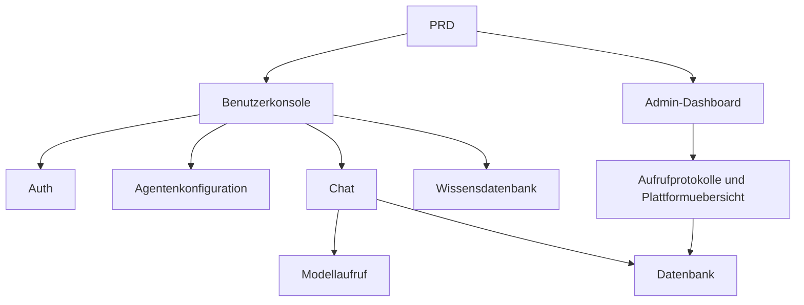

# Dify-aehnliche Agenten-Plattform Entwicklungspraxis

## Ueberblick

Dieses Praxisprojekt erfordert die Umsetzung eines echten PRD von Grund auf: Eine Plattform, die die Kernfunktionen von Dify nachahmt. Du wirst eine Benutzerkonsole, ein Admin-Dashboard und ein Plattform-Backend erstellen und Kernfunktionen wie Agentenverwaltung, Chat, Protokollierung und Wissensdatenbank implementieren.

## Vorkenntnisse

- Frontend-Design und Komponentenbibliotheken ([UI-Design](../../frontend/ui-design/), [Moderne Komponentenbibliothek](../../frontend/modern-component-library/))
- Backend-API-Design und Entwicklung ([API-Code schreiben](../../backend/ai-interface-code/))
- Datenbankgrundlagen und Supabase ([Von der Datenbank zu Supabase](../../backend/database-supabase/))
- Git-Workflow und Bereitstellung ([Git und GitHub](../../backend/git-workflow/), [Web-Anwendungen bereitstellen](../../backend/zeabur-deployment/))

## Lernziele

1. Einen echten PRD lesen und eine Entwicklungsaufgabenliste extrahieren
2. Seitenarchitektur und Datenmodell fuer eine Agenten-Plattform entwerfen
3. Vollstaendige Kette aus Agentenerstellung, Chat und Protokollierung implementieren
4. KI-gestuetzte Entwicklung einer Plattform-produkt durchfuehren
5. End-to-End-Tests abschliessen und einen demonstrierbaren KI-Plattformprototyp liefern

## Projektuebersicht

Das zu erstellende Produkt ist eine Dify-aehnliche Agenten-Plattform mit zwei Subsystemen:

| Subsystem | Verantwortung |
|-----------|---------------|
| **Benutzerkonsole** | Agenten erstellen, Prompt konfigurieren, Chat starten, Protokolle anzeigen, Wissensdatenbank verwalten |
| **Admin-Dashboard** | Benutzerdaten, Plattformressourcen, Aufrufstatistiken |

::: tip PRD-Zugang
[PRD ansehen](https://github.com/datawhalechina/easy-vibe/blob/main/docs/zh-cn/stage-2/assignments/custom-dify-agent-platform/PRD.md)
:::

<div style="margin: 32px 0;">
  <ClientOnly>
    <StepBar :active="0" :items="[
      { title: 'Anforderungsanalyse', description: 'PRD lesen, Seiten, Faehigkeitsgrenzen, Auth, Datenmodell klaeren' },
      { title: 'Geruest erstellen', description: 'Mit KI Benutzerkonsole und Admin-Geruest generieren' },
      { title: 'Iterative Entwicklung', description: 'Moduleweise Agenten, Chat, Protokolle, Wissensdatenbank ergaenzen' },
      { title: 'Test und Bereitstellung', description: 'End-to-End durchlaufen, bereitstellen und Demo vorbereiten' }
    ]" />
  </ClientOnly>
</div>

## Teil 1: Anforderungsanalyse

### 1.1 PRD lesen

- Welche Funktionen kommen in den MVP: Agenten, Sitzungen, Protokolle, Wissensdatenbank?
- Seiten- und Routenliste finalisiert?
- Grenzen fuer Modellaufrufe und Protokollierung?
- Multi-Tenant und komplexe Workflows zunaechst weglassen?

::: warning
Beginne nicht mit dem Code, wenn diese Fragen keine klaren Antworten haben.
:::

### 1.2 Systemarchitektur bestaetigen



## Teil 2: Projektgeruest erstellen

### 2.1 Frontend-Seiten generieren

```text
Bitte generiere basierend auf dem aktuellen PRD ein Frontend-Geruest fuer eine Dify-aehnliche Agenten-Plattform.

Anforderungen:
1. Benutzerseite: Login, Agentenliste, Agentenkonfiguration, Chat, Protokolle, Wissensdatenbank
2. Admin-Seite: Startseite, Benutzeruebersicht, Ressourcenuebersicht
3. Zunaechst nur Seitenstruktur mit Mock-Daten
4. Stil wie eine moderne KI-Plattform
```

### 2.2 Seitenstruktur ueberpruefen

- [ ] Benutzerkonsole und Admin-Eingang getrennt
- [ ] Agentenliste, Konfiguration, Chat, Protokolle, Wissensdatenbank vollstaendig
- [ ] Admin-Startseite und Benutzeruebersicht zugaenglich
- [ ] Mock-Daten zeigen grundlegende UI-Zustaende

## Teil 3: Iterative Entwicklung

### 3.1 Modulweise vorgehen

1. **Auth**: Registrierung, Login, Rollenunterscheidung
2. **Agentenverwaltung**: Erstellen, Bearbeiten, Loeschen, Prompt-Konfiguration
3. **Chat-Funktion**: Sitzung erstellen, Nachrichten, Modellaufruf
4. **Protokollierung**: Dauer, Token-Verbrauch, Fehleraufzeichnung
5. **Wissensdatenbank** (Bonus): Dokument-Upload, Suche, Ergebnisse injizieren
6. **Admin-Dashboard**: Benutzerdaten, Ressourcen, Aufrufstatistiken

| Pruefpunkt | Verifikationsmethode |
|------------|---------------------|
| Seitenkonsistenz | Seitenanzahl und Funktionen gemaess PRD |
| API-Abschluss | agents, chat, logs, knowledge APIs vollstaendig |
| Berechtigungsisolierung | Benutzer koennen nur eigene Agenten/Sitzungen verwalten |
| Datenkonsistenz | messages, logs, documents Daten synchron |
| Demonstrierbarkeit | "Agent erstellen > Chat > Protokolle anzeigen" vollstaendig |

### 3.2 Wissensdatenbank-Integration (Bonus)

Fuege jedem Agenten einen "Wissensdatenbank-Schalter" hinzu:
- Aktiviert: Zunaechst Wissensteile durchsuchen, dann mit Frage an Modell senden
- Deaktiviert: Normaler Chat-Modus

## Teil 4: Test und Bereitstellung

### 4.1 End-to-End-Tests

- Registrierung > Agent erstellen > Prompt konfigurieren > Chat starten > Protokolle anzeigen
- Admin-Login > Benutzerdaten > Aufrufstatistiken

### 4.2 Bereitstellung

Siehe: [Git und GitHub](../../backend/git-workflow/), [Web-Anwendungen bereitstellen](../../backend/zeabur-deployment/).

## Liefergegenstaende

- [ ] Online-Demo-Link
- [ ] Quellcode-Repository (mit README)
- [ ] PRD-Dokument
- [ ] Kernseiten-Screenshots
- [ ] 60-Sekunden-Demo-Video

## Bewertungskriterien

| Dimension | Grundanforderung | Erweiterte Anforderung |
|-----------|------------------|------------------------|
| Plattformvollstaendigkeit | agents / chat / logs Seiten nutzbar | Klare Navigation und einheitliches Design |
| Geschaefsabschluss | Agenten koennen erstellt und real kommuniziert werden | Multi-Agenten-Wechsel und Sitzungsverlauf |
| Daten und Tracking | Nachrichten und Aufrufprotokolle abfragbar | Token-/Dauerstatistik-Dashboard |
| Berechtigungssicherheit | Nur angemeldete Benutzer koennen Kern-APIs aufrufen | Ressourcen-Zuordnungspruefung vollstaendig |
| Engineering | Bereitstellbar, demonstrierbar, README klar | Wissensdatenbank mit erklaerbaren Suchergebnissen |

## Einreichungspruefung

<el-card shadow="hover" style="margin: 20px 0; border-radius: 12px;">
  <template #header>
    <div style="font-weight: bold; font-size: 16px;">Letzter Blick vor der Einreichung</div>
  </template>

  <ul style="list-style-type: none; padding-left: 0;">
    <li><label><input type="checkbox" disabled /> Nach Login: Agentenverwaltung, Chat, Protokolle zugaenglich</label></li>
    <li><label><input type="checkbox" disabled /> Mindestens 1 Agent erstellt und erfolgreich kommuniziert</label></li>
    <li><label><input type="checkbox" disabled /> Jede Frage in der Datenbank nachvollziehbar</label></li>
    <li><label><input type="checkbox" disabled /> Fehlermeldungen im Frontend sichtbar und im Protokoll erfasst</label></li>
    <li><label><input type="checkbox" disabled /> Projekt bereitgestellt, README und Demo-Video vollstaendig</label></li>
  </ul>
</el-card>

## Referenzmaterialien

- [UI-Design](../../frontend/ui-design/)
- [Moderne Komponentenbibliothek](../../frontend/modern-component-library/)
- [Von der Datenbank zu Supabase](../../backend/database-supabase/)
- [API-Code schreiben](../../backend/ai-interface-code/)
- [Git und GitHub](../../backend/git-workflow/)
- [Web-Anwendungen bereitstellen](../../backend/zeabur-deployment/)
