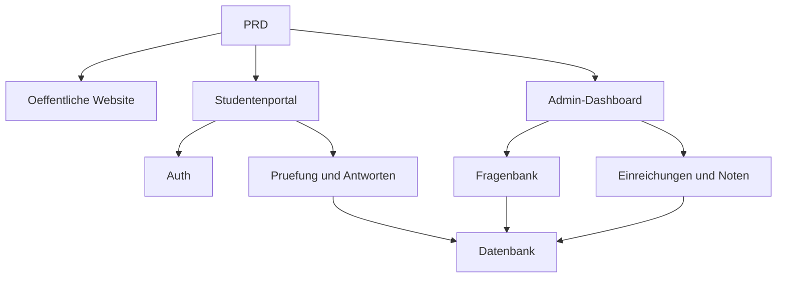

# Online-Pruefungs- und Managementsystem Entwicklungspraxis

## Ueberblick

Dieses Praxisprojekt erfordert die Umsetzung eines echten PRD von Grund auf: Ein Online-Pruefungs- und Managementsystem. Die Besonderheit liegt in mehreren Rollen (Studenten und Administratoren) mit unterschiedlichen Seiten und Berechtigungen. Du wirst Express als Backend verwenden und eine vollstaendige Pruefungsgeschaeftskette implementieren.

## Vorkenntnisse

- Frontend-Design und Komponentenbibliotheken ([UI-Design](../../frontend/ui-design/), [Moderne Komponentenbibliothek](../../frontend/modern-component-library/))
- Backend-API-Design und Entwicklung ([API-Code schreiben](../../backend/ai-interface-code/))
- Datenbankgrundlagen und Supabase ([Von der Datenbank zu Supabase](../../backend/database-supabase/))
- Git-Workflow und Bereitstellung ([Git und GitHub](../../backend/git-workflow/), [Web-Anwendungen bereitstellen](../../backend/zeabur-deployment/))

## Lernziele

1. Einen echten PRD lesen und eine Entwicklungsaufgabenliste extrahieren
2. Berechtigungssteuerung und Seitenrouten fuer ein Multi-Rollen-System entwerfen
3. Eine vollstaendige Backend-API mit Express implementieren
4. Die Geschaefskette Pruefung, Einreichung, automatische Bewertung implementieren
5. End-to-End-Tests abschliessen und einen demonstrierbaren Systemprototyp liefern

## Projektuebersicht

Das zu erstellende Produkt ist ein Online-Pruefungs- und Managementsystem mit drei Subsystemen:

| Subsystem | Verantwortung |
|-----------|---------------|
| **Oeffentliche Website** | Plattformvorstellung, Login-Einstieg |
| **Studentenportal** | Pruefungsliste, Antworten, Einreichung, Noteneinsicht |
| **Admin-Dashboard** | Fragenbank, Pruefungsverwaltung, Einreichungsdatensaetze, Notenstatistik |

::: tip PRD-Zugang
[PRD ansehen](https://github.com/datawhalechina/easy-vibe/blob/main/docs/zh-cn/stage-2/assignments/exam-management-express/PRD.md)
:::

<div style="margin: 32px 0;">
  <ClientOnly>
    <StepBar :active="0" :items="[
      { title: 'Anforderungsanalyse', description: 'PRD lesen, Rollen, Seiten, Pruefungskette und Datenmodell klaeren' },
      { title: 'Geruest erstellen', description: 'Mit KI Studenten- und Admin-Seitengeruest generieren' },
      { title: 'Backend-Entwicklung', description: 'Express: Login, Pruefung, Einreichung, Bewertung' },
      { title: 'Test und Bereitstellung', description: 'End-to-End durchlaufen, bereitstellen und Demo vorbereiten' }
    ]" />
  </ClientOnly>
</div>

## Teil 1: Anforderungsanalyse

### 1.1 PRD lesen

- Welche Rollen enthaelt das System? Was kann jede Rolle tun?
- Ist die Seitenliste vollstaendig?
- Welche Fragetypen werden unterstuetzt? Wie ist die Bewertungslogik fuer jeden Typ?
- Was ist der vollstaendige Pruefungsablauf?

::: warning
Beginne nicht mit dem Code, wenn diese Fragen keine klaren Antworten haben.
:::

### 1.2 Systemarchitektur bestaetigen



## Teil 2: Projektgeruest erstellen

### 2.1 Frontend-Seiten generieren

```text
Bitte generiere basierend auf dem aktuellen PRD ein Frontend-Geruest fuer ein Online-Pruefungssystem.

Technologie-Stack:
- Next.js App Router, TypeScript, Tailwind CSS, shadcn/ui

Seiten:
1. Startseite /
2. Login /login
3. Studenten-Pruefungsliste /student/exams
4. Studenten-Antwortseite /student/exams/[id]
5. Studenten-Noten /student/history
6. Admin-Startseite /admin
7. Pruefungsverwaltung /admin/exams
8. Fragenbank /admin/questions
9. Einreichungen /admin/submissions
```

### 2.2 Antwortseite verfeinern

Die Antwortseite ist die Kernseite des Studentenportals:

```text
Bitte verfeinere die Studenten-Antwortseite.

- Oben: Pruefungstitel, Countdown, Anzahl beantworteter Fragen
- Mitte: Frage und Optionen
- Unterstuetzung fuer Multiple-Choice, Wahr/Falsch, Kurzantwort
- Antwortkarte links oder oben
- Bestaetigungsdialog vor dem Absenden
```

### 2.3 Seitenstruktur ueberpruefen

- [ ] Studenten- und Admin-Einstiegspunkte getrennt
- [ ] Login, Pruefungsliste, Antwortseite, Notenseite vollstaendig
- [ ] Admin: Fragenbank, Pruefungsverwaltung, Einreichungen zugaenglich
- [ ] Studenten- und Admin-Seitenstile deutlich unterschieden

## Teil 3: Backend-Entwicklung

### 3.1 Login und Berechtigungssteuerung

```text
Bitte hilf mir bei der Implementierung von Login und Berechtigungssteuerung fuer das Online-Pruefungssystem.

Backend: Express.

Ziele:
1. Studenten und Administratoren koennen sich anmelden
2. Nach Login wird die Benutzerrolle zurueckgegeben
3. Studenten koennen nur /student/*-APIs aufrufen
4. Administratoren koennen nur /admin/*-APIs aufrufen
5. Unangemeldete Benutzer werden zu /login weitergeleitet
```

### 3.2 Pruefungs- und Fragenbank-APIs

| Modul | Empfohlene APIs |
|-------|-----------------|
| Pruefungsverwaltung | `GET /api/exams`, `POST /api/admin/exams`, `PATCH /api/admin/exams/:id` |
| Fragenbank | `GET /api/admin/questions`, `POST /api/admin/questions` |
| Pruefung starten | `POST /api/submissions/start` |
| Pruefung abgeben | `POST /api/submissions/:id/submit` |
| Noten | `GET /api/student/history`, `GET /api/admin/submissions` |

### 3.3 Bewertungslogik

- **Multiple-Choice**: Benutzerantwort stimmt mit Standardantwort ueberein = Punkte
- **Wahr/Falsch**: Automatisch bewertbar
- **Kurzantwort**: Nur Antwort speichern, Punkte leer, Status `reviewed = false`

::: tip Bonus
Du kannst KI verwenden, um dem Administrator die Generierung von Kandidatenfragen zu ermoeglichen. Dies ist jedoch optional.
:::

## Teil 4: Test und Bereitstellung

### 4.1 End-to-End-Tests

- Student: Login > Pruefungsliste > Pruefung starten > Antworten > Noteneinsicht
- Admin: Login > Pruefung erstellen > Fragen hinzufuegen > Veroeffentlichen > Einreichungen anzeigen

### 4.2 Bereitstellung

- Frontend: Vercel / Zeabur
- Express API: Zeabur / Railway / Render
- Datenbank: Supabase Postgres oder verwaltetes PostgreSQL

## Liefergegenstaende

- [ ] Online-Demo-Link
- [ ] Quellcode-Repository (mit README)
- [ ] PRD-Dokument
- [ ] Kernseiten-Screenshots
- [ ] 60-Sekunden-Demo-Video

## Bewertungskriterien

| Dimension | Grundanforderung | Erweiterte Anforderung |
|-----------|------------------|------------------------|
| Seitenvollstaendigkeit | Hauptseiten fuer Studenten und Admin zugaenglich | Einheitliches Design, mobile Grundverfuegbarkeit |
| Geschaefsabschluss | Student kann Pruefung ablegen und Noten einsehen | Admin kann vollstaendig Pruefungen erstellen |
| Datenkorrektheit | Antworten werden in Datenbank geschrieben, automatische Bewertung | Kurzantwort mit manueller oder KI-Unterstuetzung |
| Berechtigungen | Student/Admin-Grenzen klar | Serverseitige Rollenpruefung |
| Engineering | Lauffaehig, bereitstellbar, README klar | Demo-Video und Testanweisungen |

## Einreichungspruefung

<el-card shadow="hover" style="margin: 20px 0; border-radius: 12px;">
  <template #header>
    <div style="font-weight: bold; font-size: 16px;">Letzter Blick vor der Einreichung</div>
  </template>

  <ul style="list-style-type: none; padding-left: 0;">
    <li><label><input type="checkbox" disabled /> Startseite, Login, Studentenportal, Admin-Seiten abgeschlossen</label></li>
    <li><label><input type="checkbox" disabled /> Studenten koennen Pruefungen starten und Antworten einreichen</label></li>
    <li><label><input type="checkbox" disabled /> Administratoren koennen Pruefungen erstellen und Einreichungen einsehen</label></li>
    <li><label><input type="checkbox" disabled /> Automatische Bewertung funktioniert korrekt</label></li>
    <li><label><input type="checkbox" disabled /> Berechtigungsgrenzen zwischen Studenten und Admin verifiziert</label></li>
    <li><label><input type="checkbox" disabled /> Projekt bereitgestellt oder vollstaendige lokale Anleitung</label></li>
  </ul>
</el-card>

## Referenzmaterialien

- [UI-Design](../../frontend/ui-design/)
- [Moderne Komponentenbibliothek](../../frontend/modern-component-library/)
- [Von der Datenbank zu Supabase](../../backend/database-supabase/)
- [API-Code schreiben](../../backend/ai-interface-code/)
- [Git und GitHub](../../backend/git-workflow/)
- [Web-Anwendungen bereitstellen](../../backend/zeabur-deployment/)
