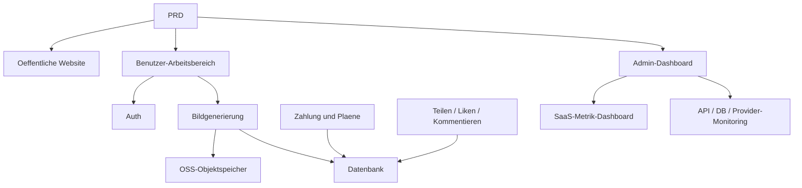

# Moderne KI-Bildgenerierungs-SaaS Entwicklungspraxis

## Ueberblick

Dieses Praxisprojekt erfordert die Umsetzung eines echten PRD von Grund auf: Eine KI-Bildgenerierungs-SaaS, die sich an der Midjourney-Erfahrung orientiert. Du wirst den gesamten Prozess von der Anforderungsanalyse ueber Projektzerlegung und iterativer Entwicklung bis zur Bereitstellung durchlaufen.

## Vorkenntnisse

- Frontend-Design und Komponentenbibliotheken ([UI-Design](../../frontend/ui-design/), [Moderne Komponentenbibliothek](../../frontend/modern-component-library/))
- Backend-API-Design und Entwicklung ([API-Code schreiben](../../backend/ai-interface-code/))
- Datenbankgrundlagen und Supabase ([Von der Datenbank zu Supabase](../../backend/database-supabase/))
- Zahlungsintegration ([Stripe-Zahlungssystem](../../backend/stripe-payment/))
- Git-Workflow und Bereitstellung ([Git und GitHub](../../backend/git-workflow/), [Web-Anwendungen bereitstellen](../../backend/zeabur-deployment/))

## Lernziele

1. Einen echten PRD lesen und eine Entwicklungsaufgabenliste extrahieren
2. Module basierend auf dem PRD aufteilen und einen schrittweisen Plan erstellen
3. KI-gestuetzt Frontend-Geruest und Backend-API entwickeln
4. Jedes Modul verifizieren und iterativ optimieren
5. End-to-End-Tests durchfuehren und von "lauffaehig" zu "lieferbar" gelangen

## Projektuebersicht

Das zu erstellende Produkt ist eine moderne KI-Bildgenerierungs-SaaS mit drei Subsystemen:

| Subsystem | Verantwortung |
|-----------|---------------|
| **Oeffentliche Website** | Produktvorstellung, Preisgestaltung, FAQ, Registrierungskonvertierung |
| **Benutzer-Arbeitsbereich** | Prompt-Eingabe, Bildgenerierung, Galerie, Guthaben, Plaene, Community |
| **Admin-Dashboard** | Benutzerverwaltung, Aufgabenverwaltung, Zahlungsverwaltung, SaaS-Metrik |

::: tip PRD-Zugang
[PRD ansehen](https://github.com/datawhalechina/easy-vibe/blob/main/docs/zh-cn/stage-2/assignments/modern-landing-page/PRD.md)
:::

<div style="margin: 32px 0;">
  <ClientOnly>
    <StepBar :active="0" :items="[
      { title: 'Anforderungsanalyse', description: 'PRD lesen, Seiten, Module, Datenmodelle und Grenzen extrahieren' },
      { title: 'Geruest erstellen', description: 'Mit KI drei Frontend-Gerueste generieren (www / app / admin)' },
      { title: 'Iterative Entwicklung', description: 'Moduleweise API, Berechtigungen, Zahlung, Monitoring ergaenzen' },
      { title: 'Test und Bereitstellung', description: 'End-to-End durchlaufen, bereitstellen und Demo vorbereiten' }
    ]" />
  </ClientOnly>
</div>

## Teil 1: Anforderungsanalyse

### 1.1 PRD lesen

- Wie viele Einstiegspunkte hat das System? Welche Seiten deckt jeder ab?
- Was ist die Kernfunktion jeder Seite?
- Welche Module und Datenbanktabellen enthaelt das Backend?
- Was ist der MVP-Umfang?

::: warning
Beginne nicht mit dem Code, wenn diese Fragen keine klaren Antworten haben.
:::

### 1.2 Systemarchitektur bestaetigen



## Teil 2: Projektgeruest erstellen

### 2.1 Frontend-Seiten generieren

```text
Bitte generiere basierend auf dem aktuellen PRD ein Frontend-Geruest fuer eine moderne KI-Bildgenerierungs-SaaS.

Anforderungen:
1. Drei Einstiegspunkte: www, app, admin
2. Website: Startseite, Preisgestaltung, FAQ
3. App: Login, Registrierung, Dashboard, Galerie, Plaene, Guthaben, Community, Detail, Profil
4. Admin: Startseite, Benutzer, Aufgaben, Inhalte, Plaene, Zahlungen, Konfiguration, Metriken, Monitoring
5. Zunaechst nur Seitenstruktur mit Mock-Daten
6. Stil wie Midjourney: schlicht, modern, produktiv
```

### 2.2 Seitenstruktur ueberpruefen

- [ ] Drei Einstiegspunkte mit unabhaengigen Routen
- [ ] Seitenanzahl stimmt mit PRD ueberein
- [ ] Alle Seiten navigierbar
- [ ] Mock-Daten zeigen grundlegende UI-Zustaende

## Teil 3: Iterative Entwicklung

### 3.1 Modulweise vorgehen

1. **Auth**: Registrierung, Login, Rollenunterscheidung
2. **Datenbank**: Tabellen erstellen, Lese-/Schreib-APIs
3. **Kerngescheaft**: Bildgenerierung, Ergebnisspeicherung
4. **OSS-Speicher**: Bild-Upload und Zugriff
5. **Zahlung**: Plaene, Guthaben, Stripe-Integration
6. **Social**: Teilen, Liken, Kommentieren
7. **Admin**: Benutzerverwaltung, Aufgaben, Inhaltsmoderation
8. **Monitoring**: SaaS-Metrik-Dashboard, Systemueberwachung

| Pruefpunkt | Verifikationsmethode |
|------------|---------------------|
| Seitenkonsistenz | Anzahl, Einstiegspunkte, Funktionen gemaess PRD |
| API-Korrektheit | Parameter, Struktur, Statusbehandlung |
| Berechtigungsisolierung | Benutzer und Admin getrennt |
| Datenkonsistenz | Datenbank, OSS, Zahlung, Guthaben synchron |
| Demonstrierbarkeit | Vollstaendige Geschaefskette vorfuehrbar |

::: tip
Wenn die KI vom PRD abweicht, nicht die ganze Seite neu starten - nur das spezifische Modul korrigieren.
:::

## Teil 4: Test und Bereitstellung

### 4.1 End-to-End-Tests

- Registrierung > Guthaben kaufen > Bild generieren > Verlauf anzeigen > Teilen
- Admin-Login > Benutzerdaten > Aufgabenstatistik > Systemueberwachung

### 4.2 Bereitstellung

Siehe: [Git und GitHub](../../backend/git-workflow/), [Web-Anwendungen bereitstellen](../../backend/zeabur-deployment/).

## Liefergegenstaende

- [ ] Online-Demo-Link
- [ ] Quellcode-Repository (mit README)
- [ ] PRD-Dokument
- [ ] Kernseiten-Screenshots
- [ ] 60-Sekunden-Demo-Video

## Bewertungskriterien

| Dimension | Grundanforderung | Erweiterte Anforderung |
|-----------|------------------|------------------------|
| PRD-Alignment | Seiten, Funktionen, Datenstruktur gemaess PRD | Designentscheidungen klar erklaert |
| Produktabschluss | Registrierung > Guthaben > Generierung > Verlauf > Teilen lauffaehig | Zahlungsstatus, Guthaben, Generierungen konsistent |
| Admin-Faehigkeit | Benutzer, Aufgaben, Zahlungen, Inhalte einsehbar | SaaS-Metrik und Monitoring vollstaendig nutzbar |
| Engineering | Frontend, Backend, DB, OSS, Zahlung verbunden | Fehlerbehandlung, Leerzustaende, Loading vorhanden |
| Lieferqualitaet | Bereitstellbar, lauffaehig | README klar, Demo-Video vollstaendig |

## Referenzmaterialien

- [UI-Design](../../frontend/ui-design/)
- [Moderne Komponentenbibliothek](../../frontend/modern-component-library/)
- [Von der Datenbank zu Supabase](../../backend/database-supabase/)
- [API-Code schreiben](../../backend/ai-interface-code/)
- [Git und GitHub](../../backend/git-workflow/)
- [Web-Anwendungen bereitstellen](../../backend/zeabur-deployment/)
- [Stripe-Zahlungssystem](../../backend/stripe-payment/)
