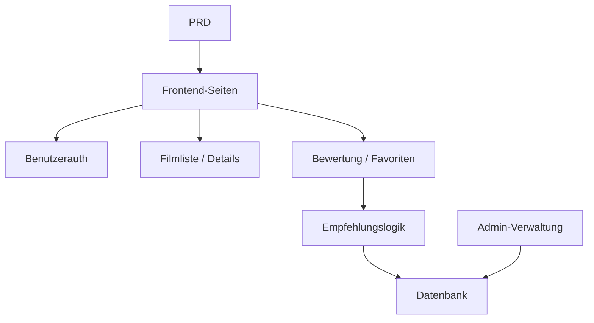

# Spring Boot Filmempfehlungssystem Entwicklungspraxis

## Ueberblick

Dieses Praxisprojekt erfordert die Umsetzung eines echten PRD: Eine Filmwebsite mit Empfehlungsfaehigkeit unter Verwendung von Spring Boot. Die Kernherausforderung liegt nicht in einfachem CRUD, sondern im Nachdenken darueber, "wie Benutzerverhalten die Empfehlungsergebnisse beeinflusst" und "wie Empfehlungen erklaerbar sind".

## Vorkenntnisse

- Frontend-Design und Komponentenbibliotheken ([UI-Design](../../frontend/ui-design/), [Moderne Komponentenbibliothek](../../frontend/modern-component-library/))
- Backend-API-Design und Entwicklung ([API-Code schreiben](../../backend/ai-interface-code/))
- Datenbankgrundlagen und Supabase ([Von der Datenbank zu Supabase](../../backend/database-supabase/))
- Git-Workflow und Bereitstellung ([Git und GitHub](../../backend/git-workflow/), [Web-Anwendungen bereitstellen](../../backend/zeabur-deployment/))

## Lernziele

1. PRD lesen und Entwicklungsaufgabenliste fuer ein Empfehlungssystem extrahieren
2. Spring Boot-Projekt aufbauen und RESTful APIs implementieren
3. Vollstaendige Datenkette "Benutzerverhalten > Empfehlung" entwerfen
4. Erklaerbare Empfehlungslogik implementieren
5. End-to-End-Tests abschliessen und einen demonstrierbaren Produktprototyp liefern

## Projektuebersicht

| Funktion | Beschreibung |
|----------|-------------|
| **Durchsuchen und Suche** | Benutzer koennen Filme durchsuchen und suchen |
| **Bewertung und Favoriten** | Benutzer koennen Filme bewerten und als Favorit speichern |
| **Personalisierte Empfehlungen** | System generiert Empfehlungen basierend auf Benutzerverhalten |
| **Admin-Dashboard** | Administrator verwaltet Filmdaten und prueft Empfehlungseffektivitaet |

::: tip PRD-Zugang
[PRD ansehen](https://github.com/datawhalechina/easy-vibe/blob/main/docs/zh-cn/stage-2/assignments/movie-recommendation-springboot/PRD.md)
:::

<div style="margin: 32px 0;">
  <ClientOnly>
    <StepBar :active="0" :items="[
      { title: 'Anforderungsanalyse', description: 'PRD lesen, Empfehlungsstrategie, Verhaltensdaten und Admin-Umfang klaeren' },
      { title: 'Geruest erstellen', description: 'Mit KI Listen-, Detail-, Empfehlungs- und Admin-Seiten generieren' },
      { title: 'Iterative Entwicklung', description: 'Empfehlungslogik, Verhaltensaufzeichnung und Admin ergaenzen' },
      { title: 'Test und Bereitstellung', description: 'End-to-End durchlaufen, bereitstellen und Demo vorbereiten' }
    ]" />
  </ClientOnly>
</div>

## Teil 1: Anforderungsanalyse

### 1.1 PRD lesen

- Was ist die Empfehlungsstrategie? Erste Version mit erklaerbarer Methode (z. B. basierend auf Bewertungsahnlichkeit)?
- Welche Verhaltensdaten speichern? (Bewertungen, Favoriten, Seitenaufrufe)
- Welche Empfehlungsmetriken sieht der Administrator?
- Seitenliste vollstaendig?

::: warning
Beginne nicht mit dem Code, wenn diese Fragen keine klaren Antworten haben.
:::

### 1.2 Systemarchitektur bestaetigen



## Teil 2: Projektgeruest erstellen

### 2.1 Frontend-Seiten generieren

```text
Bitte generiere basierend auf dem aktuellen PRD ein Frontend-Geruest fuer ein Spring Boot Filmempfehlungssystem.

Anforderungen:
1. Seiten: Startseite, Filmliste, Filmdetails, Empfehlungsseite, Profil, Admin
2. Zunaechst nur Seitenstruktur mit Mock-Daten
3. Stil wie ein echtes Content-Produkt, nicht wie ein Klassenzimmer-Demo
```

### 2.2 Seitenstruktur ueberpruefen

- [ ] Filmliste unterstuetzt Suche und Filter
- [ ] Filmdetailseite hat Bewertungs- und Favorit-Buttons
- [ ] Empfehlungsseite zeigt Ergebnisse mit Erklaerung
- [ ] Admin zeigt Filmdaten und Empfehlungseffektivitaet

## Teil 3: Iterative Entwicklung

### 3.1 Modulweise vorgehen

1. **Spring Boot-Projektaufbau**: Projektstruktur, Datenbankkonfiguration, Basis-CRUD
2. **Filmdatenverwaltung**: Filmliste, Details, Such-APIs
3. **Benutzerverhalten**: Bewertungs- und Favorit-APIs, Verhaltensdaten schreiben
4. **Empfehlungslogik**: Empfehlungsalgorithmus basierend auf Benutzerverhalten
5. **Empfehlungsanzeige**: Ergebnisse mit Erklaerung anzeigen
6. **Admin-Dashboard**: Filmdaten pflegen, Empfehlungseffektivitaet einsehen

### 3.2 Modul-Selbstpruefung

| Pruefpunkt | Verifikationsmethode |
|------------|---------------------|
| Grundfunktionen | Liste, Details, Bewertung, Favoriten vollstaendig |
| Empfehlungskopplung | Benutzerverhalten beeinflusst Empfehlungsergebnisse |
| Empfehlungserklaerbarkeit | Benutzer versteht, warum diese Filme empfohlen werden |
| Admin-Daten | Administrator kann Filmdaten und Empfehlungseffektivitaet einsehen |

## Teil 4: Test und Bereitstellung

### 4.1 End-to-End-Tests

- Film durchsuchen > Bewerten > Favorit > Empfehlungsseite pruefen, ob Ergebnisse sich aendern
- Admin-Login > Film hinzufuegen > Empfehlungsstatistik anzeigen

## Liefergegenstaende

- [ ] Online-Demo-Link
- [ ] Quellcode-Repository (mit README)
- [ ] PRD-Dokument
- [ ] Kernseiten-Screenshots
- [ ] 60-Sekunden-Demo-Video

## Bewertungskriterien

| Dimension | Grundanforderung | Erweiterte Anforderung |
|-----------|------------------|------------------------|
| PRD-Alignment | Seiten, Funktionen, Datenstruktur gemaess PRD | Designentscheidungen klar erklaert |
| Produktabschluss | Durchsuchen > Bewerten > Favorit > Empfehlung lauffaehig | Bewertungsverhalten beeinflusst Empfehlungen deutlich |
| Empfehlungsqualitaet | Ergebnisse angemessen, Gruende erklaerbar | Mehrere Empfehlungsstrategien unterstuetzt |
| Admin-Faehigkeit | Filmdaten und Empfehlungseffektivitaet einsehbar | Genauigkeitsstatistiken vorhanden |
| Engineering | Frontend, Spring Boot Backend, Datenbank verbunden | Empfehlungs-API mit Caching oder Performance-Optimierung |

## Referenzmaterialien

- [UI-Design](../../frontend/ui-design/)
- [Moderne Komponentenbibliothek](../../frontend/modern-component-library/)
- [Von der Datenbank zu Supabase](../../backend/database-supabase/)
- [API-Code schreiben](../../backend/ai-interface-code/)
- [Git und GitHub](../../backend/git-workflow/)
- [Web-Anwendungen bereitstellen](../../backend/zeabur-deployment/)
