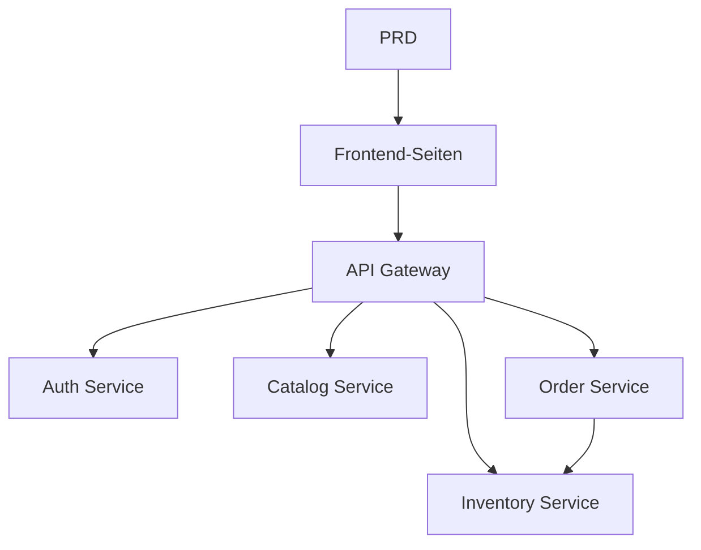

# Lebensmittel-E-Commerce-Microservicesystem Entwicklungspraxis

## Ueberblick

Dieses Praxisprojekt erfordert die Umsetzung eines echten PRD von Grund auf: Ein Lebensmittel-E-Commerce-Microservicesystem. Im Gegensatz zu frueheren Single-Service-Projekten ist das Backend hier in mehrere unabhaengige Services nach Geschaeftsbereich aufgeteilt, die ueber ein API-Gateway einheitlich nach aussen kommunizieren. Du lernst, Service-Grenzen zu entwerfen und datenuebergreifende Konsistenzprobleme zwischen Services zu behandeln.

## Vorkenntnisse

- Frontend-Design und Komponentenbibliotheken ([UI-Design](../../frontend/ui-design/), [Moderne Komponentenbibliothek](../../frontend/modern-component-library/))
- Backend-API-Design und Entwicklung ([API-Code schreiben](../../backend/ai-interface-code/))
- Datenbankgrundlagen und Supabase ([Von der Datenbank zu Supabase](../../backend/database-supabase/))
- Git-Workflow und Bereitstellung ([Git und GitHub](../../backend/git-workflow/), [Web-Anwendungen bereitstellen](../../backend/zeabur-deployment/))

## Lernziele

1. PRD lesen und Entwicklungsaufgabenliste fuer ein Microservicesystem extrahieren
2. Service-Grenzen nach Geschaeftsbereichen aufteilen (Auth, Katalog, Bestand, Bestellung)
3. API-Gateway-Routing entwerfen und implementieren
4. Uebergreifende Probleme wie Bestandsabbuchung und Bestellkonsistenz behandeln
5. End-to-End-Tests abschliessen und einen demonstrierbaren Microservice-Prototyp liefern

## Projektuebersicht

| Subsystem | Verantwortung |
|-----------|---------------|
| **Benutzerportal** | Produkte durchsuchen, bestellen, Bestellungen einsehen |
| **Admin-Portal** | Produktverwaltung, Bestandsverwaltung, Bestellverwaltung |

Backend-Services:

| Service | Verantwortung |
|---------|---------------|
| **API Gateway** | Einheitlicher Einstieg, Routing, Auth-Pruefung |
| **Auth Service** | Benutzerregistrierung, Login, JWT-Ausgabe |
| **Catalog Service** | Produktinformationsverwaltung |
| **Inventory Service** | Bestandsmengenverwaltung |
| **Order Service** | Bestellerstellung, Statusverwaltung |

::: tip PRD-Zugang
[PRD ansehen](https://github.com/datawhalechina/easy-vibe/blob/main/docs/zh-cn/stage-2/assignments/simple-grocery-microservices/PRD.md)
:::

<div style="margin: 32px 0;">
  <ClientOnly>
    <StepBar :active="0" :items="[
      { title: 'Anforderungsanalyse', description: 'PRD lesen, Service-Aufteilung, Seiten und Transaktionskette klaeren' },
      { title: 'Geruest erstellen', description: 'Frontend, Gateway und Service-Gerueste generieren' },
      { title: 'Iterative Entwicklung', description: 'Moduleweise APIs ergaenzen, Bestand und Bestellung synchronisieren' },
      { title: 'Test und Bereitstellung', description: 'End-to-End durchlaufen, bereitstellen und Demo vorbereiten' }
    ]" />
  </ClientOnly>
</div>

## Teil 1: Anforderungsanalyse

### 1.1 PRD lesen

- Wie werden Services aufgeteilt? Verantwortungsgrenzen jedes Services?
- Welche Seiten haben Benutzer- und Admin-Portal?
- Bestandsabbuchungsstrategie nach Bestellung? Erfolg / Fehler / Timeout?
- Welche komplexen Faehigkeiten (verteilte Transaktionen, Nachrichtenwarteschlangen) zunaechst weglassen?

::: warning
Beginne nicht mit dem Code, wenn diese Fragen keine klaren Antworten haben.
:::

### 1.2 Systemarchitektur bestaetigen



## Teil 2: Projektgeruest erstellen

### 2.1 Projektstruktur generieren

```text
Bitte generiere basierend auf dem aktuellen PRD ein Projektgeruest fuer ein Lebensmittel-E-Commerce-Microservicesystem.

Anforderungen:
1. Frontend Benutzer- und Admin-Geruest generieren
2. Fuenf Verzeichnisse: api-gateway, auth-service, catalog-service, inventory-service, order-service
3. Jeder Service zunaechst nur minimal lauffaehigen Einstiegspunkt
4. Keine echte Datenbank oder Zahlung
```

### 2.2 Projektstruktur ueberpruefen

- [ ] Fuenf Service-Verzeichnisse klar strukturiert
- [ ] API Gateway startet und leitet Anfragen weiter
- [ ] Gesundheitspruefung jedes Services erreichbar
- [ ] Frontend Benutzer- und Admin-Seiten zugaenglich

## Teil 3: Iterative Entwicklung

### 3.1 Modulweise vorgehen

1. **API Gateway**: Routing-Konfiguration, JWT-Pruefung-Middleware
2. **Auth Service**: Registrierung, Login, JWT-Ausgabe
3. **Catalog Service**: Produkt-CRUD, Listenabfrage
4. **Inventory Service**: Bestandsabfrage, Bestandsabbuchung
5. **Order Service**: Bestellerstellung, Statusuebergaenge, Bestandskopplung
6. **Admin-Portal**: Produkt-, Bestands- und Bestellverwaltung

### 3.2 Modul-Selbstpruefung

| Pruefpunkt | Verifikationsmethode |
|------------|---------------------|
| Gateway-Routing | Services ueber Gateway korrekt erreichbar |
| Berechtigungsisolierung | Benutzer- und Admin-APIs getrennt |
| Datenkonsistenz | Produkt- und Bestandsdaten synchron |
| Transaktionsabschluss | Bestandsabbuchung und Bestellstatus nach Bestellung konsistent |
| Fehlerbehandlung | Bestand unzureichend oder Timeout: Kompensationsmechanismus |

## Teil 4: Test und Bereitstellung

### 4.1 End-to-End-Tests

- Produkte durchsuchen > In den Warenkorb > Bestellen > Bestellung einsehen
- Admin > Produkt hinzufuegen > Bestand aktualisieren > Bestellungen anzeigen

## Liefergegenstaende

- [ ] Online-Demo-Link
- [ ] Quellcode-Repository (mit README)
- [ ] PRD-Dokument
- [ ] Kernseiten-Screenshots
- [ ] 60-Sekunden-Demo-Video

## Bewertungskriterien

| Dimension | Grundanforderung | Erweiterte Anforderung |
|-----------|------------------|------------------------|
| PRD-Alignment | Seiten, Funktionen, Service-Aufteilung gemaess PRD | Service-Aufteilungsgruende klar erklaert |
| Produktabschluss | Durchsuchen > Bestellen > Bestandsabbuchung > Bestellung lauffaehig | Kompensationsmechanismus bei Timeout oder unzureichendem Bestand |
| Service-Architektur | Jeder Service unabhaengig startbar, ueber Gateway erreichbar | Fehlerbehandlung und Retry bei Service-Kommunikation |
| Admin-Faehigkeit | Produkt-, Bestands- und Bestellverwaltung bedienbar | Admin mit Datenstatistiken |
| Engineering | Frontend, Gateway, Services, Datenbank verbunden | Docker Compose oder aehnliche Orchestrierung |

## Referenzmaterialien

- [UI-Design](../../frontend/ui-design/)
- [Moderne Komponentenbibliothek](../../frontend/modern-component-library/)
- [Von der Datenbank zu Supabase](../../backend/database-supabase/)
- [API-Code schreiben](../../backend/ai-interface-code/)
- [Git und GitHub](../../backend/git-workflow/)
- [Web-Anwendungen bereitstellen](../../backend/zeabur-deployment/)
