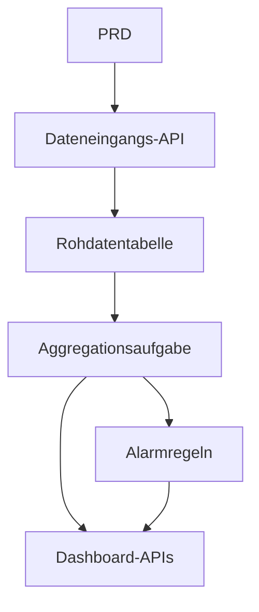

# Go Verkehrsdaten-Analyseplattform Entwicklungspraxis

## Ueberblick

Dieses Praxisprojekt erfordert die Umsetzung eines echten PRD unter Verwendung von Go: Eine Verkehrsdaten-Analyseplattform. Im Gegensatz zu frueheren CRUD-Systemen musst du hier eine vollstaendige Datenkette "Dateneingang > Aggregation > Alarmierung > Visualisierung" aufbauen. Diese Art von Datenprodukt ist in IoT-, Ueberwachungs- und Betriebsanalysen sehr verbreitet.

Dies ist die erste Begegnung mit der Programmiersprache Go. Keine Sorge - mit den vorhandenen JavaScript/TypeScript-Kenntnissen ist Go nicht schwer zu lernen. Der Fokus liegt auf dem Verstaendnis des Datenketten-Designs.

## Vorkenntnisse

- Frontend-Design und Komponentenbibliotheken ([UI-Design](../../frontend/ui-design/), [Moderne Komponentenbibliothek](../../frontend/modern-component-library/))
- Backend-API-Design und Entwicklung ([API-Code schreiben](../../backend/ai-interface-code/))
- Datenbankgrundlagen und Supabase ([Von der Datenbank zu Supabase](../../backend/database-supabase/))
- Git-Workflow und Bereitstellung ([Git und GitHub](../../backend/git-workflow/), [Web-Anwendungen bereitstellen](../../backend/zeabur-deployment/))

## Lernziele

1. PRD lesen und Entwicklungsaufgabenliste fuer ein Datenprodukt extrahieren
2. Go (Gin oder Fiber) fuer Backend-API-Services verwenden
3. Vollstaendige Datenkette fuer Dateneingang, Zeitfenster-Aggregation und Alarmierung entwerfen
4. Backend-Daten und Frontend-Dashboard konsistent halten
5. End-to-End-Tests abschliessen und einen demonstrierbaren Datenproduktprototyp liefern

## Projektuebersicht

| Modul | Verantwortung |
|-------|---------------|
| **Dateneingang** | Rohdaten zu Verkehrsereignissen empfangen und speichern |
| **Datenaggregation** | Trends und Stau-Indikatoren nach Zeitfenstern berechnen |
| **Alarmierung** | Auf regelbasierten Alarmdatensaetzen generieren |
| **Dashboard** | Trends, Ranglisten und Alarmlisten im Frontend anzeigen |

::: tip PRD-Zugang
[PRD ansehen](https://github.com/datawhalechina/easy-vibe/blob/main/docs/zh-cn/stage-2/assignments/traffic-data-visualization-go/PRD.md)
:::

<div style="margin: 32px 0;">
  <ClientOnly>
    <StepBar :active="0" :items="[
      { title: 'Anforderungsanalyse', description: 'PRD lesen, Datenquellen, Metrikdefinitionen und Alarmregeln klaeren' },
      { title: 'Geruest erstellen', description: 'Mit KI Go-API-Service und Frontend-Dashboard-Geruest generieren' },
      { title: 'Iterative Entwicklung', description: 'Aggregationslogik, Alarmregeln und Dashboard-APIs ergaenzen' },
      { title: 'Test und Bereitstellung', description: 'End-to-End durchlaufen, bereitstellen und Demo vorbereiten' }
    ]" />
  </ClientOnly>
</div>

## Teil 1: Anforderungsanalyse

### 1.1 PRD lesen

- Was ist die Datenquelle? Welche Felder gibt es?
- Wie sind die Kernmetriken definiert? (z. B. genaue "Stau"-Kriterien)
- Was sind die Alarmregeln? Erste Version auf einfache Regeln beschraenken?
- Welche Seiten und Diagramme enthaelt das Dashboard?

::: warning
Beginne nicht mit dem Code, wenn diese Fragen keine klaren Antworten haben.
:::

### 1.2 Datenkette bestaetigen



## Teil 2: Projektgeruest erstellen

### 2.1 Go-API-Service generieren

```text
Bitte generiere basierend auf dem aktuellen PRD ein Go Verkehrsdaten-Analyseplattform-Geruest.

Anforderungen:
1. Gin oder Fiber verwenden
2. Dateneingangs-API bereitstellen
3. Aggregationsaufgaben-Geruest erstellen
4. Dashboard- und Alarm-API-Geruest bereitstellen
5. Zunaechst keine komplexe Analyse, nur lauffaehige Struktur
```

### 2.2 Projektstruktur ueberpruefen

- [ ] Go-Service startet korrekt
- [ ] Dateneingangs-API kann Daten empfangen und speichern
- [ ] Aggregationsaufgaben-Geruest steht
- [ ] Frontend-Dashboard zeigt grundlegende Diagramme

## Teil 3: Iterative Entwicklung

### 3.1 Modulweise vorgehen

1. **Dateneingangs-API**: Verkehrsereignisse empfangen und in Datenbank schreiben
2. **Datenaggregation**: Nach Zeitfenstern aggregieren, Trends und Stau-Indikatoren berechnen
3. **Alarmregeln**: Basierend auf Schwellenwerten Alarmdatensaetze generieren
4. **Dashboard-APIs**: Trenddaten, Rangdaten, Alarmlisten bereitstellen
5. **Frontend-Dashboard**: Trenddiagramme, Ranglisten, Alarmlisten-Seiten

### 3.2 Modul-Selbstpruefung

| Pruefpunkt | Verifikationsmethode |
|------------|---------------------|
| Dateneingang | Rohdaten korrekt in Datenbank geschrieben |
| Aggregationsdefinition | Trend- und Rangmetriken konsistent berechnet |
| Alarmregeln | Alarm-Ausloesungsbedingungen wie erwartet |
| Datenkonsistenz | Dashboard-Anzeige und Backend-Daten synchron |
| API-Standards | Einheitliche Rueckgabestruktur und Fehlerbehandlung |

## Teil 4: Test und Bereitstellung

### 4.1 End-to-End-Tests

- Testdaten eingeben > Aggregationsaufgabe ausfuehren > Dashboard-Anzeige aktualisieren
- Alarmbedingung ausloesen > Alarmdatensatz generieren > Alarmseite anzeigen

## Liefergegenstaende

- [ ] Online-Demo-Link
- [ ] Quellcode-Repository (mit README)
- [ ] PRD-Dokument
- [ ] Kernseiten-Screenshots
- [ ] 60-Sekunden-Demo-Video

## Bewertungskriterien

| Dimension | Grundanforderung | Erweiterte Anforderung |
|-----------|------------------|------------------------|
| PRD-Alignment | Funktionen und Datenstruktur gemaess PRD | Metrikdefinitionen und Aggregationslogik klar erklaert |
| Datenkette | Eingang > Aggregation > Alarm > Dashboard lauffaehig | Aggregationsaufgaben unterstuetzen inkrementelle Updates |
| Analysefaehigkeit | Trends, Rangliste und Alarme funktional | Konfigurierbare Metriken und anpassbare Alarmregeln |
| Frontend-Anzeige | Dashboard zeigt grundlegende Diagramme | Zeitbereichsfilter fuer Diagramme |
| Engineering | Go API, Datenbank, Frontend verbunden | Einheitliche Fehlerbehandlung und Protokollierung |

## Referenzmaterialien

- [UI-Design](../../frontend/ui-design/)
- [Moderne Komponentenbibliothek](../../frontend/modern-component-library/)
- [Von der Datenbank zu Supabase](../../backend/database-supabase/)
- [API-Code schreiben](../../backend/ai-interface-code/)
- [Git und GitHub](../../backend/git-workflow/)
- [Web-Anwendungen bereitstellen](../../backend/zeabur-deployment/)
