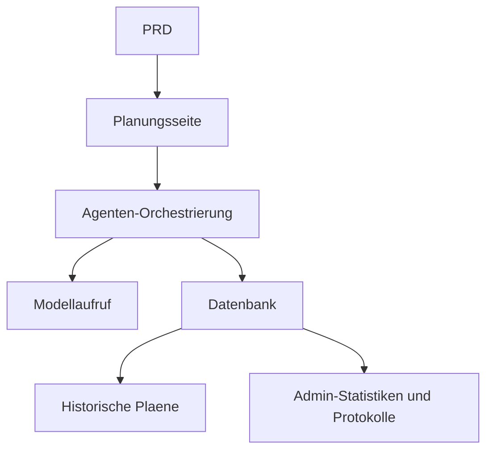

# Intelligente Reiseplanungs-Agenten-Plattform Entwicklungspraxis

## Ueberblick

Dieses Praxisprojekt erfordert die Umsetzung eines echten PRD von Grund auf: Eine intelligente Reiseplanungs-Agenten-Plattform. Du wirst ein Produkt erstellen, das strukturierte Eingaben empfaengt, Tagesreiseroutinen generiert und Speicherung sowie Wiederverwendung unterstuetzt - nicht nur ein Chatbot, sondern ein Produkt mit Aufgabenmanagement.

Die Kernherausforderung: Wie generiert die KI strukturierte, nutzbare Reiseplaene anstelle eines langen, nicht bearbeitbaren Textblocks.

## Vorkenntnisse

- Frontend-Design und Komponentenbibliotheken ([UI-Design](../../frontend/ui-design/), [Moderne Komponentenbibliothek](../../frontend/modern-component-library/))
- Backend-API-Design und Entwicklung ([API-Code schreiben](../../backend/ai-interface-code/))
- Datenbankgrundlagen und Supabase ([Von der Datenbank zu Supabase](../../backend/database-supabase/))
- Git-Workflow und Bereitstellung ([Git und GitHub](../../backend/git-workflow/), [Web-Anwendungen bereitstellen](../../backend/zeabur-deployment/))

## Lernziele

1. PRD lesen und Entwicklungsaufgabenliste fuer eine Agenten-Plattform extrahieren
2. Strukturierte Eingabeformulare und strukturierte Ausgabeformate entwerfen
3. Agenten-Orchestrierungsschicht fuer Benutzereingabe, Modellaufruf und Ergebnisspeicherung implementieren
4. Geschaefskette "Generieren > Speichern > Wiederverwenden" aufbauen
5. End-to-End-Tests abschliessen und einen demonstrierbaren KI-Produktprototyp liefern

## Projektuebersicht

| Funktion | Beschreibung |
|----------|-------------|
| **Reiseplanung** | Benutzer gibt Startort, Ziel, Datum, Budget und Praeferenzen ein; System generiert Tagesreiseroutine |
| **Budgetaufteilung** | Reiseplan enthaelt Budgetverteilung und Empfehlungen |
| **Verwaltungsverlauf** | Benutzer kann Plaene speichern, neu generieren und exportieren |
| **Admin-Dashboard** | Administrator sieht beliebte Ziele, fehlgeschlagene Aufgaben und Benutzerfeedback |

::: tip PRD-Zugang
[PRD ansehen](https://github.com/datawhalechina/easy-vibe/blob/main/docs/zh-cn/stage-2/assignments/travel-planning-agent-platform/PRD.md)
:::

<div style="margin: 32px 0;">
  <ClientOnly>
    <StepBar :active="0" :items="[
      { title: 'Anforderungsanalyse', description: 'PRD lesen, Seiten, Agenten-Orchestrierung, Ein-/Ausgabestruktur klaeren' },
      { title: 'Geruest erstellen', description: 'Mit KI Startseite, Planungsseite, Verlauf, Admin-Geruest generieren' },
      { title: 'Iterative Entwicklung', description: 'Moduleweise strukturierte Ausgabe, Aufgabenstatus, Verwaltung ergaenzen' },
      { title: 'Test und Bereitstellung', description: 'End-to-End durchlaufen, bereitstellen und Demo vorbereiten' }
    ]" />
  </ClientOnly>
</div>

## Teil 1: Anforderungsanalyse

### 1.1 PRD lesen

- Nur einzelnes Ziel in der ersten Version?
- Muss die Ausgabe strukturiert sein? Welche Struktur?
- Wie tief geht der Export? (Freigabelink / PDF / Bild)
- Umfang der Admin-Statistiken und Aufgabenprotokolle?

::: warning
Beginne nicht mit dem Code, wenn diese Fragen keine klaren Antworten haben.
:::

### 1.2 Systemarchitektur bestaetigen



## Teil 2: Projektgeruest erstellen

### 2.1 Frontend-Seiten generieren

```text
Bitte generiere basierend auf dem aktuellen PRD ein Frontend-Geruest fuer eine intelligente Reiseplanungs-Agenten-Plattform.

Anforderungen:
1. Seiten: Startseite, Planungsseite, Reisdetails, Verlauf, Admin
2. Planungsseite links: Formular, rechts: Ergebnisvorschau
3. Zunaechst nur Seitenstruktur mit Mock-Daten
4. Stil wie ein modernes KI-Produkt
```

### 2.2 Seitenstruktur ueberpruefen

- [ ] Formularfelder der Planungsseite gemaess PRD
- [ ] Ergebnisbereich zeigt strukturierte Reisedaten
- [ ] Verlaufsseite zeigt mehrere Plaene
- [ ] Admin-Seite zeigt Statistiken

## Teil 3: Iterative Entwicklung

### 3.1 Modulweise vorgehen

1. **Auth**: Registrierung, Login
2. **Planungsformular**: Strukturierte Eingabe (Startort, Ziel, Datum, Budget, Praeferenzen)
3. **Agenten-Orchestrierung**: Eingabe empfangen > Modell aufrufen > Strukturierte Ausgabe parsen
4. **Ergebnisanzeige**: Reiseplan tageweise, Budgetaufteilung, Empfehlungen
5. **Verwaltung**: Plaene speichern, neu generieren, exportieren
6. **Admin-Dashboard**: Beliebte Ziele, fehlgeschlagene Aufgaben, Benutzerfeedback
7. **Aufgabenstatus**: Generierung laeuft / Erfolg / Fehler mit Fehlerprotokollen

### 3.2 Modul-Selbstpruefung

| Pruefpunkt | Verifikationsmethode |
|------------|---------------------|
| Eingabevollstaendigkeit | Formularfelder gemaess PRD |
| Strukturierte Ausgabe | Reiseplan als strukturierte Daten (kein Textblock) |
| Datenkonsistenz | trip, itinerary, logs Daten synchron |
| Abschlussverifikation | "Eingabe > Generieren > Speichern > Neu generieren" vollstaendig |

## Teil 4: Test und Bereitstellung

### 4.1 End-to-End-Tests

- Reiseparameter eingeben > Tagesreiseroutine generieren > Budgetaufteilung anzeigen > Im Verlauf speichern
- Aus dem Verlauf eine neue Reise generieren
- Administrator sieht Aufgabenstatistiken und Fehlerprotokolle

## Liefergegenstaende

- [ ] Online-Demo-Link
- [ ] Quellcode-Repository (mit README)
- [ ] PRD-Dokument
- [ ] Kernseiten-Screenshots
- [ ] 60-Sekunden-Demo-Video

## Bewertungskriterien

| Dimension | Grundanforderung | Erweiterte Anforderung |
|-----------|------------------|------------------------|
| PRD-Alignment | Seiten, Funktionen, Datenstruktur gemaess PRD | Designentscheidungen klar erklaeren |
| Produktabschluss | Planung > Speichern > Verlauf > Neu generieren lauffaehig | Export und Freigabe unterstuetzt |
| Ausgabequalitaet | Reiseplan strukturiert und lesbar | Budgetaufteilung angemessen, Empfehlungen zielgerichtet |
| Admin-Faehigkeit | Aufgabenstatistiken und Fehlerprotokolle einsehbar | Analyse beliebter Ziele vorhanden |
| Engineering | Frontend, Backend, DB, Modellaufruf verbunden | Aufgabenstatus-Management vollstaendig |

## Referenzmaterialien

- [UI-Design](../../frontend/ui-design/)
- [Moderne Komponentenbibliothek](../../frontend/modern-component-library/)
- [Von der Datenbank zu Supabase](../../backend/database-supabase/)
- [API-Code schreiben](../../backend/ai-interface-code/)
- [Git und GitHub](../../backend/git-workflow/)
- [Web-Anwendungen bereitstellen](../../backend/zeabur-deployment/)
