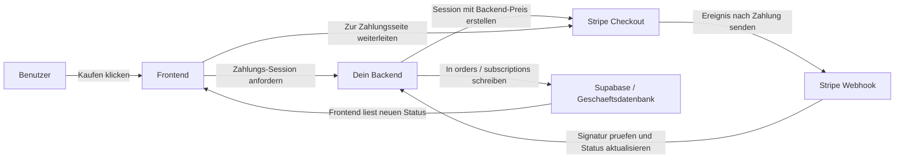
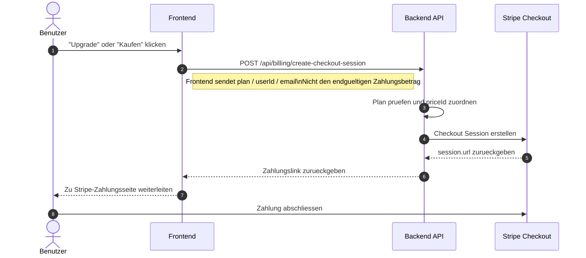
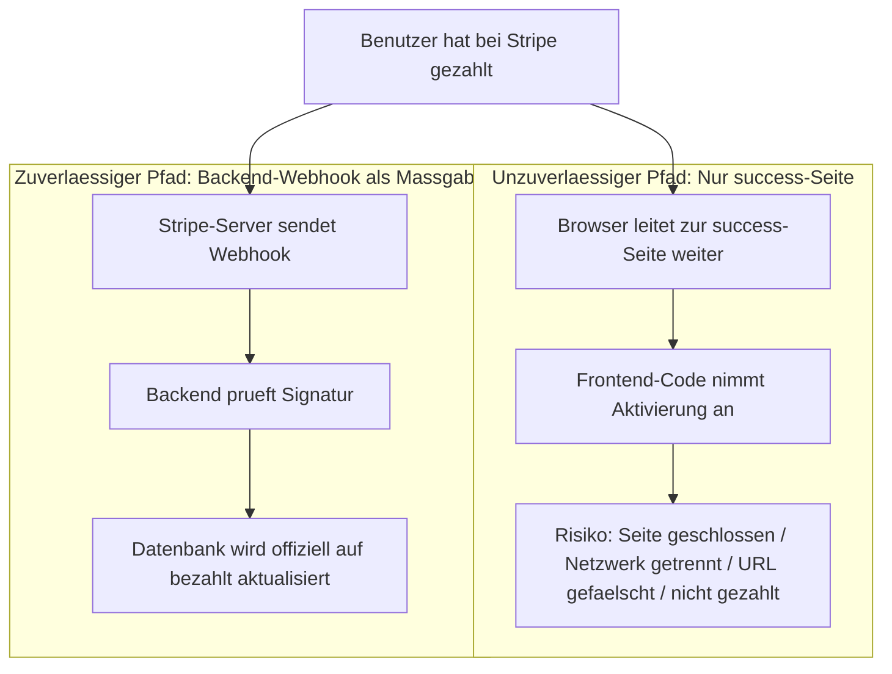
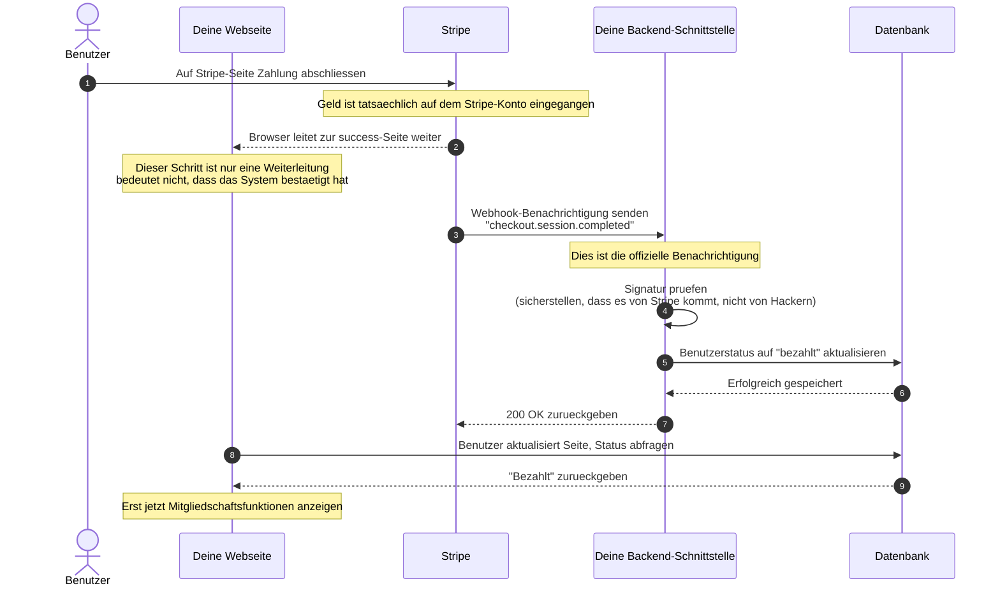
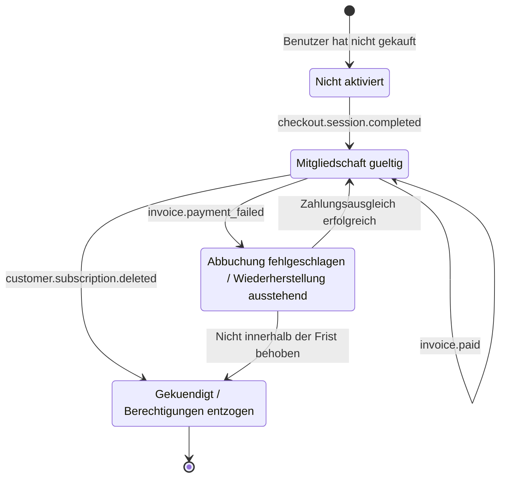
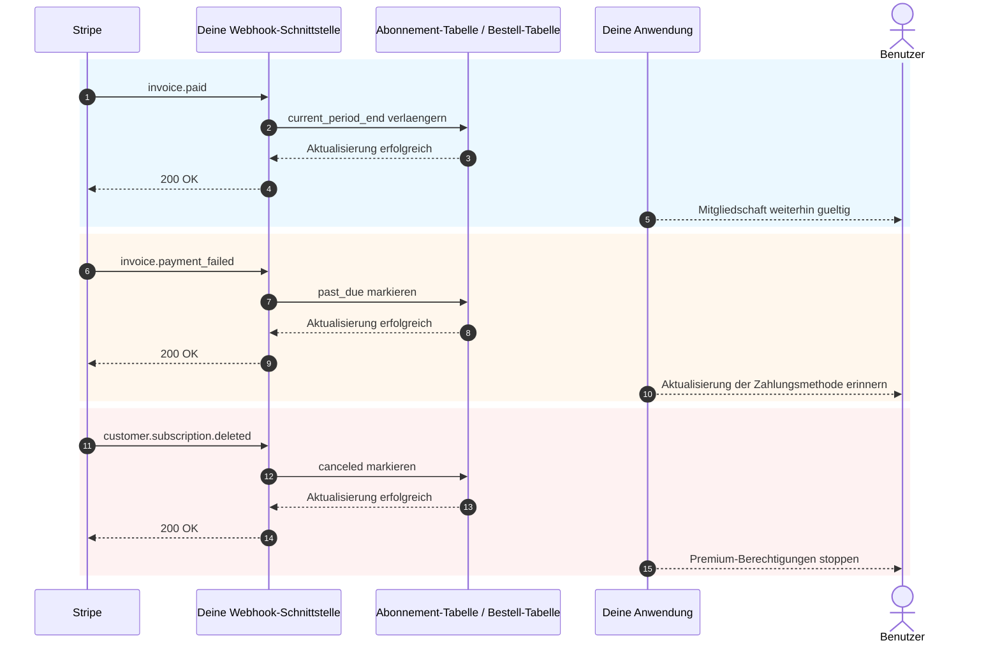

# Wie man Stripe und andere Zahlungssysteme integriert

Wenn dein Produkt bereits Seiten, Login, Datenbank und ein grundlegendes Backend hat, ist die naechste praktische Frage: **Wie nimmst du Zahlungen entgegen?**

Viele konzentrieren sich beim ersten Mal ausschliesslich darauf, "wie man zur Zahlungsseite springt". Was jedoch darueber entscheidet, ob das System stabil ist, ist nicht der Button, sondern die gesamte Zahlungskette: Wer bestimmt den Preis, wer bestaetigt den Zahlungserfolg, wer aktualisiert die Datenbank, wer entzieht Berechtigungen.

Dieser Artikel ist in zwei Teile gegliedert:

- **Der erste Teil** behandelt nur die praktischste Grundeinbindung mit dem Ziel, Stripe schnell in dein Projekt zu integrieren.
- **Der zweite Teil** wird einheitlich im Anhang behandelt und enthaelt Webhook-Details, Abo-Ereignisse und regionale Zahlungsunterschiede.

> Empfohlene Vorkenntnisse
>
> - [Von der Datenbank zu Supabase](../database-supabase/)
> - [Grosses Sprachmodell unterstuetzt beim Schreiben von API-Code](../ai-interface-code/)
> - [Web-Anwendungen bereitstellen](../zeabur-deployment/)

# Was du lernen wirst

1. Wie sieht ein minimal funktionsfaehiges Zahlungssystem aus?
2. Wie du Stripe schnellstmöglich in dein Projekt integrierst.
3. Wie du Prompts schreibst, damit die KI dir das Zahlungssystem hinzufuegt.
4. Wenn du kein internationales Stripe-Projekt machst, welche Zahlungsloesung du fuer verschiedene Regionen priorisieren solltest.

---

# Teil 1: Grundlagen

## 1. Drei Grundprinzipien merken

Wenn du dir nur drei Dinge merkst, dann diese:

1. **Preise muessen vom Backend bestimmt werden**, nicht vom Frontend. Du kannst den vom Frontend gesendeten Betrag nicht vertrauen.
2. **Berechtigungen werden durch Webhooks aktiviert**, nicht durch die `success`-Seite.
3. **Deine eigene Datenbank muss den Zahlungsstatus speichern**, nicht nur das Stripe-Backend.

Diese drei Regeln sind die Kerngrenzen eines Zahlungssystems. Solange die Grenzen stimmen, ist der Wechsel zwischen Stripe, PayPal, Alipay, WeChat Pay im Wesentlichen nur "die Schnittstelle hat sich geaendert, die Architektur bleibt gleich".

## 2. Was passiert, wenn man nicht im Backend verarbeitet, sondern das Frontend direkt mit Stripe verbindet?

Das ist der natuerlichste Gedanke vieler beim ersten Mal mit Zahlungen:

- Auf der Seite gibt es bereits einen "Kaufen"-Button
- Kann ich das Frontend nicht einfach direkt mit Stripe verbinden?
- So brauche ich doch kein Backend, oder?

Wenn du nur eine fake Demo-Seite baust, ist dieser Ansatz natuerlich unproblematisch.
Wenn du aber echtes Geld einnehmen willst, **wird dieser Weg die Dinge oft verderben**.

Die haeufigsten Probleme sind:

1. **Preise koennen leicht geaendert werden**
   Die Anfragen im Browser werden vom eigenen Computer des Benutzers gesendet. Dritte koennen den Anfrageinhalt aendern.
2. **Sensible Informationen werden leicht preisgegeben**
   Wichtige Schluessel, Preislogik und Mitgliedschaftsaktivierung gehoeren eigentlich nicht ins Frontend.
3. **Du kannst nicht zuverlaessig bestaetigen, ob die Zahlung wirklich erfolgreich war**
   Dass der Benutzer zur Erfolgsseite springt, bedeutet nicht, dass deine Datenbank bereits synchronisiert wurde.
4. **Datenbankstatus wird unordentlich**
   Der Benutzer koennte sagen "Ich habe bereits bezahlt", aber dein eigenes System hat es gar nicht aufgezeichnet.

Die sicherere Aufteilung sollte also sein:

- **Frontend**: Buttons anzeigen, Kauf initiieren, Seiten weiterleiten
- **Backend**: Preise bestimmen, Checkout-Sessions erstellen, Webhooks empfangen, Datenbank aktualisieren

::: info In einem Satz
**Das Frontend kann Weiterleitungen uebernehmen, aber das Backend muss Preisgestaltung und Bestaetigung kontrollieren.**

Solange echtes Geld eingenommen wird, solltest du weder die "endgueltige Preisentscheidung" noch die "Aktivierungslogik nach Zahlungserfolg" im Frontend belassen.
:::

## 3. Wann ist Stripe die richtige Wahl?

Wenn du folgende Szenarien hast, ist Stripe oft der einfachste Einstieg:

- SaaS fuer internationale Nutzer
- Abo-basierte Mitgliedschaftsprodukte
- Digitale Produkte, Templates, KI-Guthabenpakete
- Schnelle kommerzielle Validierung, ohne sich von Anfang an mit zu vielen lokalen Zahlungsdetails zu befassen

Wenn deine Hauptnutzer in Festland-China sind, ist Stripe in der Regel nicht die erste Wahl. Darauf gehe ich im Anhang ein.

## 4. Minimale funktionsfaehige Zahlungskette

Schauen wir uns zunaechst die Minimalversion an. Sobald diese Kette laeuft, hat dein Zahlungssystem ein Skelett.



Umgangssprachlich uebersetzt heisst das:

1. Benutzer klickt den Button.
2. Frontend fordert den Zahlungslink vom Backend an.
3. Backend erstellt die Checkout-Session mit dem Stripe-Schluessel.
4. Benutzer geht zur Stripe-Seite und zahlt.
5. Stripe benachrichtigt dich per Webhook, dass "die Zahlung wirklich erfolgreich war".
6. Dein Backend aktualisiert die Datenbank.

## 5. Standard-Zeitachse fuer die Zahlungsinitiierung

Wenn du bevorzugt formellere Systemdiagramme betrachtest, kannst du direkt dieses Sequenzdiagramm verwenden:



## 6. Schnellstart

Wenn du Stripe moeglichst schnell in dein Projekt integrieren willst, reichen die folgenden 5 Schritte.

### 6.1 Schritt 1: Produkte und Preise im Stripe-Dashboard erstellen

Der Zweck dieses Schritts ist nicht "irgendetwas schnell zu konfigurieren", sondern **was genau du verkaufst und wie du abrechnen moechtest** klar in Stripe zu definieren.

In Stripes Modell:

- **Product** beschreibt, "was du verkaufst", z.B. `Pro-Mitgliedschaft`
- **Price** beschreibt, "wie viel dieses Ding kostet und in welchem Zyklus", z.B. `monatlich 9,90 USD`, `jaehrlich 99 USD`

Warum dieser Schritt zuerst? Weil dein Backend beim Erstellen einer Checkout Session nicht direkt einen Betrag an Stripe sendet, sondern eine bereits existierende `price_id` uebergibt. Stripe generiert dann basierend auf dieser `price_id` die tatsaechliche Zahlungsseite, den Betrag, die Waehrung und den Abrechnungszyklus.

Wenn du diesen Schritt ueberspringst, kannst du "Zahlungslinks erstellen" spaeter nicht durchfuehren.

::: info Warum hier kurz pausieren
Viele Anfaenger finden die Begriffe `Product` und `Price` etwas nervig, weil es sich anfuehlt, als wuerde man Stripes interne Terminologie lernen.

Tatsaechlich machst du in diesem Schritt etwas sehr Einfaches:
- "Was wird verkauft" klar definieren
- "Wie viel kostet es" klar definieren
- Dem Backend ermoeglichen, spaeter eine stabile `price_id` zum Erstellen von Zahlungslinks zu verwenden

Sobald du diese Ebene verstanden hast, wird Checkout Session nicht mehr abstrakt wirken.
:::

Fuer ein minimal funktionsfaehiges Abo-System solltest du mindestens diese beiden Ebenen erstellen:

- ein `Product`
- einen oder mehrere `Price`

Du kannst diese Seiten direkt oeffnen:

- Stripe Dashboard Login: [Dashboard Login](https://dashboard.stripe.com/login)
- Stripe Produkt- und Preisverwaltung: [Manage products and prices](https://docs.stripe.com/products-prices/manage-prices)
- Stripe Checkout Schnellstart: [Build a Stripe-hosted checkout page](https://docs.stripe.com/checkout/quickstart?lang=node)
- Stripe Dashboard Produkte: [Product catalog](https://dashboard.stripe.com/test/products)

Wir empfehlen, zunaechst im **Testmodus (Test mode)** zu arbeiten und nicht direkt in der Produktionsumgebung zu erstellen.

Eine typische Minimalkonfiguration ist:

- `Product`: `Pro Plan`
- `Price 1`: `pro_monthly`
- `Price 2`: `pro_yearly`

Beim Arbeiten im Dashboard kannst du folgende Reihenfolge anwenden:

1. Zunaechst ein Produkt `Pro Plan` erstellen
2. Dann diesem Produkt zwei Preise zuordnen
3. Monatliche und jaehrliche Zahlung sind eigentlich zwei Abrechnungsmethoden fuer dasselbe Produkt

Nach Abschluss solltest du mindestens diese Informationen notieren:

- Die `price_id` des monatlichen Preises
- Die `price_id` des jaehrlichen Preises
- Deine eigenen Paketnamen, z.B. `pro_monthly`, `pro_yearly`

Wenn du zum ersten Mal im Stripe-Dashboard bist, empfehlen wir, diesen Schritt wie folgt zu verstehen:

- `Product` bestimmt, was auf der Zahlungsseite verkauft wird
- `Price` bestimmt, wie viel auf der Zahlungsseite berechnet wird
- Was das Backend spaeter wirklich verwendet, ist hauptsaechlich die `price_id`

::: info Die wirklich wichtigen Werte
Das Wichtigste auf dieser Seite ist nicht der Produktname, sondern die `price_id`.

Sowohl wenn die KI dir beim Backend-Integrieren hilft, als auch wenn du selbst Probleme diagnostizierst, wirst du haeufig verwenden:
- `STRIPE_PRICE_PRO_MONTHLY`
- `STRIPE_PRICE_PRO_YEARLY`
- Die beiden entsprechenden `price_id`-Werte
:::

Wenn du die KI zunaechst die Dashboard-Konfiguration fuer dich erledigen lassen moechtest, kannst du diesen Prompt verwenden:

```text
Ich verwende Stripe zum ersten Mal. Bitte aendere zunaechst keinen Code, sondern fuehre mich durch die grundlegende Zahlungs-Konfiguration im Stripe-Dashboard.

Bitte beziehe dich auf diese offiziellen Dokumente:
- https://docs.stripe.com/products-prices/manage-prices
- https://docs.stripe.com/checkout/quickstart?lang=node

Meine Situation:
- Ich moechte eine einfachste Mitgliedschaftsbezahlung erstellen
- Nur zwei Plaene: monatliche und jaehrliche Zahlung
- Ich verstehe die Begriffe Product und Price noch nicht

Bitte:
1. Erklaere mir zunaechst in einfachen Worten, was Product und Price jeweils sind.
2. Fuehre mich dann in der Reihenfolge "Welche Seite oeffnen -> Wo klicken -> Was ausfuellen" durch die Operationen.
3. Erinnere mich am Ende, welche Werte ich aus dem Dashboard kopieren muss, damit das Backend sie verwenden kann.
4. Falls ich Fehler machen koennte, erinnere mich daran, immer im Testmodus zu arbeiten.
```

### 6.2 Schritt 2: Umgebungsvariablen vorbereiten

Du benoetigst in der Regel mindestens diese Umgebungsvariablen:

- `STRIPE_SECRET_KEY`
- `STRIPE_WEBHOOK_SECRET`
- `STRIPE_PRICE_PRO_MONTHLY`
- `STRIPE_PRICE_PRO_YEARLY`
- `APP_URL`
- `SUPABASE_URL`
- `SUPABASE_SERVICE_ROLE_KEY`

Du kannst diese Seiten direkt oeffnen:

- Stripe API Keys Dokumentation: [API keys](https://docs.stripe.com/keys)
- Stripe Dashboard API Keys: [API Keys](https://dashboard.stripe.com/test/apikeys)
- Stripe Webhooks Dokumentation: [Receive Stripe events in your webhook endpoint](https://docs.stripe.com/webhooks)
- Stripe Dashboard Webhooks: [Workbench Webhooks](https://dashboard.stripe.com/test/workbench/webhooks)

> `STRIPE_SECRET_KEY` und `SUPABASE_SERVICE_ROLE_KEY` duerfen nur im Backend gespeichert werden.

::: info Zweck der Umgebungsvariablen
Dieser Schritt dient nicht dazu, "zunaechst die `.env` zu fuellen", sondern dazu, die sensibelsten Elemente des Zahlungssystems im Backend zu sichern:

- Stripes Backend-Schluessel
- Webhook-Signaturpruefschluessel
- Deine eigene Preiszuordnung

Einfach gesagt:
Das Frontend ist nur fuer die Initiierung des Kaufs zustaendig. Die echten Geheimnisse und die Preislogik sollten auf dem Server bleiben.
:::

Dieser Schritt kann auch direkt von der KI erledigt werden:

```text
Bitte pruefe zunaechst, wie mein Projekt aktuell Umgebungsvariablen speichert, und hilf mir dann, die fuer Stripe benoetigten Umgebungsvariablen zu organisieren.

Bitte beziehe dich auf diese Dokumente:
- https://docs.stripe.com/keys
- https://docs.stripe.com/webhooks

Meine Situation:
- Ich bin Anfaenger
- Ich kann nicht unterscheiden, welche Variablen ins Frontend und welche ins Backend gehoeren
- Ich bin mir nicht sicher, ob ich `.env`, `.env.local` oder eine andere Datei aendern sollte

Bitte:
1. Suche zunaechst im aktuellen Projekt, wo Umgebungsvariablen normalerweise geschrieben werden.
2. Liste die minimal noetigen Variablen fuer die Stripe-Integration auf.
3. Erklaere mir in einfachen Worten, was jede Variable macht.
4. Sag mir, von welcher Stripe-Seite ich jede Variable kopieren kann.
5. Falls das Projekt eine Beispiel-Umgebungsvariablendatei hat, fuege die Variablennamen direkt hinzu.
```

### 6.3 Schritt 3: Checkout Session im Backend erstellen

Du musst diese Schnittstelle nicht selbst schreiben. Lass die KI basierend auf der offiziellen Dokumentation die Implementierung vornehmen.

Gib ihr zunaechst diese Dokumente:

- Stripe Checkout Schnellstart: [Build a Stripe-hosted checkout page](https://docs.stripe.com/checkout/quickstart?lang=node)
- Checkout Sessions API: [Create a Checkout Session](https://docs.stripe.com/api/checkout/sessions/create)
- Abonnement-Doku: [Subscriptions](https://docs.stripe.com/payments/subscriptions)

Verwende dann diesen Prompt:

```text
Bitte pruefe zunaechst die Struktur des Backend-Codes meines aktuellen Projekts und hilf mir dann, Stripe-Zahlungen zu integrieren.

Bitte beziehe dich auf diese offiziellen Dokumente:
- https://docs.stripe.com/checkout/quickstart?lang=node
- https://docs.stripe.com/api/checkout/sessions/create
- https://docs.stripe.com/payments/subscriptions

Mein Ziel ist einfach:
- Nach dem Klick auf "Kaufen" soll der Benutzer zur Stripe-Zahlungsseite weitergeleitet werden
- Nur monatliche und jaehrliche Plaene
- Lass mich nicht selbst entscheiden, wo der Code platziert werden soll. Pruefe zunaechst das Projekt und platziere ihn an einer geeigneten Stelle

Bitte:
1. Suche im Projekt und finde heraus, wo sich Backend-Einstiegsdatei, Routing-Dateien und Umgebungsvariablen befinden.
2. Integriere basierend auf der offiziellen Dokumentation den Schritt "Stripe-Zahlungslink erstellen".
3. Lass mich den Betrag nicht selbst uebergeben. Preise sollen ueber Backend-Umgebungsvariablen bestimmt werden.
4. Sag mir nach Abschluss, welche Dateien du geaendert hast.
5. Sag mir zum Schluss, welche Konfigurationen ich noch im Stripe-Dashboard ergaenzen muss.
```

### 6.4 Schritt 4: Frontend zur Zahlungsseite weiterleiten

Das Ziel dieses Schritts ist sehr einfach: Den Button auf der Preisseite die Backend-Schnittstelle aufrufen und dann zu Stripe Checkout weiterleiten lassen.

Referenzdokumentation:

- Stripe Checkout Integration: [Build an integration with Checkout](https://docs.stripe.com/payments/checkout/build-integration)

Prompt fuer die KI:

```text
Hilf mir, den "Kaufen"-Button in meinem Projekt mit Stripe zu verbinden.

Anforderungen:
- Bestehende Seiten nicht aendern, nur die Button-Klick-Logik modifizieren
- Nach dem Klick Backend-API fuer Zahlungslink aufrufen, dann zu Stripe weiterleiten
- Bei Fehlern eine einfache Meldung anzeigen (z.B. "Zahlung derzeit nicht verfuegbar, bitte spaeter erneut versuchen")

Referenzdokumentation: https://docs.stripe.com/payments/checkout/build-integration
```

### 6.5 Schritt 5: Webhook fuer Datenbankaktualisierung

Dies ist der wichtigste Schritt.

::: info Warum dieser Schritt der wichtigste ist
Viele glauben, "der Benutzer hat bezahlt und wurde zur success-Seite weitergeleitet" sei bereits erledigt.

Nein.

Fuer dein System ist wirklich wichtig:
**Hat Stripe das Ereignis offiziell an deinen Webhook gesendet und hat dein Backend den Datenbankstatus erfolgreich aktualisiert?**
:::

Du kannst die KI auch die Implementierung direkt basierend auf der offiziellen Stripe Webhook-Dokumentation vornehmen lassen, anstatt es selbst zu schreiben.

Referenzdokumentation:

- Stripe Webhooks: [Receive Stripe events in your webhook endpoint](https://docs.stripe.com/webhooks)
- Stripe CLI: [Stripe CLI](https://docs.stripe.com/stripe-cli)
- Stripe CLI Nutzung: [Use the Stripe CLI](https://docs.stripe.com/stripe-cli/use-cli)

Prompt fuer die KI:

```text
Bitte hilf mir weiterhin, den Schritt "automatische Aktivierung nach erfolgreicher Stripe-Zahlung" zu integrieren.

Bitte beziehe dich auf diese offiziellen Dokumente:
- https://docs.stripe.com/webhooks
- https://docs.stripe.com/stripe-cli
- https://docs.stripe.com/stripe-cli/use-cli

Mein Ziel:
- Nach der Zahlung nicht nur zur Erfolgsseite weiterleiten
- Sondern den Mitgliedschaftsstatus in der Datenbank wirklich auf "aktiviert" aendern

Bitte:
1. Suche zunaechst im aktuellen Projekt nach datenbankbezogenem Code und wie der Benutzerstatus gespeichert wird.
2. Fuege dann einen Stripe-Webhook hinzu.
3. Aendere nach erfolgreicher Zahlung den entsprechenden Benutzer auf "active" oder aktualisiere das Mitgliedschaftsstatus-Feld, das bereits im Projekt verwendet wird.
4. Falls im Projekt bereits Abonnement-, Bestell- oder Benutzertabellen existieren, verwende bevorzugt die bestehende Struktur.
5. Sag mir nach Abschluss, welche Dateien du geaendert hast.
6. Sag mir auch, wie ich lokal testen kann, ob dieser Schritt wirklich funktioniert.
```

## 7. Prompt fuer die schnelle KI-Integration

Wenn du Tools wie Codex, Claude Code, Trae, Cursor verwendest, kannst du den folgenden Prompt direkt einfuegen, um die Zahlungsintegration in deinem Projekt durchfuehren zu lassen.

```text
Bitte hilf mir, das aktuelle Projekt mit Stripe-Zahlungen zu verbinden. Ich moechchte eine einfachste funktionierende Mitgliedschaftsbezahlung erstellen.

Meine Anforderungen:
1. Ich bin Anfaenger. Bitte pruefe zunaechst das Projekt selbst, bevor du entscheidest, wo der Code geaendert werden soll.
2. Lass mich nicht selbst die Verzeichnisstruktur, Routing-Struktur oder Datenbankstruktur beurteilen.
3. Ich moechchte zunaechst nur die einfachste Version: monatlicher und jaehrlicher Plan.
4. Nach dem Klick auf "Kaufen" soll der Benutzer zur Stripe-Zahlungsseite weitergeleitet werden.
5. Nach erfolgreicher Zahlung soll der Mitgliedschaftsstatus in der Datenbank auf "aktiviert" geaendert werden.
6. Nicht sofort zu viele komplexe Funktionen hinzufuegen, wie Coupons, Upgrades/Downgrades, komplexe Rechnungen.

Ausgabe-Anforderungen:
1. Gib mir zunaechst einen Aenderungsplan.
2. Aendere dann direkt den Code.
3. Sag mir zum Schluss Schritt fuer Schritt, wie ich lokal teste.
4. Falls ein Schritt noch eine Aktion im Stripe-Dashboard erfordert, gib mir direkt den Link und die wichtigsten Punkte.
```

Wenn du moechtest, dass die KI noch besser zu deinem Projekt passt, kannst du am Anfang noch ergaenzen:

- Dein Frontend-Framework
- Deine Backend-Verzeichnisstruktur
- Deine Datenbanktabellennamen
- Ob dein Benutzer-System Supabase Auth oder ein eigenes Auth-System ist

## 7.1 Lokale Integration vorzugsweise auch der KI ueberlassen

Wenn du moechtest, dass die KI auch die lokale Integration fuer dich zusammenstellt, kannst du diesen Prompt verwenden:

```text
Bitte hilf mir weiterhin, die Stripe-Zahlung wirklich zum Laufen zu bringen. Ich moechchte Schritt fuer Schritt vorgehen, ohne selbst raten zu muessen.

Bitte beziehe dich auf die offizielle Dokumentation:
- https://docs.stripe.com/webhooks
- https://docs.stripe.com/stripe-cli
- https://docs.stripe.com/stripe-cli/use-cli

Meine Ziele:
1. Sag mir, welche Stripe-Seiten ich zunaechst oeffnen muss.
2. Sag mir, wie ich STRIPE_WEBHOOK_SECRET erhalte.
3. Sag mir, wie ich stripe login und stripe listen verwende.
4. Sag mir, wie ich verifiziere, dass checkout.session.completed erfolgreich den lokalen Webhook erreicht hat.
5. Falls das aktuelle Projekt zuerst Frontend und Backend starten muss, sag mir auch die konkreten Befehle.
6. Erklaere nicht nur Theorie, gib die Schritte in tatsaechlichen Operationsanweisungen aus.
7. Falls ich einen Schritt falsch mache, sag mir, wie die haeufigsten Fehlermeldungen aussehen.
```

## 8. Die 4 haeufigsten Fehler

1. **Die `success`-Seite als Zahlungsbestaetigung betrachten**
   Was den Status wirklich bestimmt, ist der Webhook, nicht die Frontend-Weiterleitung.
2. **Das Frontend den Betrag senden lassen**
   Dies birgt ein ernstes Risiko der Preismanipulation.
3. **Webhook-Route wird von `express.json()` vorab verarbeitet**
   Stripe benoetigt den rohen Anforderungskoerper fuer die Signaturpruefung.
4. **Keine Idempotenz-Behandlung**
   Webhooks koennen wiederholt werden. Wenn du jedes Mal die Mitgliedschaft oder Credits doppelt hinzufuegst, gibt es einen Vorfall.

## 9. Auswahlberatung in einem Satz

Wenn du jetzt nur die Zahlung zum Laufen bringen moechtest:

| Hauptnutzer | Zunaechst ausprobieren |
| :--- | :--- |
| Internationale SaaS | Stripe |
| Festland-China | Alipay / WeChat Pay |
| Hongkong oder grenzueberschreitende Teams | Stripe + lokale Wallet/FPS Aggregator |

Die genauen Unterschiede behandle ich einheitlich im Anhang.

::: info Einfachste Auswahlueberlegung
Denke nicht von Anfang an: "Ich muss alle globalen Zahlungsmethoden auf einmal integrieren."

Praktischer ist meist diese Reihenfolge:
- Zunaechst basierend auf der Region der Hauptnutzer eine Hauptzahlungskette waehlen
- Die minimal funktionsfaehige Zahlung zum Laufen bringen
- Dann basierend auf tatsaechlichen Nutzungsquellen die zweite und dritte Zahlungsmethode ergaenzen
:::

## 10. Zusammenfassung

Damit hast du die grundlegendste und wichtigste Zahlungskette gemeistert:

1. Frontend initiiert den Kauf.
2. Backend erstellt eine Checkout Session.
3. Benutzer zahlt auf der Stripe-Seite.
4. Stripe benachrichtigt das Backend per Webhook.
5. Backend aktualisiert die Datenbank.
6. Frontend zeigt nach Aktualisierung den neuen Mitgliedschafts- oder Bestellstatus.

Wenn du nur schnell die Zahlung in dein Projekt integrieren moechtest, reicht der obige Inhalt. Die folgenden Anhaenge kannst du bei Bedarf konsultieren, wenn du tatsaechlich auf Probleme stoesst.

---

# Anhang

## Anhang A: Die haeufigsten Stripe-Objekte

Beim ersten Blick in die Stripe-Dokumentation verwirren einen diese Objektnamen am meisten. Du musst zunaechst nur folgende verstehen:

| Objekt | Funktion | Vergleichbar mit |
| :--- | :--- | :--- |
| `Product` | Beschreibt, was verkauft wird | Produkt oder Mitgliedschaftsplan |
| `Price` | Beschreibt Preis und Abrechnungszyklus | Monatlich, jaehrlich, Einmalkauf |
| `Checkout Session` | Von Stripe verwalteter Zahlungsprozess | Zahlungsseite |
| `Subscription` | Periodisches Abonnementverhaeltnis | Automatische Verlaengerung |
| `Customer` | Zahlender Benutzer | Kundenprofil bei Stripe |
| `Webhook` | Asynchrone Benachrichtigung | Stripe teilt dir mit "wie steht es um diese Zahlung" |

## Anhang B: Warum die `success`-Seite nicht gleich Zahlungserfolg bedeutet

Viele glauben, "der Benutzer hat bezahlt und ist zur success-Seite gesprungen" bedeute Zahlungserfolg. Das ist die groesste Falle.

### Ein reales Szenario

Angenommen, du hast eine Mitgliedschafts-Website:
1. Benutzer klickt auf "Mitgliedschaft kaufen"
2. Weiterleitung zur Stripe-Zahlungsseite
3. Benutzer gibt Kreditkartendaten ein und klickt auf Zahlung
4. Seite leitet zu deiner `success.html` weiter
5. Du schreibst Code auf der success-Seite: "Wer auf diese Seite kommt, bekommt die Mitgliedschaft aktiviert"

**Wo ist das Problem?**

Der Benutzer koennte gar nicht bezahlt haben oder die Seite waehrend der Zahlung geschlossen haben und trotzdem `success.html` direkt aufrufen.

### Zwei vollkommen unterschiedliche Pfade



**Kernunterschied:**

| | success-Seiten-Weiterleitung | Webhook-Benachrichtigung |
| :--- | :--- | :--- |
| Wer initiiert es? | Browser des Benutzers | Stripe-Server |
| Faelschbar? | Ja, URL direkt aufrufen genuegt | Nein, Signaturpruefung vorhanden |
| Garantiert es Zahlungserfolg? | Nicht unbedingt | Definitiv |
| Wie erfaehrt dein System es? | Frontend-Code vermutet es | Stripe benachrichtigt offiziell |

### Wie der vollstaendige Ablauf sein sollte



### Stolpersteine an jedem Knotenpunkt

**Schritt 1: Benutzer zahlt bei Stripe**

Dies ist der einzige Moment, der bestaetigt, "das Geld wurde wirklich bezahlt":
- Benutzer gibt Kreditkarteninformationen ein und klickt auf Bestaetigen
- Die Bank belastet die Karte des Benutzers
- Stripe bestaetigt den Erhalt dieses Betrags

**Schritt 2: Browser leitet zur success-Seite weiter (groeßstes Problem)**

Dieser Schritt ist vollkommen unzuverlaessig, weil:
- Der Benutzer kann direkt `deineseite.de/success` im Browser eingeben und ohne Zahlung zugreifen
- Der Benutzer hat die Zahlung abgebrochen, aber den success-Link zuvor kopiert und spaeter geoeffnet
- Netzwerkprobleme fuehren zu fehlgeschlagener Weiterleitung, aber das Geld wurde bereits abgebucht (Benutzer hat bezahlt, sieht aber keine Erfolgsseite)
- Der Benutzer drueckt den Zurueck-Button und zahlt noch einmal, aber beide Zahlungen leiten zur selben success-Seite weiter

**Schritt 3: Stripe sendet Webhook**

Dies ist die aktive Benachrichtigung von Stripes Server an deinen Server: "Diese Zahlung ist eingegangen":
- Nur Stripes Server kann diese Anfrage initiieren
- Die Anfrage enthaelt eine Signatur, die dein Backend verifizieren kann, ob sie wirklich von Stripe stammt
- Selbst wenn die success-Seite nicht geoeffnet wurde oder der Benutzer offline ist, wird der Webhook gesendet

**Schritt 4: Backend prueft Signatur**

Warum pruefen? Um gefaelschte Benachrichtigungen von Hackern zu verhindern.

Angenommen, es gibt keine Pruefung: Ein Hacker koennte deinem Server direkt eine falsche Benachrichtigung senden: "Benutzer A hat 1000 Euro bezahlt". Dein System wuerde dem Hacker die Mitgliedschaft aktivieren.

Der Pruefungsprozess:
- Stripe generiert mit dem vereinbarten Schluessel eine Signatur fuer den Benachrichtigungsinhalt
- Dein Backend verifiziert mit demselben Schluessel, ob die Signatur uebereinstimmt
- Uebereinstimmung = 100% von Stripe, keine Uebereinstimmung = direkt ablehnen

**Schritt 5: Datenbank aktualisieren**

Nur nach bestandener Pruefung wird die Datenbank aktualisiert:
- Benutzerstatus von "ausstehend" auf "bezahlt" aendern
- Bestellnummer, Betrag, Zahlungsdauer aufzeichnen
- Entsprechende Mitgliedschaftsberechtigungen aktivieren

**Schritt 6: Frontend fragt Status ab**

Die success-Seite sollte nicht selbst beurteilen, "wer auf dieser Seite ist, hat erfolgreich bezahlt". Der richtige Ansatz:
- Beim Laden der Seite eine Anfrage ans Backend senden: "Hat dieser Benutzer bezahlt?"
- Backend fragt die Datenbank ab und gibt den tatsaechlichen Status zurueck
- Basierend auf dem Ergebnis "Aktivierung erfolgreich" oder "Bestaetigung ausstehend" anzeigen

### Ein haeufiger falscher Ansatz

```javascript
// Falsch: Auf success-Seite direkt aktivieren
// success.html
if (window.location.pathname === '/success') {
  // Gefaehrlich! Jeder kann /success aufrufen
  activateMembership();
}
```

```javascript
// Richtig: Bei jedem Aktualisieren Backend abfragen
// success.html
async function checkStatus() {
  const response = await fetch('/api/user/status');
  const data = await response.json();

  if (data.paymentStatus === 'paid') {
    showMemberFeatures();
  } else {
    showPendingMessage();
  }
}
```

### Zusammenfassung in einem Satz

**Die success-Seite bedeutet nur "Browser-Weiterleitung erfolgreich". Der Webhook bedeutet "Stripe hat den Zahlungseingang offiziell bestaetigt".**

Dein System muss sich auf den Webhook verlassen, nicht auf die Frontend-Weiterleitung.

## Anhang C: Wichtigste Abonnement-Ereignisse

| Ereignis | Bedeutung | Typische Aktion |
| :--- | :--- | :--- |
| `checkout.session.completed` | Erste Aktivierung erfolgreich | Lokalen Abonnement-Datensatz erstellen |
| `invoice.paid` | Automatische Verlaengerung erfolgreich | Gueltigkeit verlaengern |
| `invoice.payment_failed` | Automatische Abbuchung fehlgeschlagen | Risikostatus markieren und Benutzer benachrichtigen |
| `customer.subscription.deleted` | Abonnement gekuendigt | Berechtigungen entziehen oder nach Ablauf deaktivieren |

### Abonnementstatus-Diagramm



### Zeitachse fuer Verlaengerung / Fehlschlag / Kuendigung



## Anhang D: Andere Zahlungsloesungen

### 1. Festland-China

Wenn die Hauptnutzer in Festland-China sind, ist die erste Wahl **[Alipay](https://open.alipay.com/)** und **[WeChat Pay](https://pay.wechatpay.cn/)**.

**Geschaefsmodell:**

Beide nutzen das "Zahlungsgateway"-Modell. Du musst:
- Haendlerqualifikationen beantragen (Gewerbeschein, Unternehmenskonto)
- Das vom Benutzer bezahlte Geld geht direkt auf dein Haendlerkonto
- Du bist selbst fuer Steuern, Erstattungen und Abstimmung verantwortlich

**Technisches Modell:**

Beide nutzen das Modell "Backend-Bestellung + Frontend-Aufruf + Backend-Benachrichtigung", aehnlich wie bei Stripe.

**Alipay-Integrationsprozess:**
1. Auf der Alipay Open Platform eine App erstellen
2. Oeffentliche/private Schluessel und Callback-URL konfigurieren
3. Backend ruft die einheitliche Bestellschnittstelle auf und generiert Zahlungslinks oder QR-Codes
4. Benutzer scannt den Code oder wird zur Zahlung weitergeleitet
5. Alipay benachrichtigt asynchron dein Backend und aktualisiert den Bestellstatus

**WeChat Pay-Integrationsprozess:**
- JSAPI-Zahlung: Geeignet fuer offizielle Konten und Mini-Programme, Benutzer zahlt direkt in WeChat
- Native-Zahlung: PC generiert QR-Code, Benutzer scannt und zahlt
- H5-Zahlung: Im mobilen Browser wird die WeChat-App zur Zahlung aufgerufen

Prozess: Backend-Bestellung -> `prepay_id` oder `code_url` erhalten -> Frontend ruft Zahlung auf -> Backend erhaelt Benachrichtigung und bestaetigt Erfolg

**Referenzlinks:**
- Alipay Open Platform: https://open.alipay.com/
- WeChat Pay Haendlerdokumentation: https://pay.wechatpay.cn/doc/v3/merchant/

### 2. Hongkong

Der Hongkonger Markt ist relativ gemischt, haeufige Kombinationen:

- Bankkarten: Visa / Mastercard
- FPS (Faster Payment System): Lokale Echtzeitueberweisungen in Hongkong
- AlipayHK / WeChat Pay HK: Hongkong-Version von Alipay und WeChat

**Empfohlene Kombination:**
- **[Stripe](https://stripe.com/hk)** fuer internationale Karten und Abos
- **[Airwallex](https://www.airwallex.com/)** oder **[Adyen](https://www.adyen.com/)** fuer lokale Wallets und FPS

### 3. International / SaaS

#### [Stripe](https://stripe.com/)

**Geschaefsmodell:** Zahlungsgateway

- Du musst selbst Haendlerqualifikationen beantragen (in einigen Laendern kann Stripe dies fuer dich erledigen)
- Das vom Benutzer bezahlte Geld geht auf dein Stripe-Konto und wird dann auf dein Bankkonto ausgezahlt
- Du bist selbst fuer die Steuererklaerung verantwortlich

**Technisches Modell:**

- Beste API-Erfahrung, klare Dokumentation
- Untestuetzung von Checkout (verwaltete Seite), Elements (benutzerdefinierte Formulare), Payment Links (ohne Code)
- Webhook-Benachrichtigung des Zahlungsstatus
- Untestuetzung von Abonnements, Rechnungen, mult Waehrung

**Fuer wen:** Internationale SaaS, Indie-Entwickler, Teams, die flexible Anpassung benoetigen

**Referenzlink:** https://docs.stripe.com/

#### [PayPal](https://www.paypal.com/)

**Geschaefsmodell:** Zahlungsgateway

- Das vom Benutzer bezahlte Geld geht auf dein PayPal-Konto und wird dann auf die Bank ausgezahlt
- Du bist selbst fuer Steuern verantwortlich

**Technisches Modell:**

- Einmalzahlung: Frontend-Button, Backend erstellt/bestaetigt Bestellung
- Abonnement: Zunaechst Product und Plan erstellen, dann mit SDK aufrufen
- Ebenfalls Backend und Webhook erforderlich, nicht nur auf Frontend-Callback verlassen

**Fuer wen:** Internationale Geschaefte, die einen ergaenzenden Kanal benoetigen, Benutzer, die PayPal gewohnt sind

**Referenzlink:** https://developer.paypal.com/docs/

#### [Paddle](https://www.paddle.com/)

**Geschaefsmodell:** Merchant of Record (MoR)

- Paddle ist der "Haendler of Record", rechtlich nimmt Paddle das Geld vom Benutzer entgegen
- Paddle behandelt globale Steuern, VAT, Erstattungen, Compliance fuer dich
- Das vom Benutzer bezahlte Geld geht an Paddle, Paddle zieht Steuern und Gebuehren ab und zahlt den Rest an dich aus
- Du musst in keinem Land eine Gesellschaft gruenden oder Steuern behandeln

**Technisches Modell:**

- Paddle.js: Frontend-integrierte verwaltete Checkout-Seite
- Backend-API: Transaktion erstellen, an Checkout uebergeben
- Webhook synchronisiert Abonnementstatus

**Fuer wen:** SaaS-Teams, die keine globalen Steuern behandeln moechten, insbesondere B2B SaaS

**Referenzlink:** https://developer.paddle.com/

#### [Lemon Squeezy](https://www.lemonsqueezy.com/)

**Geschaftsmodell:** Merchant of Record (MoR)

- Aehnlich wie Paddle ist Lemon Squeezy der "Haendler of Record"
- Behandelt globale Steuern, VAT, Compliance fuer dich
- 2024 von Stripe akquiriert, arbeitet aber unabhaengig weiter

**Technisches Modell:**

- Hosted Checkout: Am einfachsten, direkt Zahlungslinks generieren
- Checkout Overlay: Overlay in deine Seite eingebettet
- Backend-API: Checkout erstellen, flexible Kontrolle

**Fuer wen:** Indie-Entwickler, digitale Produkte, Software-Lizenzierung

**Referenzlink:** https://docs.lemonsqueezy.com/

### 4. Unternehmensloesungen

#### [Airwallex](https://www.airwallex.com/)

**Geschaefsmodell:** Zahlungsgateway + globale Konten

- Bietet globale Empfangskonten (aehnlich virtuellen Bankkonten)
- Untestuetzung mult Waehrungsempfang, Waehrungsumtausch, Zahlungen
- Du bist selbst fuer Steuern verantwortlich

**Technisches Modell:**

- Payment Links: Fast ohne Code, Zahlungslinks generieren
- Hosted Payment Page: Verwaltete Seite
- Drop-in / Embedded / Native API: Tiefe Integration, hohe Anpassbarkeit
- Untestuetzung von Alipay HK, FPS, WeChat Pay und weiteren lokalen Zahlungsmethoden

**Fuer wen:** Hongkonger Teams, grenzueberschreitende Geschaefte, Unternehmen mit mult Waehrungskonten

**Referenzlink:** https://www.airwallex.com/docs/

#### [Adyen](https://www.adyen.com/)

**Geschaefsmodell:** Zahlungsgateway

- Unternehmensklasse-Zahlungsplattform, jaehrliches Transaktionsvolumen in Billionen Euro
- Untestuetzung von Online-, Offline- und Mobile-Kanal
- Du bist selbst fuer Steuern verantwortlich

**Technisches Modell:**

- Pay by Link: Am einfachsten, Zahlungslinks generieren
- Drop-in / Components: Standard-Online-Integration
- Backend kann Alipay, Alipay HK, PayMe und weitere lokale Zahlungsmethoden aktivieren

**Fuer wen:** Grossunternehmen, Unternehmen mit Omnichannel-Zahlungsbedarf

**Referenzlink:** https://docs.adyen.com/

### 5. Loesungsvergleich

| Loesung | Geschaefsmodell | Steuerbehandlung | Fuer wen |
| :--- | :--- | :--- | :--- |
| Stripe | Zahlungsgateway | Selbst behandeln | Internationale SaaS, Entwickler |
| PayPal | Zahlungsgateway | Selbst behandeln | Ergaenzender internationaler Kanal |
| Paddle | MoR | Paddle behandelt | B2B SaaS, die keine Steuern verwalten wollen |
| Lemon Squeezy | MoR | LS behandelt | Indie-Entwickler, digitale Produkte |
| Adyen | Zahlungsgateway | Selbst behandeln | Grossunternehmen |
| Airwallex | Gateway + Konten | Selbst behandeln | Grenzueberschreitende Geschaefte, Hongkonger Teams |
| Alipay/WeChat | Zahlungsgateway | Selbst behandeln | Festland-China |

### 6. Nach Region auswaehlen

| Dein Markt | Empfohlene Loesung |
| :--- | :--- |
| Festland-China | Alipay / WeChat Pay |
| Hongkong | Stripe + Airwallex / Adyen |
| Internationale SaaS | Stripe (selbst) oder Paddle (MoR) |
| Digitale Produkte (international) | Stripe / Lemon Squeezy / Paddle |
| Multi-Region Unternehmen | Adyen / Airwallex / Stripe Kombination |
