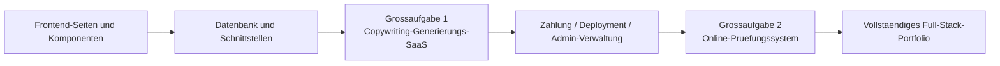

# Junior- und Mittelstufen-Entwicklung

Willkommen in der Phase **Junior- und Mittelstufen-Entwicklung**! Hier wirst du dich tief mit der Full-Stack-Entwicklung beschaeftigen, Frontend-Komponentisierung, Datenbankdesign, Backend-API-Entwicklung und Deployment beherrschen.

## Was du lernen wirst

### Frontend-Entwicklung

Beherrsche moderne Frontend-Entwicklung und lerne die Verwendung von Komponentenbibliotheken und Designtools:

<NavGrid>
  <NavCard
    href="/de-de/stage-2/frontend/lovart-assets/"
    title="Von Lovart ausgehend: deinen eigenen Asset-Produktions-Agenten aufbauen"
    description="Von Grund auf Nanobanana und Lovart nutzen, um hochwertige Design-Assets im Batch zu generieren, und einen Zeichen-Agenten mit Intent-Erkennung erstellen"
  />
  <NavCard
    href="/de-de/stage-2/frontend/figma-mastergo/"
    title="Einfuehrung in Figma und MasterGo"
    description="Die Grundoperationen professioneller UI-Designtools beherrschen und den Workflow vom Design zum Code"
  />
  <NavCard
    href="/de-de/stage-2/frontend/ui-design/"
    title="Deine erste moderne App erstellen - UI-Design"
    description="Die Grundlagen des UI-Designs fuer moderne Anwendungen lernen"
  />
  <NavCard
    href="/de-de/stage-2/frontend/multi-product-ui/"
    title="Seiten und Buttons nach UI-Designrichtlinien entwerfen"
    description="Die fuehrenden UI-Designrichtlinien kennenlernen, um klares Seiten- und Button-Hierarchie-Design zu lernen"
  />
  <NavCard
    href="/de-de/stage-2/frontend/llm-skills-beautiful/"
    title="Oberflaechen mit LLM und Skills schoen gestalten"
    description="Mit Prompts und Plugins in der Praxis schoene und einzigartige Oberflaechen durch KI generieren"
  />
  <NavCard
    href="/de-de/stage-2/frontend/hogwarts-portraits/"
    title="Gemeinsam Hogwarts-Portraets erstellen"
    description="Praxisprojekt: KI-generierte Bilder nutzen und eine interaktive Hogwarts-Portraet-Anwendung erstellen"
  />
  <NavCard
    href="/de-de/stage-2/frontend/design-to-code/"
    title="Vom Design-Prototyp zum Projektcode"
    description="Lernen, wie Prototypen aus Designtools in echten Frontend-Code umgewandelt werden, der im Browser laeuft"
  />
  <NavCard
    href="/de-de/stage-2/frontend/modern-component-library/"
    title="Deine Oberflaeche mit einer modernen Komponentenbibliothek aktualisieren"
    description="Lernen, Komponentenbibliotheken zu nutzen, um schnell professionelle Oberflaechen zu erstellen"
  />
</NavGrid>

### Backend-Entwicklung

API-Design, Datenbankverwaltung und Anwendungs-Deployment-Strategien lernen:

<NavGrid>
  <NavCard
    href="/de-de/stage-2/backend/git-workflow/"
    title="Git und GitHub verwenden lernen"
    description="Die Kernoperationen und Kollaborations-Workflows des Git-Versionskontrollsystems beherrschen"
  />
  <NavCard
    href="/de-de/stage-2/backend/database-supabase/"
    title="Von der Datenbank zu Supabase"
    description="Die Grundlagen relationaler Datenbanken beherrschen und die Verwendung von Supabase als moderne BaaS-Plattform lernen"
  />
  <NavCard
    href="/de-de/stage-2/backend/ai-interface-code/"
    title="Backend-Schnittstellendesign und -entwicklung"
    description="KI-unterstuetzt Backend-Schnittstellencode und standardisierte API-Dokumentation generieren, die Entwicklungseffizenz steigern"
  />
  <NavCard
    href="/de-de/stage-2/backend/zeabur-deployment/"
    title="Deinen Produktprototyp veroeffentlichen"
    description="Lernen, wie man Full-Stack-Anwendungen schnell mit Zeabur in der Cloud bereitstellt"
  />
  <NavCard
    href="/de-de/stage-2/backend/modern-cli/"
    title="Von der IDE zu CLI KI-Programmierwerkzeugen"
    description="Moderne CLI-Tools erkunden, um die Entwicklungserfahrung in Befehlszeilenumgebungen zu verbessern"
  />
  <NavCard
    href="/de-de/stage-2/backend/stripe-payment/"
    title="Wie man Stripe und andere Zahlungssysteme integriert"
    description="Praxis: Stripe-Zahlungsfunktionalitaet in deine Anwendung integrieren und kommerzielle Monetarisierung realisieren"
  />
</NavGrid>

### Grossaufgaben

Die vorherigen Kapitel behandeln die "Bauteile", die Grossaufgaben behandeln das "Zusammenbauen der Bauteile zu einem lauffaehigen, demonstrablen und veroeffentlichbaren Produkt".

Es wird empfohlen, die Reihenfolge **Grossaufgabe 1 -> Grossaufgabe 2** zu befolgen:

- **Grossaufgabe 1** fuehrt dich zuerst durch die haeufigste Hauptkette moderner SaaS: Login, Generierung, Datenbank, Zahlung, Admin-Panel.
- **Grossaufgabe 2** bringt dich dann in Szenarien, die eher Geschaeftssystemen aehneln: Rollenberechtigungen, Fragenbank, Pruefungen, Abgabeprotokolle, Admin-Konsole.

Wenn du nicht weisst, womit du anfangen sollst, kannst du die folgende Vergleichstabelle als Referenz nutzen:

| Projekt | Was du hauptsaechlich ueben wirst | Am besten geeignet fuer | Endabgabe |
|------|------|------|------|
| Grossaufgabe 1: Copywriting-Generierungs-Website | SaaS-Seitenstruktur, Benutzer-Login, KI-Generierung, Stripe-Zahlung, Admin-Panel | Personen, die zum ersten Mal eine vollstaendige kommerzielle Website erstellen | Ein SaaS-Prototyp mit Registrierung, Generierung, Zahlung und Verwaltung |
| Grossaufgabe 2: Online-Pruefungs- und Managementsystem | Rollenberechtigungen, Fragenbank-Modellierung, Pruefungsablauf, Abgabeprotokolle, Korrektur und Statistik | Personen, die ein "Geschaeftssystem" wirklich vervollstaendigen moechten | Eine Pruefungsplattform mit Studenten- und Admin-Ansicht |

Unabhaengig davon, welche Aufgabe du waehlst, wird empfohlen, mindestens diese 3 Abgabeprodukte vorzubereiten:

- Ein lauffaehiges Projekt-Repository
- Ein zugaenglicher Demonstrationslink
- Ein README und ein Demovideo

<NavGrid>
  <NavCard
    href="/de-de/stage-2/assignments/copywriting-platform-supabase/"
    title="Grossaufgabe 1: Erste SaaS Full-Stack-Anwendung - Copywriting-Generierungs-Website"
    description="Von Grund auf einen KI-Marketing-Copywriting-Arbeitsbereich erstellen, einschliesslich Login, Generierung, Zahlung und Admin-Panel"
  />
  <NavCard
    href="/de-de/stage-2/assignments/exam-management-express/"
    title="Grossaufgabe 2: Online-Pruefungs- und Managementsystem"
    description="Ein Online-Pruefungssystem erstellen, das automatische Fragenerstellung, Pruefungsablauf und Admin-Verwaltung unterstuetzt"
  />
</NavGrid>

Wenn du die beiden Hauptprojekte bereits abgeschlossen hast oder dein Portfolio nach deinem eigenen technischen Schwerpunkt erstellen moechtest, kannst du aus den folgenden erweiterten Themen eines fuer eine tiefere Bearbeitung auswaehlen:

<NavGrid>
  <NavCard
    href="/de-de/stage-2/assignments/modern-landing-page/"
    title="Erweiterte Aufgabe: Modernes Web-Landing-Page-Engineering"
    description="Wertausdruck, Konversionspfad, CTA-Design und grundlegendes Tracking ueben und eine Seite erstellen, die wirklich Traffic aufnehmen kann"
  />
  <NavCard
    href="/de-de/stage-2/assignments/custom-dify-agent-platform/"
    title="Erweiterte Aufgabe: Dify-aehnliche Agenten-Orchestrierungsplattform"
    description="Agentenverwaltung, Konversation, Protokolle und Zugriffskontrolle implementieren und eine minimal nutzbare KI-Plattform erstellen"
  />
  <NavCard
    href="/de-de/stage-2/assignments/travel-planning-agent-platform/"
    title="Erweiterte Aufgabe: Intelligente Reiseplanungs-Agent-Orchestrierungsplattform"
    description="Rund um strukturierte Eingabe, Agenten-Orchestrierung und Verwaltung historischer Plaene ein ausfuehrbares KI-Reiseplanungsprodukt erstellen"
  />
  <NavCard
    href="/de-de/stage-2/assignments/movie-recommendation-springboot/"
    title="Erweiterte Aufgabe: Spring Boot Filmempfehlungssystem"
    description="Spring Boot, Bewertungs-/Favoriten- und erklaerbare Empfehlungen kombinieren, um einen vollstaendigen Empfehlungssystem-Prototyp zu erstellen"
  />
  <NavCard
    href="/de-de/stage-2/assignments/simple-grocery-microservices/"
    title="Erweiterte Aufgabe: Lebensmittel-E-Commerce-Microservice-System"
    description="Service-Aufteilung, Gateway-Weiterleitung, Bestands- und Bestellkooperation ueben und den Engineering-Ansatz von Monolith zu Microservices erleben"
  />
  <NavCard
    href="/de-de/stage-2/assignments/traffic-data-visualization-go/"
    title="Erweiterte Aufgabe: Go Verkehrsdaten-Analyse- und Visualisierungsplattform"
    description="Von der Datenaufnahme ueber Fensteraggregation bis hin zum Trend-Dashboard und Alarmen einen vollstaendigen Datenprodukt-Prototyp erstellen"
  />
</NavGrid>

### KI-Faehigkeitserweiterung

<NavGrid>
  <NavCard
    href="/de-de/stage-2/ai-capabilities/dify-knowledge-base/"
    title="Dify Einfuehrung und Wissensdatenbank-Integration"
    description="Lernen, wie man KI-Anwendungen mit Dify erstellt und private Wissensdatenbanken integriert"
  />
</NavGrid>

## Fuer wen ist dies geeignet

- Entwickler mit gewisser Programmiergrundlage, die systematisch Full-Stack-Entwicklung lernen moechten
- Lernende, die vom Produktmanager zum Full-Stack-Ingenieur wechseln moechten
- Junior- bis Mittelstufen-Entwickler, die moderne Entwicklungstools und Workflows beherrschen moechten
- Unternehmer, die unabhaengig vollstaendige Produkte entwickeln moechten

## Voraussetzungen

- Abschluss der Phase "Anfaenger und Produktprototyp" oder gleichwertige Grundkenntnisse
    - Verstaendnis grundlegender HTML/CSS/JavaScript-Konzepte
- Grundkenntnisse ueber KI-Programmierungstools

Bereit, dich in die Full-Stack-Entwicklung zu vertiefen? Klicke auf die linke Navigation, um mit dem Lernen zu beginnen!
