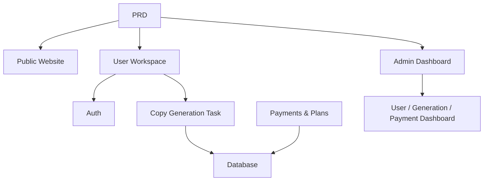

# AI Marketing Copywriting SaaS

## Overview

This project requires you to build an AI marketing copywriting SaaS product for independent developers and content teams, based on a real PRD. You'll use Supabase as the backend service and Stripe for payments, completing the full process from requirements analysis to deployment.

This is the comprehensive practical section of Stage 2. In previous chapters, you've learned individual skills — frontend pages, backend APIs, databases, and payment integration. This project ties them all together into a runnable product prototype.

## Prerequisites

Before starting this project, you should already be familiar with:

- Frontend page design and component libraries ([UI Design](../../frontend/ui-design/), [Modern Component Libraries](../../frontend/modern-component-library/))
- Backend API design and development ([API Code](../../backend/ai-interface-code/))
- Database fundamentals and Supabase ([Database to Supabase](../../backend/database-supabase/))
- Payment integration ([Stripe Payment System](../../backend/stripe-payment/))
- Git workflow and deployment ([Git & GitHub](../../backend/git-workflow/), [Web App Deployment](../../backend/zeabur-deployment/))

## Learning Objectives

After completing this project, you will be able to:

1. Read and understand a real PRD, extracting a development task list
2. Use AI assistance to incrementally generate frontend pages and backend APIs
3. Implement user authentication and database operations with Supabase
4. Integrate Stripe for paid subscription functionality
5. Build an admin dashboard and complete end-to-end integration

## Project Overview

You will build an AI marketing copywriting SaaS with three subsystems:

| Subsystem | Responsibility |
|-----------|---------------|
| **Public Website** | Product intro, pricing, FAQ, registration conversion |
| **User Workspace** | Enter product info, generate copywriting, view history, upgrade plan |
| **Admin Dashboard** | User management, generation records, payment data, operations overview |

The backend uses Supabase for database and authentication, Stripe for payment processing, and AI models for generating marketing copy.

::: tip PRD
The requirements document for this project is on GitHub: [View PRD](https://github.com/datawhalechina/easy-vibe/blob/main/docs/en/stage-2/assignments/copywriting-platform-supabase/PRD.md)
:::

<div style="margin: 32px 0;">
  <ClientOnly>
    <StepBar :active="0" :items="[
      { title: 'Requirements', description: 'Read PRD, define pages, features, auth, and payment scope' },
      { title: 'Scaffold', description: 'Use AI to generate three frontend skeletons (www / app / admin)' },
      { title: 'Backend', description: 'Supabase auth, generation API, Stripe payments' },
      { title: 'Launch', description: 'End-to-end testing, deploy, and prepare demo' }
    ]" />
  </ClientOnly>
</div>

## Part 1: Requirements Analysis

### 1.1 Read the PRD

Open the PRD document and answer these key questions:

- How many entry points does the system have? Which pages does each cover?
- What is the core functionality of each page?
- What modules and data tables does the backend include?
- How should plan pricing, payment flow, and free tier be designed?
- What is the MVP scope? What goes in the first version and what doesn't?

::: warning
If the above questions don't have clear answers, don't start coding. Unclear requirements are the most common cause of rework.
:::

### 1.2 Confirm System Architecture

Map out the overall architecture based on the PRD:



## Part 2: Project Scaffolding

### 2.1 Generate Frontend Pages

Use AI to generate the basic structure and mock data for all pages.

Prompt reference:

```text
Based on the current PRD, help me generate a frontend scaffold for an AI marketing copywriting SaaS.

Requirements:
1. Three entry points: www, app, admin
2. www: homepage, pricing, FAQ
3. app: login, register, generation workspace, history, plans page
4. admin: dashboard homepage, user management, generation records, payment orders
5. Only generate page structure with mock data, no real API integration
6. Style should look like a modern SaaS, not a classroom demo
```

### 2.2 Refine the Core Page

After the scaffold is ready, focus on refining the copywriting generation workspace (Dashboard) page:

```text
Continue refining the /dashboard page.

This is an AI marketing copywriting workspace.

Left side form fields:
- Product name
- One-line description
- Target audience
- 3 selling points
- Distribution channels (website, WeChat Moments, Xiaohongshu, Douyin, email)

Right side result area:
- Main headline
- Subheadline
- CTA
- 3 versions of short copy
- Long-form copy

Use mock data for interactions first.

Requirements:
- Loading state after clicking "Generate Copy"
- Empty state for result area
- Responsive layout, works on both wide and narrow screens
```

### 2.3 Verify Page Structure

Check each item:

- [ ] Three entry point routes are independent
- [ ] Page count matches the PRD
- [ ] Dashboard form and result area layout is reasonable
- [ ] Mock data shows basic UI states

### Stuck?

If you get stuck during frontend scaffolding, review these chapters:

- [UI Design](../../frontend/ui-design/)
- [Multi-Product UI Design](../../frontend/multi-product-ui/)
- [LLM & Skills Interface Beautification](../../frontend/llm-skills-beautiful/)
- [Design Prototype to Project Code](../../frontend/design-to-code/)
- [Modern Component Libraries](../../frontend/modern-component-library/)

## Part 3: Backend Integration

### 3.1 Connect Supabase Login

```text
Treat me as a beginner and guide me step by step through Supabase login integration.

Help me complete:
1. Connect the project to Supabase
2. Implement registration, login, and logout
3. Redirect to /dashboard after successful login
4. Redirect unauthenticated users to /login when accessing /dashboard, /billing, /admin
5. Create a profiles table
6. Automatically create a record in profiles table after user registration
7. profiles table includes email, role, and plan fields

Requirements:
- Explain which files are being modified at each step
- Don't hardcode API keys
- Clearly mark any steps that require manual actions in the Supabase dashboard
- Explain how to verify registration and login after completion
```

### 3.2 Connect Generation API and Database

```text
Treat me as a beginner and help me implement the core feature: generating marketing copy and saving it.

Target behavior:
1. User fills out the form on /dashboard and clicks "Generate Copy"
2. Backend receives: product name, description, target audience, selling points, distribution channels
3. Backend calls the model to generate results
4. Page displays the generated results
5. Both input and output are saved to the database
6. User can view history on next visit

Help me complete:
- Create generation API /api/generate
- Create generations table
- Design input and output fields
- Dashboard page reads current user's history

User experience:
- Button loading state
- Error message on generation failure
- Empty state when no history exists

After completion, explain:
- Frontend page file locations
- Backend API file locations
- Where database write logic lives
- How to test the complete generation pipeline
```

### 3.3 Connect Stripe Payments

```text
Treat me as a beginner and help me add the simplest viable Stripe payment to the project.

No complex system needed — just get the basic payment flow working.

Help me complete:
1. /billing page shows free and pro plans
2. User clicks upgrade → redirects to Stripe Checkout
3. After successful payment, returns to the site
4. Payment result saved to subscriptions table
5. Sync update to profile.plan field
6. Free users limited to 3 generations per day, pro users unlimited

Implementation principles:
- Get the main flow working first, don't worry about complex edge cases
- Clearly document what needs to be configured in Stripe dashboard
- Explain how to test the complete payment flow after completion
```

### 3.4 Build Admin Dashboard

```text
Treat me as a beginner and help me build a clean, functional admin dashboard.

Admin-only access.

Help me complete:
1. Only users with role = admin can access /admin
2. Dashboard has 3 tabs: User List, Generation Records, Subscription Status
3. User List shows: email, plan, creation date
4. Generation Records shows: user, product name, channel, creation date
5. Subscription Status shows: user, plan, payment status

Requirements:
- Clean, clear interface
- Use existing component library's table, tab, and badge components
- Explain how to set an account as admin after completion
```

### Stuck?

If you get stuck during backend development, review these chapters:

- [Database to Supabase](../../backend/database-supabase/)
- [API Code with LLM Assistance](../../backend/ai-interface-code/)
- [Stripe Payment Integration](../../backend/stripe-payment/)

## Part 4: Integration & Launch

### 4.1 End-to-End Testing

At minimum, verify these scenarios:

- Register → Login → Generate copy → View history → Upgrade plan
- Admin login → View user data → View generation records → View payment status

Pre-deployment check:

```text
Treat me as a beginner and help me check if the project is ready for deployment.

Check focus:
- Are environment variables complete?
- Is the login callback URL correct?
- Is the Stripe payment callback URL correct?
- Are there missing loading, empty, or error states on any pages?
- Does the README include setup and deployment instructions?

Help me:
1. List items to fix, prioritized
2. Mark which ones must be fixed first
3. Explain deployment steps after fixes
```

### 4.2 Deployment

Deploy the project to a public environment. For deployment instructions, see: [Git & GitHub Workflow](../../backend/git-workflow/), [Web App Deployment](../../backend/zeabur-deployment/).

## Deliverables

After completing this project, submit the following:

- [ ] Accessible live demo link
- [ ] Source code repository link (with README)
- [ ] PRD document
- [ ] Core page screenshots (homepage, Dashboard, Billing, Admin)
- [ ] 60-second demo video (covering register → generate → pay → admin)

README should include at minimum: project overview, core page descriptions, tech stack, local setup steps, and environment variable list.

## Grading Criteria

| Dimension | Basic Requirements | Advanced Requirements |
|------------|-------------------|----------------------|
| Product Completeness | Homepage, login, Dashboard, Billing, Admin are all accessible | Homepage copy and visual style look like a real SaaS |
| Business Loop | Register → Login → Generate → View history works end-to-end | Free/Pro permission differences are clearly visible |
| Data Correctness | Generation results and payment status are saved to database | Has clear error messages, empty states, and loading states |
| Auth & Security | Unauthenticated users can't access protected pages; regular users can't access Admin | Has basic input validation and server-side auth |
| Engineering Delivery | Project runs locally and can be deployed publicly | README is clear, demo video is well-structured |

::: tip
If the task feels too large, remember this principle: **Get it working first, then make it pretty.**
:::

## Pre-Submission Checklist

<el-card shadow="hover" style="margin: 20px 0; border-radius: 12px;">
  <template #header>
    <div style="font-weight: bold; font-size: 16px;">Final check before submission</div>
  </template>

  <ul style="list-style-type: none; padding-left: 0;">
    <li><label><input type="checkbox" disabled /> Homepage, login, Dashboard, Billing, and Admin pages are complete</label></li>
    <li><label><input type="checkbox" disabled /> Users can register, login, and logout</label></li>
    <li><label><input type="checkbox" disabled /> Generation results are actually saved to the database</label></li>
    <li><label><input type="checkbox" disabled /> Payment main flow is working</label></li>
    <li><label><input type="checkbox" disabled /> Admin can view users, generation records, and payment status</label></li>
    <li><label><input type="checkbox" disabled /> Project is deployed to the public internet</label></li>
  </ul>
</el-card>

## References

- [UI Design](../../frontend/ui-design/)
- [Multi-Product UI Design](../../frontend/multi-product-ui/)
- [LLM & Skills Interface Beautification](../../frontend/llm-skills-beautiful/)
- [Design Prototype to Project Code](../../frontend/design-to-code/)
- [Modern Component Libraries](../../frontend/modern-component-library/)
- [Database to Supabase](../../backend/database-supabase/)
- [API Code with LLM Assistance](../../backend/ai-interface-code/)
- [Git & GitHub Workflow](../../backend/git-workflow/)
- [Web App Deployment](../../backend/zeabur-deployment/)
- [Stripe Payment Integration](../../backend/stripe-payment/)
