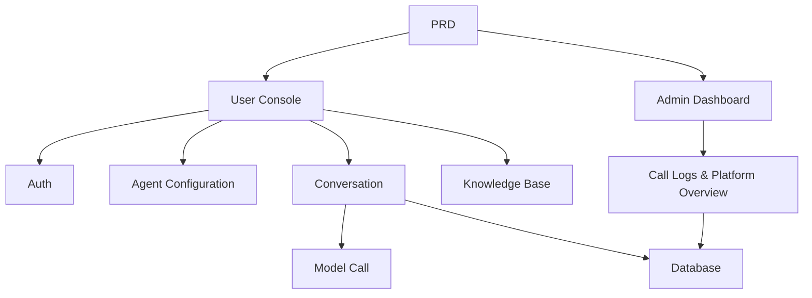

# Custom Dify Agent Platform

## Overview

This project requires you to build an agent platform that replicates the core Dify experience, based on a real PRD. You'll build a user console, admin dashboard, and platform backend, implementing core features like agent management, conversations, logging, and knowledge base.

This is the comprehensive practical section of Stage 2. Unlike previous single-page or single-feature projects, this one requires building a "platform-like" AI product — with multiple roles, multiple modules, data persistence, and model call pipelines.

## Prerequisites

Before starting this project, you should already be familiar with:

- Frontend page design and component libraries ([UI Design](../../frontend/ui-design/), [Modern Component Libraries](../../frontend/modern-component-library/))
- Backend API design and development ([API Code](../../backend/ai-interface-code/))
- Database fundamentals and Supabase ([Database to Supabase](../../backend/database-supabase/))
- Git workflow and deployment ([Git & GitHub](../../backend/git-workflow/), [Web App Deployment](../../backend/zeabur-deployment/))

## Learning Objectives

After completing this project, you will be able to:

1. Read and understand a real PRD, extracting a development task list
2. Design the page architecture and data models for an agent platform
3. Implement the full pipeline for agent creation, conversation, and logging
4. Use AI assistance to build a platform-type product
5. Complete end-to-end integration and deliver a demo-ready AI platform prototype

## Project Overview

You will build a Dify-like agent platform with two subsystems:

| Subsystem | Responsibility |
|-----------|---------------|
| **User Console** | Create agents, configure prompts, start conversations, view logs, manage knowledge base |
| **Admin Dashboard** | View user data, platform resource usage, API call statistics |

The backend needs to support: agent management, session management, message storage, model calls, call logging, and knowledge base integration.

::: tip PRD
The requirements document for this project is on GitHub: [View PRD](https://github.com/datawhalechina/easy-vibe/blob/main/docs/en/stage-2/assignments/custom-dify-agent-platform/PRD.md)
:::

<div style="margin: 32px 0;">
  <ClientOnly>
    <StepBar :active="0" :items="[
      { title: 'Requirements', description: 'Read PRD, define pages, capability scope, auth, and data models' },
      { title: 'Scaffold', description: 'Use AI to generate user console and admin dashboard skeletons' },
      { title: 'Iterate', description: 'Add agents, conversations, logs, and knowledge base module by module' },
      { title: 'Launch', description: 'End-to-end testing, deploy, and prepare demo' }
    ]" />
  </ClientOnly>
</div>

## Part 1: Requirements Analysis

### 1.1 Read the PRD

Open the PRD document and answer these key questions:

- Which of agents, sessions, logs, and knowledge base should go into the MVP?
- Is the page and route list finalized?
- What are the boundaries of model calls and log recording?
- Should multi-tenancy and complex workflows be deferred?

::: warning
If the above questions don't have clear answers, don't start coding. Unclear requirements are the most common cause of rework.
:::

### 1.2 Confirm System Architecture

Map out the overall architecture based on the PRD:



## Part 2: Project Scaffolding

### 2.1 Generate Frontend Pages

Prompt reference:

```text
Based on the current PRD, help me generate a frontend scaffold for a Dify-like agent platform.

Requirements:
1. User side: login, agent list, agent configuration, conversation page, logs page, knowledge base page
2. Admin side: dashboard homepage, user overview, resource usage overview
3. Only generate page structure with mock data first, no real API integration
4. Style should look like a modern AI platform
```

### 2.2 Verify Page Structure

Check each item:

- [ ] User console and admin dashboard entry points are separate
- [ ] Agent list, configuration, conversation, logs, and knowledge base pages are complete
- [ ] Admin dashboard homepage and user overview pages are accessible
- [ ] Mock data shows basic UI states

## Part 3: Iterative Development

### 3.1 Module-by-Module Progress

On top of the scaffold, add features module by module in this order:

1. **Authentication**: Registration, login, role differentiation
2. **Agent Management**: Create, edit, delete, prompt configuration
3. **Conversation**: Session creation, message exchange, model calls
4. **Logging**: Latency, token usage, error recording
5. **Knowledge Base** (bonus): Document upload, retrieval, result injection
6. **Admin Dashboard**: User data, resource usage, call statistics

After each module, use this self-check table:

| Check Item | Verification Method |
|------------|---------------------|
| Page consistency | Do page count and features match the PRD? |
| API completeness | Are agents, chat, logs, knowledge APIs complete? |
| Auth isolation | Can users only manage their own agents and sessions? |
| Data consistency | Do messages, logs, and documents data align? |
| Demo readiness | Can you demo "create agent → chat → view logs" end-to-end? |

### 3.2 Knowledge Base Integration (Bonus)

If you want to add knowledge base capabilities, add a "knowledge base toggle" for each agent:

- When enabled: retrieve knowledge snippets first, then send them along with the user's question to the model
- When disabled: respond in normal conversation mode

For the first version, don't aim for complex RAG — just ensure "retrieval results are visible and the call chain is explainable."

## Part 4: Integration & Launch

### 4.1 End-to-End Testing

At minimum, verify these scenarios:

- Register → Create agent → Configure prompt → Start conversation → View logs
- Admin login → View user data → View call statistics

Pre-deployment checklist:

- [ ] All core APIs require login verification
- [ ] Agent ownership permission checks pass
- [ ] Conversation and log records are persisted to the database
- [ ] Model API keys use environment variables, not hardcoded
- [ ] Error messages are visible on the frontend, not just in the console

### 4.2 Deployment

Deploy the project to a public environment. For deployment instructions, see: [Git & GitHub Workflow](../../backend/git-workflow/), [Web App Deployment](../../backend/zeabur-deployment/).

## Deliverables

After completing this project, submit the following:

- [ ] Accessible live demo link
- [ ] Source code repository link (with README)
- [ ] PRD document
- [ ] Core page screenshots (agent management, conversation, logs, admin dashboard)
- [ ] 60-second demo video (covering create agent → chat → view logs)

README should include at minimum: project overview, architecture description, tech stack, local setup steps, environment variable list, and API documentation.

## Grading Criteria

| Dimension | Basic Requirements | Advanced Requirements |
|------------|-------------------|----------------------|
| Platform Completeness | agents / chat / logs pages are functional | Has clear navigation and unified design language |
| Business Loop | Can create agents and have real conversations | Supports multi-agent switching and session history |
| Data & Tracking | Messages and call logs are queryable | Has token / latency statistics dashboard |
| Auth & Security | Only logged-in users can access core APIs | Resource ownership verification is robust |
| Engineering Delivery | Deployable, demoable, clear README | Knowledge base integrated with explainable retrieval |

## Pre-Submission Checklist

<el-card shadow="hover" style="margin: 20px 0; border-radius: 12px;">
  <template #header>
    <div style="font-weight: bold; font-size: 16px;">Final check before submission</div>
  </template>

  <ul style="list-style-type: none; padding-left: 0;">
    <li><label><input type="checkbox" disabled /> Agent management, conversation, and logs pages accessible after login</label></li>
    <li><label><input type="checkbox" disabled /> At least 1 agent can be created and successfully conversed with</label></li>
    <li><label><input type="checkbox" disabled /> Each Q&A round can be found in the database</label></li>
    <li><label><input type="checkbox" disabled /> Call failures show error messages on the frontend and are logged</label></li>
    <li><label><input type="checkbox" disabled /> Project is deployed, README and demo video are complete</label></li>
  </ul>
</el-card>

## References

- [UI Design](../../frontend/ui-design/)
- [Modern Component Libraries](../../frontend/modern-component-library/)
- [Database to Supabase](../../backend/database-supabase/)
- [API Code with LLM Assistance](../../backend/ai-interface-code/)
- [Git & GitHub Workflow](../../backend/git-workflow/)
- [Web App Deployment](../../backend/zeabur-deployment/)
