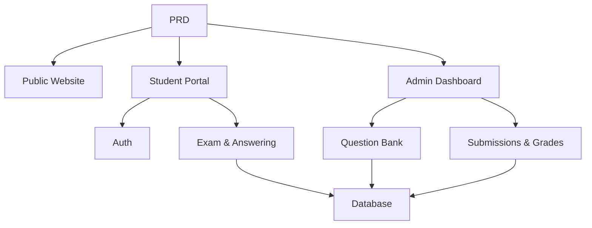

# Online Exam & Management System

## Overview

This project requires you to build an online exam and management system from scratch, based on a real PRD. What makes this project special is its multi-role design — students and admins see different pages and can perform different actions. You'll use Express to build the backend, implementing the complete exam business pipeline.

This is the comprehensive practical section of Stage 2. Multi-role permission systems are very common in real-world applications. Once you master this pattern, you'll be able to handle education, SaaS, and admin management scenarios of all kinds.

## Prerequisites

Before starting this project, you should already be familiar with:

- Frontend page design and component libraries ([UI Design](../../frontend/ui-design/), [Modern Component Libraries](../../frontend/modern-component-library/))
- Backend API design and development ([API Code](../../backend/ai-interface-code/))
- Database fundamentals and Supabase ([Database to Supabase](../../backend/database-supabase/))
- Git workflow and deployment ([Git & GitHub](../../backend/git-workflow/), [Web App Deployment](../../backend/zeabur-deployment/))

## Learning Objectives

After completing this project, you will be able to:

1. Read and understand a real PRD, extracting a development task list
2. Design permission control and page routing for multi-role systems
3. Build a complete backend API using Express
4. Implement the exam, submission, and auto-grading business pipeline
5. Complete end-to-end integration and deliver a demo-ready business system prototype

## Project Overview

You will build an online exam and management system with three subsystems:

| Subsystem | Responsibility |
|-----------|---------------|
| **Public Website** | Platform introduction, login entry |
| **Student Portal** | Exam list, taking exams, submission, grade viewing |
| **Admin Dashboard** | Question bank management, exam management, submission records, grade statistics |

The backend uses Express and needs to support: login auth, role permissions, exam and question bank management, submission flow with auto-grading, and grade/statistics management.

::: tip PRD
The requirements document for this project is on GitHub: [View PRD](https://github.com/datawhalechina/easy-vibe/blob/main/docs/en/stage-2/assignments/exam-management-express/PRD.md)
:::

<div style="margin: 32px 0;">
  <ClientOnly>
    <StepBar :active="0" :items="[
      { title: 'Requirements', description: 'Read PRD, define roles, pages, exam flow, and data models' },
      { title: 'Scaffold', description: 'Use AI to generate student and admin page skeletons' },
      { title: 'Backend', description: 'Connect login, exams, submission, and grading with Express' },
      { title: 'Launch', description: 'End-to-end testing, deploy, and prepare demo' }
    ]" />
  </ClientOnly>
</div>

## Part 1: Requirements Analysis

### 1.1 Read the PRD

Open the PRD document and answer these key questions:

- How many roles does the system have? What can each role do?
- Is the page list complete? What pages do the student portal and admin dashboard each have?
- What question types are supported? What is the grading logic for each type?
- What is the complete exam flow? (Publish → Start → Answer → Submit → Grade → View results)

::: warning
If the above questions don't have clear answers, don't start coding. Unclear requirements are the most common cause of rework.
:::

### 1.2 Confirm System Architecture

Map out the overall architecture based on the PRD:



## Part 2: Project Scaffolding

### 2.1 Generate Frontend Pages

Prompt reference:

```text
Based on the current PRD, help me generate a frontend scaffold for an online exam and management system.

Tech stack:
- Next.js App Router
- TypeScript
- Tailwind CSS
- shadcn/ui

Page list:
1. Homepage /
2. Login page /login
3. Student exam list /student/exams
4. Student exam taking /student/exams/[id]
5. Student grades /student/history
6. Admin dashboard /admin
7. Exam management /admin/exams
8. Question bank /admin/questions
9. Submission records /admin/submissions

Requirements:
- Student pages should be clean, focused, and easy to answer questions on
- Admin pages should use sidebar + top bar layout
- Use mock data first, no real API integration
- Ensure basic usability on both desktop and mobile
```

### 2.2 Refine the Student Exam Page

The exam-taking page is the core of the student portal. Focus on refining it:

```text
Continue refining the student exam-taking page.

This is an exam-taking page for an online exam system, it should include:
- Top bar: exam title, countdown timer, number of answered questions
- Main area: question stem and options
- Support three question types: single choice, true/false, short answer
- Answer card on the left or top showing which questions have been answered
- Confirmation dialog before submission

Use mock data for interactions first, no real API.

Requirements:
- Clean interface, shouldn't look like a backend table page
- Countdown should be prominent but not overly stressful
- Include empty states and loading states
```

### 2.3 Refine the Admin Dashboard

The first version of the admin dashboard focuses on three core areas:

- **Exam Management**: Create exams, set duration, manage publish status
- **Question Bank**: Add questions, edit questions, filter by type
- **Submission Records**: View student submissions, scores, timestamps

### 2.4 Verify Page Structure

Check each item:

- [ ] Student and admin entry points are separate
- [ ] Login, exam list, exam-taking, and grades pages are complete
- [ ] Admin question bank, exam management, and submission records pages are accessible
- [ ] Student and admin page styles are clearly differentiated

### Stuck?

If you get stuck during frontend scaffolding, review these chapters:

- [Database to Supabase](../../backend/database-supabase/)
- [Backend API Design & Development](../../backend/ai-interface-code/)
- [Modern Component Libraries](../../frontend/modern-component-library/)

## Part 3: Backend Development

### 3.1 Login & Permission Control

```text
Treat me as a beginner and help me implement login and permission control for the online exam system.

Backend: Express.

Goals:
1. Both students and admins can log in
2. Login returns the user's role
3. Students can only access /student/* APIs
4. Admins can only access /admin/* APIs
5. Unauthenticated users accessing protected pages redirect to /login

Requirements:
- Suggest a clear directory structure
- Explain what the middleware is responsible for
- Don't hardcode environment variables
- Explain how to verify permissions work after implementation
```

### 3.2 Exam & Question Bank APIs

Recommended implementation by module:

| Module | Suggested APIs |
|--------|---------------|
| Exam Management | `GET /api/exams`, `POST /api/admin/exams`, `PATCH /api/admin/exams/:id` |
| Question Bank | `GET /api/admin/questions`, `POST /api/admin/questions` |
| Start Exam | `POST /api/submissions/start` |
| Submit Exam | `POST /api/submissions/:id/submit` |
| Grade Records | `GET /api/student/history`, `GET /api/admin/submissions` |

Prompt reference:

```text
Help me design and implement Express APIs for the online exam system.

Scope:
- Admin creates exams
- Admin manages question bank
- Students view published exams
- Students start exam and create submission
- Student submissions auto-grade multiple choice and true/false
- Short answer questions marked as pending review
- Students view their grade history
- Admins view all submission records

Requirements:
- Clear API naming
- Unified JSON response structure
- Separate code into controller, service, middleware, and db layers
- Explain how to test each API
```

### 3.3 Grading Logic

Grading logic is the core business rule of the exam system:

- **Multiple Choice**: Score if the user's answer matches the correct answer
- **True/False**: Can also be auto-graded
- **Short Answer**: First version just saves the answer, score is null, status is `reviewed = false`

::: tip Bonus
If you want to add AI capabilities, you could let admins enter "topic + difficulty" and have the model generate candidate questions for manual review before adding to the bank. But this is a bonus, not required.
:::

## Part 4: Integration & Launch

### 4.1 End-to-End Testing

At minimum, verify these scenarios:

- Student login → View exam list → Start exam → Submit → View grades
- Admin login → Create exam → Add questions → Publish → View submission records

### 4.2 Deployment

- Frontend: Deploy to Vercel / Zeabur
- Express API: Deploy to Zeabur / Railway / Render
- Database: Use Supabase Postgres or managed PostgreSQL

Pre-deployment checklist:

- [ ] Environment variables are complete
- [ ] Frontend and backend API URLs are correct
- [ ] Login state works in production
- [ ] Admin account can actually access the dashboard
- [ ] README includes setup, deployment, and testing instructions

## Deliverables

After completing this project, submit the following:

- [ ] Accessible live demo link
- [ ] Source code repository link (with README)
- [ ] PRD document
- [ ] Core page screenshots (homepage, student exam list, exam-taking page, admin dashboard)
- [ ] 60-second demo video (covering student exam flow and admin management flow)

README should include at minimum: project overview, core page descriptions, tech stack, local setup steps, and environment variable list.

## Grading Criteria

| Dimension | Basic Requirements | Advanced Requirements |
|------------|-------------------|----------------------|
| Page Completeness | Student and admin main pages are accessible | Unified page style, basic mobile responsiveness |
| Business Loop | Students can login, take exams, submit, and view grades | Admins can fully create and publish exams |
| Data Correctness | Submitted answers are saved to database, objective questions auto-graded | Short answers support manual review or AI assistance |
| Permission Control | Student and admin access boundaries are clear | Server-side APIs also have role verification |
| Engineering Delivery | Project runs and is deployable, README is clear | Has demo video and testing instructions |

## Pre-Submission Checklist

<el-card shadow="hover" style="margin: 20px 0; border-radius: 12px;">
  <template #header>
    <div style="font-weight: bold; font-size: 16px;">Final check before submission</div>
  </template>

  <ul style="list-style-type: none; padding-left: 0;">
    <li><label><input type="checkbox" disabled /> Homepage, login, student portal, and admin dashboard pages are complete</label></li>
    <li><label><input type="checkbox" disabled /> Students can start exams and submit answers normally</label></li>
    <li><label><input type="checkbox" disabled /> Admins can create exams and view submission records</label></li>
    <li><label><input type="checkbox" disabled /> Objective question scores are auto-calculated and saved to database</label></li>
    <li><label><input type="checkbox" disabled /> Student and admin permission boundaries are verified</label></li>
    <li><label><input type="checkbox" disabled /> Project is deployed or has complete local setup instructions</label></li>
  </ul>
</el-card>

## References

- [UI Design](../../frontend/ui-design/)
- [Modern Component Libraries](../../frontend/modern-component-library/)
- [Database to Supabase](../../backend/database-supabase/)
- [API Code with LLM Assistance](../../backend/ai-interface-code/)
- [Git & GitHub Workflow](../../backend/git-workflow/)
- [Web App Deployment](../../backend/zeabur-deployment/)
