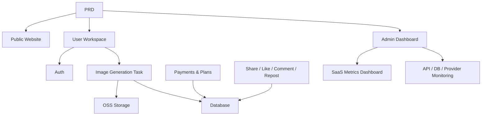

# Modern AI Image Generation SaaS

## Overview

This project requires you to build a Midjourney-inspired AI image generation SaaS product from scratch, based on a real PRD. You'll go through the full process: requirements analysis, project breakdown, iterative development, and integration testing.

This is the comprehensive practical section of Stage 2. In previous chapters, you've learned individual skills — frontend design, backend APIs, databases, payment integration. This project ties them all together into a runnable product prototype.

## Prerequisites

Before starting this project, you should already be familiar with:

- Frontend page design and component libraries ([UI Design](../../frontend/ui-design/), [Modern Component Libraries](../../frontend/modern-component-library/))
- Backend API design and development ([API Code](../../backend/ai-interface-code/))
- Database fundamentals and Supabase ([Database to Supabase](../../backend/database-supabase/))
- Payment integration ([Stripe Payment System](../../backend/stripe-payment/))
- Git workflow and deployment ([Git & GitHub](../../backend/git-workflow/), [Web App Deployment](../../backend/zeabur-deployment/))

## Learning Objectives

After completing this project, you will be able to:

1. Read and understand a real PRD, extracting a development task list
2. Break down modules based on the PRD and create a step-by-step plan
3. Use AI assistance to build frontend scaffolds and backend APIs
4. Verify and iterate on each module
5. Complete end-to-end integration, taking the project from "runs locally" to "deliverable"

## Project Overview

You will build a modern AI image generation SaaS platform with three subsystems:

| Subsystem | Responsibility |
|-----------|---------------|
| **Public Website** | Product intro, pricing, FAQ, registration conversion |
| **User Workspace** | Prompt input, image generation, gallery, credits, plans, community interaction |
| **Admin Dashboard** | User management, task management, payment management, content moderation, SaaS metrics, system monitoring |

The backend needs to support: user auth, image generation tasks, OSS object storage, credits and plan payments, image social interaction, and operations data monitoring.

::: tip PRD
The requirements document for this project is on GitHub: [View PRD](https://github.com/datawhalechina/easy-vibe/blob/main/docs/en/stage-2/assignments/modern-landing-page/PRD.md)
:::

<div style="margin: 32px 0;">
  <ClientOnly>
    <StepBar :active="0" :items="[
      { title: 'Requirements', description: 'Read PRD, extract pages, modules, data models, and scope' },
      { title: 'Scaffold', description: 'Use AI to generate three frontend skeletons (www / app / admin)' },
      { title: 'Iterate', description: 'Add APIs, auth, payments, monitoring module by module' },
      { title: 'Launch', description: 'End-to-end testing, deploy, and prepare demo' }
    ]" />
  </ClientOnly>
</div>

## Part 1: Requirements Analysis

### 1.1 Read the PRD

Open the PRD document and answer these key questions:

- How many entry points does the system have? Which pages does each cover?
- What is the core functionality of each page?
- What modules and database tables does the backend include?
- What is the MVP scope? What goes in the first version and what doesn't?

::: warning
If the above questions don't have clear answers, don't start coding. Unclear requirements are the most common cause of rework.
:::

### 1.2 Confirm System Architecture

Map out the overall architecture based on the PRD:



We recommend drawing the architecture diagram in your own words to confirm your understanding is complete.

## Part 2: Project Scaffolding

### 2.1 Generate Frontend Pages

Use AI to generate the basic structure and mock data for all pages. The goal here is to set up the information architecture and routing — no real API integration yet.

Prompt reference:

```text
Based on the current PRD, help me generate a frontend scaffold for a modern AI image generation SaaS.

Requirements:
1. Three entry points: www, app, admin
2. www: homepage, pricing, FAQ
3. app: login, register, generation workspace, gallery, plans, credits, community, artwork detail, profile
4. admin: dashboard homepage, user management, task management, content management, plan management, payment orders, operations config, SaaS metrics, system monitoring
5. Only generate page structure with mock data, no real API integration
6. Style reference: Midjourney — clean, modern, product-like
```

### 2.2 Verify Page Structure

After generating the scaffold, check each item:

- [ ] Three entry point routes are independent (`/`, `/app`, `/admin`)
- [ ] Page count matches the PRD
- [ ] Each page is accessible and navigable
- [ ] Mock data shows basic UI states (lists, empty states, forms, etc.)

## Part 3: Iterative Development

### 3.1 Module-by-Module Progress

On top of the scaffold, add features module by module in this order:

1. **Authentication**: Registration, login, role differentiation
2. **Database**: Table creation, read/write APIs
3. **Core Business**: Image generation tasks, result storage
4. **OSS Storage**: Image upload and access
5. **Payments**: Plans, credits, Stripe integration
6. **Social Interaction**: Sharing, likes, comments
7. **Admin Dashboard**: User management, task management, content moderation
8. **Data Monitoring**: SaaS metrics dashboard, system monitoring

After each module, use this self-check table:

| Check Item | Verification Method |
|------------|---------------------|
| Page consistency | Do page count, entry points, and features match the PRD? |
| API correctness | Are request params, response structure, and status handling reasonable? |
| Auth isolation | Are regular users and admins properly separated? |
| Data consistency | Do database, OSS, payment, and credits data align? |
| Demo readiness | Can you demo a complete business flow to someone else? |

::: tip
If AI-generated content drifts from the PRD, don't throw away the whole page — just ask it to fix the specific module.
:::

### 3.2 Roles & Responsibilities

During iteration, you need to play three roles simultaneously:

- **Product Manager**: Confirm each module's features match the PRD
- **Tech Lead**: Confirm the implementation approach is reasonable
- **QA Engineer**: Confirm the features actually work

## Part 4: Integration & Launch

### 4.1 End-to-End Testing

The focus at this stage is not adding new pages but running complete business flows. At minimum, verify:

- Register → Buy credits → Generate image → View history → Share and interact
- Admin login → View user data → View task statistics → View system monitoring

### 4.2 Deployment

Deploy the project to a public environment, ensuring:

- Environment variables are fully configured
- Login callback URLs are correct
- Payment callback URLs are correct
- Pages don't have missing loading, empty states, or error messages

For deployment instructions, see: [Git & GitHub Workflow](../../backend/git-workflow/), [Web App Deployment](../../backend/zeabur-deployment/).

## Deliverables

After completing this project, submit the following:

- [ ] Accessible live demo link
- [ ] Source code repository link (with README)
- [ ] PRD document
- [ ] Core page screenshots (homepage, generation workspace, gallery, plans page, admin dashboard)
- [ ] 60-second demo video (covering register → generate → view → admin management)

README should include at minimum: project overview, core page descriptions, tech stack, local setup steps, and environment variable list.

## Grading Criteria

| Dimension | Basic Requirements | Advanced Requirements |
|------------|-------------------|----------------------|
| PRD Alignment | Pages, features, and data structures basically match PRD | Can clearly explain each design decision's PRD correspondence |
| Product Loop | Register → Buy credits → Generate image → View history → Share works end-to-end | Payment status, credit balance, and generation count data are consistent |
| Admin Capability | Users, tasks, payments, and content management are viewable | SaaS metrics dashboard and system monitoring page are fully functional |
| Engineering Completeness | Frontend, backend, database, OSS, payment pipeline connected | Has error handling, empty states, and loading states |
| Delivery Quality | Deployable and runnable | README is clear, demo video is well-structured |

## References

- [UI Design](../../frontend/ui-design/)
- [Multi-Product UI Design](../../frontend/multi-product-ui/)
- [LLM & Skills Interface Beautification](../../frontend/llm-skills-beautiful/)
- [Design Prototype to Project Code](../../frontend/design-to-code/)
- [Modern Component Libraries](../../frontend/modern-component-library/)
- [Database to Supabase](../../backend/database-supabase/)
- [API Code with LLM Assistance](../../backend/ai-interface-code/)
- [Git & GitHub Workflow](../../backend/git-workflow/)
- [Web App Deployment](../../backend/zeabur-deployment/)
- [Stripe Payment Integration](../../backend/stripe-payment/)
