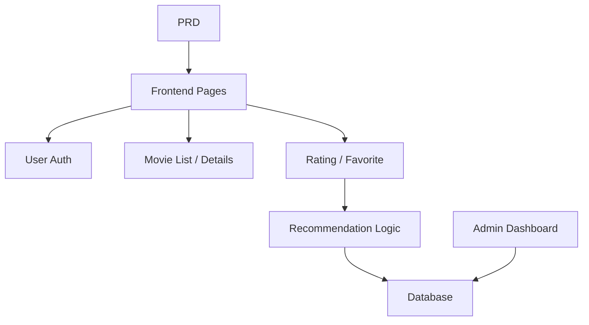

# Spring Boot Movie Recommendation System

## Overview

This project requires you to build a movie website with recommendation capabilities using Spring Boot, based on a real PRD. The core challenge is not simple CRUD — it's thinking about "how user behavior affects recommendations" and "how to make recommendations explainable."

This is the comprehensive practical section of Stage 2. You'll encounter the "content + behavior + recommendation" product development pattern for the first time, which is common in e-commerce, content platforms, and personalized feeds.

## Prerequisites

Before starting this project, you should already be familiar with:

- Frontend page design and component libraries ([UI Design](../../frontend/ui-design/), [Modern Component Libraries](../../frontend/modern-component-library/))
- Backend API design and development ([API Code](../../backend/ai-interface-code/))
- Database fundamentals and Supabase ([Database to Supabase](../../backend/database-supabase/))
- Git workflow and deployment ([Git & GitHub](../../backend/git-workflow/), [Web App Deployment](../../backend/zeabur-deployment/))

## Learning Objectives

After completing this project, you will be able to:

1. Read a PRD and extract a development task list for a recommendation system
2. Set up a Spring Boot project and implement RESTful APIs
3. Design a complete data pipeline from "user behavior → recommendation"
4. Implement explainable recommendation logic
5. Complete end-to-end integration and deliver a demo-ready product prototype

## Project Overview

You will build a movie website with recommendation capabilities:

| Feature | Description |
|---------|-------------|
| **Browse & Search** | Users can browse and search for movies |
| **Ratings & Favorites** | Users can rate and favorite movies |
| **Personalized Recommendations** | The system generates recommendations based on user behavior |
| **Admin Dashboard** | Admins manage movie data and view recommendation performance |

::: tip PRD
The requirements document for this project is on GitHub: [View PRD](https://github.com/datawhalechina/easy-vibe/blob/main/docs/en/stage-2/assignments/movie-recommendation-springboot/PRD.md)
:::

<div style="margin: 32px 0;">
  <ClientOnly>
    <StepBar :active="0" :items="[
      { title: 'Requirements', description: 'Read PRD, define recommendation strategy, behavior data, and admin scope' },
      { title: 'Scaffold', description: 'Use AI to generate list, detail, recommendation, and admin pages' },
      { title: 'Iterate', description: 'Add recommendation logic, behavior tracking, and admin management' },
      { title: 'Launch', description: 'End-to-end testing, deploy, and prepare demo' }
    ]" />
  </ClientOnly>
</div>

## Part 1: Requirements Analysis

### 1.1 Read the PRD

Open the PRD document and answer these key questions:

- What is the recommendation strategy? Should the first version use an explainable approach (e.g., rating-based similarity)?
- What user behavior data should be stored? (ratings, favorites, browsing history, etc.)
- What recommendation performance metrics should admins see?
- Is the page list complete?

::: warning
If the above questions don't have clear answers, don't start coding. Unclear requirements are the most common cause of rework.
:::

### 1.2 Confirm System Architecture



## Part 2: Project Scaffolding

### 2.1 Generate Frontend Pages

Prompt reference:

```text
Based on the current PRD, help me generate a frontend scaffold for a Spring Boot movie recommendation system.

Requirements:
1. Pages: homepage, movie list, movie detail, recommendation page, user profile, admin dashboard
2. Only generate page structure with mock data first, no real API integration
3. Style should look like a real content product, not a classroom demo
```

### 2.2 Verify Page Structure

Check each item:

- [ ] Movie list page supports search and filtering
- [ ] Movie detail page includes rating and favorite buttons
- [ ] Recommendation page shows results with recommendation reasons
- [ ] Admin dashboard displays movie data and recommendation performance

## Part 3: Iterative Development

### 3.1 Module-by-Module Progress

1. **Spring Boot Setup**: Project structure, database configuration, basic CRUD
2. **Movie Data Management**: Movie list, detail, search APIs
3. **User Behavior**: Rating, favorite APIs, behavior data storage
4. **Recommendation Logic**: Implement recommendation algorithm based on user behavior
5. **Recommendation Display**: Show recommendation results with explanations
6. **Admin Dashboard**: Movie data management, recommendation performance review

### 3.2 Module Self-Check

| Check Item | Verification Method |
|------------|---------------------|
| Basic features | Is list, detail, rating, favorite a closed loop? |
| Recommendation linkage | Does user behavior affect recommendation results? |
| Explainability | Can users understand why these movies were recommended? |
| Admin data | Can admins view movie data and recommendation performance? |

## Part 4: Integration & Launch

### 4.1 End-to-End Testing

At minimum, verify these scenarios:

- Browse movies → Rate → Favorite → View recommendation page, confirm results change
- Admin login → Add movie → View recommendation performance stats

## Deliverables

After completing this project, submit the following:

- [ ] Accessible live demo link
- [ ] Source code repository link (with README)
- [ ] PRD document
- [ ] Core page screenshots (movie list, movie detail, recommendation page, admin dashboard)
- [ ] 60-second demo video

## Grading Criteria

| Dimension | Basic Requirements | Advanced Requirements |
|------------|-------------------|----------------------|
| PRD Alignment | Pages, features, and data structures basically match PRD | Can clearly explain design decisions |
| Product Loop | Browse → Rate → Favorite → Recommend works end-to-end | Rating behavior visibly affects recommendations |
| Recommendation Quality | Results are reasonable, reasons are explainable | Supports multiple recommendation strategies |
| Admin Capability | Movie data and recommendation performance viewable | Has stats like recommendation accuracy metrics |
| Engineering Completeness | Frontend, Spring Boot backend, database pipeline connected | Recommendation API has caching or performance optimization |

## References

- [UI Design](../../frontend/ui-design/)
- [Modern Component Libraries](../../frontend/modern-component-library/)
- [Database to Supabase](../../backend/database-supabase/)
- [API Code with LLM Assistance](../../backend/ai-interface-code/)
- [Git & GitHub Workflow](../../backend/git-workflow/)
- [Web App Deployment](../../backend/zeabur-deployment/)
