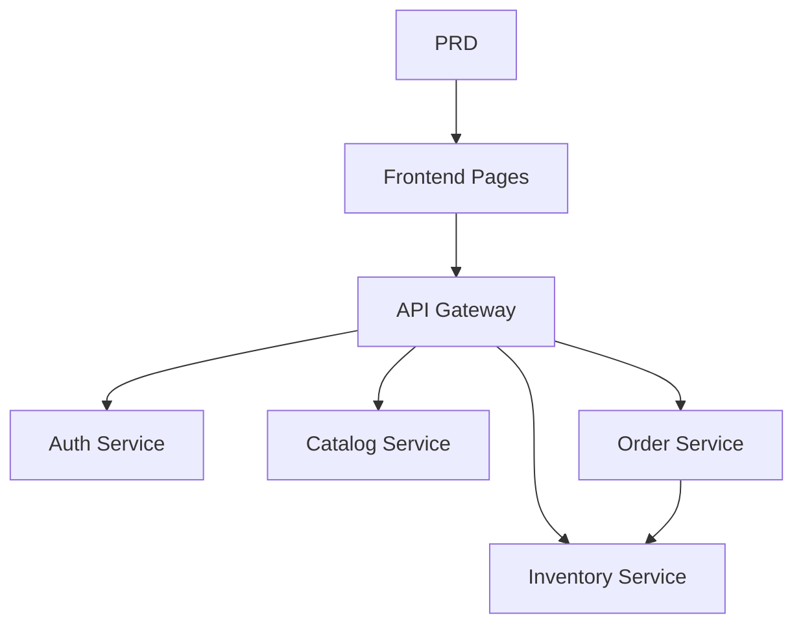

# Grocery E-Commerce Microservices System

## Overview

This project requires you to build a grocery e-commerce microservices system from scratch, based on a real PRD. Unlike previous single-service projects, the backend here is split into multiple independent services by business domain, unified through an API gateway. You'll learn how to design service boundaries and handle cross-service data consistency.

This is the comprehensive practical section of Stage 2. Microservices architecture is very common in real-world applications. Once you understand service decomposition and gateway routing, you'll be able to handle more complex backend system designs.

## Prerequisites

Before starting this project, you should already be familiar with:

- Frontend page design and component libraries ([UI Design](../../frontend/ui-design/), [Modern Component Libraries](../../frontend/modern-component-library/))
- Backend API design and development ([API Code](../../backend/ai-interface-code/))
- Database fundamentals and Supabase ([Database to Supabase](../../backend/database-supabase/))
- Git workflow and deployment ([Git & GitHub](../../backend/git-workflow/), [Web App Deployment](../../backend/zeabur-deployment/))

## Learning Objectives

After completing this project, you will be able to:

1. Read a PRD and extract a development task list for a microservices system
2. Decompose service boundaries by business domain (auth, catalog, inventory, order)
3. Design and implement API gateway routing
4. Handle cross-service issues like inventory deduction and order consistency
5. Complete end-to-end integration and deliver a demo-ready microservices prototype

## Project Overview

You will build a grocery e-commerce microservices system:

| Subsystem | Responsibility |
|-----------|---------------|
| **User Frontend** | Browse products, place orders, view order history |
| **Admin Portal** | Product management, inventory management, order management |

The backend is split into these services:

| Service | Responsibility |
|---------|---------------|
| **API Gateway** | Unified entry point, route forwarding, auth verification |
| **Auth Service** | User registration, login, JWT issuance |
| **Catalog Service** | Product information management |
| **Inventory Service** | Stock quantity management |
| **Order Service** | Order creation, status management |

::: tip PRD
The requirements document for this project is on GitHub: [View PRD](https://github.com/datawhalechina/easy-vibe/blob/main/docs/en/stage-2/assignments/simple-grocery-microservices/PRD.md)
:::

<div style="margin: 32px 0;">
  <ClientOnly>
    <StepBar :active="0" :items="[
      { title: 'Requirements', description: 'Read PRD, define service decomposition, pages, and transaction flow' },
      { title: 'Scaffold', description: 'Generate frontend, gateway, and service skeletons' },
      { title: 'Iterate', description: 'Add APIs module by module, fix inventory and order consistency' },
      { title: 'Launch', description: 'End-to-end testing, deploy, and prepare demo' }
    ]" />
  </ClientOnly>
</div>

## Part 1: Requirements Analysis

### 1.1 Read the PRD

Open the PRD document and answer these key questions:

- How should services be decomposed? What are the responsibility boundaries of each service?
- What pages do the user frontend and admin portal each need?
- What is the inventory deduction strategy after an order is placed? How to handle success / failure / timeout?
- Which complex capabilities (distributed transactions, message queues) should be skipped in the first version?

::: warning
If the above questions don't have clear answers, don't start coding. Unclear requirements are the most common cause of rework.
:::

### 1.2 Confirm System Architecture



## Part 2: Project Scaffolding

### 2.1 Generate Project Structure

Prompt reference:

```text
Based on the current PRD, help me generate a project scaffold for a grocery e-commerce microservices system.

Requirements:
1. Generate user frontend and admin portal skeletons
2. Generate five directories: api-gateway, auth-service, catalog-service, inventory-service, order-service
3. Each service should only have a minimal runnable entry point
4. Don't connect to a real database or payment system yet
```

### 2.2 Verify Project Structure

Check each item:

- [ ] Five service directories have clear structure
- [ ] API Gateway starts and forwards requests
- [ ] Each service's health check endpoint works
- [ ] User frontend and admin portal pages are accessible

## Part 3: Iterative Development

### 3.1 Module-by-Module Progress

1. **API Gateway**: Route configuration, JWT verification middleware
2. **Auth Service**: Registration, login, JWT issuance
3. **Catalog Service**: Product CRUD, list queries
4. **Inventory Service**: Stock queries, stock deduction
5. **Order Service**: Order creation, status transitions, inventory integration
6. **Admin Portal**: Product management, inventory management, order management

### 3.2 Module Self-Check

| Check Item | Verification Method |
|------------|---------------------|
| Gateway routing | Are service APIs correctly forwarded through the gateway? |
| Auth isolation | Are user and admin APIs properly separated? |
| Data consistency | Are product and inventory data in sync? |
| Transaction loop | After ordering, are inventory deduction and order status consistent? |
| Failure handling | Is there a compensation mechanism for insufficient stock or timeout? |

## Part 4: Integration & Launch

### 4.1 End-to-End Testing

At minimum, verify these scenarios:

- Browse products → Add to cart → Place order → View order
- Admin → Add product → Update inventory → View orders

## Deliverables

After completing this project, submit the following:

- [ ] Accessible live demo link
- [ ] Source code repository link (with README)
- [ ] PRD document
- [ ] Core page screenshots (product list, order page, order history, admin dashboard)
- [ ] 60-second demo video

## Grading Criteria

| Dimension | Basic Requirements | Advanced Requirements |
|------------|-------------------|----------------------|
| PRD Alignment | Pages, features, and service decomposition basically match PRD | Can clearly explain service decomposition rationale |
| Product Loop | Browse → Order → Inventory deduction → View order works end-to-end | Order timeout or insufficient stock has compensation mechanism |
| Service Architecture | Each service starts independently, accessible through gateway | Inter-service communication has error handling and retry |
| Admin Capability | Product, inventory, and order management are functional | Admin portal has data statistics |
| Engineering Completeness | Frontend, gateway, services, database pipeline connected | Has Docker Compose or similar orchestration |

## References

- [UI Design](../../frontend/ui-design/)
- [Modern Component Libraries](../../frontend/modern-component-library/)
- [Database to Supabase](../../backend/database-supabase/)
- [API Code with LLM Assistance](../../backend/ai-interface-code/)
- [Git & GitHub Workflow](../../backend/git-workflow/)
- [Web App Deployment](../../backend/zeabur-deployment/)
