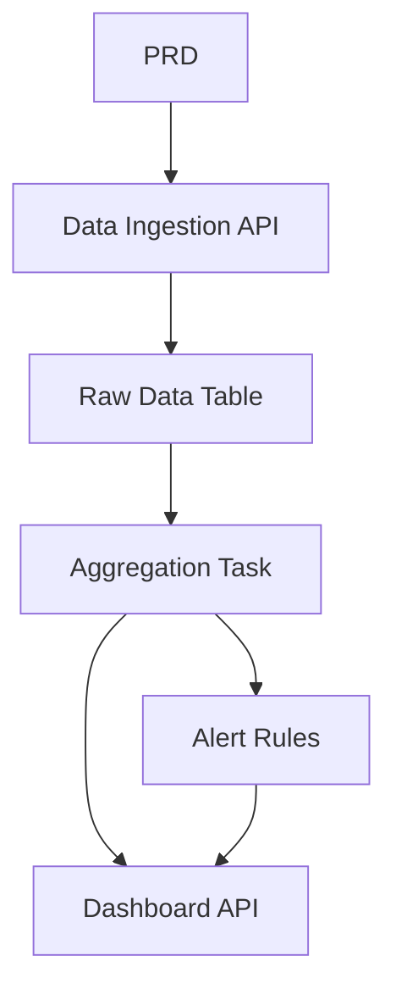

# Go Traffic Data Analysis Platform

## Overview

This project requires you to build a traffic data analysis platform using Go, based on a real PRD. Unlike previous CRUD systems, you'll build a complete data pipeline: "data ingestion → aggregation → alerting → visualization." This type of data product is very common in IoT, monitoring, and operations analytics.

This is the comprehensive practical section of Stage 2, and your first encounter with Go. Don't worry — with your JavaScript/TypeScript background, learning Go isn't difficult. The focus is on understanding data pipeline design principles.

## Prerequisites

Before starting this project, you should already be familiar with:

- Frontend page design and component libraries ([UI Design](../../frontend/ui-design/), [Modern Component Libraries](../../frontend/modern-component-library/))
- Backend API design and development ([API Code](../../backend/ai-interface-code/))
- Database fundamentals and Supabase ([Database to Supabase](../../backend/database-supabase/))
- Git workflow and deployment ([Git & GitHub](../../backend/git-workflow/), [Web App Deployment](../../backend/zeabur-deployment/))

## Learning Objectives

After completing this project, you will be able to:

1. Read a PRD and extract a development task list for a data product
2. Build a backend API service using Go (Gin or Fiber)
3. Design a complete pipeline for data ingestion, windowed aggregation, and alerting
4. Keep backend data and frontend dashboards consistent
5. Complete end-to-end integration and deliver a demo-ready data product prototype

## Project Overview

You will build a Go traffic data analysis platform:

| Module | Responsibility |
|--------|---------------|
| **Data Ingestion** | Receive raw traffic events and store them |
| **Data Aggregation** | Calculate trends and congestion metrics by time window |
| **Alerting** | Generate alert records based on rules |
| **Dashboard** | Display trend charts, rankings, and alert lists on the frontend |

::: tip PRD
The requirements document for this project is on GitHub: [View PRD](https://github.com/datawhalechina/easy-vibe/blob/main/docs/en/stage-2/assignments/traffic-data-visualization-go/PRD.md)
:::

<div style="margin: 32px 0;">
  <ClientOnly>
    <StepBar :active="0" :items="[
      { title: 'Requirements', description: 'Read PRD, define data sources, metric definitions, and alert rules' },
      { title: 'Scaffold', description: 'Use AI to generate Go API service and frontend dashboard scaffold' },
      { title: 'Iterate', description: 'Add aggregation logic, alert rules, and dashboard APIs' },
      { title: 'Launch', description: 'End-to-end testing, deploy, and prepare demo' }
    ]" />
  </ClientOnly>
</div>

## Part 1: Requirements Analysis

### 1.1 Read the PRD

Open the PRD document and answer these key questions:

- What is the data source? What fields does it contain?
- What are the definitions of core metrics? (e.g., the specific criteria for "congestion")
- What are the alert rules? Should the first version use simple rules?
- What pages and charts does the dashboard include?

::: warning
If the above questions don't have clear answers, don't start coding. Unclear requirements are the most common cause of rework.
:::

### 1.2 Confirm Data Pipeline



## Part 2: Project Scaffolding

### 2.1 Generate Go API Service

Prompt reference:

```text
Based on the current PRD, help me generate a Go traffic data analysis platform scaffold.

Requirements:
1. Use Gin or Fiber
2. Provide data ingestion API
3. Provide aggregation task skeleton
4. Provide dashboard and alerts API skeleton
5. Don't implement real complex analysis yet, just runnable structure
```

### 2.2 Verify Project Structure

Check each item:

- [ ] Go service starts successfully
- [ ] Data ingestion API can receive and store data
- [ ] Aggregation task framework is set up
- [ ] Frontend dashboard displays basic charts

## Part 3: Iterative Development

### 3.1 Module-by-Module Progress

1. **Data Ingestion API**: Receive raw traffic events, write to database
2. **Data Aggregation**: Aggregate by time window, calculate trends and congestion metrics
3. **Alert Rules**: Generate alert records based on thresholds
4. **Dashboard API**: Provide trend data, ranking data, alert list
5. **Frontend Dashboard**: Trend charts, rankings, alert list pages

### 3.2 Module Self-Check

| Check Item | Verification Method |
|------------|---------------------|
| Data ingestion | Is raw data correctly stored in database? |
| Aggregation logic | Are trend and ranking metric calculations consistent? |
| Alert rules | Do alert trigger conditions match expectations? |
| Data consistency | Does the dashboard match the backend data? |
| API standards | Is there a unified response structure and error handling? |

## Part 4: Integration & Launch

### 4.1 End-to-End Testing

At minimum, verify these scenarios:

- Ingest test data → Run aggregation task → Dashboard updates
- Trigger alert condition → Alert record generated → Alert page displays it

## Deliverables

After completing this project, submit the following:

- [ ] Accessible live demo link
- [ ] Source code repository link (with README)
- [ ] PRD document
- [ ] Core page screenshots (data ingestion demo, trend dashboard, alert list)
- [ ] 60-second demo video

## Grading Criteria

| Dimension | Basic Requirements | Advanced Requirements |
|------------|-------------------|----------------------|
| PRD Alignment | Features and data structures basically match PRD | Can clearly explain metric definitions and aggregation logic |
| Data Pipeline | Ingest → Aggregate → Alert → Dashboard works end-to-end | Aggregation tasks support incremental updates |
| Analysis Capability | Trends, rankings, alerts all functional | Metrics configurable, alert rules customizable |
| Frontend Display | Dashboard shows basic charts | Charts support time range filtering |
| Engineering Completeness | Go API, database, frontend pipeline connected | API has unified error handling and logging |

## References

- [UI Design](../../frontend/ui-design/)
- [Modern Component Libraries](../../frontend/modern-component-library/)
- [Database to Supabase](../../backend/database-supabase/)
- [API Code with LLM Assistance](../../backend/ai-interface-code/)
- [Git & GitHub Workflow](../../backend/git-workflow/)
- [Web App Deployment](../../backend/zeabur-deployment/)
