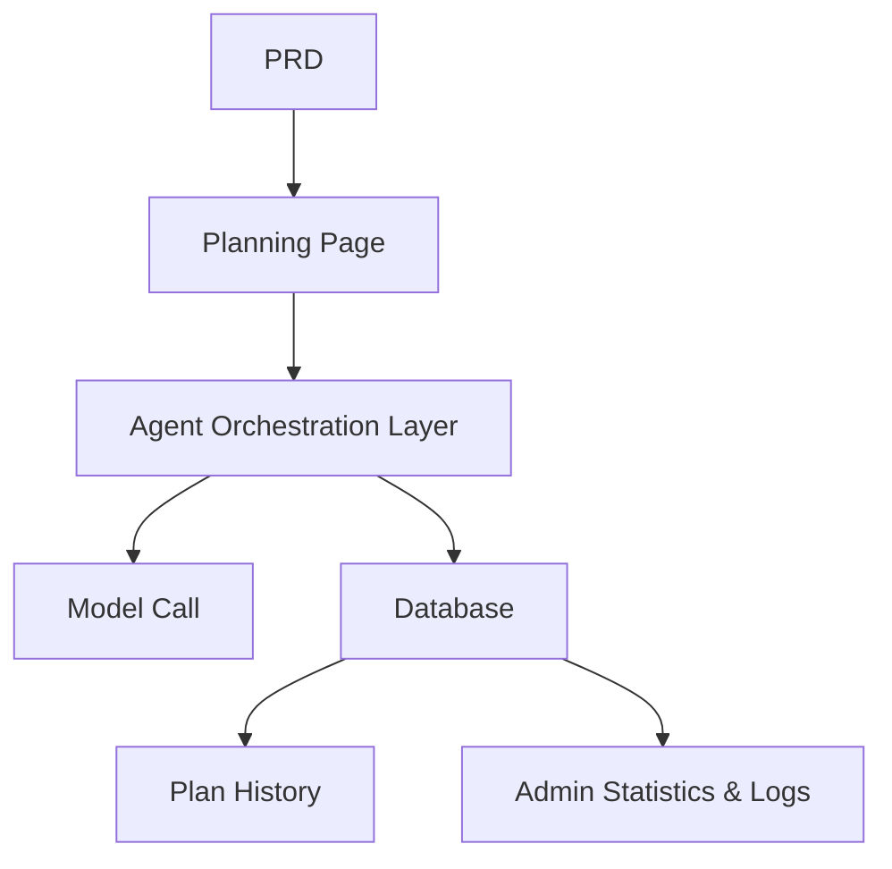

# Travel Planning Agent Platform

## Overview

This project requires you to build an intelligent travel planning Agent platform from scratch, based on a real PRD. You'll build a complete AI product that accepts structured input, generates daily itineraries, and supports saving and reusing plans — not just a chatbot, but a product with task management capabilities.

This is the comprehensive practical section of Stage 2. The core challenge: how to make AI generate structured, actionable itineraries instead of a wall of unstructured text.

## Prerequisites

Before starting this project, you should already be familiar with:

- Frontend page design and component libraries ([UI Design](../../frontend/ui-design/), [Modern Component Libraries](../../frontend/modern-component-library/))
- Backend API design and development ([API Code](../../backend/ai-interface-code/))
- Database fundamentals and Supabase ([Database to Supabase](../../backend/database-supabase/))
- Git workflow and deployment ([Git & GitHub](../../backend/git-workflow/), [Web App Deployment](../../backend/zeabur-deployment/))

## Learning Objectives

After completing this project, you will be able to:

1. Read a PRD and extract a development task list for an Agent platform
2. Design structured input forms and structured output formats
3. Implement an Agent orchestration layer handling user input, model calls, and result storage
4. Build a "generate → save → reuse" business loop
5. Complete end-to-end integration and deliver a demo-ready AI product prototype

## Project Overview

You will build an intelligent travel planning Agent platform:

| Feature | Description |
|---------|-------------|
| **Itinerary Planning** | Users enter origin, destination, dates, budget, and preferences; the system generates daily itineraries |
| **Budget Breakdown** | Itinerary results include budget allocation and suggestions |
| **History Management** | Users can save, regenerate, and export past plans |
| **Admin Dashboard** | Admins view popular destinations, failed tasks, and user feedback |

::: tip PRD
The requirements document for this project is on GitHub: [View PRD](https://github.com/datawhalechina/easy-vibe/blob/main/docs/en/stage-2/assignments/travel-planning-agent-platform/PRD.md)
:::

<div style="margin: 32px 0;">
  <ClientOnly>
    <StepBar :active="0" :items="[
      { title: 'Requirements', description: 'Read PRD, define pages, Agent orchestration, and input/output structure' },
      { title: 'Scaffold', description: 'Use AI to generate homepage, planning, history, and admin page skeletons' },
      { title: 'Iterate', description: 'Add structured output, task status, and history management module by module' },
      { title: 'Launch', description: 'End-to-end testing, deploy, and prepare demo' }
    ]" />
  </ClientOnly>
</div>

## Part 1: Requirements Analysis

### 1.1 Read the PRD

Open the PRD document and answer these key questions:

- Should the first version only support single-destination trips?
- Must the itinerary output be structured? What is the structure?
- How deep should export capabilities go? (share link / PDF / image)
- What is the scope of admin statistics and task logs?

::: warning
If the above questions don't have clear answers, don't start coding. Unclear requirements are the most common cause of rework.
:::

### 1.2 Confirm System Architecture



## Part 2: Project Scaffolding

### 2.1 Generate Frontend Pages

Prompt reference:

```text
Based on the current PRD, help me generate a frontend scaffold for an intelligent travel planning Agent platform.

Requirements:
1. Pages: homepage, planning page, itinerary detail, history, admin dashboard
2. Planning page has a form on the left and result preview on the right
3. Only generate page structure with mock data first, no real API integration
4. Style should look like a modern AI product
```

### 2.2 Verify Page Structure

Check each item:

- [ ] Planning page form fields match the PRD
- [ ] Result preview area can display structured itinerary data
- [ ] History page can display multiple plans
- [ ] Admin dashboard can display statistics

## Part 3: Iterative Development

### 3.1 Module-by-Module Progress

1. **Authentication**: Registration, login
2. **Planning Form**: Structured input (origin, destination, dates, budget, preferences)
3. **Agent Orchestration**: Receive input → Call model → Parse structured output
4. **Result Display**: Show itinerary by day, budget breakdown, suggestions
5. **History Management**: Save plans, regenerate, export
6. **Admin Dashboard**: Popular destinations, failed tasks, user feedback
7. **Task Status**: Generating / Success / Failed status management and error logging

### 3.2 Module Self-Check

| Check Item | Verification Method |
|------------|---------------------|
| Input completeness | Do form fields match the PRD? |
| Output structure | Is the itinerary result structured data (not a wall of text)? |
| Data consistency | Do trip, itinerary, and logs data align? |
| Loop verification | Can you demo "input → generate → save → regenerate"? |

## Part 4: Integration & Launch

### 4.1 End-to-End Testing

At minimum, verify these scenarios:

- Enter trip parameters → Generate daily itinerary → View budget breakdown → Save to history
- Regenerate itinerary from history
- Admin views task statistics and failure logs

## Deliverables

After completing this project, submit the following:

- [ ] Accessible live demo link
- [ ] Source code repository link (with README)
- [ ] PRD document
- [ ] Core page screenshots (planning page, itinerary detail, history, admin dashboard)
- [ ] 60-second demo video

## Grading Criteria

| Dimension | Basic Requirements | Advanced Requirements |
|------------|-------------------|----------------------|
| PRD Alignment | Pages, features, and data structures basically match PRD | Can clearly explain design decisions |
| Product Loop | Plan → Save → History → Regenerate works end-to-end | Supports export and sharing |
| Output Quality | Itinerary results are structured and readable | Budget breakdown is reasonable, suggestions are relevant |
| Admin Capability | Task statistics and failure logs viewable | Has popular destination analysis |
| Engineering Completeness | Frontend, backend, database, model call pipeline connected | Task status management is robust, errors are traceable |

## References

- [UI Design](../../frontend/ui-design/)
- [Modern Component Libraries](../../frontend/modern-component-library/)
- [Database to Supabase](../../backend/database-supabase/)
- [API Code with LLM Assistance](../../backend/ai-interface-code/)
- [Git & GitHub Workflow](../../backend/git-workflow/)
- [Web App Deployment](../../backend/zeabur-deployment/)
