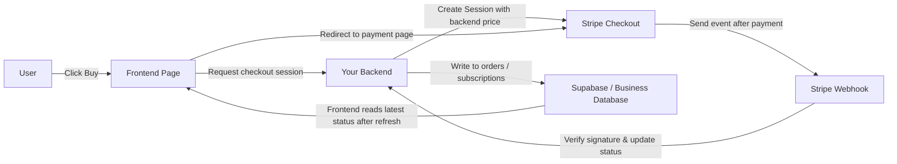
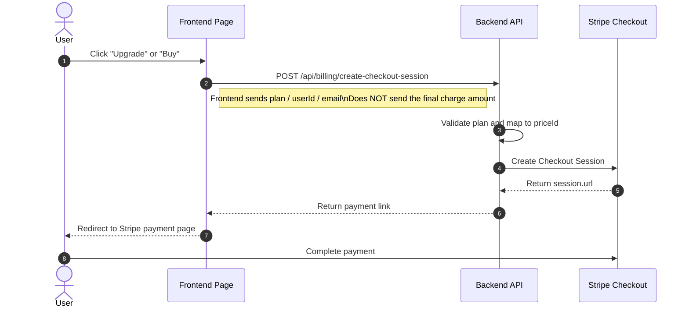
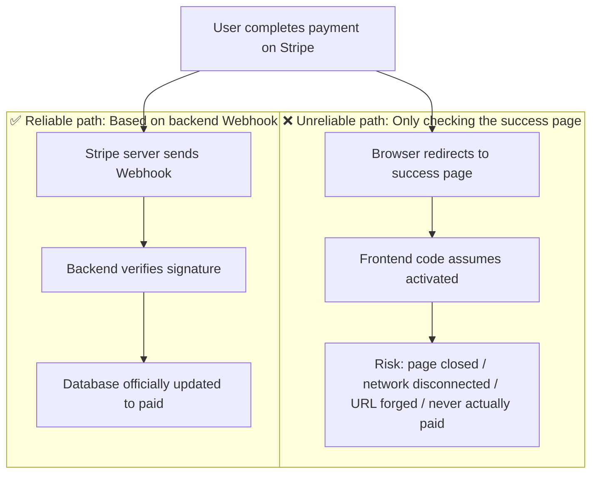
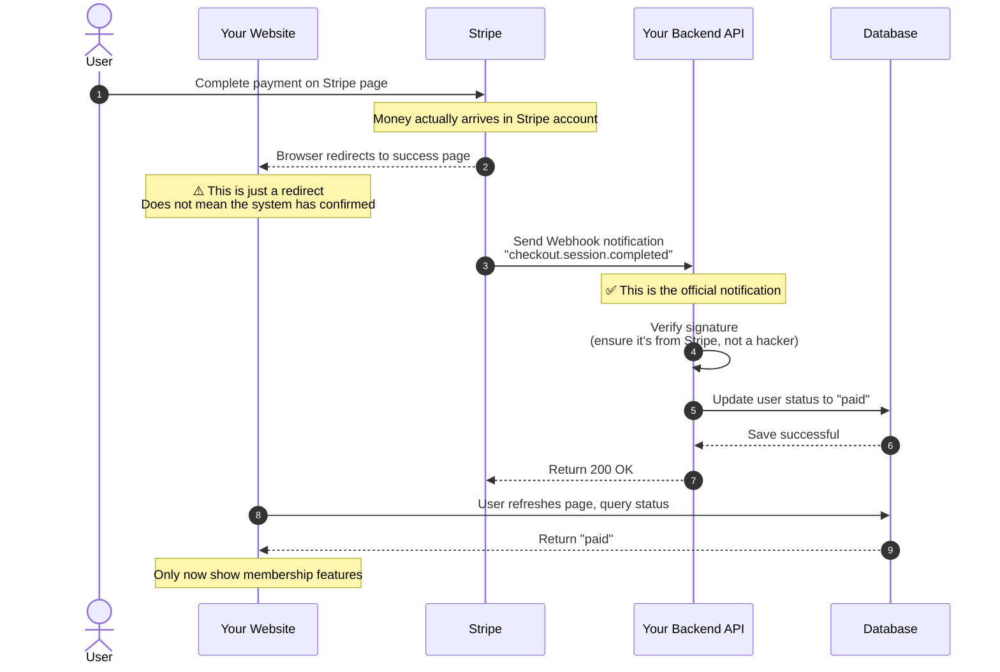
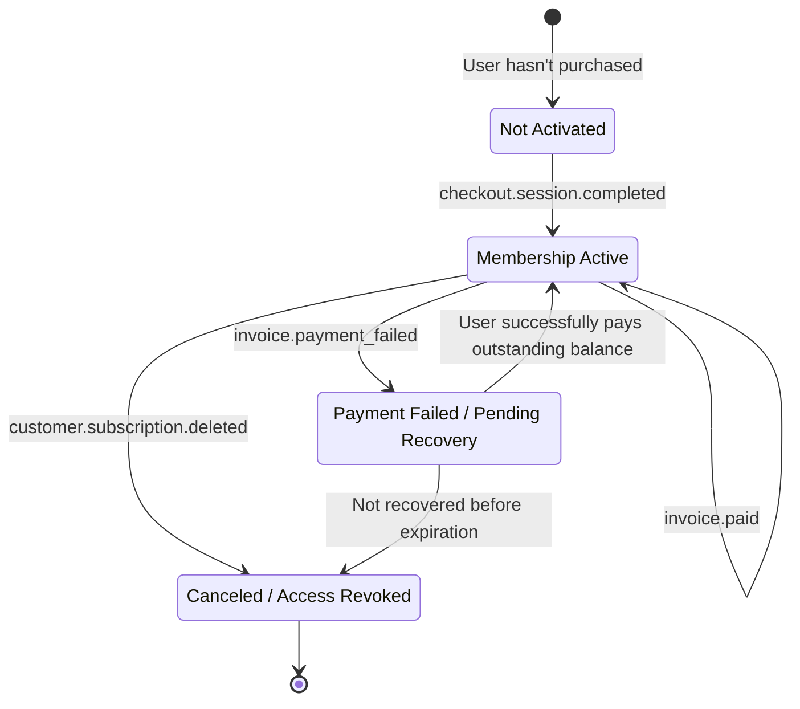
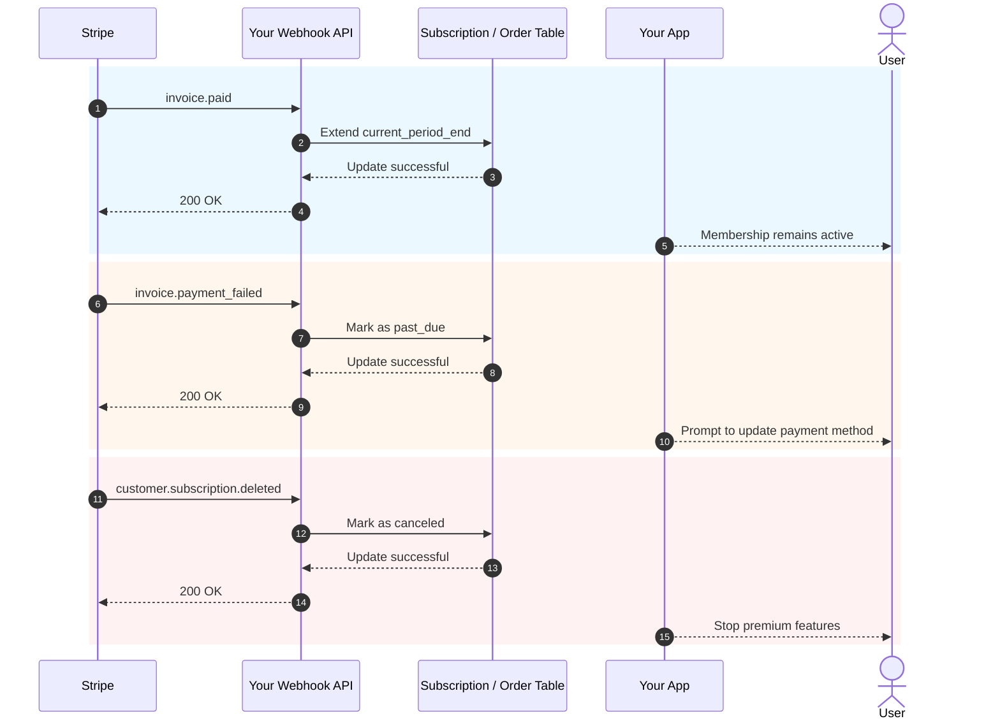

# How to Integrate Stripe and Other Billing Systems

When your product already has pages, authentication, a database, and a basic backend, the next practical question is: **how do you charge for it**.

Many people making their first payment integration focus entirely on "how to redirect to the payment page." But what truly determines whether the system is stable is not the button -- it's the entire billing chain: who decides the price, who confirms the payment succeeded, who updates the database, and who grants or revokes access.

This article is split into two parts:

- **The first half** covers only the most practical basics, with the goal of helping you integrate Stripe into your project as quickly as possible.
- **The second half** is consolidated into the appendix, covering Webhook details, subscription events, and differences in payment solutions across different countries and regions.

> 💡 We recommend completing these chapters before continuing:
>
> - [From Database to Supabase](../database-supabase/)
> - [Using AI to Write API Code and Documentation](../ai-interface-code/)
> - [How to Deploy a Web Application](../zeabur-deployment/)

# What You Will Learn

1. What a minimum viable payment system looks like.
2. How to integrate Stripe into your project in the fastest way possible.
3. How to write prompts so AI can directly add a payment system for you.
4. If you're not building an overseas Stripe project, which payment solutions you should prioritize for different regions.

---

# Part 1: Getting Started

## 1. Remember These 3 Principles First

If you only remember three things, remember these:

1. **Prices must be determined by the backend** -- never trust the amount sent from the frontend.
2. **What actually grants access is the Webhook**, not the `success` page.
3. **Your own database must store the payment status** -- don't rely solely on the Stripe dashboard.

These three principles are the core boundaries of any payment system. As long as the boundaries are correct, switching between Stripe, PayPal, Alipay, or WeChat Pay is essentially just "the API changes, but the architecture stays the same."

## 2. What Happens If You Skip the Backend and Connect Directly from the Frontend?

This is the most natural idea many people have when building payments for the first time:

- There's already a "Buy" button on the page
- Can I just let the frontend connect to Stripe directly?
- That way I don't need a backend, right?

If you're just building a fake demo page, this thinking is fine.
But if you're actually collecting real money, **this approach usually leads to trouble**.

The most common problems are:

1. **Prices can be easily tampered with**
   Requests from the browser are sent from the user's own computer. Others can modify the request content.
2. **Sensitive information can be exposed**
   Truly important keys, pricing logic, and membership activation logic should never be on the frontend.
3. **You can't reliably confirm "whether this payment actually succeeded"**
   The user landing on a success page doesn't mean your database has been synced correctly.
4. **Database state will be inconsistent**
   The user might say "I already paid," but your own system has no record of it.

So the safer division of labor should be:

- Frontend is responsible for: displaying buttons, initiating purchases, redirecting pages
- Backend is responsible for: determining prices, creating payment sessions, receiving Webhooks, updating the database

::: info You can summarize this in one sentence
**The frontend can handle redirections; the backend must handle pricing and confirmation.**

As long as real money is involved, never put the "final pricing authority" and "post-payment activation logic" on the frontend.
:::

## 3. When Is It Appropriate to Start with Stripe?

If you're building any of the following scenarios, Stripe is usually the smoothest starting point:

- SaaS targeting international users
- Subscription-based membership products
- Digital products, templates, AI credit packs
- Wanting to quickly validate monetization rather than dealing with too many local payment details upfront

If your primary users are in mainland China, Stripe usually wouldn't be your first choice -- I'll cover that in the appendix.

## 4. Minimum Viable Payment Chain

Let's start with the minimum version. As long as this chain works, your payment system has a skeleton.



Translating this into plain language:

1. User clicks a button.
2. Frontend asks the backend for a payment link.
3. Backend creates a payment session using the Stripe secret key.
4. User goes to the Stripe page to pay.
5. Stripe notifies you via Webhook that "the payment actually succeeded."
6. Your backend then updates the database.

## 5. Standard Sequence Diagram for Initiating a Payment

If you prefer looking at more formal system diagrams, here's a sequence diagram:



## 6. Quick Start

If you want to integrate it into your project as fast as possible, just follow these 5 steps.

### 6.1 Step 1: Create Products and Prices in the Stripe Dashboard

The purpose of this step is not to "just configure something random" -- it's to clearly define in Stripe **what you're selling and how you plan to charge for it**.

In Stripe's model:

- **Product** represents "what you're selling," for example `Pro Membership`
- **Price** represents "how much this costs and on what billing cycle," for example `$9.9/month`, `$99/year`

Why do this step first?
Because later when your backend creates a Checkout Session, you don't pass a raw amount to Stripe -- you pass an existing `price_id`. Stripe then uses this `price_id` to generate the actual payment page, amount, currency, and billing cycle.

If you skip this step, the "create payment link" step later won't work at all.

::: info Why pause here
Many beginners feel annoyed when they see `Product` and `Price`, thinking they're learning Stripe's internal jargon.

But actually, this step is doing something very straightforward:
- Define clearly "what you're selling"
- Define clearly "how much it costs"
- Let the backend later use a stable `price_id` to create payment links

Once you understand this layer, Checkout Sessions won't feel abstract.
:::

For a minimum viable subscription system, you need at least these two levels:

- One `Product`
- One or more `Price` entries

You can open these pages directly:

- Stripe Dashboard Login: [Dashboard Login](https://dashboard.stripe.com/login)
- Stripe Products and Prices Management Docs: [Manage products and prices](https://docs.stripe.com/products-prices/manage-prices)
- Stripe Checkout Quickstart Docs: [Build a Stripe-hosted checkout page](https://docs.stripe.com/checkout/quickstart?lang=node)
- Stripe Dashboard Products Page: [Product catalog](https://dashboard.stripe.com/test/products)

We recommend operating in **Test mode** first -- don't start building in the live environment.

A typical minimum configuration is:

- `Product`: `Pro Plan`
- `Price 1`: `pro_monthly`
- `Price 2`: `pro_yearly`

When operating in the dashboard, follow this order:

1. First create a product `Pro Plan`
2. Then attach two prices under this product
3. Monthly and yearly billing are really just two pricing options for the same product

After completion, you need to note down at least:

- The `price_id` for the monthly price
- The `price_id` for the yearly price
- Your own plan names, e.g. `pro_monthly`, `pro_yearly`

If this is your first time in the Stripe Dashboard, think of it this way:

- `Product` determines what's being sold on the payment page
- `Price` determines how much is charged on the payment page
- What the backend will actually use later is mainly `price_id`

::: info The values you actually need to note down
The most important thing on this page is not the product name, but the `price_id`.

Later, whether you're having AI help integrate the backend or troubleshooting issues yourself, what you'll frequently use is:
- `STRIPE_PRICE_PRO_MONTHLY`
- `STRIPE_PRICE_PRO_YEARLY`
- The two `price_id` values they correspond to
:::

If you want AI to walk you through the Dashboard configuration first, you can use this prompt:

```text
I'm using Stripe for the first time. Don't modify any code yet -- first help me set up the most basic billing configuration in the Stripe Dashboard.

Please give me step-by-step instructions based on these official docs:
- https://docs.stripe.com/products-prices/manage-prices
- https://docs.stripe.com/checkout/quickstart?lang=node

My situation:
- I want to build the simplest membership billing
- Only two plans: monthly and yearly
- I don't understand terms like Product and Price yet

Please:
1. First explain in simple terms what Product and Price are.
2. Then guide me step by step: which page to open first -> what to click -> what to fill in.
3. Finally remind me what I need to copy from the Dashboard for the backend to use.
4. If I might make mistakes, please remind me to always stay in test mode.
```

### 6.2 Step 2: Prepare Environment Variables

You typically need at least these environment variables:

- `STRIPE_SECRET_KEY`
- `STRIPE_WEBHOOK_SECRET`
- `STRIPE_PRICE_PRO_MONTHLY`
- `STRIPE_PRICE_PRO_YEARLY`
- `APP_URL`
- `SUPABASE_URL`
- `SUPABASE_SERVICE_ROLE_KEY`

You can open these pages directly:

- Stripe API Keys Docs: [API keys](https://docs.stripe.com/keys)
- Stripe Dashboard API Keys Page: [API Keys](https://dashboard.stripe.com/test/apikeys)
- Stripe Webhooks Docs: [Receive Stripe events in your webhook endpoint](https://docs.stripe.com/webhooks)
- Stripe Dashboard Webhooks Page: [Workbench Webhooks](https://dashboard.stripe.com/test/workbench/webhooks)

> ⚠️ `STRIPE_SECRET_KEY` and `SUPABASE_SERVICE_ROLE_KEY` must only be placed on the backend.

::: info Purpose of this environment variable step
This step is not about "filling up the `.env` file" -- it's about placing the most sensitive parts of the payment system on the backend:

- Stripe's backend secret key
- Webhook signature verification secret
- Your own price mapping

Simply put:
The frontend is only responsible for initiating purchases; the real secrets and pricing logic should stay on the server side.
:::

You can also have AI help organize this step:

```text
Please look at how my project currently stores environment variables, then help me organize the environment variables needed for Stripe.

Please refer to these docs:
- https://docs.stripe.com/keys
- https://docs.stripe.com/webhooks

My situation:
- I'm a complete beginner
- I can't distinguish which variables should go on the frontend vs the backend
- I'm not sure whether to edit `.env`, `.env.local`, or another file in the current project

Please:
1. First search where environment variables are typically stored in the current project.
2. List the minimum environment variables needed for Stripe integration.
3. Explain in simple terms what each variable does.
4. Tell me which Stripe page to visit to copy each variable.
5. If the project has an example environment variable file, please add the variable names directly.
```

### 6.3 Step 3: Create a Checkout Session on the Backend

You don't need to write the API yourself for this step -- just have AI reference the official docs and implement it for you.

First, give it these docs:

- Stripe Checkout Quickstart: [Build a Stripe-hosted checkout page](https://docs.stripe.com/checkout/quickstart?lang=node)
- Checkout Sessions API: [Create a Checkout Session](https://docs.stripe.com/api/checkout/sessions/create)
- Subscriptions: [Subscriptions](https://docs.stripe.com/payments/subscriptions)

Then paste this prompt:

```text
Please look at how my current project's backend code is organized, then help me integrate Stripe payments.

Please refer to these official docs:
- https://docs.stripe.com/checkout/quickstart?lang=node
- https://docs.stripe.com/api/checkout/sessions/create
- https://docs.stripe.com/payments/subscriptions

My goal is simple:
- After the user clicks the buy button, redirect to Stripe's payment page
- Only two plans: monthly and yearly
- Don't make me decide where to put the code -- look at the project first and place it appropriately

Please:
1. First search the project to find the backend entry file, route files, and how environment variables are written.
2. Then reference the official docs to integrate the "create Stripe payment link" step.
3. Don't let me pass the amount myself -- use backend environment variables for pricing.
4. After finishing, tell me which files you changed.
5. Finally, tell me what additional configuration I need to do in the Stripe Dashboard.
```

### 6.4 Step 4: Redirect to the Payment Page from the Frontend

The goal of this step is very simple: make the pricing page button call your backend API, then redirect to Stripe Checkout.

Reference docs:

- Stripe Checkout Integration Guide: [Build an integration with Checkout](https://docs.stripe.com/payments/checkout/build-integration)

Prompt for AI:

```text
Help me connect the "Buy" button in my project to Stripe.

Requirements:
- Don't change the existing page, only modify the button click logic
- After clicking, call the backend API to get the payment link, then redirect to Stripe
- If there's an error, show a simple message to the user (e.g. "Payment temporarily unavailable, please try again later")

Reference docs: https://docs.stripe.com/payments/checkout/build-integration
```

### 6.5 Step 5: Update Database Status via Webhook

This is the most critical step.

::: info Why this step is the most critical
Many people think "the user paid and was redirected to the success page" means everything is done.

No.

What matters for your system is:
**Whether Stripe has officially delivered the event to your Webhook, and whether your backend has successfully updated the database status.**
:::

You can also have AI implement this directly following Stripe's official Webhook docs -- don't write it by hand.

Reference docs:

- Stripe Webhooks: [Receive Stripe events in your webhook endpoint](https://docs.stripe.com/webhooks)
- Stripe CLI: [Stripe CLI](https://docs.stripe.com/stripe-cli)
- Stripe CLI Usage: [Use the Stripe CLI](https://docs.stripe.com/stripe-cli/use-cli)

Prompt for AI:

```text
Please continue helping me integrate the "automatically activate after successful payment" step with Stripe.

Please refer to these official docs:
- https://docs.stripe.com/webhooks
- https://docs.stripe.com/stripe-cli
- https://docs.stripe.com/stripe-cli/use-cli

My goal:
- After the user pays, don't just redirect to a success page
- Actually change the membership status in my database to activated

Please:
1. First search the current project for database-related code and how user status is stored.
2. Then add the Stripe webhook.
3. After successful payment, change the corresponding user to active, or update the membership status field currently used in the project.
4. If the project already has subscription tables, order tables, or user tables, prefer to follow the existing structure.
5. After finishing, tell me which files you changed.
6. Also tell me how to test locally whether this step actually works.
```

## 7. Prompt for Having AI Quickly Integrate Payments

If you're using tools like Codex, Claude Code, Trae, or Cursor, you can paste the following prompt directly and have it integrate payments into your project.

```text
Please help me integrate Stripe payments into the current project. I want to build the simplest membership billing feature that works.

My requirements:
1. I'm a complete beginner -- please look at the project yourself first, then decide where to modify the code.
2. Don't make me figure out the directory structure, routing structure, or database structure myself.
3. I only want the simplest version first: two plans, monthly and yearly.
4. After clicking buy, the user should be redirected to the Stripe payment page.
5. After successful payment, the membership status in my database should change to activated.
6. Don't add too many complex features upfront, like coupons, upgrades/downgrades, or complex invoicing.

Output requirements:
1. First give me a change plan.
2. Then directly modify the code.
3. Finally tell me how to test step by step locally.
4. If any step requires me to do something in the Stripe Dashboard, give me the link and key points directly.
```

If you want AI to be more tailored to your project, you can also add at the beginning:

- Your frontend framework
- Your backend directory structure
- Your database table names
- Whether your current user system uses Supabase Auth or a custom Auth solution

## 7.1 Let AI Handle Local Integration Testing Too

If you want AI to walk you through the entire local integration testing process, you can use this prompt:

```text
Please continue helping me get Stripe payments actually working. I want to follow along step by step without guessing.

Please refer to the official docs:
- https://docs.stripe.com/webhooks
- https://docs.stripe.com/stripe-cli
- https://docs.stripe.com/stripe-cli/use-cli

My goals:
1. Tell me which Stripe pages to open first.
2. Tell me how to get the STRIPE_WEBHOOK_SECRET.
3. Tell me how to use stripe login and stripe listen.
4. Tell me how to verify that checkout.session.completed has successfully reached my local webhook.
5. If the current project needs the frontend and backend running first, tell me the specific commands too.
6. Don't just explain principles -- output actual step-by-step instructions.
7. If I might make a mistake at some step, also tell me what the most common errors look like.
```

## 8. The 4 Most Common Pitfalls

1. **Treating the `success` page as payment success**
   What actually determines the status is the Webhook, not the frontend redirect.
2. **Letting the frontend pass the amount**
   This creates a serious price tampering risk.
3. **The Webhook route being pre-processed by `express.json()`**
   Stripe signature verification requires the raw request body.
4. **Not implementing idempotent handling**
   Webhooks may be retried. If you add membership or credits on every retry, you'll have problems.

## 9. One-Sentence Selection Guide

If you just want to get billing working right now:

| Your Primary Users | First Solution to Try |
| :--- | :--- |
| International SaaS / Global users | Stripe |
| Mainland China users | Alipay / WeChat Pay |
| Hong Kong or cross-border teams | Stripe + local wallet / FPS aggregation solution |

The specific differences are covered in detail in the appendix.

::: info Simplest approach to selecting a payment solution
Don't start by thinking "I need to integrate every payment method globally at once."

A more practical order is usually:
- First pick one primary payment chain based on where your main users are located
- Get the minimum viable payment working first
- Then add a second or third payment method based on actual user sources
:::

## 10. Summary

At this point, you've mastered the most fundamental yet important billing chain:

1. Frontend initiates the purchase.
2. Backend creates a Checkout Session.
3. User pays on the Stripe page.
4. Stripe notifies the backend via Webhook.
5. Backend updates the database.
6. Frontend displays the new membership or order status after refresh.

If you just want to quickly integrate payments into your project, the content above is sufficient. The appendix below can be referenced when you actually encounter issues.

---

# Appendix

## Appendix A: The Most Common Objects in Stripe

When looking at Stripe docs for the first time, it's easy to get confused by these object names. You really only need to understand these:

| Object | Purpose | What You Can Think of It As |
| :--- | :--- | :--- |
| `Product` | Describes what you're selling | A product or membership plan |
| `Price` | Describes how much it costs and the billing cycle | Monthly, yearly, or one-time purchase |
| `Checkout Session` | Stripe-hosted payment flow | The payment page |
| `Subscription` | Recurring subscription relationship | Auto-renewing membership |
| `Customer` | The paying user | Customer profile in Stripe |
| `Webhook` | Async notification | Stripe telling you "what happened with this payment" |

## Appendix B: Why the `success` Page Does Not Equal Payment Success

Many people think "the user paid and was redirected to the success page" means the payment succeeded. This is the most common pitfall.

### A Real-World Scenario

Imagine you built a membership website:
1. User clicks "Buy Membership"
2. Redirected to the Stripe payment page
3. User enters credit card info and clicks pay
4. Page redirects to your `success.html`
5. You wrote code on the success page: "Since they reached this page, activate their membership"

**What's the problem?**

The user might not have paid at all, or might have closed the page mid-payment, but can still directly access `success.html`.

### Two Completely Different Paths



**Key differences:**

| | success Page Redirect | Webhook Notification |
| :--- | :--- | :--- |
| Who initiates it | User's browser | Stripe's server |
| Can it be forged? | Yes, just visit the URL directly | No, there's signature verification |
| Does it guarantee payment success? | Not necessarily | Yes, always |
| How does your system know? | Frontend code guesses | Stripe officially notifies |

### What the Complete Flow Should Look Like



### Potential Issues at Each Step

**Step 1: User pays on Stripe**

This is the only moment that confirms "money was actually paid":
- User enters credit card info and clicks confirm
- Bank charges the user's card
- Stripe confirms receipt of the funds

**Step 2: Browser redirects to the success page (most problematic)**

This step is completely unreliable because:
- User can type `yoursite.com/success` directly in the browser, accessing it without paying
- User closes the page mid-payment but had copied the success link earlier, and opens it later
- Network issues cause the redirect to fail, but the money was already charged (user paid but didn't see the success page)
- User hits the back button and pays again, but both times redirect to the same success page

**Step 3: Stripe sends the Webhook**

This is Stripe proactively notifying your server "this payment has been received":
- Only Stripe's server can initiate this request
- The request includes a signature that your backend can verify as genuinely from Stripe
- Even if the success page didn't load or the user disconnected, the Webhook is still sent

**Step 4: Backend verifies the signature**

Why verify? To prevent hackers from forging notifications.

Without verification, a hacker could send a fake notification to your server: "User A paid $1000." Your system would then activate membership for the hacker.

The verification process:
- Stripe generates a signature using a shared secret key for the notification content
- Your backend uses the same secret key to verify whether the signature matches
- Match = 100% from Stripe, no match = reject immediately

**Step 5: Update the database**

Only after verification passes, update the database:
- Change user status from "pending payment" to "paid"
- Record the order number, amount, and payment time
- Activate the corresponding membership permissions

**Step 6: Frontend queries the status**

The success page should not assume "reaching this page means success." The correct approach:
- On page load, send a request to the backend: "Has this user paid?"
- Backend queries the database and returns the actual status
- Display "activation successful" or "pending confirmation" based on the result

### A Common Mistake

```javascript
// Wrong: Activate directly on the success page
// success.html
if (window.location.pathname === '/success') {
  // Dangerous! Anyone can access /success
  activateMembership();
}
```

```javascript
// Correct: Always query the backend on every refresh
// success.html
async function checkStatus() {
  const response = await fetch('/api/user/status');
  const data = await response.json();

  if (data.paymentStatus === 'paid') {
    showMemberFeatures();
  } else {
    showPendingMessage();
  }
}
```

### Summary in One Sentence

**The success page only means "browser redirect succeeded." The Webhook is what means "Stripe has officially confirmed receipt of payment."**

Your system must use the Webhook as the source of truth -- never trust the frontend redirect.

## Appendix C: The Most Important Subscription Events to Listen To

| Event | Meaning | What You Typically Do |
| :--- | :--- | :--- |
| `checkout.session.completed` | First subscription activation succeeded | Create a local subscription record |
| `invoice.paid` | Auto-renewal succeeded | Extend the expiration date |
| `invoice.payment_failed` | Auto-charge failed | Mark risk status and notify the user |
| `customer.subscription.deleted` | Subscription canceled | Revoke access or mark as expired |

### Subscription State Diagram



### Renewal / Failure / Cancellation Sequence Diagram



## Appendix D: How to Choose Other Payment Solutions

### 1. Mainland China

If your primary users are in mainland China, the first choice is still **[Alipay](https://open.alipay.com/)** and **[WeChat Pay](https://pay.wechatpay.cn/)**.

**Business model:**

Both use a "payment gateway" model. You need to:
- Apply for merchant qualifications (business license, corporate bank account)
- User payments go directly to your merchant account
- You handle taxes, refunds, and reconciliation yourself

**Technical model:**

Both follow a "backend creates order + frontend triggers payment + backend receives notification" model, same as Stripe.

**Alipay integration flow:**
1. Create an app on the Alipay Open Platform
2. Configure public/private keys and callback URL
3. Backend calls the unified order API to generate a payment link or QR code
4. User scans the code or is redirected to pay
5. Alipay sends an async notification to your backend to update the order status

**WeChat Pay integration flow:**
- JSAPI Payment: Suitable for official accounts and mini programs; users pay directly within WeChat
- Native Payment: Generates a QR code on PC; user scans to pay
- H5 Payment: Launches the WeChat App from a mobile browser to pay

Flow: Backend creates order -> gets `prepay_id` or `code_url` -> frontend triggers payment -> backend receives notification to confirm success

**Reference links:**
- Alipay Open Platform: https://open.alipay.com/
- WeChat Pay Merchant Docs: https://pay.wechatpay.cn/doc/v3/merchant/

### 2. Hong Kong

The Hong Kong market is quite mixed. Common combinations:

- Bank cards: Visa / Mastercard
- FPS (Faster Payment System): Hong Kong's local instant transfer system
- AlipayHK / WeChat Pay HK: Hong Kong versions of Alipay and WeChat

**Recommended combination:**
- Use **[Stripe](https://stripe.com/hk)** for international cards and subscriptions
- Use **[Airwallex](https://www.airwallex.com/)** or **[Adyen](https://www.adyen.com/)** to supplement local wallets and FPS

### 3. International / Global SaaS

#### [Stripe](https://stripe.com/)

**Business model:** Payment gateway

- You need to apply for merchant qualifications yourself (in some countries Stripe can handle this for you)
- User payments go to your Stripe account, then are settled to your bank account
- You handle tax filing yourself

**Technical model:**

- Best API experience, clear documentation
- Supports Checkout (hosted page), Elements (custom form), Payment Links (no-code)
- Webhook notifications for payment status
- Supports subscriptions, invoices, multi-currency

**Best for:** International SaaS, indie developers, teams needing flexible customization

**Reference link:** https://docs.stripe.com/

#### [PayPal](https://www.paypal.com/)

**Business model:** Payment gateway

- User payments go to your PayPal account, then you withdraw to your bank
- You handle taxes yourself

**Technical model:**

- One-time payments: Place a button on the frontend, backend creates/confirms orders
- Subscriptions: First create Product and Plan, then use SDK to launch
- Also requires backend and Webhooks -- don't rely only on frontend callbacks

**Best for:** International businesses needing an additional channel, users accustomed to paying with PayPal

**Reference link:** https://developer.paypal.com/docs/

#### [Paddle](https://www.paddle.com/)

**Business model:** Merchant of Record (MoR)

- Paddle is the "Merchant of Record" -- legally, Paddle collects payment from the user
- Paddle handles global taxes, VAT, refunds, and compliance for you
- User payments go to Paddle; after deducting taxes and fees, Paddle settles with you
- You don't need to register a company or handle taxes in each country

**Technical model:**

- Paddle.js: Embed a hosted checkout page on the frontend
- Backend API: Create a transaction, hand it to checkout
- Webhooks sync subscription status

**Best for:** SaaS teams that don't want to deal with global taxes, especially B2B SaaS

**Reference link:** https://developer.paddle.com/

#### [Lemon Squeezy](https://www.lemonsqueezy.com/)

**Business model:** Merchant of Record (MoR)

- Similar to Paddle, Lemon Squeezy is the "Merchant of Record"
- Handles global taxes, VAT, and compliance for you
- Acquired by Stripe in 2024, but operates independently

**Technical model:**

- Hosted Checkout: Simplest option -- just generate a payment link
- Checkout Overlay: Overlay embedded in your page
- Backend API: Create a checkout with flexible control

**Best for:** Indie developers, digital products, software licensing

**Reference link:** https://docs.lemonsqueezy.com/

### 4. Enterprise Solutions

#### [Airwallex](https://www.airwallex.com/)

**Business model:** Payment gateway + global accounts

- Provides global receiving accounts (similar to virtual bank accounts)
- Supports multi-currency collection, currency exchange, and payouts
- You handle taxes yourself

**Technical model:**

- Payment Links: Almost no code needed -- generate payment links
- Hosted Payment Page: Hosted page
- Drop-in / Embedded / Native API: Deep integration with high customization
- Supports Alipay HK, FPS, WeChat Pay, and other local payment methods

**Best for:** Hong Kong teams, cross-border businesses, companies needing multi-currency accounts

**Reference link:** https://www.airwallex.com/docs/

#### [Adyen](https://www.adyen.com/)

**Business model:** Payment gateway

- Enterprise-level payment platform, processing trillions of euros in annual transaction volume
- Supports online, offline, and mobile omnichannel payments
- You handle taxes yourself

**Technical model:**

- Pay by Link: Simplest option -- generate a payment link
- Drop-in / Components: Standard online integration
- Dashboard can enable Alipay, Alipay HK, PayMe, and other local payment methods

**Best for:** Large enterprises, companies needing omnichannel payments

**Reference link:** https://docs.adyen.com/

### 5. Solution Comparison

| Solution | Business Model | Tax Handling | Best For |
| :--- | :--- | :--- | :--- |
| Stripe | Payment gateway | Handle yourself | International SaaS, developers |
| PayPal | Payment gateway | Handle yourself | International supplementary channel |
| Paddle | MoR | Paddle handles for you | B2B SaaS, don't want to manage taxes |
| Lemon Squeezy | MoR | LS handles for you | Indie developers, digital products |
| Adyen | Payment gateway | Handle yourself | Large enterprises |
| Airwallex | Payment gateway + accounts | Handle yourself | Cross-border businesses, Hong Kong teams |
| Alipay/WeChat | Payment gateway | Handle yourself | Mainland China users |

### 6. Choose by Region

| Your Market | Recommended Solution |
| :--- | :--- |
| Mainland China | Alipay / WeChat Pay |
| Hong Kong | Stripe + Airwallex / Adyen |
| International SaaS | Stripe (manage taxes yourself) or Paddle (MoR handles taxes) |
| International digital products | Stripe / Lemon Squeezy / Paddle |
| Multi-region enterprise | Adyen / Airwallex / Stripe combination |
