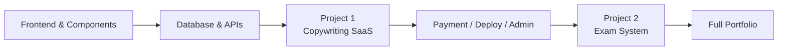

# Junior Developer

Welcome to the **Junior Developer** stage! Here, you will go deeper into full-stack development and learn modern frontend workflows, database design, backend APIs, deployment, and AI-powered product building.

## What You Will Learn

### Frontend Development

Master modern frontend development and learn how to use design tools, component libraries, and AI-native UI workflows:
<NavGrid>
  <NavCard
    href="/en/stage-2/frontend/lovart-assets/"
    title="Frontend 0: Build Your Own Asset-Production Agent with Lovart"
    description="Use Nanobanana and Lovart to batch-generate high-quality visual assets, then build a drawing agent with intent recognition"
  />
  <NavCard
    href="/en/stage-2/frontend/figma-mastergo/"
    title="Frontend 1: Figma & MasterGo Basics"
    description="Master the basic operations of professional UI design tools and the workflow from design to code"
  />
  <NavCard
    href="/en/stage-2/frontend/multi-product-ui/"
    title="Frontend 2: UI Guidelines and Multi-Product Design"
    description="Learn mainstream UI design guidelines to improve product design consistency and aesthetics"
  />
  <NavCard
    href="/en/stage-2/frontend/llm-skills-beautiful/"
    title="Frontend 3: Make Interfaces Beautiful with LLMs and Skills"
    description="Use prompts and plugins in real projects to make AI generate more polished, distinctive interfaces"
  />
  <NavCard
    href="/en/stage-2/frontend/hogwarts-portraits/"
    title="Frontend 4: Let's Build Hogwarts Portraits"
    description="Practical project: Build an interactive Hogwarts portrait application using AI-generated images"
  />
  <NavCard
    href="/en/stage-2/frontend/design-to-code/"
    title="Frontend 5: From Design Prototype to Project Code"
    description="Learn how to turn design prototypes into frontend code that really runs in the browser"
  />
  <NavCard
    href="/en/stage-2/frontend/modern-component-library/"
    title="Frontend 6: Upgrade Your UI with Modern Component Libraries"
    description="Use component libraries to build professional interfaces faster"
  />
</NavGrid>

### Backend Development

Learn API design, database management, and application deployment strategies:
<NavGrid>
  <NavCard
    href="/en/stage-2/backend/database-supabase/"
    title="Backend 1: From Database to Supabase"
    description="Master relational database basics and learn to use Supabase, a modern BaaS platform"
  />
  <NavCard
    href="/en/stage-2/backend/ai-interface-code/"
    title="Backend 2: Backend API Design and Development"
    description="Use AI to assist in generating backend interface code and standard API documentation"
  />
  <NavCard
    href="/en/stage-2/backend/git-workflow/"
    title="Backend 3: Learn Git and GitHub"
    description="Master core version control operations and collaboration workflows with Git"
  />
  <NavCard
    href="/en/stage-2/backend/zeabur-deployment/"
    title="Backend 4: Ship Your Product Prototype"
    description="Learn to quickly deploy your full-stack applications to the cloud using Zeabur"
  />
  <NavCard
    href="/en/stage-2/backend/modern-cli/"
    title="Backend 5: From IDEs to CLI AI Coding Tools"
    description="Explore modern CLI tools to enhance command-line development experience"
  />
  <NavCard
    href="/en/stage-2/backend/stripe-payment/"
    title="Backend 6: Integrate Stripe and Other Billing Systems"
    description="Practical: Integrate Stripe payment functionality into your application for monetization"
  />
</NavGrid>

### Major Projects

The previous chapters teach you the "parts." The major projects teach you "how to assemble those parts into a product that runs, demos, and ships."

We recommend completing them in order: **Project 1 → Project 2**:

- **Project 1** walks you through the most common SaaS pipeline: login, generation, database, payments, and admin dashboard.
- **Project 2** takes you into a more business-system-like scenario: role-based permissions, question banks, exams, submissions, and admin management.

If you're not sure which to start with, here's a quick comparison:

| Project | Key Skills | Best For | Deliverable |
|---------|-----------|----------|-------------|
| Project 1: Copywriting Website | SaaS page structure, user login, AI generation, Stripe payments, admin dashboard | First-time builders of a complete commercial website | A registerable, generatable, payable, manageable SaaS prototype |
| Project 2: Exam & Management System | Role permissions, question bank modeling, exam flow, submissions, grading & statistics | Those who want to build a complete "business system" | An exam platform with student and admin portals |

Whichever you choose, prepare at least these 3 deliverables:

- A runnable project repository
- An accessible demo link
- A README and a demo video

<NavGrid>
  <NavCard
    href="/en/stage-2/assignments/copywriting-platform-supabase/"
    title="Project 1: Your First SaaS Full-Stack App - AI Copywriting Website"
    description="Build an AI marketing copy workspace from scratch, including login, generation, billing, and an admin dashboard"
  />
  <NavCard
    href="/en/stage-2/assignments/exam-management-express/"
    title="Project 2: Online Exam and Management System"
    description="Build an online exam system with automatic question generation, test-taking flows, and admin management"
  />
</NavGrid>

If you've completed the two main projects above, or want to build your portfolio in your own direction, pick one of these extension projects to dive deeper:

<NavGrid>
  <NavCard
    href="/en/stage-2/assignments/modern-landing-page/"
    title="Extension: Modern AI Image Generation SaaS"
    description="Build a Midjourney-inspired AI image SaaS with generation workspace, gallery, payments, and admin dashboard"
  />
  <NavCard
    href="/en/stage-2/assignments/custom-dify-agent-platform/"
    title="Extension: Custom Dify Agent Platform"
    description="Implement agent management, conversations, logging, and permission control for a minimal viable AI platform"
  />
  <NavCard
    href="/en/stage-2/assignments/travel-planning-agent-platform/"
    title="Extension: Travel Planning Agent Platform"
    description="Build an AI travel planning product with structured input, agent orchestration, and plan history management"
  />
  <NavCard
    href="/en/stage-2/assignments/movie-recommendation-springboot/"
    title="Extension: Spring Boot Movie Recommendation System"
    description="Build a complete recommendation system with Spring Boot, ratings, favorites, and explainable recommendations"
  />
  <NavCard
    href="/en/stage-2/assignments/simple-grocery-microservices/"
    title="Extension: Grocery E-Commerce Microservices"
    description="Practice service decomposition, gateway routing, and inventory-order coordination in a microservices architecture"
  />
  <NavCard
    href="/en/stage-2/assignments/traffic-data-visualization-go/"
    title="Extension: Go Traffic Data Analysis & Visualization"
    description="Build a complete data product with ingestion, windowed aggregation, trend dashboards, and alerting"
  />
</NavGrid>

### AI Capabilities Extension
<NavGrid>
  <NavCard
    href="/en/stage-2/ai-capabilities/dify-knowledge-base/"
    title="AI 1: Dify Basics & Knowledge Base Integration"
    description="Learn to build AI applications using Dify and integrate private knowledge bases"
  />
</NavGrid>

## Who Is This For

- Developers with some programming foundation who want to systematically learn modern full-stack development
- Learners transitioning from product manager to full-stack engineer
- Junior to intermediate developers who want to master modern development tools and workflows
- Entrepreneurs who want to independently develop complete products

## Prerequisites

- Complete the "Novice & Product Prototype" stage, or have equivalent foundational knowledge
- Understand basic HTML/CSS/JavaScript concepts
- Have a basic understanding of AI coding tools

Ready to move from product prototype to real full-stack delivery? Use the left navigation to start learning.
