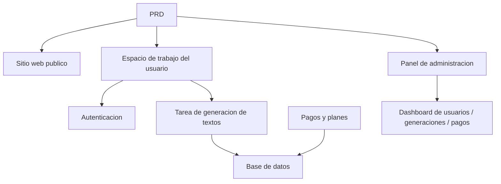

# Desarrollo Practico: SaaS de Copywriting con IA para Marketing

## Descripcion general

Este proyecto practico te requiere trabajar con un PRD real para completar desde cero un producto SaaS de copywriting con IA dirigido a desarrolladores independientes y equipos de contenido. Usaras Supabase como servicio de backend y Stripe como sistema de pagos, completando todo el proceso desde el analisis de requisitos hasta el despliegue.

Esta es la seccion de practica integral de la Etapa 2. En los capitulos anteriores, ya has aprendido por separado habilidades individuales como construccion de paginas frontend, desarrollo de interfaces backend, operaciones de base de datos e integracion de pagos. Este proyecto te exige conectar todas estas habilidades para entregar un prototipo de producto funcional.

## Conocimientos previos

Antes de comenzar este proyecto, ya deberias dominar lo siguiente:

- Diseno de paginas frontend y uso de bibliotecas de componentes ([Diseno UI](../../frontend/ui-design/), [Biblioteca de componentes moderna](../../frontend/modern-component-library/))
- Diseno y desarrollo de interfaces backend ([Escritura de codigo de interfaces](../../backend/ai-interface-code/))
- Fundamentos de bases de datos y Supabase ([De la base de datos a Supabase](../../backend/database-supabase/))
- Integracion de pagos ([Sistema de pagos Stripe](../../backend/stripe-payment/))
- Flujo de trabajo de Git y despliegue ([Git y GitHub](../../backend/git-workflow/), [Despliegue de aplicaciones web](../../backend/zeabur-deployment/))

## Objetivos de aprendizaje

Despues de completar esta practica, podras:

1. Leer y comprender un PRD real, extrayendo una lista de tareas de desarrollo
2. Usar IA para asistir en la generacion paso a paso de paginas frontend e interfaces backend
3. Usar Supabase para implementar autenticacion de usuarios y operaciones de base de datos
4. Integrar Stripe para implementar funcionalidad de suscripcion de pago
5. Construir un panel de administracion y completar la integracion de extremo a extremo

## Introduccion del proyecto

El producto que vas a construir es un SaaS de copywriting con IA para marketing, que incluye tres subsistemas:

| Subsistema | Responsabilidad |
|--------|------|
| **Sitio web publico** | Introduccion del producto, precios, FAQ, conversion de registro |
| **Espacio de trabajo del usuario** | Ingresar informacion del producto, generar textos, ver historial, mejorar plan |
| **Panel de administracion** | Gestion de usuarios, registros de generacion, datos de pagos, resumen de operaciones |

El backend usa Supabase para proporcionar capacidades de base de datos y autenticacion, Stripe para procesar pagos y modelos de IA para generar textos de marketing.

::: tip PRD
El documento de requisitos de este proyecto esta en GitHub: [Ver PRD](https://github.com/datawhalechina/easy-vibe/blob/main/docs/es-es/stage-2/assignments/copywriting-platform-supabase/PRD.md)
:::

<div style="margin: 32px 0;">
  <ClientOnly>
    <StepBar :active="0" :items="[
      { title: 'Analisis de requisitos', description: 'Leer el PRD, definir paginas, funcionalidades, autenticacion y alcance de pagos' },
      { title: 'Construccion del esqueleto', description: 'Usar IA para generar tres esqueletos frontend (www / app / admin)' },
      { title: 'Integracion backend', description: 'Autenticacion Supabase, interfaz de generacion, pagos Stripe' },
      { title: 'Integracion y despliegue', description: 'Verificar de extremo a extremo, desplegar y preparar la demostracion' }
    ]" />
  </ClientOnly>
</div>

## Primera parte: Analisis de requisitos

### 1.1 Leer el PRD

Abre el documento PRD y responde las siguientes preguntas clave:

- Cuantos puntos de entrada tiene el sistema? Que paginas cubre cada uno?
- Cual es la funcionalidad principal de cada pagina?
- Que modulos y tablas de datos incluye el backend?
- Como se disenaran los precios de planes, el flujo de pagos y la cuota gratuita?
- Cual es el alcance del MVP? Que se incluye y que se excluye en la primera version?

::: warning
Si no tienes respuestas claras a las preguntas anteriores, no comiences a escribir codigo. La comprension inadecuada de los requisitos es la causa mas comun de retrabajo.
:::

### 1.2 Confirmar la arquitectura del sistema

Segun el PRD, organiza la arquitectura general del sistema:



## Segunda parte: Construccion del esqueleto del proyecto

### 2.1 Generar paginas frontend

Usa IA para generar primero la estructura basica y los datos ficticios de todas las paginas.

Referencia de prompts:

```text
Basandote en el PRD actual, ayudame a generar el esqueleto frontend de un SaaS de copywriting con IA para marketing.

Requisitos:
1. Dividido en tres puntos de entrada: www, app, admin
2. El sitio web incluye: inicio, precios, FAQ
3. La app incluye: inicio de sesion, registro, espacio de trabajo de generacion, historial, pagina de planes
4. El panel incluye: pagina principal, gestion de usuarios, registros de generacion, ordenes de pago
5. Primero generar solo la estructura de paginas y datos ficticios, sin conectar interfaces reales
6. El estilo debe parecerse a un SaaS moderno, no a un demo de clase
```

### 2.2 Mejorar paginas clave

Despues de construir el esqueleto, enfocate en mejorar la pagina del espacio de trabajo de generacion (Dashboard):

```text
Continua mejorando la pagina /dashboard.

Este es un espacio de trabajo de copywriting con IA para marketing.

Campos del formulario izquierdo:
- Nombre del producto
- Descripcion de una oracion
- Usuario objetivo
- 3 puntos de venta
- Canales de distribucion (sitio web, redes sociales, Xiaohongshu, Douyin, email)

Area de resultados derecha (reservada):
- Titulo principal
- Subtitulo
- CTA
- 3 versiones de texto corto
- Texto largo

Primero implementa la interaccion con datos mock.

Requisitos:
- Despues de hacer clic en "Generar texto" hay un estado de loading
- El area de resultados tiene un diseno de estado vacio
- Layout responsivo que funciona tanto en pantallas anchas como estrechas
```

### 2.3 Verificar la estructura de paginas

Verificar item por item:

- [ ] Las rutas de los tres puntos de entrada son independientes
- [ ] El numero de paginas coincide con el PRD
- [ ] El layout del formulario y el area de resultados del Dashboard es razonable
- [ ] Los datos ficticios muestran estados basicos de la interfaz

### Encontraste un obstaculo?

Si te quedas atascado en la etapa de construccion del frontend, puedes revisar estos capitulos:

- [Diseno UI](../../frontend/ui-design/)
- [Diseno de paginas y botones con especificaciones UI](../../frontend/multi-product-ui/)
- [Mejorar la apariencia de la interfaz con LLM y Skills](../../frontend/llm-skills-beautiful/)
- [De prototipo de diseno a codigo del proyecto](../../frontend/design-to-code/)
- [Biblioteca de componentes moderna](../../frontend/modern-component-library/)

## Tercera parte: Integracion backend

### 3.1 Integrar inicio de sesion con Supabase

```text
Tratame como un principiante total y guiadme paso a paso para integrar el inicio de sesion con Supabase.

Necesito que me ayudes a:
1. Integrar Supabase en el proyecto
2. Implementar funcionalidades de registro, inicio de sesion y cierre de sesion
3. Despues de iniciar sesion exitosamente, redirigir a /dashboard
4. Los usuarios no autenticados que accedan a /dashboard, /billing o /admin seran redirigidos a /login
5. Crear la tabla profiles
6. Despues de un registro exitoso, crear automaticamente un registro en la tabla profiles
7. La tabla profiles incluye los campos email, role y plan

Requisitos de implementacion:
- Indicar que archivos se modifican en cada paso
- No hacer hardcoding de claves secretas
- Marcar claramente los pasos que requieren operaciones manuales en el panel de Supabase
- Despues de completar, explicar como verificar el registro y el inicio de sesion
```

### 3.2 Integrar interfaz de generacion y base de datos

```text
Tratame como un principiante total y ayudame a completar la funcionalidad principal del sitio: generar textos de marketing y guardarlos.

Efecto deseado:
1. El usuario completa el formulario en /dashboard y hace clic en "Generar texto"
2. El backend recibe: nombre del producto, descripcion, usuario objetivo, puntos de venta, canales de distribucion
3. El backend llama al modelo para generar resultados
4. La pagina muestra los resultados generados
5. Tanto la entrada como la salida se guardan en la base de datos
6. La proxima vez que el usuario entre, podra ver el historial

Necesito que completes:
- Crear la interfaz de generacion /api/generate
- Crear la tabla generations
- Disenar los campos de entrada y salida
- La pagina del Dashboard lee el historial del usuario actual

Experiencia del usuario:
- Estado de loading en el boton
- Mensaje de error cuando la generacion falla
- Estado vacio cuando no hay historial

Despues de completar, explica:
- Ubicacion de los archivos de paginas frontend
- Ubicacion de los archivos de interfaces backend
- Ubicacion de la logica de escritura en la base de datos
- Como probar el flujo completo de generacion
```

### 3.3 Integrar pagos con Stripe

```text
Tratame como un principiante total y ayudame a agregar pagos con Stripe funcionales para LaunchKit.

No se necesita un sistema complejo, primero hagamos funcionar el flujo de pagos mas basico.

Necesito que completes:
1. La pagina /billing muestra los planes free y pro
2. Despues de que el usuario hace clic en mejorar, redirige a Stripe Checkout
3. Despues de un pago exitoso, redirige de vuelta al sitio
4. El resultado del pago se guarda en la tabla subscriptions
5. Actualizar sincronicamente el campo profile.plan
6. Los usuarios free estan limitados a 3 generaciones por dia, los usuarios pro sin limite

Principios de implementacion:
- Primero hacer funcionar el flujo principal, sin preocuparse por casos limite complejos
- Explicar claramente las configuraciones necesarias en el panel de Stripe
- Despues de completar, explicar como probar el flujo completo de pagos
```

### 3.4 Construir el panel de administracion

```text
Tratame como un principiante total y ayudame a crear un panel de administracion simple y funcional.

Solo accesible para administradores.

Necesito que completes:
1. Solo los usuarios con role = admin pueden acceder a /admin
2. El panel incluye 3 pestanas: lista de usuarios, registros de generacion, estado de suscripciones
3. La lista de usuarios muestra: email, plan, fecha de creacion
4. Los registros de generacion muestran: usuario, nombre del producto, canal, fecha de creacion
5. El estado de suscripciones muestra: usuario, plan, estado del pago

Requisitos:
- Interfaz limpia y clara
- Usar tablas, pestanas y badges de la biblioteca de componentes existente
- Despues de completar, explicar como establecer una cuenta como admin
```

### Encontraste un obstaculo?

Si te quedas atascado en la etapa de desarrollo del backend, puedes revisar estos capitulos:

- [De la base de datos a Supabase](../../backend/database-supabase/)
- [Escritura de codigo de interfaces](../../backend/ai-interface-code/)
- [Sistema de pagos Stripe](../../backend/stripe-payment/)

## Cuarta parte: Integracion y despliegue

### 4.1 Pruebas de extremo a extremo

Verificar al menos los siguientes escenarios:

- Registrarse -> Iniciar sesion -> Generar texto -> Ver historial -> Mejorar plan
- Iniciar sesion como administrador -> Ver datos de usuarios -> Ver registros de generacion -> Ver estado de pagos

Verificacion antes del despliegue:

```text
Tratame como un principiante total y ayudame a verificar si el proyecto esta listo para despliegue.

Puntos de verificacion:
- Las variables de entorno estan completas
- La URL de callback de inicio de sesion es correcta
- La URL de callback de pago de Stripe es correcta
- Las paginas no carecen de estados de loading, estados vacios ni mensajes de error
- El README incluye instrucciones de inicio y despliegue

Necesito que:
1. Enumeres los elementos pendientes de reparacion por prioridad
2. Indiques cuales deben repararse primero
3. Expliques los pasos de despliegue despues de las reparaciones
```

### 4.2 Despliegue

Desplegar el proyecto en un entorno publico. Tutorial de despliegue de referencia: [Flujo de trabajo de Git y GitHub](../../backend/git-workflow/), [Despliegue de aplicaciones web](../../backend/zeabur-deployment/).

## Entregables

Despues de completar este proyecto, necesitas enviar lo siguiente:

- [ ] Enlace de demostracion en linea accesible
- [ ] Enlace al repositorio de codigo fuente (incluyendo README)
- [ ] Documento PRD
- [ ] Capturas de pantalla de paginas clave (inicio, Dashboard, Billing, Admin)
- [ ] Video de demostracion de 60 segundos (cubriendo registro -> generacion -> pago -> panel)

El README debe incluir al menos: introduccion del proyecto, descripcion de paginas principales, stack tecnologico, pasos de inicio local y lista de variables de entorno.

## Criterios de evaluacion

| Dimension | Requisitos basicos | Requisitos avanzados |
|------|---------|---------|
| Completitud del producto | Inicio, inicio de sesion, Dashboard, Billing y Admin son accesibles | Los textos y el estilo visual del inicio parecen un SaaS real |
| Ciclo completo del negocio | Registrarse -> Iniciar sesion -> Generar -> Ver historial funciona completamente | La diferencia de permisos entre Free/Pro es claramente visible |
| Correccion de datos | Los resultados de generacion y estados de pago se escriben en la base de datos | Tiene mensajes de error claros, estados vacios y estados de loading |
| Permisos y seguridad | Los usuarios no autenticados no pueden acceder a paginas protegidas, los usuarios normales no pueden entrar a Admin | Tiene validacion basica de entrada y autenticacion del lado del servidor |
| Entrega de ingenieria | El proyecto se puede iniciar localmente y desplegar en internet publico | README claro, video de demostracion con estructura completa |

::: tip
Si sientes que la tarea es demasiado grande, recuerda este principio: **primero asegurate de que "funcione", luego busca que "se vea bien".**
:::

## Verificacion antes de enviar

<el-card shadow="hover" style="margin: 20px 0; border-radius: 12px;">
  <template #header>
    <div style="font-weight: bold; font-size: 16px;">Revision final antes de enviar</div>
  </template>

  <ul style="list-style-type: none; padding-left: 0;">
    <li><label><input type="checkbox" disabled /> Las paginas de inicio, inicio de sesion, Dashboard, Billing y Admin estan completas</label></li>
    <li><label><input type="checkbox" disabled /> Los usuarios pueden registrarse, iniciar sesion y cerrar sesion</label></li>
    <li><label><input type="checkbox" disabled /> Los resultados de generacion se escriben realmente en la base de datos</label></li>
    <li><label><input type="checkbox" disabled /> El flujo principal de pagos funciona</label></li>
    <li><label><input type="checkbox" disabled /> El administrador puede ver usuarios, registros de generacion y estado de pagos</label></li>
    <li><label><input type="checkbox" disabled /> El proyecto esta desplegado en internet publico</label></li>
  </ul>
</el-card>

## Referencias

- [Diseno UI](../../frontend/ui-design/)
- [Diseno de paginas y botones con especificaciones UI](../../frontend/multi-product-ui/)
- [Mejorar la apariencia de la interfaz con LLM y Skills](../../frontend/llm-skills-beautiful/)
- [De prototipo de diseno a codigo del proyecto](../../frontend/design-to-code/)
- [Biblioteca de componentes moderna](../../frontend/modern-component-library/)
- [De la base de datos a Supabase](../../backend/database-supabase/)
- [Escritura de codigo de interfaces](../../backend/ai-interface-code/)
- [Flujo de trabajo de Git y GitHub](../../backend/git-workflow/)
- [Despliegue de aplicaciones web](../../backend/zeabur-deployment/)
- [Sistema de pagos Stripe](../../backend/stripe-payment/)
