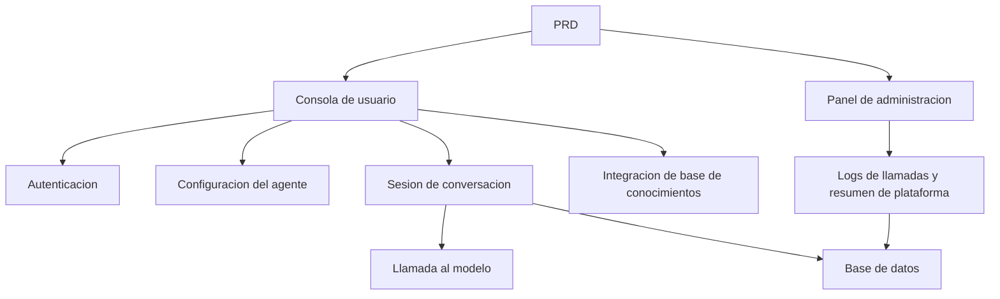

# Desarrollo Practico: Plataforma de Agentes Inteligentes tipo Dify

## Descripcion general

Este proyecto practico te requiere trabajar con un PRD real para completar desde cero una plataforma de agentes inteligentes que replica la experiencia central de Dify. Construiras una consola de usuario, un panel de administracion y un backend de plataforma, implementando funcionalidades principales como gestion de agentes, conversacion, logs y base de conocimientos.

Esta es la seccion de practica integral de la Etapa 2. A diferencia de los proyectos anteriores de pagina unica o funcion unica, este proyecto te exige construir un producto de IA con "sensacion de plataforma", que incluye multiples roles, multiples modulos, persistencia de datos y un pipeline de llamadas a modelos.

## Conocimientos previos

Antes de comenzar este proyecto, ya deberias dominar lo siguiente:

- Diseno de paginas frontend y uso de bibliotecas de componentes ([Diseno UI](../../frontend/ui-design/), [Biblioteca de componentes moderna](../../frontend/modern-component-library/))
- Diseno y desarrollo de interfaces backend ([Escritura de codigo de interfaces](../../backend/ai-interface-code/))
- Fundamentos de bases de datos y Supabase ([De la base de datos a Supabase](../../backend/database-supabase/))
- Flujo de trabajo de Git y despliegue ([Git y GitHub](../../backend/git-workflow/), [Despliegue de aplicaciones web](../../backend/zeabur-deployment/))

## Objetivos de aprendizaje

Despues de completar esta practica, podras:

1. Leer y comprender un PRD real, extrayendo una lista de tareas de desarrollo
2. Disenar la arquitectura de paginas y el modelo de datos de una plataforma de agentes
3. Implementar el ciclo completo de creacion de agentes, conversacion y registro de logs
4. Usar IA para asistir en el desarrollo de productos tipo plataforma
5. Completar la integracion de extremo a extremo, entregando un prototipo de plataforma de IA demostrable

## Introduccion del proyecto

El producto que vas a construir es una plataforma de agentes inteligentes tipo Dify, que incluye dos subsistemas:

| Subsistema | Responsabilidad |
|--------|------|
| **Consola de usuario** | Crear agentes, configurar Prompt, iniciar conversaciones, ver logs, gestionar base de conocimientos |
| **Panel de administracion** | Ver datos de usuarios, uso de recursos de la plataforma, estadisticas de llamadas |

El backend necesita soportar las siguientes capacidades principales: gestion de agentes, gestion de sesiones, almacenamiento de mensajes, llamadas a modelos, registro de logs de llamadas e integracion de base de conocimientos.

::: tip PRD
El documento de requisitos de este proyecto esta en GitHub: [Ver PRD](https://github.com/datawhalechina/easy-vibe/blob/main/docs/es-es/stage-2/assignments/custom-dify-agent-platform/PRD.md)
:::

<div style="margin: 32px 0;">
  <ClientOnly>
    <StepBar :active="0" :items="[
      { title: 'Analisis de requisitos', description: 'Leer el PRD, definir paginas, limites de capacidades, autenticacion y modelo de datos' },
      { title: 'Construccion del esqueleto', description: 'Usar IA para generar los esqueletos de la consola de usuario y el panel de administracion' },
      { title: 'Desarrollo iterativo', description: 'Agregar agentes, conversacion, logs y base de conocimientos modulo por modulo' },
      { title: 'Integracion y despliegue', description: 'Verificar de extremo a extremo, desplegar y preparar la demostracion' }
    ]" />
  </ClientOnly>
</div>

## Primera parte: Analisis de requisitos

### 1.1 Leer el PRD

Abre el documento PRD y responde las siguientes preguntas clave:

- Que elementos deben incluirse en el MVP: agentes, sesiones, logs, base de conocimientos?
- La lista de paginas y rutas esta definida?
- Cual es el alcance de las llamadas a modelos y el registro de logs?
- Multi-tenencia y flujos de trabajo complejos deben excluirse en la primera version?

::: warning
Si no tienes respuestas claras a las preguntas anteriores, no comiences a escribir codigo. La comprension inadecuada de los requisitos es la causa mas comun de retrabajo.
:::

### 1.2 Confirmar la arquitectura del sistema

Segun el PRD, organiza la arquitectura general del sistema:



## Segunda parte: Construccion del esqueleto del proyecto

### 2.1 Generar paginas frontend

Referencia de prompts:

```text
Basandote en el PRD actual, ayudame a generar el esqueleto frontend de una plataforma de agentes inteligentes tipo Dify.

Requisitos:
1. El lado del usuario incluye: inicio de sesion, lista de agentes, configuracion del agente, pagina de conversacion, pagina de logs, pagina de base de conocimientos
2. El lado del administrador incluye: pagina principal del panel, resumen de usuarios, resumen de uso de recursos
3. Primero generar solo la estructura de paginas y datos ficticios, sin conectar interfaces reales
4. El estilo debe parecerse a una plataforma de IA moderna
```

### 2.2 Verificar la estructura de paginas

Verificar item por item:

- [ ] Los puntos de entrada de la consola de usuario y el panel de administracion estan separados
- [ ] Las paginas de lista de agentes, configuracion, conversacion, logs y base de conocimientos estan completas
- [ ] La pagina principal del panel de administracion y el resumen de usuarios son accesibles
- [ ] Los datos ficticios muestran estados basicos de la interfaz

## Tercera parte: Desarrollo iterativo

### 3.1 Avanzar por modulos

Sobre la base del esqueleto, agrega funcionalidades modulo por modulo en el siguiente orden:

1. **Autenticacion**: Registro, inicio de sesion, diferenciacion de roles
2. **Gestion de agentes**: Crear, editar, eliminar, configuracion de Prompt
3. **Funcionalidad de conversacion**: Creacion de sesiones, envio y recepcion de mensajes, llamadas a modelos
4. **Registro de logs**: Tiempo de respuesta, uso de tokens, registro de errores
5. **Integracion de base de conocimientos** (punto extra): Carga de documentos, busqueda, inyeccion de resultados
6. **Panel de administracion**: Datos de usuarios, uso de recursos, estadisticas de llamadas

Despues de completar cada modulo, usa la siguiente tabla para autoverificacion:

| Item de verificacion | Metodo de verificacion |
|--------|----------|
| Consistencia de paginas | El numero de paginas y funcionalidades coincide con el PRD |
| Cierre de interfaces | Las interfaces de agents, chat, logs y knowledge estan completas |
| Aislamiento de permisos | Los usuarios solo pueden gestionar sus propios agentes y sesiones |
| Consistencia de datos | Los datos de messages, logs y documents coinciden |
| Demostrabilidad | Se puede demostrar el ciclo completo "crear agente -> conversar -> ver logs" |

### 3.2 Integracion de base de conocimientos (punto extra)

Si deseas agregar capacidades de base de conocimientos, puedes anadir un "interruptor de base de conocimientos" para cada agente:

- Cuando esta activado, primero busca fragmentos de conocimiento y luego los envia junto con la pregunta del usuario al modelo
- Cuando esta desactivado, responde en modo de conversacion normal

La primera version no necesita implementar RAG complejo; basta con que los resultados de busqueda sean visibles y el pipeline de llamadas sea explicable.

## Cuarta parte: Integracion y despliegue

### 4.1 Pruebas de extremo a extremo

Verificar al menos los siguientes escenarios:

- Registrarse -> Crear agente -> Configurar Prompt -> Iniciar conversacion -> Ver logs
- Iniciar sesion como administrador -> Ver datos de usuarios -> Ver estadisticas de llamadas

Verificacion antes del despliegue:

- [ ] Todas las interfaces principales tienen verificacion de inicio de sesion
- [ ] La verificacion de pertenencia del agente ha pasado
- [ ] Los registros de sesiones y logs se almacenan realmente en la base de datos
- [ ] La clave del modelo usa variables de entorno, sin hardcoding
- [ ] Los mensajes de error son visibles en el frontend, no solo en la consola

### 4.2 Despliegue

Desplegar el proyecto en un entorno publico. Tutorial de despliegue de referencia: [Flujo de trabajo de Git y GitHub](../../backend/git-workflow/), [Despliegue de aplicaciones web](../../backend/zeabur-deployment/).

## Entregables

Despues de completar este proyecto, necesitas enviar lo siguiente:

- [ ] Enlace de demostracion en linea accesible
- [ ] Enlace al repositorio de codigo fuente (incluyendo README)
- [ ] Documento PRD
- [ ] Capturas de pantalla de paginas clave (gestion de agentes, pagina de conversacion, pagina de logs, pagina principal del panel)
- [ ] Video de demostracion de 60 segundos (cubriendo crear agente -> conversar -> ver logs)

El README debe incluir al menos: introduccion del proyecto, descripcion de arquitectura, stack tecnologico, pasos de inicio local, lista de variables de entorno y descripcion de interfaces.

## Criterios de evaluacion

| Dimension | Requisitos basicos | Requisitos avanzados |
|------|---------|---------|
| Completitud de plataforma | Las tres paginas de agents/chat/logs son funcionales | Tiene navegacion clara y lenguaje de diseno unificado |
| Ciclo completo del negocio | Se pueden crear agentes y tener conversaciones reales | Soporta cambio entre multiples agentes e historial de sesiones |
| Datos y seguimiento | Los mensajes y logs de llamadas son consultables | Tiene un dashboard de estadisticas de tokens y tiempo de respuesta |
| Seguridad de permisos | Solo usuarios autenticados pueden acceder a las interfaces principales | La verificacion de pertenencia de recursos es robusta |
| Entrega de ingenieria | Desplegable, demostrable, README claro | Integra base de conocimientos y puede explicar resultados de busqueda |

## Verificacion antes de enviar

<el-card shadow="hover" style="margin: 20px 0; border-radius: 12px;">
  <template #header>
    <div style="font-weight: bold; font-size: 16px;">Revision final antes de enviar</div>
  </template>

  <ul style="list-style-type: none; padding-left: 0;">
    <li><label><input type="checkbox" disabled /> Despues de iniciar sesion se puede acceder a las paginas de gestion de agentes, conversacion y logs</label></li>
    <li><label><input type="checkbox" disabled /> Se puede crear al menos 1 agente y conversar exitosamente</label></li>
    <li><label><input type="checkbox" disabled /> Cada ronda de preguntas y respuestas tiene registros en la base de datos</label></li>
    <li><label><input type="checkbox" disabled /> Cuando una llamada falla, el error es visible en el frontend y se registra en los logs</label></li>
    <li><label><input type="checkbox" disabled /> El proyecto esta desplegado, README y video de demostracion completos</label></li>
  </ul>
</el-card>

## Referencias

- [Diseno UI](../../frontend/ui-design/)
- [Biblioteca de componentes moderna](../../frontend/modern-component-library/)
- [De la base de datos a Supabase](../../backend/database-supabase/)
- [Escritura de codigo de interfaces](../../backend/ai-interface-code/)
- [Flujo de trabajo de Git y GitHub](../../backend/git-workflow/)
- [Despliegue de aplicaciones web](../../backend/zeabur-deployment/)
