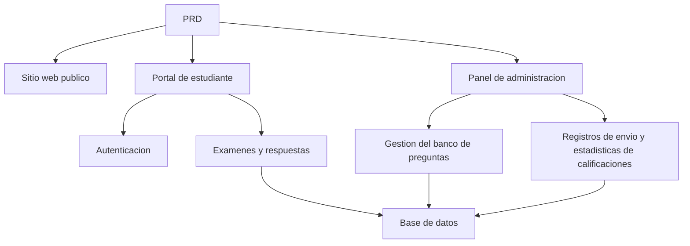

# Desarrollo Practico: Sistema de Examenes en Linea y Gestion

## Descripcion general

Este proyecto practico te requiere trabajar con un PRD real para completar desde cero un sistema de examenes en linea y gestion. Lo especial de este proyecto es que incluye multiples roles (estudiantes y administradores), donde cada rol ve paginas diferentes y puede ejecutar operaciones distintas. Usaras Express para construir el backend e implementar el flujo de negocio completo de examenes.

Esta es la seccion de practica integral de la Etapa 2. Los sistemas de permisos multi-rol son muy comunes en el trabajo real. Una vez que domines este patron, podras enfrentar escenarios de negocio como educacion, SaaS y paneles de administracion.

## Conocimientos previos

Antes de comenzar este proyecto, ya deberias dominar lo siguiente:

- Diseno de paginas frontend y uso de bibliotecas de componentes ([Diseno UI](../../frontend/ui-design/), [Biblioteca de componentes moderna](../../frontend/modern-component-library/))
- Diseno y desarrollo de interfaces backend ([Escritura de codigo de interfaces](../../backend/ai-interface-code/))
- Fundamentos de bases de datos y Supabase ([De la base de datos a Supabase](../../backend/database-supabase/))
- Flujo de trabajo de Git y despliegue ([Git y GitHub](../../backend/git-workflow/), [Despliegue de aplicaciones web](../../backend/zeabur-deployment/))

## Objetivos de aprendizaje

Despues de completar esta practica, podras:

1. Leer y comprender un PRD real, extrayendo una lista de tareas de desarrollo
2. Disenar el control de permisos y las rutas de paginas para un sistema multi-rol
3. Usar Express para implementar una API backend completa
4. Implementar el flujo de negocio de examenes, envio y calificacion automatica
5. Completar la integracion de extremo a extremo, entregando un prototipo de sistema empresarial demostrable

## Introduccion del proyecto

El producto que vas a construir es un sistema de examenes en linea y gestion, que incluye tres subsistemas:

| Subsistema | Responsabilidad |
|--------|------|
| **Sitio web publico** | Introduccion de la plataforma, punto de entrada de inicio de sesion |
| **Portal de estudiante** | Lista de examenes, responder preguntas, enviar, ver calificaciones |
| **Panel de administracion** | Gestion del banco de preguntas, gestion de examenes, registros de envio, estadisticas de calificaciones |

El backend usa Express y necesita soportar: autenticacion de inicio de sesion, permisos de roles, gestion de examenes y banco de preguntas, flujo de envio y calificacion automatica, y gestion de calificaciones y estadisticas.

::: tip PRD
El documento de requisitos de este proyecto esta en GitHub: [Ver PRD](https://github.com/datawhalechina/easy-vibe/blob/main/docs/es-es/stage-2/assignments/exam-management-express/PRD.md)
:::

<div style="margin: 32px 0;">
  <ClientOnly>
    <StepBar :active="0" :items="[
      { title: 'Analisis de requisitos', description: 'Leer el PRD, definir roles, paginas, flujo de examenes y modelo de datos' },
      { title: 'Construccion del esqueleto', description: 'Usar IA para generar el esqueleto de paginas del portal de estudiante y el panel de administracion' },
      { title: 'Desarrollo backend', description: 'Conectar con Express el inicio de sesion, examenes, envio y calificacion' },
      { title: 'Integracion y despliegue', description: 'Verificar de extremo a extremo, desplegar y preparar la demostracion' }
    ]" />
  </ClientOnly>
</div>

## Primera parte: Analisis de requisitos

### 1.1 Leer el PRD

Abre el documento PRD y responde las siguientes preguntas clave:

- Cuales roles tiene el sistema? Que puede hacer cada uno?
- La lista de paginas esta completa? Cuales paginas tiene el portal de estudiante y el panel de administracion respectivamente?
- Que tipos de preguntas se soportan? Cual es la logica de calificacion para cada tipo?
- Cual es el flujo completo del examen? (Publicar -> Comenzar -> Responder -> Enviar -> Calificar -> Ver calificaciones)

::: warning
Si no tienes respuestas claras a las preguntas anteriores, no comiences a escribir codigo. La comprension inadecuada de los requisitos es la causa mas comun de retrabajo.
:::

### 1.2 Confirmar la arquitectura del sistema

Segun el PRD, organiza la arquitectura general del sistema:



## Segunda parte: Construccion del esqueleto del proyecto

### 2.1 Generar paginas frontend

Referencia de prompts:

```text
Basandote en el PRD actual, ayudame a generar el esqueleto frontend de un sistema de examenes en linea y gestion.

Requisitos de stack tecnologico:
- Next.js App Router
- TypeScript
- Tailwind CSS
- shadcn/ui

Lista de paginas:
1. Inicio /
2. Pagina de inicio de sesion /login
3. Lista de examenes del estudiante /student/exams
4. Pagina de respuestas del estudiante /student/exams/[id]
5. Pagina de calificaciones del estudiante /student/history
6. Pagina principal del panel de administracion /admin
7. Gestion de examenes /admin/exams
8. Gestion del banco de preguntas /admin/questions
9. Registros de envio /admin/submissions

Requisitos:
- Las paginas del portal de estudiante deben enfatizar claridad, enfoque y facilidad de respuesta
- Las paginas del panel de administracion usan layout de barra lateral + barra superior
- Primero usar datos mock, sin conectar interfaces reales
- Considerar la usabilidad basica en escritorio y movil
```

### 2.2 Mejorar la pagina de respuestas del estudiante

La pagina de respuestas es la pagina principal del portal de estudiante. Enfocate en lo siguiente:

```text
Continua mejorando la pagina de respuestas del estudiante.

Esta es la pagina de respuestas de un sistema de examenes en linea y necesita incluir:
- La parte superior muestra el titulo del examen, cuenta regresiva y numero de preguntas respondidas
- La parte central muestra el enunciado y las opciones
- Soporta tres tipos de preguntas: opcion multiple, verdadero/falso y respuesta corta
- A la izquierda o arriba hay una tarjeta de respuestas que muestra si cada pregunta ha sido respondida
- Antes de enviar, aparece un dialogo de confirmacion

Primero implementa la interaccion con datos mock, sin conectar interfaces reales.

Requisitos:
- La interfaz debe ser limpia, no como una pagina de tabla de administracion
- La cuenta regresiva debe ser visible pero sin crear demasiada presion
- Incluir estados vacios y estados de loading
```

### 2.3 Mejorar el panel de administracion

La primera version del panel de administracion se enfoca en tres areas principales:

- **Gestion de examenes**: Crear examenes, establecer duracion, estado de publicacion
- **Gestion del banco de preguntas**: Agregar preguntas, editar preguntas, filtrar por tipo
- **Registros de envio**: Ver envios de estudiantes, calificaciones, tiempo

### 2.4 Verificar la estructura de paginas

Verificar item por item:

- [ ] Los puntos de entrada del portal de estudiante y el panel de administracion estan separados
- [ ] Las paginas de inicio de sesion, lista de examenes, respuestas y calificaciones estan completas
- [ ] Las paginas de banco de preguntas, gestion de examenes y registros de envio del panel son accesibles
- [ ] El estilo de las paginas del portal de estudiante y el panel de administracion es claramente diferenciado

### Encontraste un obstaculo?

Si te quedas atascado en la etapa de construccion del frontend, puedes revisar estos capitulos:

- [De la base de datos a Supabase](../../backend/database-supabase/)
- [Diseno y desarrollo de interfaces backend](../../backend/ai-interface-code/)
- [Biblioteca de componentes moderna](../../frontend/modern-component-library/)

## Tercera parte: Desarrollo backend

### 3.1 Inicio de sesion y control de permisos

```text
Tratame como un principiante total y ayudame a implementar el inicio de sesion y control de permisos del sistema de examenes en linea.

El backend usa Express.

Objetivos:
1. Tanto estudiantes como administradores pueden iniciar sesion
2. Despues de iniciar sesion se devuelve el rol del usuario
3. Los estudiantes solo pueden acceder a las interfaces /student/*
4. Los administradores solo pueden acceder a las interfaces /admin/*
5. Los usuarios no autenticados son redirigidos a /login cuando acceden a paginas protegidas

Requisitos de implementacion:
- Proporcionar una sugerencia clara de estructura de directorios
- Explicar claramente las responsabilidades del middleware
- No hacer hardcoding de variables de entorno
- Despues de completar, explicar como verificar que los permisos funcionan correctamente
```

### 3.2 Interfaces de gestion de examenes y banco de preguntas

Se recomienda implementar por los siguientes modulos:

| Modulo | Interfaces recomendadas |
|------|----------|
| Gestion de examenes | `GET /api/exams`, `POST /api/admin/exams`, `PATCH /api/admin/exams/:id` |
| Gestion del banco de preguntas | `GET /api/admin/questions`, `POST /api/admin/questions` |
| Iniciar examen | `POST /api/submissions/start` |
| Enviar examen | `POST /api/submissions/:id/submit` |
| Registros de calificaciones | `GET /api/student/history`, `GET /api/admin/submissions` |

Referencia de prompts:

```text
Ayudame a disenar e implementar la API Express para el sistema de examenes en linea.

Alcance funcional:
- El administrador crea examenes
- El administrador gestiona el banco de preguntas
- El estudiante ve los examenes publicados
- El estudiante comienza un examen y crea un submission
- El estudiante envia respuestas y se califican automaticamente las preguntas de opcion multiple y verdadero/falso
- Las preguntas de respuesta corta se marcan como pendientes de revision
- El estudiante ve su historial de calificaciones
- El administrador ve todos los registros de envio

Requisitos:
- Nombres de interfaces claros
- Estructura JSON de retorno unificada
- Separar capas de controller, service, middleware y db en el codigo
- Explicar como probar cada interfaz
```

### 3.3 Logica de calificacion

La logica de calificacion es la regla de negocio principal del sistema de examenes:

- **Preguntas de opcion multiple**: Si la respuesta del usuario coincide con la respuesta correcta, obtiene puntos
- **Preguntas de verdadero/falso**: Igualmente se pueden calificar automaticamente
- **Preguntas de respuesta corta**: En la primera version solo se guarda la respuesta, la calificacion queda vacia y el estado es `reviewed = false`

::: tip Punto extra
Si deseas agregar capacidades de IA, puedes permitir que el administrador ingrese "tema + dificultad" en el panel para que el modelo genere un lote de preguntas candidatas, que luego se revisan manualmente antes de agregarlas al banco de preguntas. Sin embargo, esto es un punto extra y no es obligatorio.
:::

## Cuarta parte: Integracion y despliegue

### 4.1 Pruebas de extremo a extremo

Verificar al menos los siguientes escenarios:

- Iniciar sesion como estudiante -> Ver lista de examenes -> Comenzar a responder -> Enviar -> Ver calificaciones
- Iniciar sesion como administrador -> Crear examen -> Agregar preguntas -> Publicar -> Ver registros de envio

### 4.2 Despliegue

- Desplegar el frontend en Vercel / Zeabur
- Desplegar la API Express en Zeabur / Railway / Render
- Usar Supabase Postgres o PostgreSQL gestionado para la base de datos

Verificacion antes del despliegue:

- [ ] Las variables de entorno estan completas
- [ ] Las URLs de la API frontend y backend son correctas
- [ ] El estado de inicio de sesion funciona correctamente en produccion
- [ ] La cuenta de administrador puede acceder realmente al panel
- [ ] El README incluye instrucciones de inicio, despliegue y pruebas

## Entregables

Despues de completar este proyecto, necesitas enviar lo siguiente:

- [ ] Enlace de demostracion en linea accesible
- [ ] Enlace al repositorio de codigo fuente (incluyendo README)
- [ ] Documento PRD
- [ ] Capturas de pantalla de paginas clave (inicio, lista de examenes del estudiante, pagina de respuestas, panel de administracion)
- [ ] Video de demostracion de 60 segundos (cubriendo el flujo de respuestas del estudiante y el flujo de gestion del administrador)

El README debe incluir al menos: introduccion del proyecto, descripcion de paginas principales, stack tecnologico, pasos de inicio local y lista de variables de entorno.

## Criterios de evaluacion

| Dimension | Requisitos basicos | Requisitos avanzados |
|------|---------|---------|
| Completitud de paginas | Las paginas principales del portal de estudiante y el panel de administracion son accesibles | El estilo de las paginas es unificado y basicamente util en movil |
| Ciclo completo del negocio | El estudiante puede iniciar sesion, tomar examenes, enviar y ver calificaciones | El administrador puede crear y publicar examenes completamente |
| Correccion de datos | Despues de enviar respuestas se escriben en la base de datos y las preguntas objetivas se califican automaticamente | Las preguntas de respuesta corta soportan revision manual o asistencia de IA |
| Control de permisos | Los limites de acceso entre estudiantes y administradores son claros | Las interfaces del servidor tambien tienen verificacion de roles |
| Entrega de ingenieria | El proyecto es ejecutable, desplegable y el README es claro | Tiene video de demostracion e instrucciones de pruebas |

## Verificacion antes de enviar

<el-card shadow="hover" style="margin: 20px 0; border-radius: 12px;">
  <template #header>
    <div style="font-weight: bold; font-size: 16px;">Revision final antes de enviar</div>
  </template>

  <ul style="list-style-type: none; padding-left: 0;">
    <li><label><input type="checkbox" disabled /> Las paginas de inicio, inicio de sesion, portal de estudiante y panel de administracion estan completas</label></li>
    <li><label><input type="checkbox" disabled /> El estudiante puede iniciar un examen y enviar respuestas normalmente</label></li>
    <li><label><input type="checkbox" disabled /> El administrador puede crear examenes y ver registros de envio</label></li>
    <li><label><input type="checkbox" disabled /> Las calificaciones de preguntas objetivas se calculan automaticamente y se escriben en la base de datos</label></li>
    <li><label><input type="checkbox" disabled /> Los limites de permisos entre estudiantes y administradores han sido verificados</label></li>
    <li><label><input type="checkbox" disabled /> El proyecto esta desplegado o tiene instrucciones completas para ejecucion local</label></li>
  </ul>
</el-card>

## Referencias

- [Diseno UI](../../frontend/ui-design/)
- [Biblioteca de componentes moderna](../../frontend/modern-component-library/)
- [De la base de datos a Supabase](../../backend/database-supabase/)
- [Escritura de codigo de interfaces](../../backend/ai-interface-code/)
- [Flujo de trabajo de Git y GitHub](../../backend/git-workflow/)
- [Despliegue de aplicaciones web](../../backend/zeabur-deployment/)
