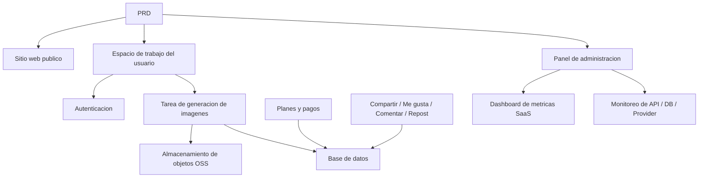

# Desarrollo Practico: SaaS de Generacion de Imagenes con IA Moderna

## Descripcion general

Este proyecto practico te requiere trabajar con un PRD real (documento de requisitos del producto) para completar desde cero un producto SaaS de generacion de imagenes con IA que toma como referencia la experiencia de Midjourney. Experimentaras el proceso completo de analisis de requisitos, descomposicion del proyecto, desarrollo iterativo e integracion y despliegue.

Esta es la seccion de practica integral de la Etapa 2. En los capitulos anteriores, ya has aprendido por separado habilidades individuales como diseno de paginas frontend, desarrollo de interfaces backend, operaciones de base de datos e integracion de pagos. Este proyecto te exige conectar todas estas habilidades para entregar un prototipo de producto funcional.

## Conocimientos previos

Antes de comenzar este proyecto, ya deberias dominar lo siguiente:

- Diseno de paginas frontend y uso de bibliotecas de componentes ([Diseno UI](../../frontend/ui-design/), [Biblioteca de componentes moderna](../../frontend/modern-component-library/))
- Diseno y desarrollo de interfaces backend ([Escritura de codigo de interfaces](../../backend/ai-interface-code/))
- Fundamentos de bases de datos y Supabase ([De la base de datos a Supabase](../../backend/database-supabase/))
- Integracion de pagos ([Sistema de pagos Stripe](../../backend/stripe-payment/))
- Flujo de trabajo de Git y despliegue ([Git y GitHub](../../backend/git-workflow/), [Despliegue de aplicaciones web](../../backend/zeabur-deployment/))

## Objetivos de aprendizaje

Despues de completar esta practica, podras:

1. Leer y comprender un PRD real, extrayendo una lista de tareas de desarrollo
2. Dividir modulos basandote en el PRD, formulando un plan de avance paso a paso
3. Usar IA para asistir en la construccion del esqueleto frontend y el desarrollo de interfaces backend
4. Verificar y optimizar iterativamente cada modulo
5. Completar la integracion de extremo a extremo, llevando el proyecto de "funcional" a "entregable"

## Introduccion del proyecto

El producto que vas a construir es una plataforma SaaS moderna de generacion de imagenes con IA, que incluye tres subsistemas:

| Subsistema | Responsabilidad |
|--------|------|
| **Sitio web publico** | Introduccion del producto, precios, FAQ, conversion de registro |
| **Espacio de trabajo del usuario** | Entrada de Prompt, generacion de imagenes, galeria, creditos, planes, interaccion comunitaria |
| **Panel de administracion** | Gestion de usuarios, gestion de tareas, gestion de pagos, moderacion de contenido, metricas SaaS, monitoreo del sistema |

El backend necesita soportar las siguientes capacidades principales: autenticacion de usuarios, tareas de generacion de imagenes, almacenamiento de objetos OSS, creditos y pagos de planes, interaccion social de imagenes y monitoreo de datos operativos.

::: tip PRD
El documento de requisitos de este proyecto esta en GitHub: [Ver PRD](https://github.com/datawhalechina/easy-vibe/blob/main/docs/es-es/stage-2/assignments/modern-landing-page/PRD.md)
:::

<div style="margin: 32px 0;">
  <ClientOnly>
    <StepBar :active="0" :items="[
      { title: 'Analisis de requisitos', description: 'Leer el PRD, extraer paginas, modulos, modelo de datos y limites' },
      { title: 'Construccion del esqueleto', description: 'Usar IA para generar tres esqueletos frontend (www / app / admin)' },
      { title: 'Desarrollo iterativo', description: 'Agregar interfaces, permisos, pagos y monitoreo modulo por modulo' },
      { title: 'Integracion y despliegue', description: 'Verificar de extremo a extremo, desplegar y preparar la demostracion' }
    ]" />
  </ClientOnly>
</div>

## Primera parte: Analisis de requisitos

### 1.1 Leer el PRD

Abre el documento PRD y responde las siguientes preguntas clave:

- Cuantos puntos de entrada tiene el sistema? Que paginas cubre cada uno?
- Cual es la funcionalidad principal de cada pagina?
- Que modulos y tablas de base de datos incluye el backend?
- Cual es el alcance del MVP? Que se incluye y que se excluye en la primera version?

::: warning
Si no tienes respuestas claras a las preguntas anteriores, no comiences a escribir codigo. La comprension inadecuada de los requisitos es la causa mas comun de retrabajo.
:::

### 1.2 Confirmar la arquitectura del sistema

Segun la descripcion del PRD, organiza la arquitectura general del sistema:



Se recomienda dibujar el diagrama de arquitectura con tus propias palabras para confirmar que tu comprension del sistema es completa.

## Segunda parte: Construccion del esqueleto del proyecto

### 2.1 Generar paginas frontend

Usa IA para generar primero la estructura basica y los datos ficticios de todas las paginas. El objetivo de este paso es construir la arquitectura de informacion y las rutas, sin necesidad de conectar interfaces reales.

Referencia de prompts:

```text
Basandote en el PRD actual, ayudame a generar el esqueleto frontend de un SaaS moderno de generacion de imagenes con IA.

Requisitos:
1. Dividido en tres puntos de entrada: www, app, admin
2. El sitio web incluye: inicio, precios, FAQ
3. La app incluye: inicio de sesion, registro, espacio de trabajo de generacion, galeria, planes, creditos, comunidad, detalle de obras, centro personal
4. El panel incluye: pagina principal, gestion de usuarios, gestion de tareas, gestion de contenido, gestion de planes, ordenes de pago, configuracion operativa, metricas SaaS, monitoreo del sistema
5. Primero generar solo la estructura de paginas y datos ficticios, sin conectar interfaces reales
6. Estilo referenciado en Midjourney: simple, moderno y con sensacion de producto
```

### 2.2 Verificar la estructura de paginas

Despues de generar el esqueleto, verificar item por item:

- [ ] Las rutas de los tres puntos de entrada son independientes (`/`, `/app`, `/admin`)
- [ ] El numero de paginas coincide con el PRD
- [ ] Cada pagina es accesible y navegable
- [ ] Los datos ficticios muestran estados basicos de la interfaz (listas, estados vacios, formularios, etc.)

## Tercera parte: Desarrollo iterativo

### 3.1 Avanzar por modulos

Sobre la base del esqueleto, agrega funcionalidades modulo por modulo en el siguiente orden:

1. **Autenticacion**: Registro, inicio de sesion, diferenciacion de roles
2. **Base de datos**: Creacion de tablas, interfaces de lectura y escritura
3. **Negocio principal**: Tareas de generacion de imagenes, almacenamiento de resultados
4. **Almacenamiento OSS**: Carga y acceso de imagenes
5. **Pagos**: Planes, creditos, integracion con Stripe
6. **Interaccion social**: Compartir, me gusta, comentarios
7. **Panel de administracion**: Gestion de usuarios, gestion de tareas, moderacion de contenido
8. **Monitoreo de datos**: Dashboard de metricas SaaS, monitoreo del sistema

Despues de completar cada modulo, usa la siguiente tabla para autoverificacion:

| Item de verificacion | Metodo de verificacion |
|--------|----------|
| Consistencia de paginas | El numero de paginas, puntos de entrada y funcionalidades coinciden con el PRD |
| Correccion de interfaces | Los parametros de solicitud, estructura de respuesta y manejo de estados son razonables |
| Aislamiento de permisos | Los usuarios normales y administradores estan mutuamente aislados |
| Consistencia de datos | Base de datos, OSS, pagos y creditos coinciden |
| Demostrabilidad | Se puede demostrar un flujo de negocio completo a otra persona |

::: tip
Si encuentras que el contenido generado por IA se desvia del PRD, no vuelvas a hacer toda la pagina desde cero; simplemente pidele que modifique los modulos especificos.
:::

### 3.2 Roles y responsabilidades

Durante la iteracion, necesitas asumir tres roles simultaneamente:

- **Gerente de producto**: Confirmar que la funcionalidad de cada modulo cumple con el PRD
- **Lider tecnico**: Confirmar que la solucion de implementacion es razonable
- **Ingeniero de pruebas**: Confirmar que la funcionalidad funciona correctamente

## Cuarta parte: Integracion y despliegue

### 4.1 Pruebas de extremo a extremo

El enfoque de la etapa final no es agregar nuevas paginas, sino hacer que el flujo de negocio completo funcione. Verificar al menos los siguientes escenarios:

- Registrarse -> Comprar creditos -> Generar imagen -> Ver historial -> Compartir e interactuar
- Iniciar sesion como administrador -> Ver datos de usuarios -> Ver estadisticas de tareas -> Ver monitoreo del sistema

### 4.2 Despliegue

Desplegar el proyecto en un entorno publico, asegurando:

- Las variables de entorno estan completamente configuradas
- La URL de callback de inicio de sesion es correcta
- La URL de callback de pago es correcta
- Las paginas no carecen de estados de loading, estados vacios ni mensajes de error

Tutorial de despliegue de referencia: [Flujo de trabajo de Git y GitHub](../../backend/git-workflow/), [Despliegue de aplicaciones web](../../backend/zeabur-deployment/).

## Entregables

Despues de completar este proyecto, necesitas enviar lo siguiente:

- [ ] Enlace de demostracion en linea accesible
- [ ] Enlace al repositorio de codigo fuente (incluyendo README)
- [ ] Documento PRD
- [ ] Capturas de pantalla de paginas clave (inicio del sitio web, espacio de trabajo de generacion, galeria, pagina de planes, pagina principal del panel)
- [ ] Video de demostracion de 60 segundos (cubriendo registro -> generacion -> visualizacion -> panel de administracion)

El README debe incluir al menos: introduccion del proyecto, descripcion de paginas principales, stack tecnologico, pasos de inicio local y lista de variables de entorno.

## Criterios de evaluacion

| Dimension | Requisitos basicos | Requisitos avanzados |
|------|---------|---------|
| Alineacion con PRD | Paginas, funcionalidades y estructura de datos basicamente cumplen con el PRD | Puede explicar claramente la correspondencia entre cada decision de diseno y el PRD |
| Ciclo completo del producto | Registrarse -> Comprar creditos -> Generar imagen -> Ver historial -> Compartir e interactuar funciona completamente | Los estados de pago, saldo de creditos y numero de generaciones son consistentes |
| Capacidades del panel | Gestion de usuarios, tareas, pagos y contenido son consultables | El dashboard de metricas SaaS y la pagina de monitoreo del sistema son funcionales |
| Completitud de ingenieria | Frontend, backend, base de datos, OSS y pipeline de pagos conectados | Tiene manejo de errores, estados vacios y estados de loading |
| Calidad de entrega | Desplegable y ejecutable | README claro, video de demostracion con estructura completa |

## Referencias

- [Diseno UI](../../frontend/ui-design/)
- [Diseno de paginas y botones con especificaciones UI](../../frontend/multi-product-ui/)
- [Mejorar la apariencia de la interfaz con LLM y Skills](../../frontend/llm-skills-beautiful/)
- [De prototipo de diseno a codigo del proyecto](../../frontend/design-to-code/)
- [Biblioteca de componentes moderna](../../frontend/modern-component-library/)
- [De la base de datos a Supabase](../../backend/database-supabase/)
- [Escritura de codigo de interfaces](../../backend/ai-interface-code/)
- [Flujo de trabajo de Git y GitHub](../../backend/git-workflow/)
- [Despliegue de aplicaciones web](../../backend/zeabur-deployment/)
- [Sistema de pagos Stripe](../../backend/stripe-payment/)
