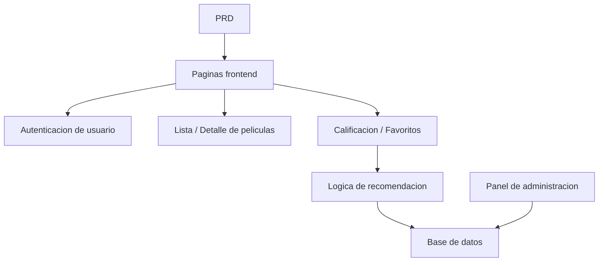

# Desarrollo Practico: Sistema de Recomendacion de Peliculas con Spring Boot

## Descripcion general

Este proyecto practico te requiere trabajar con un PRD real para completar un sitio web de peliculas con capacidades de recomendacion usando Spring Boot. El desafio central de este proyecto radica en que no es un simple CRUD, sino que necesitas reflexionar sobre como el comportamiento del usuario afecta los resultados de recomendacion y como hacer que las recomendaciones sean explicables.

Esta es la seccion de practica integral de la Etapa 2. Por primera vez te enfrentarás al desarrollo de un producto de tipo "contenido + comportamiento + recomendacion", un patron muy comun en comercio electronico, plataformas de contenido y feeds personalizados.

## Conocimientos previos

Antes de comenzar este proyecto, ya deberias dominar lo siguiente:

- Diseno de paginas frontend y uso de bibliotecas de componentes ([Diseno UI](../../frontend/ui-design/), [Biblioteca de componentes moderna](../../frontend/modern-component-library/))
- Diseno y desarrollo de interfaces backend ([Escritura de codigo de interfaces](../../backend/ai-interface-code/))
- Fundamentos de bases de datos y Supabase ([De la base de datos a Supabase](../../backend/database-supabase/))
- Flujo de trabajo de Git y despliegue ([Git y GitHub](../../backend/git-workflow/), [Despliegue de aplicaciones web](../../backend/zeabur-deployment/))

## Objetivos de aprendizaje

Despues de completar esta practica, podras:

1. Leer un PRD y extraer la lista de tareas de desarrollo para un sistema de recomendacion
2. Usar Spring Boot para construir un proyecto backend e implementar API RESTful
3. Disenar el flujo de datos completo de "comportamiento del usuario a recomendacion"
4. Implementar logica de recomendacion explicable
5. Completar la integracion de extremo a extremo, entregando un prototipo de producto demostrable

## Introduccion del proyecto

El producto que vas a construir es un sitio web de peliculas con capacidades de recomendacion:

| Funcionalidad | Descripcion |
|------|------|
| **Navegacion y busqueda** | Los usuarios pueden navegar y buscar peliculas |
| **Calificacion y favoritos** | Los usuarios pueden calificar peliculas y agregarlas a favoritos |
| **Recomendacion personalizada** | El sistema genera resultados de recomendacion basados en el comportamiento del usuario |
| **Panel de administracion** | Los administradores mantienen los datos de peliculas y revisan la efectividad de las recomendaciones |

::: tip PRD
El documento de requisitos de este proyecto esta en GitHub: [Ver PRD](https://github.com/datawhalechina/easy-vibe/blob/main/docs/es-es/stage-2/assignments/movie-recommendation-springboot/PRD.md)
:::

<div style="margin: 32px 0;">
  <ClientOnly>
    <StepBar :active="0" :items="[
      { title: 'Analisis de requisitos', description: 'Leer el PRD, definir la estrategia de recomendacion, datos de comportamiento y alcance del panel' },
      { title: 'Construccion del esqueleto', description: 'Usar IA para generar las paginas de lista, detalle, recomendacion y panel de administracion' },
      { title: 'Desarrollo iterativo', description: 'Agregar logica de recomendacion, registro de comportamiento y panel de administracion' },
      { title: 'Integracion y despliegue', description: 'Verificar de extremo a extremo, desplegar y preparar la demostracion' }
    ]" />
  </ClientOnly>
</div>

## Primera parte: Analisis de requisitos

### 1.1 Leer el PRD

Abre el documento PRD y responde las siguientes preguntas clave:

- Cual es la estrategia de recomendacion? La primera version debe usar una version explicable (como similitud de calificaciones)?
- Que datos de comportamiento del usuario deben almacenarse? (calificaciones, favoritos, historial de navegacion, etc.)
- Que metricas de efectividad de recomendacion necesita ver el administrador?
- La lista de paginas esta completa?

::: warning
Si no tienes respuestas claras a las preguntas anteriores, no comiences a escribir codigo. La comprension inadecuada de los requisitos es la causa mas comun de retrabajo.
:::

### 1.2 Confirmar la arquitectura del sistema



## Segunda parte: Construccion del esqueleto del proyecto

### 2.1 Generar paginas frontend

Referencia de prompts:

```text
Basandote en el PRD actual, ayudame a generar el esqueleto frontend de un sistema de recomendacion de peliculas con Spring Boot.

Requisitos:
1. Paginas incluidas: inicio, lista de peliculas, detalle de pelicula, pagina de recomendacion, centro personal, panel de administracion
2. Primero generar solo la estructura de paginas y datos ficticios, sin conectar interfaces reales
3. El estilo debe parecerse a un producto de contenido real, no a un demo de clase
```

### 2.2 Verificar la estructura de paginas

Verificar item por item:

- [ ] La pagina de lista de peliculas soporta busqueda y filtrado
- [ ] La pagina de detalle de pelicula incluye botones de calificacion y favoritos
- [ ] La pagina de recomendacion puede mostrar resultados y razones de recomendacion
- [ ] El panel de administracion puede mostrar datos de peliculas y efectividad de recomendacion

## Tercera parte: Desarrollo iterativo

### 3.1 Avanzar por modulos

1. **Configuracion del proyecto Spring Boot**: Estructura del proyecto, configuracion de base de datos, CRUD basico
2. **Gestion de datos de peliculas**: Lista de peliculas, detalle, interfaz de busqueda
3. **Comportamiento del usuario**: Interfaces de calificacion y favoritos, escritura de datos de comportamiento
4. **Logica de recomendacion**: Implementacion del algoritmo de recomendacion basado en comportamiento del usuario
5. **Visualizacion de recomendaciones**: Mostrar resultados de recomendacion incluyendo las razones
6. **Panel de administracion**: Mantenimiento de datos de peliculas, revision de efectividad de recomendacion

### 3.2 Autoverificacion de modulos

| Item de verificacion | Metodo de verificacion |
|--------|----------|
| Funcionalidad basica | Lista, detalle, calificacion, favoritos forman un ciclo completo |
| Vinculacion de recomendacion | El comportamiento del usuario afecta los resultados de recomendacion |
| Explicabilidad de recomendacion | El usuario puede entender por que se le recomiendan estas peliculas |
| Datos del panel | El administrador puede ver datos de peliculas y efectividad de recomendacion |

## Cuarta parte: Integracion y despliegue

### 4.1 Pruebas de extremo a extremo

Verificar al menos los siguientes escenarios:

- Navegar peliculas -> Calificar -> Agregar a favoritos -> Ver pagina de recomendacion, confirmar que los resultados de recomendacion cambian
- Iniciar sesion como administrador -> Agregar peliculas -> Ver estadisticas de efectividad de recomendacion

## Entregables

Despues de completar este proyecto, necesitas enviar lo siguiente:

- [ ] Enlace de demostracion en linea accesible
- [ ] Enlace al repositorio de codigo fuente (incluyendo README)
- [ ] Documento PRD
- [ ] Capturas de pantalla de paginas clave (lista de peliculas, detalle de pelicula, pagina de recomendacion, panel de administracion)
- [ ] Video de demostracion de 60 segundos

## Criterios de evaluacion

| Dimension | Requisitos basicos | Requisitos avanzados |
|------|---------|---------|
| Alineacion con PRD | Paginas, funcionalidades y estructura de datos basicamente cumplen con el PRD | Puede explicar claramente las decisiones de diseno |
| Ciclo completo del producto | Navegar -> Calificar -> Agregar a favoritos -> Recomendar funciona completamente | El comportamiento de calificacion afecta significativamente los resultados de recomendacion |
| Calidad de recomendacion | Resultados de recomendacion razonables, razones de recomendacion explicables | Soporta multiples estrategias de recomendacion |
| Capacidades del panel | Datos de peliculas y efectividad de recomendacion visibles | Tiene metricas estadisticas como precision de recomendacion |
| Completitud de ingenieria | Frontend, backend Spring Boot y base de datos conectados | Las interfaces de recomendacion tienen cache u optimizacion de rendimiento |

## Referencias

- [Diseno UI](../../frontend/ui-design/)
- [Biblioteca de componentes moderna](../../frontend/modern-component-library/)
- [De la base de datos a Supabase](../../backend/database-supabase/)
- [Escritura de codigo de interfaces](../../backend/ai-interface-code/)
- [Flujo de trabajo de Git y GitHub](../../backend/git-workflow/)
- [Despliegue de aplicaciones web](../../backend/zeabur-deployment/)
