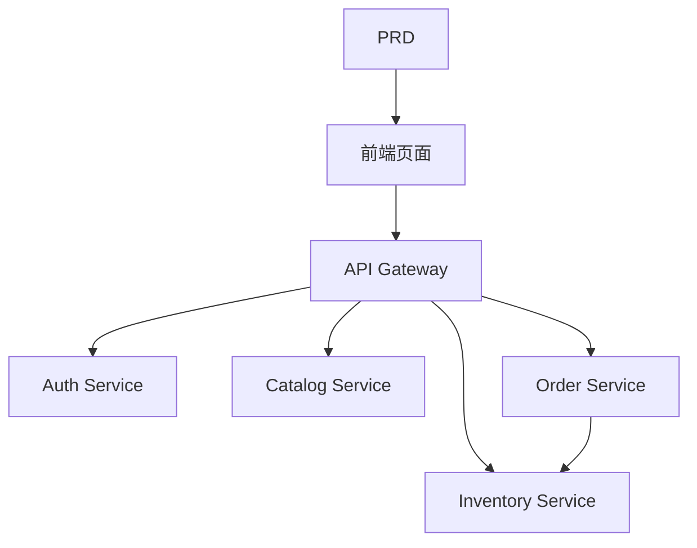

# 生鲜电商微服务系统开发实战

## Descripcion general

Este proyecto practico te requiere trabajar con un PRD real，completar desde cero un生鲜电商微服务系统。与前面的单服务项目不同，这个项目的后端按业务拆分成多个独立服务，通过 API 网关统一对外。你将学习如何设计服务边界、如何处理跨服务的Consistencia de datos问题。

Esta es la seccion de practica integral de la Etapa 2。微服务架构在实际工作中非常常见，掌握服务拆分和网关路由的基本思路后，你能够应对更复杂的后端系统设计。

## Conocimientos previos

Antes de comenzar este proyecto, ya deberias dominar lo siguiente:

- Diseno de paginas frontend y uso de bibliotecas de componentes（[UI 设计](../../frontend/ui-design/)、[现代组件库](../../frontend/modern-component-library/)）
- Diseno y desarrollo de interfaces backend（[接口代码编写](../../backend/ai-interface-code/)）
- Fundamentos de bases de datos y Supabase（[从数据库到 Supabase](../../backend/database-supabase/)）
- Flujo de trabajo de Git y despliegue（[Git 和 GitHub](../../backend/git-workflow/)、[Despliegue Web 应用](../../backend/zeabur-deployment/)）

## Objetivos de aprendizaje

Despues de completar esta practica, podras:

1. Leer el PRD 并提取微服务系统的开发任务清单
2. Divir los limites de servicios por dominio de negocio (autenticacion, productos, inventario, ordenes)
3. Disenar e implementar el enrutamiento del API Gateway
4. Manejar problemas entre servicios como deduccion de inventario y consistencia de ordenes
5. Completar la integracion de extremo a extremo, entregando un prototipo de microservicios demostrable

## Introduccion del proyecto

El producto que vas a construir es一个生鲜电商微服务系统：

| Subsistema | Responsabilidad |
|--------|------|
| **Portal de usuario** | Navegar productos, hacer pedidos, ver ordenes |
| **Portal de administracion** | Gestion de productos, gestion de inventario, gestion de ordenes |

后端按业务拆分为以下服务：

| 服务 | Responsabilidad |
|------|------|
| **API Gateway** | Entrada unificada, enrutamiento, verificacion de autenticacion |
| **Auth Service** | Registro de usuarios, login, emision de JWT |
| **Catalog Service** | Gestion de informacion de productos |
| **Inventory Service** | Gestion de cantidades de inventario |
| **Order Service** | Creacion de ordenes, gestion de estados |

::: tip PRD 入口
El documento de requisitos de este proyecto esta en GitHub： [Ver PRD](https://github.com/datawhalechina/easy-vibe/blob/main/docs/es-es/stage-2/assignments/simple-grocery-microservices/PRD.md)
:::

<div style="margin: 32px 0;">
  <ClientOnly>
    <StepBar :active="0" :items="[
      { title: 'Analisis de requisitos', description: 'Leer el PRD，明确服务拆分、页面和交易链路' },
      { title: 'Construccion del esqueleto', description: '生成前端、网关和各服务骨架' },
      { title: 'Desarrollo iterativo', description: '逐模块补接口、修库存与订单一致性' },
      { title: 'Integracion y despliegue', description: 'Verificar de extremo a extremo，Desplegar y preparar la demostracion' }
    ]" />
  </ClientOnly>
</div>

## Primera parte：Analisis de requisitos

### 1.1 Leer el PRD

打开 PRD 文档，重点回答以下问题：

- 服务如何拆分？每个服务的Responsabilidad边界是什么？
- 前台和Portal de administracion分别有哪些页面？
- 下单后库存扣减的策略是什么？成功 / 失败 / 超时各怎么处理？
- 第一版哪些复杂能力（如分布式事务、消息队列）先不做？

::: warning
Si no tienes respuestas claras a las preguntas anteriores, no comiences a escribir codigo. La comprension inadecuada de los requisitos es la causa mas comun de retrabajo.
:::

### 1.2 Confirmar la arquitectura del sistema



## Segunda parte：搭建项目骨架

### 2.1 生成项目结构

Referencia de prompts：

```text
请基于当前 PRD，帮我生成一个生鲜电商微服务系统的项目骨架。

要求：
1. 生成前端Portal de usuario和Portal de administracion骨架
2. 生成 api-gateway、auth-service、catalog-service、inventory-service、order-service 五个目录
3. 每个服务先只做最小可运行入口
4. 先不接真实数据库和支付
```

### 2.2 验证项目结构

Verificar item por item:

- [ ] 五个服务目录结构清晰
- [ ] API Gateway 可以启动并转发请求
- [ ] 各服务健康检查接口可用
- [ ] 前端Portal de usuario和Portal de administracion页面可访问

## Tercera parte：Desarrollo iterativo

### 3.1 Avanzar por modulos

1. **API Gateway**：路由配置、JWT 校验中间件
2. **Auth Service**：注册、登录、JWT 颁发
3. **Catalog Service**：商品 CRUD、列表查询
4. **Inventory Service**：库存查询、库存扣减
5. **Order Service**：订单创建、状态流转、库存联动
6. **Portal de administracion**：Gestion de productos, gestion de inventario, gestion de ordenes

### 3.2 Autoverificacion de modulos

| Item de verificacion | Metodo de verificacion |
|--------|----------|
| 网关路由 | 各服务接口是否通过网关正确转发 |
| Aislamiento de permisos | Portal de usuario和Portal de administracion接口是否隔离 |
| 数据一致 | 商品和库存数据是否同步 |
| 交易闭环 | 下单后库存扣减、订单状态是否一致 |
| 失败处理 | 库存不足或超时时是否有补偿机制 |

## Cuarta parte：联调与上线

### 4.1 Pruebas de extremo a extremo

Verificar al menos los siguientes escenarios:

- 浏览商品 → 加入购物车 → 下单 → 查看订单
- 管理员 → 添加商品 → 更新库存 → 查看订单

## Entregables

Despues de completar este proyecto, necesitas enviar lo siguiente:

- [ ] Enlace de demostracion en linea accesible
- [ ] Enlace al repositorio de codigo fuente (incluyendo README)
- [ ] PRD 文档
- [ ] Capturas de pantalla de paginas clave（商品列表、下单页、订单页、Panel de administracion）
- [ ] 60 segundos de video de demostracion

## Criterios de evaluacion

| 维度 | Requisitos basicos | Requisitos avanzados |
|------|---------|---------|
| Alineacion con PRD | 页面、功能、服务拆分基本符合 PRD | 能清晰说明服务拆分的理由 |
| Ciclo completo del producto | 浏览 → 下单 → 库存扣减 → 查看订单可跑通 | 订单超时或库存不足有补偿机制 |
| 服务架构 | 各服务可独立启动，通过网关统一访问 | 服务间通信有错误处理和重试 |
| Capacidades del backend | 商品、库存、订单管理可操作 | Portal de administracion有数据统计 |
| Completitud de ingenieria | 前端、网关、服务、数据库链路已接通 | 有 Docker Compose 或类似编排 |

## Referencias

- [UI 设计](../../frontend/ui-design/)
- [使用现代组件库更新你的界面](../../frontend/modern-component-library/)
- [从数据库到 Supabase](../../backend/database-supabase/)
- [大模型辅助编写接口代码与接口文档](../../backend/ai-interface-code/)
- [Git 和 GitHub 工作流](../../backend/git-workflow/)
- [如何Despliegue Web 应用](../../backend/zeabur-deployment/)
