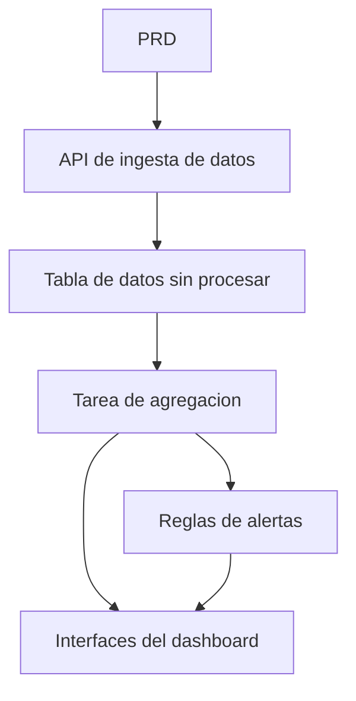

# Desarrollo Practico: Plataforma de Analisis de Datos de Trafico con Go

## Descripcion general

Este proyecto practico te requiere trabajar con un PRD real para completar una plataforma de analisis de datos de trafico usando Go. La direccion de este proyecto es diferente a los sistemas CRUD anteriores: necesitas construir un flujo de datos completo de "ingesta de datos -> agregacion -> alertas -> visualizacion". Este tipo de producto de datos es muy comun en escenarios como IoT, monitoreo y analisis de operaciones.

Esta es la seccion de practica integral de la Etapa 2, y tambien tu primer contacto con el lenguaje Go. No te preocupes, con la base de JavaScript/TypeScript que ya tienes, aprender Go no es dificil; el enfoque esta en comprender las ideas de diseno del flujo de datos.

## Conocimientos previos

Antes de comenzar este proyecto, ya deberias dominar lo siguiente:

- Diseno de paginas frontend y uso de bibliotecas de componentes ([Diseno UI](../../frontend/ui-design/), [Biblioteca de componentes moderna](../../frontend/modern-component-library/))
- Diseno y desarrollo de interfaces backend ([Escritura de codigo de interfaces](../../backend/ai-interface-code/))
- Fundamentos de bases de datos y Supabase ([De la base de datos a Supabase](../../backend/database-supabase/))
- Flujo de trabajo de Git y despliegue ([Git y GitHub](../../backend/git-workflow/), [Despliegue de aplicaciones web](../../backend/zeabur-deployment/))

## Objetivos de aprendizaje

Despues de completar esta practica, podras:

1. Leer un PRD y extraer la lista de tareas de desarrollo para un producto de datos
2. Usar Go (Gin o Fiber) para construir un servicio API backend
3. Disenar el flujo completo de ingesta de datos, agregacion por ventanas de tiempo y alertas
4. Mantener la consistencia entre los datos del backend y el dashboard frontend
5. Completar la integracion de extremo a extremo, entregando un prototipo de producto de datos demostrable

## Introduccion del proyecto

El producto que vas a construir es una plataforma de analisis de datos de trafico con Go:

| Modulo | Responsabilidad |
|------|------|
| **Ingesta de datos** | Recibir eventos de trafico sin procesar y almacenarlos en la base de datos |
| **Agregacion de datos** | Calcular tendencias e indicadores de congestion por ventanas de tiempo |
| **Alertas** | Generar registros de alertas basados en reglas |
| **Dashboard de visualizacion** | Mostrar graficos de tendencias, rankings y lista de alertas en el frontend |

::: tip PRD
El documento de requisitos de este proyecto esta en GitHub: [Ver PRD](https://github.com/datawhalechina/easy-vibe/blob/main/docs/es-es/stage-2/assignments/traffic-data-visualization-go/PRD.md)
:::

<div style="margin: 32px 0;">
  <ClientOnly>
    <StepBar :active="0" :items="[
      { title: 'Analisis de requisitos', description: 'Leer el PRD, definir fuentes de datos, definicion de metricas y reglas de alertas' },
      { title: 'Construccion del esqueleto', description: 'Usar IA para generar el servicio API Go y el esqueleto del dashboard frontend' },
      { title: 'Desarrollo iterativo', description: 'Agregar logica de agregacion, reglas de alertas e interfaces del dashboard' },
      { title: 'Integracion y despliegue', description: 'Verificar de extremo a extremo, desplegar y preparar la demostracion' }
    ]" />
  </ClientOnly>
</div>

## Primera parte: Analisis de requisitos

### 1.1 Leer el PRD

Abre el documento PRD y responde las siguientes preguntas clave:

- Cual es la fuente de datos? Que campos tiene?
- Cual es la definicion de las metricas principales? (por ejemplo, el criterio especifico de "congestion")
- Cuales son las reglas de alertas? La primera version debe limitarse a reglas simples?
- Que paginas y graficos incluye el dashboard?

::: warning
Si no tienes respuestas claras a las preguntas anteriores, no comiences a escribir codigo. La comprension inadecuada de los requisitos es la causa mas comun de retrabajo.
:::

### 1.2 Confirmar el flujo de datos



## Segunda parte: Construccion del esqueleto del proyecto

### 2.1 Generar el servicio API Go

Referencia de prompts:

```text
Basandote en el PRD actual, ayudame a generar el esqueleto de una plataforma de analisis de datos de trafico con Go.

Requisitos:
1. Usar Gin o Fiber
2. Proporcionar interfaz de ingesta de datos
3. Proporcionar esqueleto de tarea de agregacion
4. Proporcionar esqueletos de interfaces para dashboard y alertas
5. No hacer analisis complejo real, solo estructura ejecutable
```

### 2.2 Verificar la estructura del proyecto

Verificar item por item:

- [ ] El servicio Go se puede iniciar normalmente
- [ ] La interfaz de ingesta de datos puede recibir y almacenar datos
- [ ] El framework de tarea de agregacion esta listo
- [ ] La pagina del dashboard frontend puede mostrar graficos basicos

## Tercera parte: Desarrollo iterativo

### 3.1 Avanzar por modulos

1. **API de ingesta de datos**: Recibir eventos de trafico sin procesar y escribirlos en la base de datos
2. **Agregacion de datos**: Agregar por ventanas de tiempo, calcular tendencias e indicadores de congestion
3. **Reglas de alertas**: Generar registros de alertas basados en umbrales
4. **Interfaces del dashboard**: Proporcionar datos de tendencias, datos de ranking y lista de alertas
5. **Dashboard frontend**: Graficos de tendencias, rankings y paginas de lista de alertas

### 3.2 Autoverificacion de modulos

| Item de verificacion | Metodo de verificacion |
|--------|----------|
| Ingesta de datos | Los datos sin procesar se almacenan correctamente en la base de datos |
| Definicion de metricas | La logica de calculo de indicadores de tendencias y rankings es consistente |
| Reglas de alertas | Las condiciones de activacion de alertas cumplen las expectativas |
| Consistencia de datos | Lo que muestra el dashboard coincide con los datos del backend |
| Estandares de API | Tiene estructura de retorno unificada y manejo de errores |

## Cuarta parte: Integracion y despliegue

### 4.1 Pruebas de extremo a extremo

Verificar al menos los siguientes escenarios:

- Ingresar un lote de datos de prueba -> La tarea de agregacion se ejecuta -> El dashboard se actualiza
- Activar una condicion de alerta -> Se genera un registro de alerta -> La pagina de alertas lo muestra

## Entregables

Despues de completar este proyecto, necesitas enviar lo siguiente:

- [ ] Enlace de demostracion en linea accesible
- [ ] Enlace al repositorio de codigo fuente (incluyendo README)
- [ ] Documento PRD
- [ ] Capturas de pantalla de paginas clave (demo de ingesta de datos, dashboard de tendencias, lista de alertas)
- [ ] Video de demostracion de 60 segundos

## Criterios de evaluacion

| Dimension | Requisitos basicos | Requisitos avanzados |
|------|---------|---------|
| Alineacion con PRD | Funcionalidades y estructura de datos basicamente cumplen con el PRD | Puede explicar claramente las definiciones de metricas y la logica de agregacion |
| Flujo de datos | Ingesta -> Agregacion -> Alertas -> Dashboard funciona completamente | La tarea de agregacion soporta actualizaciones incrementales |
| Capacidad de analisis | Los tres modulos de tendencias, ranking y alertas son funcionales | Las metricas son configurables y las reglas de alertas son personalizables |
| Visualizacion frontend | El dashboard puede mostrar graficos basicos | Los graficos soportan filtrado por rango de fechas |
| Completitud de ingenieria | API Go, base de datos y pipeline frontend conectados | La API tiene manejo de errores unificado y registro de logs |

## Referencias

- [Diseno UI](../../frontend/ui-design/)
- [Biblioteca de componentes moderna](../../frontend/modern-component-library/)
- [De la base de datos a Supabase](../../backend/database-supabase/)
- [Escritura de codigo de interfaces](../../backend/ai-interface-code/)
- [Flujo de trabajo de Git y GitHub](../../backend/git-workflow/)
- [Despliegue de aplicaciones web](../../backend/zeabur-deployment/)
