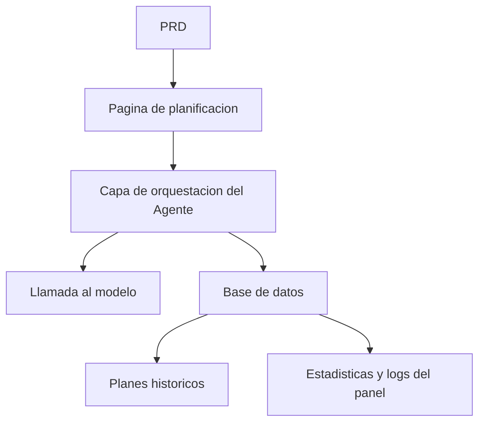

# Desarrollo Practico: Plataforma de Agentes para Planificacion de Viajes Inteligentes

## Descripcion general

Este proyecto practico te requiere trabajar con un PRD real para completar desde cero una plataforma de agentes para planificacion de viajes inteligentes. Construiras un producto de IA completo que puede recibir entradas estructuradas, generar itinerarios diarios y soportar guardado y reutilizacion. No es solo un chatbot, sino un producto con capacidades de gestion de tareas.

Esta es la seccion de practica integral de la Etapa 2. El desafio central de este proyecto radica en como hacer que la IA genere planes de itinerario estructurados y utilizables, en lugar de un largo bloque de texto no accionable.

## Conocimientos previos

Antes de comenzar este proyecto, ya deberias dominar lo siguiente:

- Diseno de paginas frontend y uso de bibliotecas de componentes ([Diseno UI](../../frontend/ui-design/), [Biblioteca de componentes moderna](../../frontend/modern-component-library/))
- Diseno y desarrollo de interfaces backend ([Escritura de codigo de interfaces](../../backend/ai-interface-code/))
- Fundamentos de bases de datos y Supabase ([De la base de datos a Supabase](../../backend/database-supabase/))
- Flujo de trabajo de Git y despliegue ([Git y GitHub](../../backend/git-workflow/), [Despliegue de aplicaciones web](../../backend/zeabur-deployment/))

## Objetivos de aprendizaje

Despues de completar esta practica, podras:

1. Leer un PRD y extraer la lista de tareas de desarrollo para una plataforma de Agentes
2. Disenar formularios de entrada estructurados y formatos de salida estructurados
3. Implementar la capa de orquestacion del Agente, procesando entradas de usuario, llamadas a modelos y almacenamiento de resultados
4. Construir un ciclo de negocio completo de "generar -> guardar -> reutilizar"
5. Completar la integracion de extremo a extremo, entregando un prototipo de producto de IA demostrable

## Introduccion del proyecto

El producto que vas a construir es una plataforma de agentes para planificacion de viajes inteligentes:

| Funcionalidad | Descripcion |
|------|------|
| **Planificacion de itinerario** | El usuario ingresa origen, destino, fechas, presupuesto y preferencias; el sistema genera el itinerario diario |
| **Desglose de presupuesto** | Los resultados del itinerario incluyen distribucion de presupuesto y sugerencias |
| **Gestion de historial** | Los usuarios pueden guardar planes anteriores, regenerar y exportar |
| **Panel de administracion** | Los administradores consultan destinos populares, tareas fallidas y retroalimentacion de usuarios |

::: tip PRD
El documento de requisitos de este proyecto esta en GitHub: [Ver PRD](https://github.com/datawhalechina/easy-vibe/blob/main/docs/es-es/stage-2/assignments/travel-planning-agent-platform/PRD.md)
:::

<div style="margin: 32px 0;">
  <ClientOnly>
    <StepBar :active="0" :items="[
      { title: 'Analisis de requisitos', description: 'Leer el PRD, definir paginas, orquestacion del Agente y estructura de entrada/salida' },
      { title: 'Construccion del esqueleto', description: 'Usar IA para generar las paginas de inicio, planificacion, historial y administracion' },
      { title: 'Desarrollo iterativo', description: 'Agregar salida estructurada, estados de tarea y gestion de historial modulo por modulo' },
      { title: 'Integracion y despliegue', description: 'Verificar de extremo a extremo, desplegar y preparar la demostracion' }
    ]" />
  </ClientOnly>
</div>

## Primera parte: Analisis de requisitos

### 1.1 Leer el PRD

Abre el documento PRD y responde las siguientes preguntas clave:

- La primera version debe cubrir solo un unico destino?
- La salida del itinerario debe ser estructurada? Cual es la estructura?
- Que tan profunda debe ser la capacidad de exportacion? (enlace para compartir / PDF / imagen)
- Cual es el alcance de las estadisticas del panel y los registros de tareas?

::: warning
Si no tienes respuestas claras a las preguntas anteriores, no comiences a escribir codigo. La comprension inadecuada de los requisitos es la causa mas comun de retrabajo.
:::

### 1.2 Confirmar la arquitectura del sistema



## Segunda parte: Construccion del esqueleto del proyecto

### 2.1 Generar paginas frontend

Referencia de prompts:

```text
Basandote en el PRD actual, ayudame a generar el esqueleto frontend de una plataforma de agentes para planificacion de viajes inteligentes.

Requisitos:
1. Paginas incluidas: inicio, planificacion, detalle de itinerario, historial, administracion
2. La pagina de planificacion tiene un formulario a la izquierda y una vista previa de resultados a la derecha
3. Primero generar solo la estructura de paginas y datos ficticios, sin conectar interfaces reales
4. El estilo debe parecerse a un producto de IA moderno
```

### 2.2 Verificar la estructura de paginas

Verificar item por item:

- [ ] Los campos del formulario de la pagina de planificacion coinciden con el PRD
- [ ] El area de vista previa de resultados puede mostrar datos de itinerario estructurados
- [ ] La pagina de historial puede mostrar multiples planes
- [ ] La pagina del panel de administracion puede mostrar datos estadisticos

## Tercera parte: Desarrollo iterativo

### 3.1 Avanzar por modulos

1. **Autenticacion**: Registro, inicio de sesion
2. **Formulario de planificacion**: Entrada estructurada (origen, destino, fechas, presupuesto, preferencias)
3. **Orquestacion del Agente**: Recibir entrada -> Llamar al modelo -> Analizar salida estructurada
4. **Visualizacion de resultados**: Itinerario por dias, desglose de presupuesto, sugerencias
5. **Gestion de historial**: Guardar planes, regenerar, exportar
6. **Panel de administracion**: Destinos populares, tareas fallidas, retroalimentacion de usuarios
7. **Estados de tarea**: Gestion de estados "generando / exito / error" y registro de errores

### 3.2 Autoverificacion de modulos

| Item de verificacion | Metodo de verificacion |
|--------|----------|
| Completitud de entrada | Los campos del formulario coinciden con el PRD |
| Salida estructurada | Los resultados del itinerario son datos estructurados (no un bloque de texto) |
| Consistencia de datos | Los datos de trip, itinerary y logs coinciden |
| Verificacion de ciclo | Se puede demostrar "entrada -> generacion -> guardado -> regeneracion" |

## Cuarta parte: Integracion y despliegue

### 4.1 Pruebas de extremo a extremo

Verificar al menos los siguientes escenarios:

- Ingresar parametros del itinerario -> Generar itinerario diario -> Ver desglose de presupuesto -> Guardar en historial
- Regenerar itinerario desde el historial
- El administrador consulta estadisticas de tareas y logs de errores

## Entregables

Despues de completar este proyecto, necesitas enviar lo siguiente:

- [ ] Enlace de demostracion en linea accesible
- [ ] Enlace al repositorio de codigo fuente (incluyendo README)
- [ ] Documento PRD
- [ ] Capturas de pantalla de paginas clave (pagina de planificacion, detalle de itinerario, historial, panel de administracion)
- [ ] Video de demostracion de 60 segundos

## Criterios de evaluacion

| Dimension | Requisitos basicos | Requisitos avanzados |
|------|---------|---------|
| Alineacion con PRD | Paginas, funcionalidades y estructura de datos basicamente cumplen con el PRD | Puede explicar claramente las decisiones de diseno |
| Ciclo completo del producto | Planificar -> Guardar -> Historial -> Regenerar funciona completamente | Soporta exportacion y compartir |
| Calidad de salida | Los resultados del itinerario son estructurados y legibles | El desglose de presupuesto es razonable, las sugerencias son especificas |
| Capacidades del panel | Las estadisticas de tareas y logs de errores son consultables | Tiene analisis de destinos populares |
| Completitud de ingenieria | Frontend, backend, base de datos y pipeline de llamadas al modelo conectados | La gestion de estados de tarea es robusta, los errores son rastreables |

## Referencias

- [Diseno UI](../../frontend/ui-design/)
- [Biblioteca de componentes moderna](../../frontend/modern-component-library/)
- [De la base de datos a Supabase](../../backend/database-supabase/)
- [Escritura de codigo de interfaces](../../backend/ai-interface-code/)
- [Flujo de trabajo de Git y GitHub](../../backend/git-workflow/)
- [Despliegue de aplicaciones web](../../backend/zeabur-deployment/)
