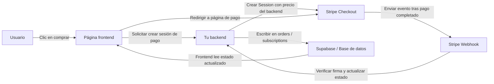
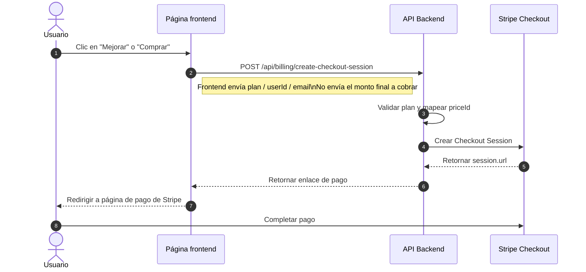
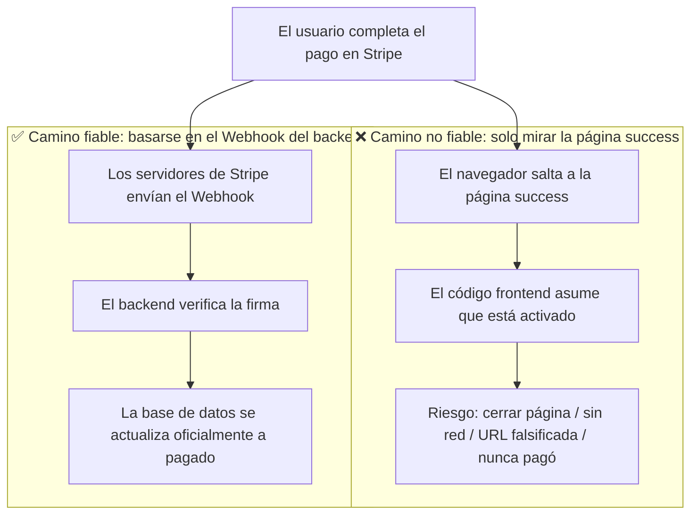
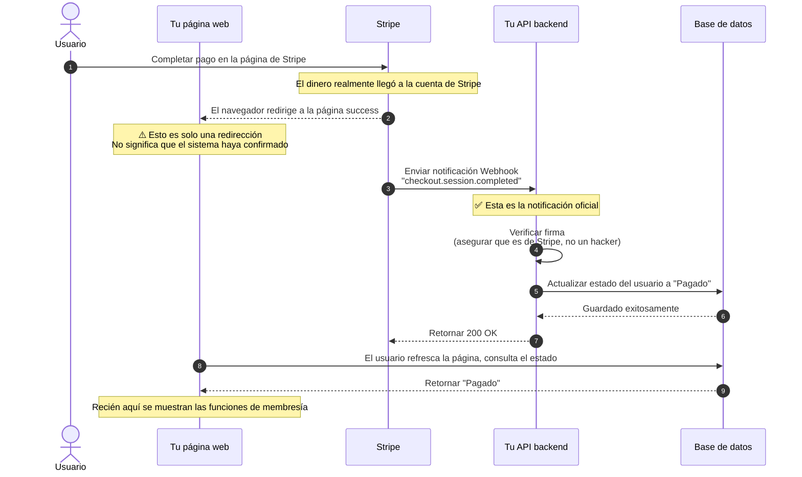
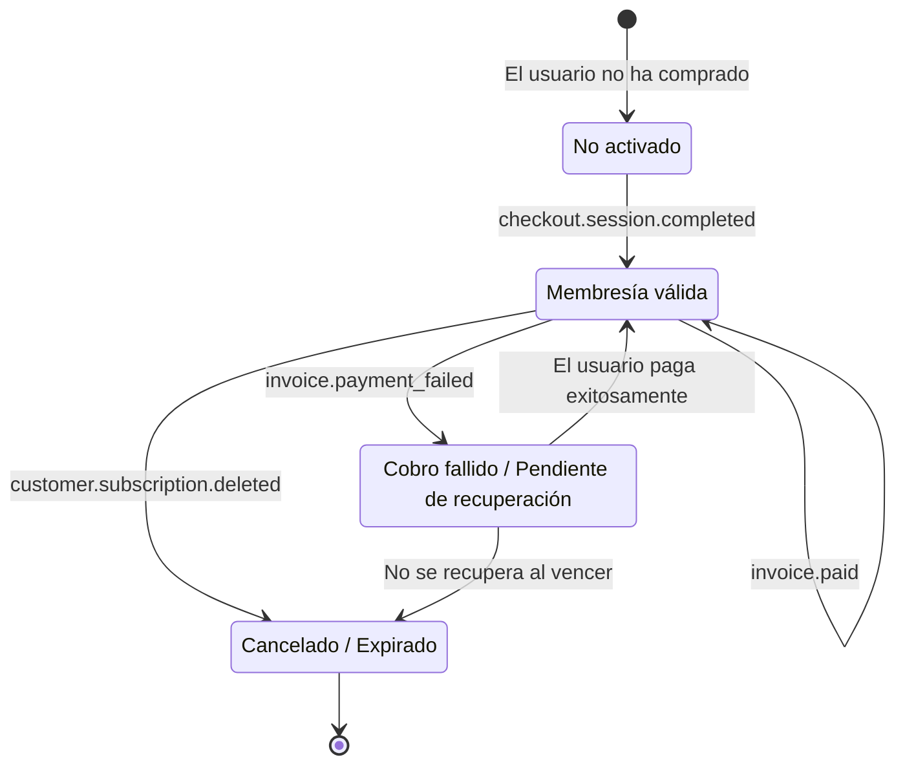
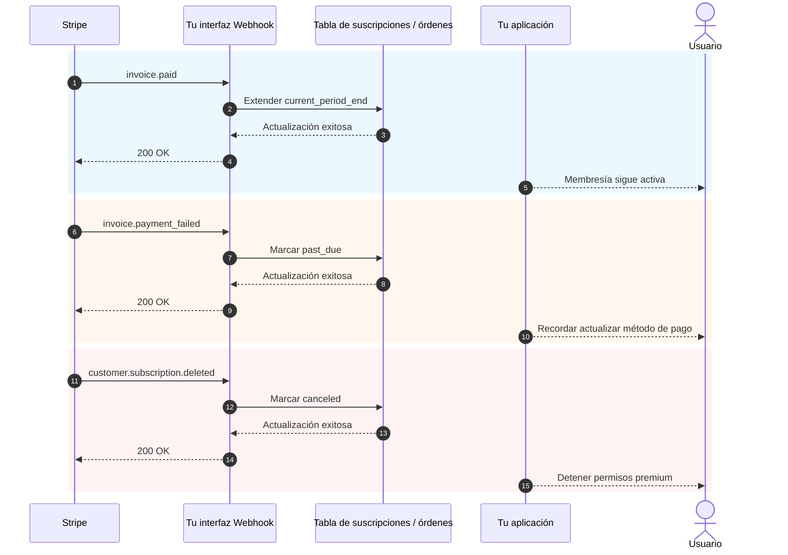

# Cómo integrar Stripe y otros sistemas de cobro

Cuando tu producto ya tiene páginas, login, base de datos y un backend básico, la siguiente pregunta práctica es: **¿cómo cobras?**.

Muchas personas, al integrar pagos por primera vez, ponen toda su atención en "cómo saltar a la página de pago". Pero lo que realmente determina si el sistema es estable no es el botón, sino toda la cadena de cobro: quién decide el precio, quién confirma que el pago fue exitoso, quién actualiza la base de datos, quién revoca los permisos.

Este artículo está dividido en dos partes:

- **La primera mitad** cubre solo lo más práctico y básico, con el objetivo de que integres Stripe en tu proyecto lo antes posible.
- **La segunda mitad** se incluye en el apéndice, con detalles de Webhook, eventos de suscripción y diferencias entre métodos de pago de diferentes países y regiones.

> 💡 Te recomendamos completar estos capítulos antes de continuar
>
> - [De bases de datos a Supabase](../database-supabase/)
> - [Asistencia de LLM para escribir código de API y documentación](../ai-interface-code/)
> - [Cómo desplegar aplicaciones web](../zeabur-deployment/)

# Lo que aprenderás

1. Cómo se ve un sistema de pagos mínimamente viable.
2. Cómo integrar Stripe en tu proyecto de la forma más rápida.
3. Cómo escribir prompts para que la AI agregue el sistema de pagos directamente.
4. Si no estás haciendo un proyecto internacional con Stripe, qué solución de pago deberías considerar primero según tu región.

---

# Primera parte: Fundamentos

## 1. Primero recuerda estos 3 principios

Si solo recuerdas tres cosas, que sean estas:

1. **El precio debe ser decidido por el backend**, no puedes confiar en el monto enviado desde el frontend.
2. **Lo que realmente activa los permisos es el Webhook**, no la página de `success`.
3. **Tu propia base de datos debe guardar el estado del pago**, no puedes depender solo del panel de Stripe.

Estos tres principios son los límites más importantes de un sistema de pagos. Mientras los límites estén bien, luego cambiar de Stripe a PayPal, Alipay o WeChat Pay es esencialmente solo "cambiar la API, la arquitectura no cambia".

## 2. ¿Qué pasa si no lo manejas en el backend y conectas Stripe directamente desde el frontend?

Esta es la idea más natural de muchas personas la primera vez que hacen pagos:

- Ya tengo un botón de "Comprar" en la página
- ¿Puedo hacer que el frontend se conecte directamente a Stripe?
- ¿Así no necesito hacer backend?

Si solo estás haciendo una página de demostración falsa, pensar así no es problema.
Pero si realmente vas a cobrar dinero, **este camino generalmente termina mal**.

Los problemas más comunes son:

1. **El precio es fácil de modificar**
   Las peticiones del navegador las envía la computadora del usuario. Alguien puede modificar el contenido de la petición.
2. **Información sensible fácil de exponer**
   Las claves realmente importantes, la lógica de precios y la lógica de activación de membresía nunca deberían estar en el frontend.
3. **No puedes confirmar de forma fiable "si este pago realmente cuenta como exitoso"**
   Que el usuario salte a la página de éxito no significa que tu base de datos se haya sincronizado correctamente.
4. **El estado de la base de datos se descontrola**
   El usuario puede decir "ya pagué", pero tu sistema ni siquiera lo registró.

Así que una distribución más segura sería:

- Frontend: mostrar botones, iniciar la compra, redirigir páginas
- Backend: decidir precios, crear sesiones de pago, recibir Webhooks, actualizar la base de datos

::: info Esto puedes recordarlo en una frase
**El frontend puede manejar las redirecciones, el backend debe manejar los precios y las confirmaciones.**

Si realmente estás cobrando dinero, no pongas "el poder de decisión sobre el precio final" ni "la lógica de activación post-pago" en el frontend.
:::

## 3. ¿Cuándo es apropiado usar Stripe primero?

Si estás en alguno de estos escenarios, Stripe suele ser el punto de partida más conveniente:

- SaaS orientado a usuarios internacionales
- Productos de membresía por suscripción
- Productos digitales, plantillas, paquetes de créditos AI
- Quieres validar rápidamente la monetización sin lidiar con demasiados detalles de pagos locales desde el principio

Si tus usuarios principales están en China continental, generalmente Stripe no sería la primera opción. Esto lo cubro en el apéndice.

## 4. Cadena de pago mínimamente viable

Primero veamos la versión mínima. Mientras esta cadena funcione, tu sistema de pagos tiene una columna vertebral.



Traducido a lenguaje llano:

1. El usuario hace clic en un botón.
2. El frontend pide al backend un enlace de pago.
3. El backend crea una sesión de pago usando la clave de Stripe.
4. El usuario va a la página de Stripe para pagar.
5. Stripe notifica a tu backend que "el pago realmente se completó" a través del Webhook.
6. Tu backend actualiza la base de datos.

## 5. Diagrama de secuencia estándar para iniciar un pago

Si prefieres ver un diagrama de sistema más formal:



## 6. Inicio rápido

Si quieres integrarlo lo más rápido posible, sigue estos 5 pasos.

### 6.1 Paso 1: Crear productos y precios en el panel de Stripe

El propósito de este paso no es "configurar algo al azar", sino definir claramente en Stripe **qué estás vendiendo y cómo planeas cobrar**.

En el modelo de Stripe:

- **Product** representa "qué estás vendiendo", por ejemplo `Membresía Pro`
- **Price** representa "cuánto cuesta y con qué periodicidad", por ejemplo `9.9 USD/mes`, `99 USD/año`

¿Por qué hacer esto primero?
Porque cuando tu backend crea un Checkout Session más adelante, no le pasa un monto directamente a Stripe, sino un `price_id` que ya existe. Stripe genera la página de pago, monto, moneda y ciclo de suscripción basándose en ese `price_id`.

Si saltas este paso, no podrás "crear enlaces de pago" después.

::: info Por qué hay que hacer una pausa aquí
Muchos principiantes se frustran al ver las palabras `Product` y `Price`, sintiendo que están aprendiendo jerga interna de Stripe.

Pero en realidad, este paso hace algo muy simple:
- Definir claramente "qué se vende"
- Definir claramente "cuánto cuesta"
- Permitir que el backend use un `price_id` estable para crear enlaces de pago

Una vez que entiendas esto, el Checkout Session no te parecerá abstracto.
:::

Para un sistema de suscripción mínimamente viable, necesitas crear al menos estos dos niveles:

- Un `Product`
- Uno o más `Price`

Puedes abrir directamente estas páginas:

- Página de login del Dashboard de Stripe: [Dashboard Login](https://dashboard.stripe.com/login)
- Documentación de gestión de productos y precios: [Manage products and prices](https://docs.stripe.com/products-prices/manage-prices)
- Documentación de inicio rápido de Checkout: [Build a Stripe-hosted checkout page](https://docs.stripe.com/checkout/quickstart?lang=node)
- Página de productos del Dashboard: [Product catalog](https://dashboard.stripe.com/test/products)

Te recomiendo operar primero en **Test mode (modo de prueba)**, no empieces directamente en el entorno de producción.

La configuración mínima más común es:

- `Product`: `Pro Plan`
- `Price 1`: `pro_monthly`
- `Price 2`: `pro_yearly`

Al operar en el panel, puedes seguir este orden:

1. Primero crear un producto `Pro Plan`
2. Luego colgar dos precios debajo de ese producto
3. El pago mensual y anual son en realidad dos formas de cobro del mismo producto

Al finalizar, necesitas anotar al menos:

- El `price_id` del precio mensual
- El `price_id` del precio anual
- Tus propios nombres de planes, por ejemplo `pro_monthly`, `pro_yearly`

Si es tu primera vez en el panel de Stripe, te recomiendo entender este paso como:

- `Product` determina qué se vende en la página de pago
- `Price` determina cuánto se cobra en la página de pago
- Lo que el backend realmente usará es principalmente el `price_id`

::: info Los valores que realmente debes anotar
Lo más importante en esta página no es el nombre del producto, sino el `price_id`.

Más adelante, tanto si pides a la AI que te ayude con el backend como si solucionas problemas tú mismo, lo que usarás con más frecuencia es:
- `STRIPE_PRICE_PRO_MONTHLY`
- `STRIPE_PRICE_PRO_YEARLY`
- Los dos `price_id` correspondientes
:::

Si quieres que la AI te guíe primero en la configuración del panel, puedes usar este prompt:

```text
Es la primera vez que uso Stripe. No cambies el código todavía, primero guíame paso a paso en la configuración básica de pagos en el panel de Stripe.

Por favor, basa las instrucciones en esta documentación oficial:
- https://docs.stripe.com/products-prices/manage-prices
- https://docs.stripe.com/checkout/quickstart?lang=node

Mi situación es:
- Quiero hacer una membresía de pago lo más simple posible
- Solo dos planes: mensual y anual
- Aún no entiendo los términos Product y Price

Por favor:
1. Primero explícame con palabras simples qué son Product y Price.
2. Luego guíame en el orden de "qué página abrir primero -> dónde hacer clic -> qué rellenar".
3. Finalmente recuérdame qué valores necesito copiar del panel para el backend.
4. Si es fácil equivocarse de camino, recuérdame que debo operar siempre en modo de prueba.
```

### 6.2 Paso 2: Preparar las variables de entorno

Generalmente necesitas al menos estas variables de entorno:

- `STRIPE_SECRET_KEY`
- `STRIPE_WEBHOOK_SECRET`
- `STRIPE_PRICE_PRO_MONTHLY`
- `STRIPE_PRICE_PRO_YEARLY`
- `APP_URL`
- `SUPABASE_URL`
- `SUPABASE_SERVICE_ROLE_KEY`

Puedes abrir directamente estas páginas:

- Documentación de API Keys: [API keys](https://docs.stripe.com/keys)
- Página de API Keys del Dashboard: [API Keys](https://dashboard.stripe.com/test/apikeys)
- Documentación de Webhooks: [Receive Stripe events in your webhook endpoint](https://docs.stripe.com/webhooks)
- Página de Webhooks del Dashboard: [Workbench Webhooks](https://dashboard.stripe.com/test/workbench/webhooks)

> ⚠️ `STRIPE_SECRET_KEY` y `SUPABASE_SERVICE_ROLE_KEY` solo deben estar en el backend.

::: info El propósito de este paso de variables de entorno
Este paso no es para "llenar el `.env`", sino para guardar las cosas más sensibles del sistema de pagos en el backend:

- La clave backend de Stripe
- La clave de verificación de Webhook
- Tu mapeo de precios

En pocas palabras:
El frontend solo se encarga de iniciar la compra. Los secretos y la lógica de precios deben quedarse en el servidor.
:::

Este paso también se puede delegar a la AI:

```text
Por favor, revisa cómo maneja las variables de entorno este proyecto y ayúdame a organizar las variables que Stripe necesita.

Referencia:
- https://docs.stripe.com/keys
- https://docs.stripe.com/webhooks

Mi situación:
- Soy principiante
- No distingo qué variables van en el frontend y cuáles en el backend
- No estoy seguro si debo modificar `.env`, `.env.local` u otro archivo

Por favor:
1. Primero busca en el proyecto dónde se suelen poner las variables de entorno.
2. Hazme una lista de las variables mínimas necesarias para Stripe.
3. Explícame con palabras simples para qué sirve cada variable.
4. Dime en qué página de Stripe debo copiar cada variable.
5. Si hay un archivo de ejemplo de variables de entorno, agrega los nombres de variables directamente.
```

### 6.3 Paso 3: Crear Checkout Session en el backend

No necesitas escribir la API tú mismo; deja que la AI lo implemente basándose en la documentación oficial.

Primero pásale estos enlaces:

- Inicio rápido de Checkout: [Build a Stripe-hosted checkout page](https://docs.stripe.com/checkout/quickstart?lang=node)
- API de Checkout Sessions: [Create a Checkout Session](https://docs.stripe.com/api/checkout/sessions/create)
- Documentación de suscripciones: [Subscriptions](https://docs.stripe.com/payments/subscriptions)

Luego usa este prompt:

```text
Por favor, revisa cómo está organizado el código backend de mi proyecto actual y ayúdame a integrar los pagos de Stripe.

Referencia oficial:
- https://docs.stripe.com/checkout/quickstart?lang=node
- https://docs.stripe.com/api/checkout/sessions/create
- https://docs.stripe.com/payments/subscriptions

Mi objetivo es simple:
- Cuando el usuario haga clic en comprar, que salte a la página de pago de Stripe
- Solo hay dos planes: mensual y anual
- No me hagas decidir dónde poner el código, primero revisa el proyecto y ponlo en el lugar adecuado

Por favor:
1. Primero busca en el proyecto el archivo de entrada del backend, los archivos de rutas y cómo se escriben las variables de entorno.
2. Luego, basándote en la documentación oficial, integra el paso de "crear enlace de pago de Stripe".
3. No me hagas pasar el monto manualmente; los precios deben determinarse con variables de entorno del backend.
4. Al terminar, dime qué archivos modificaste.
5. Finalmente, dime qué configuraciones adicionales necesito hacer en el panel de Stripe.
```

### 6.4 Paso 4: Redirigir al frontend a la página de pago

El objetivo de este paso es muy simple: hacer que el botón de la página de precios llame a tu API backend y luego redirija a Stripe Checkout.

Documentación de referencia:

- Integración de Checkout: [Build an integration with Checkout](https://docs.stripe.com/payments/checkout/build-integration)

Prompt para la AI:

```text
Ayúdame a conectar el botón de "Comprar" del proyecto con Stripe.

Requisitos:
- No modificar las páginas existentes, solo cambiar la lógica después del clic en el botón
- Al hacer clic, llamar a la API backend para obtener el enlace de pago y luego redirigir a Stripe
- Si hay error, mostrar un mensaje simple al usuario (por ejemplo, "El pago no está disponible temporalmente, intenta más tarde")

Referencia: https://docs.stripe.com/payments/checkout/build-integration
```

### 6.5 Paso 5: Webhook actualiza el estado en la base de datos

Este es el paso más crítico.

::: info Por qué este paso es el más crítico
Muchas personas piensan que "el usuario pagó y fue redirigido a la página de success" ya está todo hecho.

No.

Para tu sistema, lo realmente importante es:
**¿Stripe envió formalmente el evento a tu Webhook, y tu backend actualizó exitosamente el estado en la base de datos?**
:::

También puedes pedirle a la AI que lo implemente directamente según la documentación oficial de Webhook de Stripe, sin escribirlo manualmente.

Documentación de referencia:

- Webhooks de Stripe: [Receive Stripe events in your webhook endpoint](https://docs.stripe.com/webhooks)
- Stripe CLI: [Stripe CLI](https://docs.stripe.com/stripe-cli)
- Uso de Stripe CLI: [Use the Stripe CLI](https://docs.stripe.com/stripe-cli/use-cli)

Prompt para la AI:

```text
Por favor, continúa ayudándome a integrar el paso de "activación automática tras pago exitoso" con Stripe.

Referencia oficial:
- https://docs.stripe.com/webhooks
- https://docs.stripe.com/stripe-cli
- https://docs.stripe.com/stripe-cli/use-cli

Mi objetivo es:
- Después de que el usuario pague, no solo redirigir a una página de éxito
- Sino realmente cambiar el estado de membresía en mi base de datos a activado

Por favor:
1. Primero busca en el proyecto el código relacionado con la base de datos y cómo se guarda el estado del usuario.
2. Luego agrega el webhook de Stripe.
3. Después del pago exitoso, cambiar el usuario correspondiente a active, o actualizar el campo de membresía que ya se usa en el proyecto.
4. Si el proyecto ya tiene tablas de suscripción, órdenes o usuarios, prioriza usar la estructura existente.
5. Al terminar, dime qué archivos modificaste.
6. También dime cómo probar localmente si este paso realmente funciona.
```

## 7. Prompt para que la AI integre rápidamente

Si usas herramientas como Codex, Claude Code, Trae o Cursor, puedes pegar directamente el siguiente prompt para que integre pagos en tu proyecto.

```text
Por favor, ayúdame a integrar pagos con Stripe en el proyecto actual. Quiero hacer la función de membresía más simple que pueda funcionar.

Mis requisitos:
1. Soy principiante; por favor revisa primero el proyecto y luego decide dónde modificar el código.
2. No me hagas juzgar la estructura de directorios, rutas o base de datos.
3. Solo quiero la versión más simple: dos planes, mensual y anual.
4. Cuando el usuario haga clic en comprar, debe saltar a la página de pago de Stripe.
5. Después del pago exitoso, el estado de membresía en mi base de datos debe cambiar a activado.
6. No agregues funciones complejas desde el principio, como cupones, upgrades/downgrades o facturas complejas.

Requisitos de salida:
1. Primero dame un plan de cambios.
2. Luego modifica el código directamente.
3. Finalmente dime cómo probar localmente paso a paso.
4. Si algún paso requiere que yo opere en el panel de Stripe, dame directamente el enlace y los puntos clave.
```

Si quieres que la AI se adapte más a tu proyecto, puedes agregar al inicio:

- Tu framework frontend
- La estructura de directorios de tu backend
- Los nombres de las tablas de tu base de datos
- Si tu sistema de usuarios usa Supabase Auth o Auth propio

## 7.1 Delega también la integración local a la AI

Si quieres que la AI te ayude a conectar todo localmente:

```text
Por favor, continúa ayudándome a que el pago con Stripe funcione realmente. Quiero seguir los pasos uno por uno, sin tener que adivinar.

Referencia oficial:
- https://docs.stripe.com/webhooks
- https://docs.stripe.com/stripe-cli
- https://docs.stripe.com/stripe-cli/use-cli

Mi objetivo:
1. Dime qué páginas de Stripe debo abrir primero.
2. Dime cómo obtener el STRIPE_WEBHOOK_SECRET.
3. Dime cómo usar stripe login y stripe listen.
4. Dime cómo verificar que checkout.session.completed llegó correctamente al webhook local.
5. Si el proyecto necesita iniciar frontend y backend primero, dame los comandos específicos.
6. No expliques solo teoría; dame los pasos de operación reales.
7. Si me equivoco en algún paso, dime qué errores son los más comunes.
```

## 8. Las 4 trampas más comunes

1. **Considerar la página `success` como pago exitoso**
   Lo que realmente determina el estado es el Webhook, no la redirección del frontend.
2. **Dejar que el frontend envíe el monto**
   Esto genera un riesgo grave de manipulación de precios.
3. **La ruta del Webhook es procesada antes por `express.json()`**
   La verificación de firma de Stripe necesita el cuerpo原始 de la petición.
4. **No manejar idempotencia**
   Los Webhooks pueden reintentar. Si cada vez agregas membresía o créditos duplicados, habrá problemas.

## 9. Consejo de selección en una frase

Si ahora solo quieres que funcione el cobro:

| Tus usuarios principales | Solución para intentar primero |
| :--- | :--- |
| SaaS internacional / usuarios globales | Stripe |
| Usuarios de China continental | Alipay / WeChat Pay |
| Equipos de Hong Kong o transfronterizos | Stripe + solución agregada de billetera local / FPS |

Los detalles específicos los cubro en el apéndice.

::: info El enfoque de selección más simple
No intentes "integrar todos los métodos de pago del mundo de una vez".

Un orden más práctico suele ser:
- Primero elige una cadena de pago principal según la región de tus usuarios
- Haz funcionar el pago mínimamente viable
- Luego agrega el segundo y tercer método según el origen real de los usuarios
:::

## 10. Resumen

Hasta aquí, ya dominas la cadena de cobro más básica pero más importante:

1. El frontend inicia la compra.
2. El backend crea un Checkout Session.
3. El usuario paga en la página de Stripe.
4. Stripe notifica al backend a través del Webhook.
5. El backend actualiza la base de datos.
6. El frontend muestra el nuevo estado de membresía u orden tras refrescar.

Si solo quieres integrar pagos rápidamente en tu proyecto, el contenido anterior es suficiente. El apéndice puedes consultarlo cuando realmente encuentres problemas.

---

# Apéndice

## Apéndice A: Los objetos más comunes de Stripe

La primera vez que lees la documentación de Stripe, es fácil confundirse con estos nombres de objetos. En realidad, solo necesitas entender estos:

| Objeto | Función | Puedes entenderlo como |
| :--- | :--- | :--- |
| `Product` | Describe qué se vende | Producto o plan de membresía |
| `Price` | Describe cuánto cuesta y la periodicidad | Mensual, anual, pago único |
| `Checkout Session` | Flujo de pago alojado por Stripe | Página de pago |
| `Subscription` | Relación de suscripción periódica | Membresía con renovación automática |
| `Customer` | Usuario que paga | Perfil de cliente en Stripe |
| `Webhook` | Notificación asíncrona | Stripe te dice "qué pasó con este pago" |

## Apéndice B: Por qué la página `success` no equivale a pago exitoso

Muchas personas piensan que "el usuario pagó y saltó a la página de success" ya significa que el pago fue exitoso. Esta es la trampa más fácil de caer.

### Un escenario real

Supongamos que hiciste un sitio web de membresía:
1. El usuario hace clic en "Comprar membresía"
2. Salta a la página de pago de Stripe
3. El usuario ingresa la tarjeta de crédito y hace clic en pagar
4. La página redirige a tu `success.html`
5. En la página de success escribes código: "ya que llegamos a esta página, activa la membresía del usuario"

**¿Dónde está el problema?**

El usuario podría no haber pagado en absoluto, o cerró la página a la mitad del pago, y aún así podría acceder directamente a `success.html`.

### Dos caminos completamente diferentes



**Diferencia clave:**

| | Redirección a página success | Notificación Webhook |
| :--- | :--- | :--- |
| Quién lo inicia | El navegador del usuario | Los servidores de Stripe |
| ¿Se puede falsificar? | Sí, basta con acceder a la URL | No, tiene verificación de firma |
| ¿Siempre significa pago exitoso? | No necesariamente | Sí, siempre |
| ¿Cómo lo sabe tu sistema? | El código frontend lo supone | Stripe lo notifica oficialmente |

### Cómo debería ser el flujo completo



### Puntos críticos de cada paso

**Paso 1: El usuario paga en Stripe**

Este es el único momento que confirma "el dinero realmente se pagó":
- El usuario ingresa la información de la tarjeta de crédito y hace clic en confirmar
- El banco cobra de la tarjeta del usuario
- Stripe confirma la recepción del dinero

**Paso 2: El navegador redirige a la página success (el mayor problema)**

Este paso es completamente no fiable, porque:
- El usuario puede escribir directamente `tusitio.com/success` en el navegador, accediendo sin haber pagado
- El usuario cerró la página a la mitad del pago, pero había copiado el enlace de success y lo abre después
- Problemas de red impiden la redirección, pero el dinero ya se cobró (el usuario pagó pero no ve la página de éxito)
- El usuario presiona el botón de retroceso y paga otra vez, pero ambos pagan redirigen a la misma página de success

**Paso 3: Stripe envía el Webhook**

Esta es la notificación activa de Stripe a tu servidor de que "este pago se recibió":
- Solo los servidores de Stripe pueden iniciar esta petición
- La petición lleva una firma que tu backend puede verificar si realmente es de Stripe
- Incluso si la página de success no se abrió o el usuario se quedó sin red, el Webhook se envía

**Paso 4: El backend verifica la firma**

¿Por qué verificar? Para evitar que hackers falsifiquen notificaciones.

Supongamos que no hay verificación: un hacker podría enviar una notificación falsa a tu servidor: "El usuario A pagó 1000 dólares". Tu sistema le daría membresía al hacker.

El proceso de verificación:
- Stripe genera una firma del contenido de la notificación usando una clave que ambos conocen
- Tu backend usa la misma clave para verificar si la firma coincide
- Coincide = 100% es de Stripe, no coincide = rechazar directamente

**Paso 5: Actualizar la base de datos**

Solo después de pasar la verificación se actualiza la base de datos:
- Cambiar el estado del usuario de "pendiente de pago" a "pagado"
- Registrar el número de orden, monto y fecha de pago
- Activar los permisos de membresía correspondientes

**Paso 6: El frontend consulta el estado**

La página de success no debe asumir por sí misma que "llegar a esta página significa éxito". Lo correcto:
- Al cargar la página, enviar una petición al backend: "¿Este usuario ha pagado?"
- El backend consulta la base de datos y retorna el estado real
- Mostrar "Activación exitosa" o "Esperando confirmación" según el resultado

### Un error común

```javascript
// Incorrecto: Activar directamente en la página success
// success.html
if (window.location.pathname === '/success') {
  // ¡Peligro! Cualquiera puede acceder a /success
  activateMembership()
}
```

```javascript
// Correcto: Siempre consultar al backend al refrescar
// success.html
async function checkStatus() {
  const response = await fetch('/api/user/status')
  const data = await response.json()

  if (data.paymentStatus === 'paid') {
    showMemberFeatures()
  } else {
    showPendingMessage()
  }
}
```

### Resumen en una frase

**La página success es solo "la redirección del navegador tuvo éxito", el Webhook es "Stripe confirma oficialmente la recepción del pago".**

Tu sistema debe basarse en el Webhook, no confiar en la redirección del frontend.

## Apéndice C: Eventos más importantes para escuchar en un sistema de suscripción

| Evento | Significado | Qué debes hacer normalmente |
| :--- | :--- | :--- |
| `checkout.session.completed` | Primera activación exitosa | Crear registro de suscripción local |
| `invoice.paid` | Renovación automática exitosa | Extender el período de validez |
| `invoice.payment_failed` | Fallo en el cobro automático | Marcar estado de riesgo y notificar al usuario |
| `customer.subscription.deleted` | Suscripción cancelada | Revocar permisos o marcar como expirada al vencer |

### Diagrama de estados de suscripción



### Diagrama de secuencia de renovación / fallo / cancelación



## Apéndice D: Cómo elegir entre otras soluciones de pago

### 1. China continental

Si tus usuarios principales están en el continente, la primera opción sigue siendo **[Alipay](https://open.alipay.com/)** y **[WeChat Pay](https://pay.wechatpay.cn/)**.

**Modelo de negocio:**

Ambos son modelos de "pasarela de pago". Necesitas:
- Solicitar calificación de comerciante (licencia comercial, cuenta corporativa)
- El dinero del usuario va directamente a tu cuenta de comerciante
- Eres responsable de impuestos, reembolsos y conciliación

**Modelo técnico:**

Ambos usan el modelo de "pedido en backend + invocación en frontend + notificación en backend", la misma lógica que Stripe.

**Proceso de integración de Alipay:**
1. Crear aplicación en la plataforma abierta de Alipay
2. Configurar claves públicas/privadas y dirección de callback
3. El backend llama a la API de pedido unificado, generando enlace de pago o código QR
4. El usuario escanea o redirige para pagar
5. Alipay notifica asíncronamente a tu backend, actualizando el estado de la orden

**Proceso de integración de WeChat Pay:**
- JSAPI: Para cuentas oficiales y mini-programas, el usuario paga directamente dentro de WeChat
- Native: Genera código QR en PC, el usuario escanea para pagar
- H5: En navegador móvil, invoca la app de WeChat para pagar

Flujo: backend crea pedido → obtiene `prepay_id` o `code_url` → frontend invoca pago → backend recibe notificación confirmando éxito

**Enlaces de referencia:**
- Plataforma abierta de Alipay: https://open.alipay.com/
- Documentación de comerciante de WeChat Pay: https://pay.wechatpay.cn/doc/v3/merchant/

### 2. Hong Kong

El mercado de Hong Kong es bastante mixto, combinaciones comunes:

- Tarjetas bancarias: Visa / Mastercard
- FPS (Faster Payment System): Transferencia instantánea local de Hong Kong
- AlipayHK / WeChat Pay HK: Versiones de Hong Kong de Alipay y WeChat

**Combinación recomendada:**
- Usar **[Stripe](https://stripe.com/hk)** para tarjetas internacionales y suscripciones
- Usar **[Airwallex](https://www.airwallex.com/)** o **[Adyen](https://www.adyen.com/)** para billeteras locales y FPS

### 3. Internacional / SaaS global

#### [Stripe](https://stripe.com/)

**Modelo de negocio:** Pasarela de pago

- Necesitas solicitar calificación de comerciante (en algunos países Stripe puede gestionarlo)
- El dinero del usuario llega a tu cuenta de Stripe, luego se liquida a tu cuenta bancaria
- Eres responsable de la declaración de impuestos

**Modelo técnico:**

- Mejor experiencia de API, documentación clara
- Soporta Checkout (página alojada), Elements (formularios personalizados), Payment Links (sin código)
- Webhook notifica el estado del pago
- Soporta suscripciones, facturas y múltiples monedas

**Para quién:** SaaS internacional, desarrolladores independientes, equipos que necesitan personalización flexible

**Enlace de referencia:** https://docs.stripe.com/

#### [PayPal](https://www.paypal.com/)

**Modelo de negocio:** Pasarela de pago

- El dinero del usuario llega a tu cuenta PayPal, luego retiras a tu banco
- Eres responsable de impuestos

**Modelo técnico:**

- Pagos únicos: botón en el frontend, el backend crea/confirma órdenes
- Suscripciones: crear Product y Plan primero, luego levantar con SDK
- También necesita backend y Webhook, no solo el callback del frontend

**Para quién:** Negocios internacionales que necesitan un canal adicional, usuarios acostumbrados a pagar con PayPal

**Enlace de referencia:** https://developer.paypal.com/docs/

#### [Paddle](https://www.paddle.com/)

**Modelo de negocio:** Merchant of Record (MoR)

- Paddle es el "comerciante de registro"; legalmente, Paddle cobra al usuario
- Paddle gestiona impuestos globales, IVA, reembolsos y cumplimiento
- El dinero del usuario llega a Paddle, que deduce impuestos y comisiones antes de liquidarte
- No necesitas registrar una empresa en cada país ni manejar impuestos

**Modelo técnico:**

- Paddle.js: Checkout alojado integrado en el frontend
- API backend: crear transaction, pasarla al checkout
- Webhook sincroniza el estado de suscripción

**Para quién:** Equipos SaaS que no quieren manejar impuestos globales, especialmente SaaS B2B

**Enlace de referencia:** https://developer.paddle.com/

#### [Lemon Squeezy](https://www.lemonsqueezy.com/)

**Modelo de negocio:** Merchant of Record (MoR)

- Similar a Paddle, Lemon Squeezy es el "comerciante de registro"
- Gestiona impuestos globales, IVA y cumplimiento
- Adquirida por Stripe en 2024, pero opera de forma independiente

**Modelo técnico:**

- Hosted Checkout: el más simple, genera enlaces de pago directamente
- Checkout Overlay: overlay integrado en tu página
- API backend: crear checkout, control flexible

**Para quién:** Desarrolladores independientes, productos digitales, licencias de software

**Enlace de referencia:** https://docs.lemonsqueezy.com/

### 4. Soluciones empresariales

#### [Airwallex](https://www.airwallex.com/)

**Modelo de negocio:** Pasarela de pago + cuentas globales

- Proporciona cuentas de cobro globales (similar a cuentas bancarias virtuales)
- Soporta cobro en múltiples monedas, cambio de divisa y pagos
- Eres responsable de impuestos

**Modelo técnico:**

- Payment Links: casi sin código, genera enlaces de pago
- Hosted Payment Page: página alojada
- Drop-in / Embedded / Native API: integración profunda, alta personalización
- Soporta Alipay HK, FPS, WeChat Pay y otros métodos locales

**Para quién:** Equipos de Hong Kong, negocios transfronterizos, empresas que necesitan cuentas en múltiples monedas

**Enlace de referencia:** https://www.airwallex.com/docs/

#### [Adyen](https://www.adyen.com/)

**Modelo de negocio:** Pasarela de pago

- Plataforma de pagos empresarial, procesa transacciones por billones de euros al año
- Soporta online, offline y móvil en todos los canales
- Eres responsable de impuestos

**Modelo técnico:**

- Pay by Link: el más simple, genera enlaces de pago
- Drop-in / Components: integración online estándar
- Se pueden habilitar Alipay, Alipay HK, PayMe y otros métodos locales desde el panel

**Para quién:** Grandes empresas, empresas que necesitan pagos en todos los canales

**Enlace de referencia:** https://docs.adyen.com/

### 5. Comparación de soluciones

| Solución | Modelo de negocio | Gestión de impuestos | Para quién |
| :--- | :--- | :--- | :--- |
| Stripe | Pasarela de pago | Tú gestionas | SaaS internacional, desarrolladores |
| PayPal | Pasarela de pago | Tú gestionas | Canal adicional internacional |
| Paddle | MoR | Paddle gestiona | SaaS B2B, no quieren gestionar impuestos |
| Lemon Squeezy | MoR | LS gestiona | Desarrolladores independientes, productos digitales |
| Adyen | Pasarela de pago | Tú gestionas | Grandes empresas |
| Airwallex | Pasarela + cuentas | Tú gestionas | Negocios transfronterizos, equipos de Hong Kong |
| Alipay/WeChat Pay | Pasarela de pago | Tú gestionas | Usuarios de China continental |

### 6. Selección por región

| Tu mercado | Solución recomendada |
| :--- | :--- |
| China continental | Alipay / WeChat Pay |
| Hong Kong | Stripe + Airwallex / Adyen |
| SaaS internacional | Stripe (tú gestionas impuestos) o Paddle (MoR) |
| Productos digitales internacionales | Stripe / Lemon Squeezy / Paddle |
| Multi-región empresarial | Combinación de Adyen / Airwallex / Stripe |
