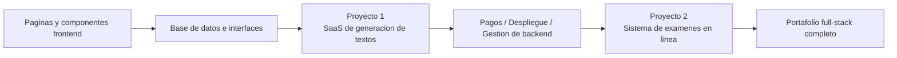

# Desarrollo Junior-Intermedio

Bienvenido a la etapa de **Desarrollo Junior-Intermedio**. Aqui profundizaras en el desarrollo full-stack, dominando la componentizacion frontend, el diseno de bases de datos, el desarrollo de API backend y el despliegue en produccion.

## Lo que aprenderas

### Desarrollo Frontend

Domina el desarrollo frontend moderno, aprende a usar bibliotecas de componentes y herramientas de diseno:

<NavGrid>
  <NavCard
    href="/es-es/stage-2/frontend/lovart-assets/"
    title="Desde Lovart, construye tu propio Agent de produccion de activos"
    description="Desde cero, utiliza Nanobanana y Lovart para generar en lote activos de diseno de alta calidad y construye un Agent de dibujo con reconocimiento de intenciones"
  />
  <NavCard
    href="/es-es/stage-2/frontend/figma-mastergo/"
    title="Introduccion a Figma y MasterGo"
    description="Domina las operaciones basicas de herramientas profesionales de diseno de UI y el flujo de colaboracion del diseno al codigo"
  />
  <NavCard
    href="/es-es/stage-2/frontend/ui-design/"
    title="Construye tu primera aplicacion moderna - Diseno de UI"
    description="Aprende los fundamentos del diseno de UI para aplicaciones modernas"
  />
  <NavCard
    href="/es-es/stage-2/frontend/multi-product-ui/"
    title="Disena paginas y botones siguiendo guias de diseno de UI"
    description="Aprende las guias de diseno de UI dominantes y disena jerarquias de paginas y botones mas claras"
  />
  <NavCard
    href="/es-es/stage-2/frontend/llm-skills-beautiful/"
    title="Usa LLM y Skills para que la interfaz se vea bien"
    description="Practica con prompts y plugins para que la IA genere interfaces atractivas y unicas"
  />
  <NavCard
    href="/es-es/stage-2/frontend/hogwarts-portraits/"
    title="Hagamos juntos retratos de Hogwarts"
    description="Proyecto practico: combina imagenes generadas por IA para construir una aplicacion interactiva de retratos de Hogwarts"
  />
  <NavCard
    href="/es-es/stage-2/frontend/design-to-code/"
    title="De prototipo de diseno a codigo de proyecto"
    description="Aprende como convertir prototipos de herramientas de diseno en codigo frontend que realmente funcione en el navegador"
  />
  <NavCard
    href="/es-es/stage-2/frontend/modern-component-library/"
    title="Actualiza tu interfaz con una biblioteca de componentes moderna"
    description="Aprende a usar bibliotecas de componentes para construir rapidamente interfaces de nivel profesional"
  />
</NavGrid>

### Desarrollo Backend

Aprende diseno de API, gestion de bases de datos y estrategias de despliegue de aplicaciones:

<NavGrid>
  <NavCard
    href="/es-es/stage-2/backend/git-workflow/"
    title="Aprende a usar Git y GitHub"
    description="Domina las operaciones centrales y el flujo de colaboracion del sistema de control de versiones Git"
  />
  <NavCard
    href="/es-es/stage-2/backend/database-supabase/"
    title="De la base de datos a Supabase"
    description="Domina los fundamentos de las bases de datos relacionales y aprende a usar Supabase, una plataforma BaaS moderna"
  />
  <NavCard
    href="/es-es/stage-2/backend/ai-interface-code/"
    title="Diseno y desarrollo de interfaces backend de aplicaciones"
    description="Utiliza IA para asistir en la generacion de codigo de interfaces backend y documentacion de API estandar, mejorando la eficiencia del desarrollo"
  />
  <NavCard
    href="/es-es/stage-2/backend/zeabur-deployment/"
    title="Publica tu prototipo de producto"
    description="Aprende a usar Zeabur para desplegar rapidamente tu aplicacion full-stack en la nube"
  />
  <NavCard
    href="/es-es/stage-2/backend/modern-cli/"
    title="De IDE a herramientas de programacion CLI con IA"
    description="Explora herramientas CLI modernas para mejorar la experiencia de desarrollo en entornos de linea de comandos"
  />
  <NavCard
    href="/es-es/stage-2/backend/stripe-payment/"
    title="Como integrar Stripe y otros sistemas de pago"
    description="Practica: integra la funcionalidad de pago de Stripe en tu aplicacion para lograr la monetizacion comercial"
  />
</NavGrid>

### Proyectos principales

Los capitulos anteriores son para aprender las "piezas"; los proyectos principales son para aprender "como ensamblar las piezas en un producto que funcione, se pueda demostrar y se pueda lanzar".

Te recomendamos seguir el orden **Proyecto 1 -> Proyecto 2**:

- **Proyecto 1** primero te guia a traves de la cadena principal mas comun del SaaS moderno: login, generacion, base de datos, pagos, panel de administracion.
- **Proyecto 2** luego te lleva a un escenario mas parecido a un sistema empresarial: roles y permisos, banco de preguntas, examenes, registros de envio, consola de administracion.

Si no sabes cual hacer primero, puedes consultar esta tabla comparativa:

| Proyecto | Que practicaras principalmente | Para quien es mas adecuado | Entregable final |
|------|------|------|------|
| Proyecto 1: Sitio web de generacion de textos | Estructura de paginas SaaS, login de usuarios, generacion con IA, pagos con Stripe, panel de administracion | Quienes hacen su primer sitio web comercial completo | Un prototipo SaaS con registro, generacion, pagos y gestion |
| Proyecto 2: Sistema de examenes en linea y gestion | Permisos de roles, modelado de banco de preguntas, flujo de examenes, registros de envio, calificacion y estadisticas | Quienes quieren hacer un "sistema empresarial" verdaderamente completo | Una plataforma de examenes con portal de estudiante y administracion |

Sin importar cual elijas, te recomendamos preparar al menos estos 3 entregables:

- Un repositorio de proyecto ejecutable
- Un enlace de demostracion accesible
- Un README y un video de demostracion

<NavGrid>
  <NavCard
    href="/es-es/stage-2/assignments/copywriting-platform-supabase/"
    title="Proyecto 1: Primera aplicacion full-stack SaaS - Sitio web de generacion de textos"
    description="Construye desde cero un espacio de trabajo de textos de marketing con IA, incluyendo login, generacion, pagos y panel de administracion"
  />
  <NavCard
    href="/es-es/stage-2/assignments/exam-management-express/"
    title="Proyecto 2: Sistema de examenes en linea y gestion"
    description="Construye un sistema de examenes en linea con soporte para generacion automatica de preguntas, respuestas y panel de administracion"
  />
</NavGrid>

Si ya completaste los dos proyectos principales anteriores, o quieres hacer un portafolio segun tu propia direccion tecnica, puedes continuar eligiendo uno de estos proyectos extendidos para profundizar:

<NavGrid>
  <NavCard
    href="/es-es/stage-2/assignments/modern-landing-page/"
    title="Proyecto extendido: Ingenieria de pagina de aterrizaje web moderna"
    description="Practica la expresion de valor, las rutas de conversion, el diseno de CTA y el tracking basico, creando una pagina que realmente pueda captar trafico"
  />
  <NavCard
    href="/es-es/stage-2/assignments/custom-dify-agent-platform/"
    title="Proyecto extendido: Plataforma de orquestacion de agentes tipo Dify"
    description="Implementa gestion de agentes, conversacion, registros y control de permisos, creando una plataforma de IA minimamente viable"
  />
  <NavCard
    href="/es-es/stage-2/assignments/travel-planning-agent-platform/"
    title="Proyecto extendido: Plataforma de Agent de planificacion de viajes inteligente"
    description="Centrado en entrada estructurada, orquestacion de Agent y gestion de planes historicos, crea un producto de planificacion de viajes con IA ejecutable"
  />
  <NavCard
    href="/es-es/stage-2/assignments/movie-recommendation-springboot/"
    title="Proyecto extendido: Sistema de recomendacion de peliculas con Spring Boot"
    description="Combina Spring Boot, calificaciones/favoritos y recomendaciones explicas, completa un prototipo de sistema de recomendacion completo"
  />
  <NavCard
    href="/es-es/stage-2/assignments/simple-grocery-microservices/"
    title="Proyecto extendido: Sistema de microservicios de comercio electronico de productos frescos"
    description="Practica la division de servicios, enrutamiento de gateway, colaboracion entre inventario y pedidos, experimenta el enfoque de ingenieria de monolito a microservicios"
  />
  <NavCard
    href="/es-es/stage-2/assignments/traffic-data-visualization-go/"
    title="Proyecto extendido: Plataforma de analisis y visualizacion de datos de trafico con Go"
    description="Desde la ingesta de datos, agregacion por ventanas hasta dashboards de tendencias y alertas, crea un prototipo completo de producto de datos"
  />
</NavGrid>

### Extension de capacidades de IA

<NavGrid>
  <NavCard
    href="/es-es/stage-2/ai-capabilities/dify-knowledge-base/"
    title="Introduccion a Dify e integracion de base de conocimientos"
    description="Aprende a usar Dify para construir aplicaciones de IA e integrar bases de conocimientos privadas"
  />
</NavGrid>

## Para quien es

- Desarrolladores con alguna base de programacion que quieran aprender desarrollo full-stack de manera sistematica
- Estudiantes que desean hacer la transicion de gerente de producto a ingeniero full-stack
- Desarrolladores junior a intermedios que quieren dominar herramientas y flujos de trabajo de desarrollo modernos
- Emprendedores que quieren desarrollar productos completos de forma independiente

## Requisitos previos

- Haber completado la etapa de "Novato y prototipo de producto", o tener conocimientos basicos equivalentes
- Comprender conceptos basicos de HTML/CSS/JavaScript
- Tener conocimientos preliminares sobre herramientas de programacion con IA

Listo para profundizar en el desarrollo full-stack? Haz clic en la navegacion izquierda para comenzar a aprender!
